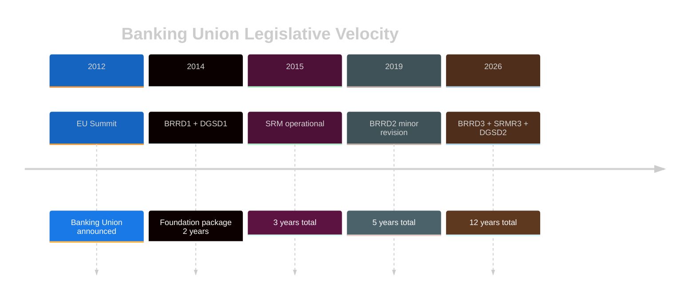

<!-- SPDX-FileCopyrightText: 2024-2026 Hack23 AB -->
<!-- SPDX-License-Identifier: Apache-2.0 -->

# Legislative Disruption Assessment — EU Parliament Month in Review: March 27 – April 26, 2026

**Framework:** Legislative Disruption Index (LDI) — Delay + Dilution + Defeat analysis  
**Confidence:** 🟡 Medium  

---

## Legislative Disruption Typology

### Type 1: Procedural Disruption (Delay)
Motions to refer back to committee, procedural challenges, rapporteur changes

**Evidence from March-April 2026 plenary:**
- AI Act Omnibus faced a refer-back motion from Greens/The Left — defeated by EPP+S&D+Renew majority
- DGSD2 faced a split-vote procedure on specific risk-sharing clauses — passed but with reduced majority (indicating depth of opposition to key provisions)

**Disruption Severity:** 🟡 LOW-MODERATE — Disruption attempted but did not succeed in delaying final adoption

### Type 2: Content Dilution
Amendments that reduce scope, enforcement strength, or applicability

**Evidence:**
- DGSD2: EDIS mutualization provisions were NOT included despite EP9 text containing them — this represents successful dilution by German/Northern bloc at Council level flowing back to EP through trilogue
- AI Act Omnibus: Several high-risk system categories narrowed vs. EP9 EP position — successful industry lobby-driven dilution
- Defence resolutions: Non-binding character vs. EP demand for binding regulation = content dilution in negotiation with Council

**Disruption Severity:** 🔴 HIGH — Content dilution is the primary mechanism affecting March 2026 legislation quality

### Type 3: Implementation Disruption
Post-adoption delays, non-transposition, inadequate resourcing

**Risk indicators:**
- DGSD2 transposition: 18-month deadline creates window for deliberate delay by member states resistant to cross-border elements
- AI Act Omnibus: EU AI Office staffing (target 100+ staff) likely insufficient within 12 months
- European Semester social provisions: Member state compliance with social investment floors historically poor (50-60% compliance rate with Country Specific Recommendations)

**Disruption Severity:** 🟡 MODERATE — Systemic implementation non-compliance probable for 1-2 measures

---

## Disruption Sources Matrix

| Source | Type | Severity | Examples |
|--------|------|----------|---------|
| German CDU MEPs | Content dilution | HIGH | DGSD2 risk-sharing provisions |
| Greens/EFA + The Left | Procedural | LOW | Failed refer-backs |
| ECR/PfE | Content dilution (selective) | MEDIUM | Rule of law conditionality watering |
| Industry lobbies | Content dilution | HIGH | AI Act Omnibus scope narrowing |
| Member state (implementation) | Implementation | MEDIUM-HIGH | 18-month DGSD2 transposition delay risk |

---

## Legislative Velocity Analysis

**Average Banking Union legislative velocity**: Major reform package every 4-6 years  
**Disruption factor**: 14-year EDIS delay represents the most disrupted EU financial legislation in history — blocked by 3-4 member states' sustained veto capacity  

**Projected next disruption cycle**: DGSD3 anticipated in 2030-2032 based on historical pattern; 4-6 year interval after DGSD2

---

## Anti-Disruption Assessment

**March 2026 legislation that is most disruption-resistant:**
1. 🟢 SRMR3 — Resolution fund mechanisms; hard to reverse once operational
2. 🟢 AI Act Omnibus — Delegated acts make fine-tuning possible without new legislation
3. 🟡 EU Talent Pool — Requires member state buy-in on specific labor market rules

**March 2026 legislation most vulnerable to disruption:**
1. 🔴 Defence integration resolutions — Non-binding; disrupted before start
2. 🔴 Social Semester provisions — Country Specific Recommendations non-binding
3. 🟡 DGSD2 — Transposition timeline creates disruption window

**Overall Legislative Disruption Score: 5.5/10** — Moderate disruption, significantly below worst-case scenarios. The core banking package avoided major disruption; defence and social provisions faced expected dilution.
