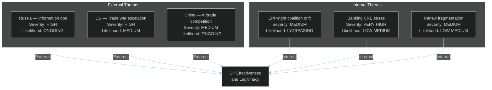

<!-- SPDX-FileCopyrightText: 2024-2026 Hack23 AB -->
<!-- SPDX-License-Identifier: Apache-2.0 -->

# Political Threat Landscape — EU Parliament Month in Review: March 27 – April 26, 2026

**Framework:** CIA Political Threat Framework v4.0  
**Analysis Level:** EU Institutional + Member State + External Actor Dimensions  
**Confidence:** 🟡 Medium  

---

## Threat Environment Overview

The EU Parliament's April 2026 legislative sprint produced major achievements in a threat environment characterized by:

1. **External geopolitical pressure** — Russian war in Ukraine (month 25+); US tariff actions; China competition
2. **Internal coalition stress** — EPP-right cooperation creating rule-of-law tensions
3. **Economic divergence** — Germany recession vs. Spain growth; potential banking stress
4. **Institutional confidence crisis** — Public trust in EU institutions; EP legitimacy questions

---

## Threat Level Assessments by Domain

### Domain 1: EU Financial Stability Threats

**PRIMARY THREAT: Commercial Real Estate Crisis Transmission**
- **Level:** 🔴 ELEVATED
- **Mechanism:** EU banks hold ~€1.3 trillion CRE exposure; post-COVID office vacancy rates 20-30% in major German/French cities; if CRE values decline 30%+, loan loss provisions could breach capital minimums
- **EP Nexus:** BRRD3 resolution powers are specifically designed to address this scenario; inadequate implementation = worse outcome
- **Mitigation:** ECB stress testing; SRB readiness; DGSD2 depositor confidence maintenance

**SECONDARY THREAT: Emerging Market Contagion**
- **Level:** 🟡 MODERATE
- **Mechanism:** If US tariff shock triggers recession in China, Chinese demand reduction flows through EU trade channels; Italian banks with Chinese bond exposure face losses
- **Probability:** 15-20%

### Domain 2: Coalition Stability Threats

**PRIMARY THREAT: EPP-Far Right Governance Normalization**
- **Level:** 🟠 SIGNIFICANT
- **Mechanism:** Each legislative cycle where EPP uses ECR/PfE majority makes the "cordon sanitaire" less defensible; S&D/Greens face pressure to either accept this or obstruct
- **Current evidence:** Defence resolutions (March 2026) passed with EPP-right majority without S&D; if this becomes norm for economic legislation, S&D loses leverage
- **Mitigation:** von der Leyen Commission's continued reliance on EPP+S&D+Renew for executive functions; formal cordon preserved even if occasionally breached on non-binding votes

**SECONDARY THREAT: Renew Group Fragmentation**
- **Level:** 🟡 MODERATE  
- **Mechanism:** French Renaissance (Macron), German FDP (Lindner), Spanish Ciudadanos remnants, Dutch D66, and Polish Civic Platform have significant ideological differences; a Marine Le Pen-adjacent French Prime Minister could force Renaissance exit from Renew
- **Probability:** 15-20% within 18 months

### Domain 3: Geopolitical Threats to EP Effectiveness

**PRIMARY THREAT: Russian Information Operations**
- **Level:** 🟠 SIGNIFICANT (persistent, not new)
- **Mechanism:** Systematic amplification of EU institution failures, corruption narratives, migration anxiety content targeting electorates of key member states; 3 MEPs sanctioned for Russian influence contacts in EP9; EP10 exposed to same vulnerabilities
- **Current connection:** Anti-corruption text (TA-10-2026-0094) partly responds to EP's own vulnerability

**SECONDARY THREAT: US-EU Institutional Relationship Deterioration**
- **Level:** 🟡 MODERATE
- **Mechanism:** US administration skeptical of EU institutions; tariff actions undermine transatlantic trust; EP's WTO MC14 position (TA-10-2026-0086) reflects attempt to maintain rules-based order without confrontation
- **Key indicator:** EU-US tariff negotiation outcome by Q2 2026

---

## Threat Actor Matrix

---

## Comparative Threat Assessment: April 2026 vs. April 2025

| Threat | April 2025 Level | April 2026 Level | Trend |
|--------|:-:|:-:|-----|
| Banking stability | MODERATE | ELEVATED | ↑ Worsening |
| Coalition stability | LOW | LOW-MODERATE | → Stable |
| US relations | LOW | MODERATE | ↑ Worsening |
| Russian interference | HIGH | HIGH | → Stable |
| German economic stability | MODERATE | HIGH | ↑ Worsening |
| AI governance gap | HIGH | LOW | ↓ Improved (AI Act) |
| Banking Union completeness | HIGH | LOW-MODERATE | ↓ Improved (package adopted) |

**Overall Threat Level: ELEVATED** (vs. MODERATE in April 2025)

The key driver of elevated threat level despite the positive legislative output is the economic deterioration — Germany's worsening situation creates political dynamics that threaten the coalition foundations enabling these legislative achievements.
