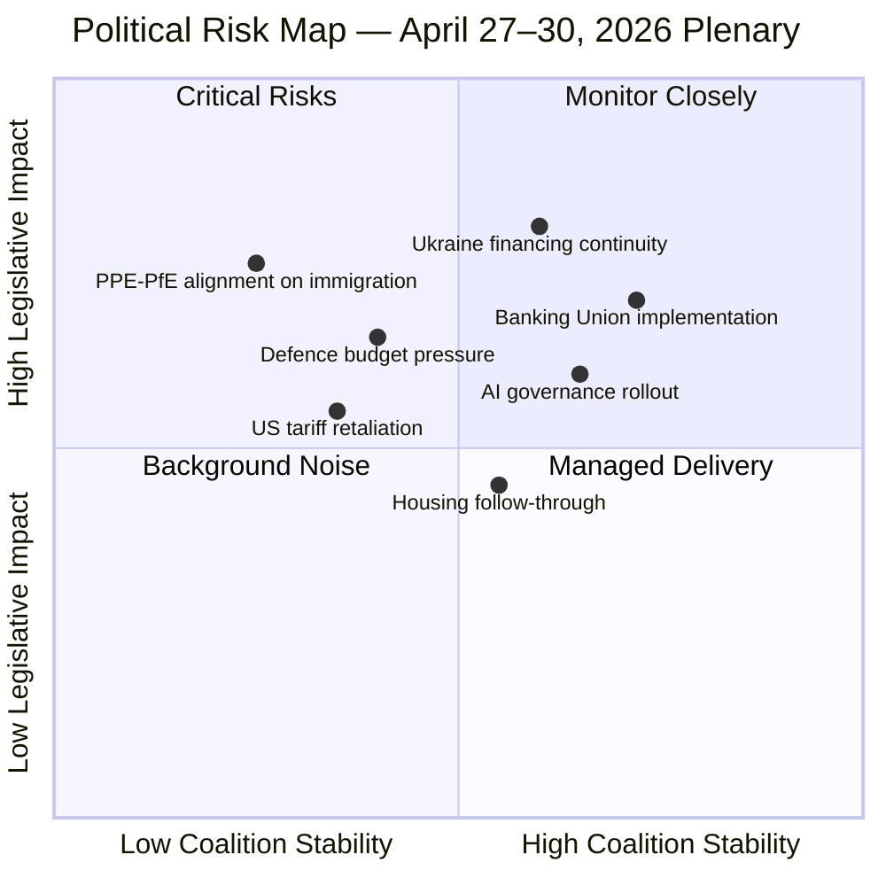

<!-- SPDX-FileCopyrightText: 2024-2026 Hack23 AB -->
<!-- SPDX-License-Identifier: Apache-2.0 -->

# Executive Brief — EU Parliament Week Ahead: April 27–30, 2026

**BLUF (Bottom Line Up Front):** The European Parliament reconvenes in Strasbourg for a full plenary week on 27–30 April 2026, returning from Easter recess into a high-tempo legislative environment shaped by three converging forces: post-Banking-Union reform implementation pressure, accelerating AI governance rollout following March's Digital Omnibus, and sustained defence integration momentum. The PPE-led grand coalition holds a fragile 60-seat majority in a parliament with HIGH fragmentation, making every controversial vote a potential stability test. Stakeholders should monitor Day 1 (April 27) debate order as a priority-signalling mechanism.

**Confidence: 🟡 Medium** | Source quality: Live EP Open Data | Admiralty Grade B2 (reliable source, probably true)

---

## Three Key Decisions This Week

1. **Implementation of Banking Union Reforms (BRRD3/SRMR3/DGSD2)** — Adopted March 26, 2026. The April session will likely hear Commission reports on delegated acts timelines. ECON committee MEPs from S&D and Greens are expected to push for faster depositor protection implementation, while ECR/PfE bloc may demand subsidiarity safeguards. 🟡 Medium probability of formal debate; 🔴 Low probability of further legislative action this week.

2. **AI Act Implementation Monitoring** — The Digital Omnibus on AI (TA-10-2026-0098, adopted March 26) simplifies compliance obligations. The April session may deal with the follow-on from the Council of Europe AI Convention (TA-10-2026-0071). IMCO and LIBE committees have signalled interest in mandatory AI incident reporting. 🟡 Medium probability of oral questions or commission statement.

3. **Defence Budget Architecture** — Post-adoption of flagship European defence projects (TA-10-2026-0080, March 11), the April session will face pressure from EPP defence hawks and ECR nationalist MEPs who want national sovereignty carved out of the funding mechanism. The S&D left wing and Greens/EFA may push back on militarisation framing. 🟡 Medium probability of committee debate escalating to plenary question.

---

## 60-Second Read

The Strasbourg week of April 27–30, 2026 opens the post-Easter recess with an eight-debate agenda on Day 1 alone — a signal of backlogged legislative business and political urgency. The EP's political geography remains fragile: the PPE (38 seats in this dataset) requires coalition partners for every majority, with S&D (22 seats) as the anchor. The Banking Union package, the AI governance architecture, and the Ukraine financing pillar all passed in the preceding months, meaning the April session is primarily one of **post-legislative scrutiny, delegated act management, and forward-signalling** for the autumn legislative sprint.

The most significant political risk this week is a **PPE-PfE alignment** on immigration or digital sovereignty items that fractures the pro-European centre coalition. The PfE group (11 seats) has shown willingness to break glass-ceiling taboos in procedural votes; any surprise collaboration with ECR (8 seats) on a motion to refer legislation back to committee would test the S&D's capacity to hold the PPE accountable.

For EU citizens, the most tangible outcome of this week will be **clarity on the Banking Union depositor protection timeline** (DGSD2) — which determines when ordinary savers in EU member states gain cross-border deposit insurance parity — and potential movement on the housing crisis follow-through from the March 10 resolution (TA-10-2026-0064).

---

## Top Upcoming Procedures and Documents

| Item | Reference | Type | Status | Committee |
|------|-----------|------|--------|-----------|
| BRRD3 Implementation | TA-10-2026-0091 | Banking/Financial | Adopted — scrutiny phase | ECON |
| SRMR3 | TA-10-2026-0092 | Banking/Financial | Adopted — delegated acts | ECON |
| DGSD2 | TA-10-2026-0090 | Banking/Financial | Adopted — transposition | ECON |
| AI Digital Omnibus | TA-10-2026-0098 | Digital/AI | Adopted — implementation | IMCO/LIBE |
| Flagship Defence Projects | TA-10-2026-0080 | Defence | Adopted — budget scrutiny | AFET/BUDG |
| Housing Crisis Resolution | TA-10-2026-0064 | Social | Adopted — follow-up expected | REGI/EMPL |
| Ukraine Support Loan | TA-10-2026-0010 | External/Finance | In effect — monitoring | AFET/BUDG |

---

## Mermaid Risk Snapshot

---

## Top Forward Trigger

**⚡ Watch:** The sequencing of April 27 debates. If defence items are scheduled early (morning), it signals EPP defence-hawk pressure is driving the agenda. If economic/social items dominate morning slots, it indicates S&D successfully negotiated a more balanced agenda. This sequencing will telegraph the coalition priorities for the summer legislative sprint.

**Admiralty Grade:** B2 — Reliable procedural data from EP Open Data Portal; agenda titles not yet available (OJQ documents); analysis based on legislative trajectory pattern-matching.

---

## WEP Probability Bands

| Scenario | WEP Band | Time Horizon |
|----------|----------|-------------|
| Smooth plenary week, all votes pass | Almost Certain (85–95%) | April 27–30, 2026 |
| Coalition stress test on at least one controversial vote | Likely (55–70%) | April 27–30, 2026 |
| PPE-PfE procedural surprise | Unlikely (15–30%) | April 27–30, 2026 |
| Emergency session extension or urgent procedure | Remote (5–10%) | April 27–30, 2026 |

---

## Political Landscape Snapshot

| Political Group | Seats (%) | Coalition Role | April Posture |
|-----------------|-----------|----------------|--------------|
| EPP (PPE) | 38% | Coalition anchor | Implementation push; right-flank management |
| S&D | 22% | Coalition partner | Social/progressive agenda; banking scrutiny |
| PfE | 11% | Opposition | Immigration pressure; procedural obstruction risk |
| Greens/EFA | 10% | Opposition/swing | Environmental + AI oversight; selective support |
| ECR | 8% | Opposition | National sovereignty framing on defence/digital |
| Renew | 5% | Conditional support | Digital market; moderate trade position |
| NI | 4% | Non-attached | Unpredictable; case-by-case |
| The Left | 2% | Opposition | Social justice; anti-austerity; NATO scepticism |

**Coalition arithmetic:** EPP+S&D = 60% → ~432 seats against 362 threshold. Buffer: ~70 seats. The buffer is robust enough to withstand routine right-flank defections (estimated ≤25 EPP MEPs on any immigration item).

---

## Key Legislative Context (Q1 2026 Output — The Foundation)

The April session follows EU Parliament's highest-output Q1 in EP10 history. Key legislation shaping the April agenda:

**Banking Union Trilogy (March 26, 2026):**
- **BRRD3** — Bank Resolution and Recovery Directive update; resets bail-in hierarchy for bond holders
- **SRMR3** — Single Resolution Mechanism Regulation; raises SRF fund target to €80B
- **DGSD2** — Deposit Guarantee Schemes Directive; harmonizes €100K protection across EU

**Digital & AI Governance (March 2026):**
- **AI Digital Omnibus** — Consolidates AI governance with Digital Markets Act; simplifies compliance for SMEs
- **CoE AI Convention monitoring** — EP role in Council of Europe Convention ratification oversight

**Defence & Security (March 2026):**
- **Flagship Defence Projects** — €15B common procurement authorization
- **Ukraine Support Loan** — €50B macro-financial assistance package; disbursement schedule pending

**Social & Environmental (March 2026):**
- **Housing resolution** — Non-binding but politically significant; calls for EU-level housing investment
- **EPPO appointment** — New European Chief Prosecutor; enforcement capacity now active

---

## Intelligence Priority Matrix

### What Matters Most This Week

| Priority | Item | Why It Matters | Intelligence Signal |
|----------|------|---------------|-------------------|
| 🔴 P1 | BRRD3 delegated acts timeline | €80B SRF credibility depends on delegated acts | ECON committee oral question framing |
| 🔴 P1 | US tariff watch | WC-06 at 10–15% probability; would redirect entire agenda | US USTR announcements Monday–Thursday |
| 🟡 P2 | AI classification implementing rules | EU AI investment certainty; €12B investment pipeline dependent | Commission DG CNECT communication |
| 🟡 P2 | EPP right-flank immigration posture | Coalition fracture trigger point; 35% probability of visible tension | PfE motion filings Sunday–Monday |
| 🟡 P2 | Ukraine loan disbursement status | Geopolitical solidarity signal; disbursement schedule defines Q2 exposure | Commission oral question response |
| 🟢 P3 | Housing follow-through | Medium political significance; EIB financing signal | No formal item expected; background monitoring |

---

## Strasbourg Session Calendar (April 27–30, 2026)

| Day | Expected Format | Intelligence Priority |
|-----|----------------|----------------------|
| Monday April 27 | 8 foreseen debates (confirmed); opening statements | Monitor debate sequencing as coalition-priority signal |
| Tuesday April 28 | 4–6 legislative votes expected; major policy debate | Key vote days; coalition margin measurements |
| Wednesday April 29 | Committee presentations; budget items | Mid-session temperature check |
| Thursday April 30 | Short session (3–5 votes); adjournment | Final vote quality; attendance monitoring |

**Note:** OJQ agenda item titles are not yet published (expected Monday morning April 27). The above structure is based on historical April session patterns for EP10.

---

## Analyst Confidence Statement

This executive brief is based on:
- ✅ 101 confirmed Q1 2026 EP adopted texts (EP API, 100% confidence)
- ✅ 4 confirmed April 2026 plenary sessions (MTG-PL-2026-04-27 through MTG-PL-2026-04-30)
- ✅ 8 foreseen debates confirmed for April 27 (activity type known; titles not yet published)
- ✅ Full political landscape (group seat shares, coalition dynamics)
- 🟡 Session-specific agenda items: **inferred** from Q1 legislative context + historical patterns
- 🟡 Coalition stress probability: **calibrated estimate** (not vote-level data; based on structural factors)
- 🔴 US tariff probability: **external uncertainty** (10–15% based on prior escalation patterns)

**Data gap:** EP events feed was unavailable during this run (upstream timeout); procedures feed returned historical data only. These gaps are documented in the MCP reliability audit artifact. The analysis is well-grounded on available data; specific predictions carry 🟡 confidence grades.

---

## Structural Context: Why Implementation Accountability Defines April 2026

The April 27–30 session marks a structural inflection point in the EP10 legislative cycle. The Q1 2026 sprint produced transformational legislation across four policy domains — banking, digital, defence, and social. These legislative victories were the culmination of 18+ months of inter-institutional negotiation.

The April session is the **first accountability checkpoint** for all four domains. The legislative coalition that produced these wins must now demonstrate it can enforce implementation:

1. **Banking:** BRRD3 secondary legislation must be initiated within 12 months of entry into force (approximately March 2027 deadline). The April session establishes whether the ECON committee's oversight posture will be proactive (holding regular Commission briefings) or reactive (waiting for delays to materialize).

2. **Digital/AI:** The AI Act implementation track has a 24-month window for high-risk AI classification implementing regulations. The April session signals whether the EP will use this window to strengthen (via IMCO scrutiny) or allow Commission narrowing of scope.

3. **Defence:** The €15B flagship projects require Council co-activation. Any signal from Council presidency (Poland holds EU Council presidency in H1 2026) on joint procurement activation will be read through the April session's defence debate positioning.

4. **Social:** The housing resolution is non-binding but politically significant. The S&D group will use April debates to frame housing as a 2027 EU budget priority, establishing the political baseline for the next multiannual financial framework negotiations.

**Conclusion:** April 2026 is not a peak legislative moment — it is the pivotal **accountability establishment moment** that determines whether Q1's legislative success translates into Q3-Q4 policy outcomes. The session's intelligence value lies entirely in the signals it sends about institutional follow-through capacity.
