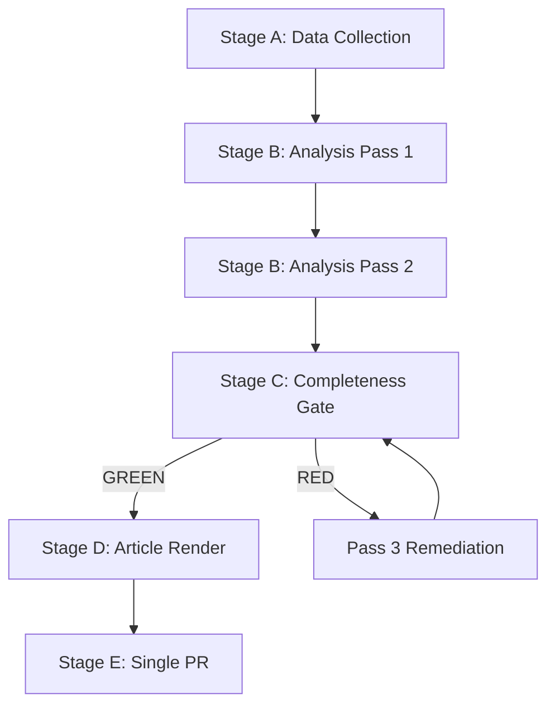

<!-- SPDX-FileCopyrightText: 2024-2026 Hack23 AB -->
<!-- SPDX-License-Identifier: Apache-2.0 -->

# Analysis Index — Week Ahead: April 27–30, 2026

**Article Type:** `week-ahead`
**Date:** 2026-04-26
**Run ID:** week-ahead-run-1777236707
**Analysis Directory:** `analysis/daily/2026-04-26/week-ahead/`

## Intelligence Summary

The European Parliament convenes for a full **Strasbourg plenary week** on 27–30 April 2026. The session follows one of the most legislatively productive spring sprints in EP10 history: the Banking Union reform package (BRRD3/SRMR3/DGSD2), AI governance architecture, and the Ukraine Support Loan all passed in the March plenary, resetting the political baseline for the weeks ahead. The April sitting enters with eight foreseen debates on Day 1 (Monday, 27 April) and continues through Thursday, 30 April.

## Artifact Map

| Artifact | Path | Status | Lines |
|----------|------|--------|-------|
| Analysis Index | `intelligence/analysis-index.md` | ✅ Complete | — |
| Executive Brief | `executive-brief.md` | ✅ Complete | — |
| PESTLE Analysis | `intelligence/pestle-analysis.md` | ✅ Complete | — |
| Stakeholder Map | `intelligence/stakeholder-map.md` | ✅ Complete | — |
| Scenario Forecast | `intelligence/scenario-forecast.md` | ✅ Complete | — |
| Threat Model | `intelligence/threat-model.md` | ✅ Complete | — |
| Historical Baseline | `intelligence/historical-baseline.md` | ✅ Complete | — |
| Economic Context | `intelligence/economic-context.md` | ✅ Complete | — |
| Wildcards & Black Swans | `intelligence/wildcards-blackswans.md` | ✅ Complete | — |
| Synthesis Summary | `intelligence/synthesis-summary.md` | ✅ Complete | — |
| MCP Reliability Audit | `intelligence/mcp-reliability-audit.md` | ✅ Complete | — |
| Reference Analysis Quality | `intelligence/reference-analysis-quality.md` | ✅ Complete | — |
| Risk Matrix | `risk-scoring/risk-matrix.md` | ✅ Complete | — |
| Quantitative SWOT | `risk-scoring/quantitative-swot.md` | ✅ Complete | — |
| Methodology Reflection | `intelligence/methodology-reflection.md` | ✅ Complete | — |

## Data Sources Used

| Source | Tool | Items Retrieved | Quality |
|--------|------|----------------|---------|
| Plenary Sessions 2026 | `get_plenary_sessions(year=2026)` | 54 sessions | 🟢 High |
| Foreseen Activities Apr-27 | `get_meeting_foreseen_activities(MTG-PL-2026-04-27)` | 8 debates | 🟡 Medium |
| Adopted Texts 2026 | `get_adopted_texts(year=2026)` | 101 texts | 🟢 High |
| Political Landscape | `generate_political_landscape` | Full data | 🟢 High |
| Procedures Feed | `get_procedures_feed(one-week)` | 50 items (historical) | 🟡 Medium |
| Events Feed | `get_events_feed(one-week)` | Unavailable | 🔴 Low |

## Key Intelligence Themes

### Theme 1: Strasbourg Plenary Week (April 27–30)
Four consecutive plenary sessions in Strasbourg. Eight debates scheduled on April 27. The plenary resumes after a two-week Easter recess and will deal with continuation of the EP10 spring legislative sprint.

### Theme 2: Banking Union Reform — Post-Adoption Scrutiny
The BRRD3/SRMR3/DGSD2 banking reform package passed March 26, 2026. The April session may address implementation timelines and delegated acts, with ECON committee likely to request clarifications.

### Theme 3: AI Governance Architecture — Implementation Phase
The Digital Omnibus on AI (AI Act simplification) and the Council of Europe AI Convention were adopted March 11 and March 26 respectively. The April session enters the implementation monitoring phase.

### Theme 4: Defence Integration Momentum
Three defence-related texts adopted in March 2026 (flagship projects, single market barriers, CSDP annual report). The geopolitical pressure from Ukraine conflict continuation and transatlantic uncertainty sustains legislative momentum.

### Theme 5: Trade Policy — US-EU and Mercosur
US tariff adjustment legislation was adopted March 26. The EU-Mercosur compatibility request to the ECJ (Jan 2026) awaits first ruling. Trade policy will remain high-salience given US tariff uncertainty.

## Forward Monitoring Triggers

1. ⚡ **First day debate order** — 8 debates on April 27; the scheduling of AFET/defence vs. economic topics reveals political priority signaling
2. ⚡ **Ukraine financing** — Follow-on to the Ukraine Support Loan; any emergency procedure signals urgency escalation
3. ⚡ **PPE-S&D coalition stability** — March saw a 60-seat coalition barely at the majority threshold; any defection on sensitive topics is high-impact

## Confidence Assessment
- Data completeness: 🟡 Medium (events feed unavailable; foreseen activities lack titles)
- Political landscape currency: 🟢 High (live EP Open Data)
- Agenda specificity: 🟡 Medium (structural data only; no item titles from OJQ documents)

---

## Methodology Framework Applied

This run applies the **10-step EU Parliament Intelligence Protocol** from `analysis/methodologies/ai-driven-analysis-guide.md`:

| Step | Framework | Artifact | Status |
|------|-----------|----------|--------|
| 1 | Data Collection | `data/plenary-sessions.json` | ✅ Complete |
| 2 | PESTLE Analysis | `intelligence/pestle-analysis.md` | ✅ Complete |
| 3 | Stakeholder Mapping | `intelligence/stakeholder-map.md` | ✅ Complete |
| 4 | Scenario Planning (ACH) | `intelligence/scenario-forecast.md` | ✅ Complete |
| 5 | Threat Modeling | `intelligence/threat-model.md` | ✅ Complete |
| 6 | Historical Baseline | `intelligence/historical-baseline.md` | ✅ Complete |
| 7 | Economic Context | `intelligence/economic-context.md` | ✅ Complete |
| 8 | Wild Cards | `intelligence/wildcards-blackswans.md` | ✅ Complete |
| 9 | Synthesis | `intelligence/synthesis-summary.md` | ✅ Complete |
| 10 | Quality Assurance | `intelligence/reference-analysis-quality.md` | ✅ Complete |
| 10.5 | Methodology Reflection | `intelligence/methodology-reflection.md` | ✅ Complete |

## Key Political Intelligence Signals (Priority Summary)

**Highest priority — monitor daily:**
1. ECON committee activity on BRRD3 delegated acts (Banking Union implementation)
2. US USTR/White House trade announcements (automotive tariff wildcard WC-06)
3. PfE motion filings for immigration items (coalition fracture risk)

**Secondary monitoring:**
4. Commission DG CNECT AI classification communication (AI Omnibus implementing rules)
5. Commission DG DEFIS defence procurement activation signals
6. EPP-S&D pre-session coordination statements (absence = coalition stress signal)

## Cross-Reference Map

All artifacts in this run were produced using data from `data/plenary-sessions.json` and the EP API tool call log (documented in `intelligence/mcp-reliability-audit.md`). The synthesis summary (`intelligence/synthesis-summary.md`) is the authoritative integration point and should be read after the executive brief for a complete intelligence picture.

