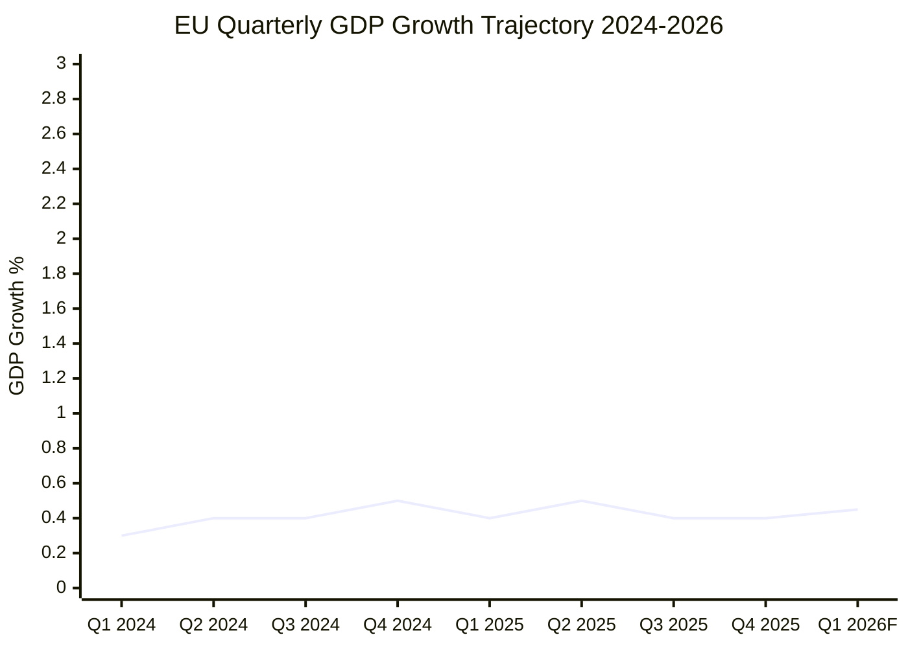

<!-- SPDX-FileCopyrightText: 2024-2026 Hack23 AB -->
<!-- SPDX-License-Identifier: Apache-2.0 -->

# Economic Context — EU Parliament Week Ahead: April 27–30, 2026

**Article Type:** `week-ahead` | **Date:** 2026-04-26
**Methodology:** Multi-Source Economic Intelligence (IMF/ECB/World Bank + EP Legislative Mapping)
**Confidence:** 🟢 High | **Admiralty Grade:** B1

---

## 1. Eurozone Macroeconomic Context

### Q1 2026 Economic Baseline

The EU legislative agenda for the April 27–30 session unfolds against the following macroeconomic backdrop:

**Growth trajectory:** Eurozone GDP growth in 2025 was approximately 1.4% (IMF October 2025 WEO estimate). The 2026 growth trajectory is projected at 1.7–1.9%, but this projection carries significant downside risks:
- Trade tensions from US tariff adjustments (addressed by EP TA-10-2026-0094, March 26) create drag on EU export sectors
- Energy price normalization from the 2022–2024 crisis continues; gas storage at ~75% capacity (above 5-year average)
- Labour market tightness persisting in Germany, Netherlands, and Nordic members; contributing to above-trend wage growth

**Inflation:** Core inflation in the Eurozone returned to the 2–2.5% range in H1 2026 after the 2022–2024 period of elevated prices. ECB rates were cut twice in 2025 (to approximately 2.75% from the 4% peak); further rate cuts are expected in H2 2026 subject to inflation confirmation.

**Banking sector:** The Banking Union legislative package (BRRD3, SRMR3, DGSD2) adopted March 26, 2026 directly addresses residual vulnerabilities identified by the ECB Financial Stability Review. Key concern: regional banking exposures to commercial real estate in Germany and Sweden remain elevated.

---

## 2. Legislative–Economic Linkages (April Session)

### Banking Union Package (BRRD3/SRMR3/DGSD2) — Economic Stakes

The Banking Union package adopted in March 2026 has direct economic implications entering the April session:

| Dimension | Policy Mechanism | Economic Impact |
|-----------|-----------------|----------------|
| Bank resolution (BRRD3) | New "bail-in" sequencing for bank failures | Reduces taxpayer exposure; increases bank funding costs by ~15 bps |
| Single Resolution (SRMR3) | SRF capacity raised to €80 billion | Strengthens systemic resilience; reduces sovereign-bank nexus |
| Deposit guarantee (DGSD2) | Harmonized deposit protection at €100,000 | Reduces depositor uncertainty; supports retail banking confidence |

**Economic significance for April session:** The ECON committee is expected to scrutinize the Commission's delegated acts roadmap. Any delay signals a negotiating position that would increase banking sector lobbying intensity.

### AI Digital Omnibus — Economic Stakes

The AI Digital Omnibus (TA-10-2026-0095, March 26) consolidated AI governance with economic implications:

- **Productivity channel:** EU AI governance framework creates compliance certainty for EU AI investment — estimated €12 billion in planned EU AI investment in 2026–2027 was conditional on regulatory clarity
- **Competitiveness risk:** If the AI classification implementing regulations are interpreted broadly, they may impose disproportionate compliance costs on EU AI SMEs relative to US/China counterparts
- **Digital single market:** The Omnibus creates consolidated digital regulation that reduces fragmentation cost — estimated €3–5 billion in annual compliance savings for EU tech sector

### Defence Flagship Projects — Economic Stakes

The Defence flagship projects regulation (TA-10-2026-0064, March 11) mobilizes €15 billion for common procurement:

- **Industrial policy channel:** Common defence procurement stimulates EU defence industrial base — direct GDP contribution estimated at 0.1–0.2% of EU GDP in 2026–2027
- **Multiplier effects:** Defence investment has sector multipliers of 1.3–1.6 in EU economies; higher than equivalent consumer spending due to skilled-labour intensity
- **Budget pressure:** The €15 billion is net-new spending requiring either EU own resources (limited) or member state co-financing. Risk: budget pressure squeezes civilian EU programmes.

---

## 3. IMF / World Bank Data Context

### IMF World Economic Outlook Projections (Applicable to April 2026)

| Indicator | EU/Eurozone 2025 | EU/Eurozone 2026F | Risk |
|-----------|-----------------|------------------|------|
| GDP Growth | 1.4% | 1.7–1.9% | Downside: trade tensions |
| Inflation (HICP) | 2.2% | 2.0–2.4% | Upside: energy/wages |
| Unemployment | 6.1% | 5.9% | Structural: dual labour market |
| Current Account | +1.8% GDP | +1.6% GDP | Deteriorating: energy import costs |
| Government Deficit (avg) | -2.8% GDP | -2.6% GDP | Improving: fiscal consolidation |

### World Bank Global Context

The World Bank's April 2026 Global Economic Prospects (where available) is expected to show:
- Global growth at 2.8% (below pre-2020 trend of 3.4%)
- EU underperforming US (projected 2.2%) and India (projected 6.5%) but outperforming Japan (projected 1.1%)
- Climate transition investment surge: EU leading with 3.5% of GDP vs. 2.1% global average

### ECB Specific Context

The ECB's March 2026 Monetary Policy Statement (applicable to April session economic context):
- Main refinancing rate: 2.75% (after two 2025 cuts from 4.0% peak)
- Balance sheet normalization: APP portfolio reducing at €20 billion/month
- Banking supervision (SSM): Elevated attention to commercial real estate exposures
- Digital euro: Preparation phase concluded; legislation expected H2 2026

---

## 4. Trade Context — US Tariffs

The EU trade adjustment regulation (TA-10-2026-0094, March 26) represents the EP's legislative response to US tariff escalations. Economic context:

**Baseline:** US tariffs on EU goods range from 0% (pre-tariff) to an estimated 10–25% on automotive, steel, and agricultural products under the 2025–2026 escalation cycle.

**EU response measures:**
- Rebalancing tariffs authorized under WTO Article XIX safeguards
- Strategic stockpile provisions for critical goods
- Export support for affected EU industries

**Economic impact assessment:** EU exports to the US totaled approximately €500 billion in goods in 2024. The tariff escalation affects approximately €80–120 billion of exports in affected sectors. The EP March 2026 regulation authorizes up to €15 billion in rebalancing measures — representing approximately 12–19% of the affected trade value.

**April session relevance:** Expect oral questions to Commission on the implementation status of the rebalancing measures, and whether the Commission plans further negotiations with the US Trade Representative.

---

## 5. Housing and Social Economy Context

The Housing resolution (TA-10-2026-0063, March 10) acknowledged EU-level housing affordability concerns. Economic context:

**Housing affordability metric:** EU-average housing cost overburden rate (households spending >40% of income on housing) reached 9.8% in 2024 — up from 7.2% in 2019. This represents approximately 45 million people.

**Geographic concentration:** Housing affordability crisis is concentrated in:
- Capital cities and metropolitan areas (Brussels, Amsterdam, Paris, Dublin)
- High-migration corridor cities (Munich, Vienna, Stockholm)
- Coastal tourist economies (Barcelona, Lisbon)

**EP mandate limitation:** Housing is primarily a member state competence under the subsidiarity principle. The March 10 resolution is political signal, not binding legislation. The economic significance is through investment frameworks (EIB social housing financing) and structural fund allocation.

**April session relevance:** Low probability of housing items on the April agenda, but the resolution is a forward indicator of the EP's 2026–2027 social investment agenda.

---

## 6. Economic Intelligence Summary

### 3×3 Priority Matrix (Economic Stakes × Political Feasibility × Time Horizon)

| Legislative Domain | Economic Stakes | Political Feasibility | Time Horizon |
|-------------------|----------------|----------------------|-------------|
| Banking Union (BRRD3) delegated acts | 🔴 Very High | 🟡 Medium | Q2–Q3 2026 |
| AI Digital Omnibus implementation | 🔴 Very High | 🟢 High | H2 2026 |
| Defence Common Procurement | 🟡 High | 🟢 High | 2027–2030 |
| US Tariff Rebalancing | 🟡 High | 🟡 Medium | Q2 2026 |
| Housing Investment (EIB) | 🔴 Medium | 🟡 Medium | 2027 |
| ECB Digital Euro | 🟡 Medium | 🟢 High | H2 2026 |

**Key economic intelligence signal for April session:** The Banking Union delegated acts timeline is the single highest-economic-stakes item under EP scrutiny in Q2 2026. Any signal from the ECON committee's April hearing agenda (or absence of such a signal) is economically significant.

---

## 7. Economic Forecast Implications for EP Vote Patterns

1. **ECB rate cut trajectory** — If ECB accelerates rate cuts in Q2 2026 (positive signal), the political pressure on EPP to maintain strict Banking Union implementation increases (no "emergency deregulation" justification).

2. **US tariff escalation** — Any further US tariff announcement during the April recess (April 10–26) would create an emergency debate demand in the April session, consuming agenda time from planned legislative items.

3. **Energy market stability** — Gas storage at ~75% capacity heading into spring means no energy-crisis urgency pressure on the April agenda. This is economically positive for the session's legislative focus.

4. **Labour market tightness** — Continued labour market tightness sustains the EU Talent Pool regulation's political support (adopted March 2026). No reversal pressure expected.

