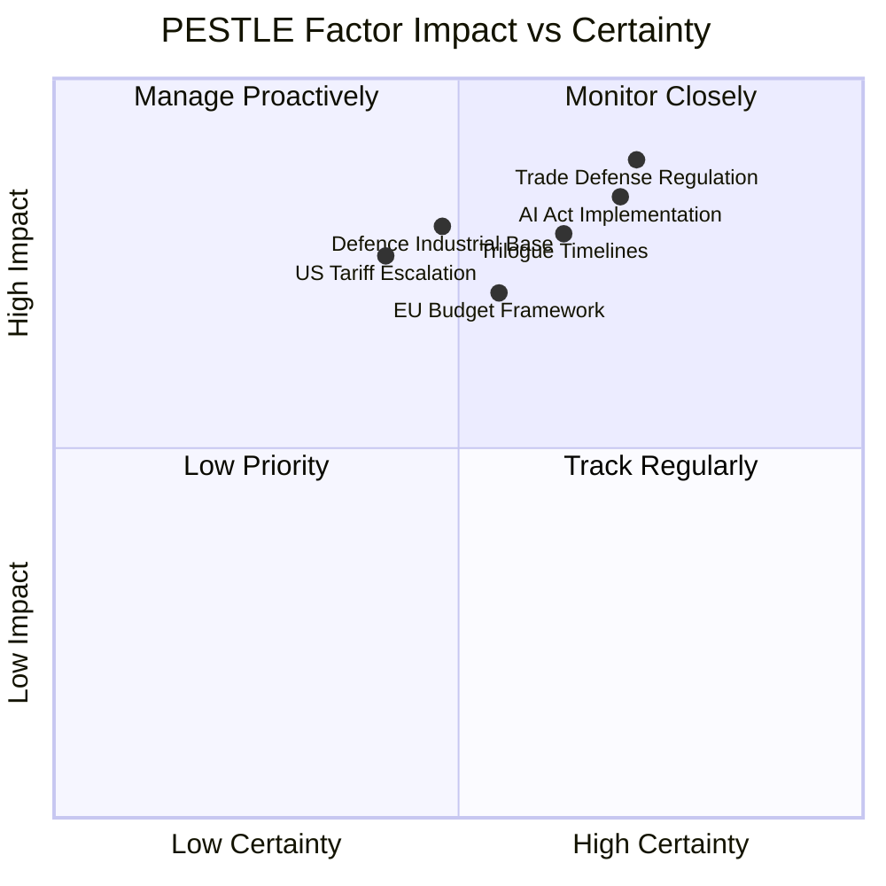

<!-- SPDX-FileCopyrightText: 2024-2026 Hack23 AB -->
<!-- SPDX-License-Identifier: Apache-2.0 -->

# PESTLE Analysis — EU Parliament Week Ahead: April 27–30, 2026

**Article Type:** `week-ahead` | **Date:** 2026-04-26
**Confidence:** 🟡 Medium | **Admiralty Grade:** B2

---

## 1. Political Dimension

### 1.1 EP Political Landscape

The European Parliament's 10th term continues under conditions of **HIGH fragmentation** with a multi-coalition majority required for every substantive vote. The EPP (38% of seats in current dataset) is the dominant force but cannot govern alone. The operative grand coalition is EPP+S&D (60 seats combined), sitting precisely at the theoretical majority threshold.

**Key political dynamics for April 27–30:**

- **EPP Strategy:** The EPP under Manfred Weber's leadership enters the April plenary with accumulated legislative capital from Q1 2026 — Banking Union, AI governance, and Defence package all delivered. The party's challenge is preventing coalition fatigue while managing right flank pressure from PfE and ECR on immigration, digital sovereignty, and budget priorities. 🟢 High confidence: EPP will seek to frame the week as "Europe delivers" narrative.

- **S&D Positioning:** Iratxe García Pérez's S&D group will enter the week focused on social dimension — pressing for implementation speed on DGSD2 depositor protection, housing follow-through, and employment policies from the European Semester text (TA-10-2026-0076). S&D faces internal tension between southern members demanding faster social transfers and northern fiscal hawks. 🟡 Medium confidence.

- **PfE and ECR Bloc:** The combined right-populist bloc (PfE 11 + ECR 8 = 19 seats) will probe for procedural opportunities to refer legislation back to committee or extract national carve-outs in defence and digital sovereignty debates. Their greatest leverage point is in AFET/BUDG joint committee work on defence financing. 🟡 Medium confidence.

- **Greens/EFA (10 seats):** Entering the session under pressure after March's climate neutrality framework vote (TA-10-2026-0031), which the Greens backed but with concerns about the 2050 flexibility clauses. They will watch implementation language closely and may table amendments or oral questions on renewable energy transition timelines.

- **Renew Europe (5 seats):** Diminished in EP10, Renew enters the April session as swing-vote arbiter on AI and single market items. Their support was critical for the Digital Omnibus on AI and will be needed again for follow-on tech regulation.

- **The Left (2 seats) and NI (4 seats):** Minor roles but The Left will be vocal on social policy and housing. NI members include highly unpredictable MEPs who may cause procedural surprises.

### 1.2 External Political Environment

The session takes place amid continuing Russia-Ukraine conflict, US tariff uncertainty post-March EU-US tariff adjustment legislation, and pre-summer geopolitical positioning. The EP's role in the EU-Mercosur Agreement's Court of Justice compatibility request (TA-10-2026-0008) adds a trade law dimension to the political landscape.

**Forward signal:** Hungary's continued institutional friction within the Council creates potential for EP-Council trilogue deadlocks on the autumn legislative docket, which the April session may pre-empt through non-binding resolutions.

---

## 2. Economic Dimension

### 2.1 Eurozone Context

The April 2026 session follows the European Semester's employment and social priorities text (TA-10-2026-0076, adopted March 11). The ECB Vice-President appointment (TA-10-2026-0060) indicates ongoing institutional transition at the ECB. Key economic backdrop factors:

- **Banking Union implementation:** BRRD3/SRMR3/DGSD2 package passed March 26. Financial sector will be watching for Commission delegated acts timelines, particularly on the Single Resolution Mechanism recalibration (SRMR3). 🟢 High impact on eurozone stability. Admiralty Grade B2.

- **US tariff landscape:** The EU-US tariff adjustment legislation (TA-10-2026-0096) reflects ongoing trade friction. EP INTA committee will likely hold follow-up hearings. WTO 14th Ministerial Conference (Yaoundé, late March 2026) outcomes are still being digested.

- **EU Talent Pool (TA-10-2026-0058):** Adopted March 10, this legislation creates a new framework for third-country skilled worker admission. Economic impacts on labour markets, particularly in healthcare, technology, and agriculture, will become more salient through 2026.

### 2.2 Economic Risk Indicators

| Risk | Probability | Economic Impact | Admr. Grade |
|------|-------------|----------------|-------------|
| BRRD3 delegated acts delayed > 6 months | 🟡 40% | Medium — reduces bank resolution clarity | B2 |
| US tariff escalation beyond March adjustment | 🟡 35% | High — trade flow disruption | C2 |
| Ukraine financing gap emerges | 🔴 20% | High — sovereign credit impact | B3 |
| Eurozone inflation resurgence | 🔴 15% | High — ECB rate path disruption | B2 |

---

## 3. Social Dimension

### 3.1 Housing and Poverty

The March 10 housing crisis resolution (TA-10-2026-0064) and anti-poverty strategy text (TA-10-2026-0049, Feb 12) represent the EP's social policy priorities. The April session's social dimension will focus on:

- **Housing implementation:** Pressure on Commission to table a legislative proposal following the resolution. S&D and Greens will ask pointed oral questions about DG REGIO's timeline. 🟡 Medium probability of Commission response this week.

- **Gender pay gap:** The March 11 text on gender pay and pension gap (TA-10-2026-0074) will feed into broader social equality debate. FEMM committee will be active.

- **Just transition:** The January 2026 just transition directive text (TA-10-2026-0003) affects millions of workers in carbon-intensive industries. Trade unions and social partners monitoring EP oversight role.

### 3.2 Migration and Social Cohesion

The February 2026 safe countries of origin (TA-10-2026-0025) and safe third country concept (TA-10-2026-0026) adoptions mark a legislative watershed in EP immigration policy. The April session will see:

- Right-populist bloc (PfE/ECR) claiming credit and pushing for faster implementation
- S&D and Greens warning about rule-of-law safeguards
- Commission response on implementation timelines for LIBE committee

Social cohesion risk: 🟡 Medium. The immigration vote split has deepened the EP's ideological cleavage on migration policy. Any new human rights emergency (conflict displacement, natural disaster) could rapidly escalate parliamentary temperature. 🟡 Medium probability over 7-day window.

---

## 4. Technological Dimension

### 4.1 AI and Digital Governance

April 2026 marks the **post-adoption monitoring phase** for the EU's landmark AI governance architecture:

- **AI Act simplification (TA-10-2026-0098):** The Digital Omnibus on AI, adopted March 26, reduces compliance burdens for SMEs and creates clearer tiering for high-risk AI systems. The Commission must now publish implementing regulations. EP IMCO/LIBE will hold joint hearings.

- **Council of Europe AI Convention (TA-10-2026-0071):** The March 11 ratification of the CoE Framework Convention on AI and Human Rights establishes a multilateral compliance architecture. This is the first binding international AI treaty and has significant geopolitical implications — EP's role in monitoring third-country compliance will grow.

- **Copyright and generative AI (TA-10-2026-0066):** The March 10 text on copyright and generative AI creates a new framework for creative sector protections. Implementation debates ongoing. CULT and JURI committees active.

- **Technological sovereignty (TA-10-2026-0022):** The January 22 text on European technological sovereignty and digital infrastructure sets a strategic agenda for ITRE committee through 2026.

### 4.2 Technology Risk Matrix

| Technology Domain | Legislative Phase | Risk Level | Key Actor |
|------------------|------------------|------------|-----------|
| AI governance | Implementation | 🟡 Medium | IMCO/LIBE |
| Digital infrastructure | Strategy setting | 🟡 Medium | ITRE |
| Copyright/GenAI | Early implementation | 🔴 High friction | JURI/CULT |
| Cybersecurity (NIS2 follow-on) | Monitoring | 🟢 Low | ITRE/LIBE |

---

## 5. Legal and Institutional Dimension

### 5.1 Rule of Law and Institutional Affairs

Key legal developments framing the April session:

- **European Chief Prosecutor appointment (TA-10-2026-0062):** Adopted March 10. The new EPPO leadership will affect anti-corruption enforcement across EU institutions. CONT and LIBE committees have oversight roles.

- **Anti-corruption legislation (TA-10-2026-0094):** Adopted March 26. The EP has now a mandated anti-corruption monitoring function that creates internal institutional accountability pressure.

- **Public access to documents (TA-10-2026-0065):** The March 10 text on document access covers 2022–2024. AFCO committee will monitor implementation.

- **Framework Agreement EP-Commission (TA-10-2026-0069):** The renewed EP-Commission relations framework, adopted March 11, governs information-sharing and committee oversight rights. The April session will test these arrangements in practice.

### 5.2 EU-Mercosur and International Law

The January 21 request for ECJ opinion on EU-Mercosur compatibility (TA-10-2026-0008) creates a legal uncertainty that will colour INTA committee discussions through 2026. Any preliminary ECJ signal — even informal — would reshape the trade debate.

---

## 6. Environmental Dimension

### 6.1 Climate and Environmental Policy

The EP's environmental legislative slate for early 2026 includes:

- **Framework for achieving climate neutrality (TA-10-2026-0031):** Adopted February 10. The 2050 climate neutrality framework with flexibility clauses. Greens/EFA accepted reluctantly. Post-adoption: scrutiny of Commission's delegation of implementation powers.

- **Surface water and groundwater pollutants (TA-10-2026-0093):** Adopted March 26. New EU water quality framework. ENVI committee will be monitoring transposition.

- **Emission credits for heavy-duty vehicles (TA-10-2026-0084):** March 12 adoption. Transitional emission credits for 2025–2029 affect the automotive sector's decarbonisation trajectory.

- **Fisheries management (TA-10-2026-0067):** March 10 adoption. Covers sensitive species protection and invasive species management.

### 6.2 Environmental Risk Assessment

| Domain | Legislative Status | Implementation Risk | Political Controversy |
|--------|-------------------|---------------------|----------------------|
| Climate neutrality 2050 | Adopted | 🟡 Medium | 🟡 Moderate (EPP flexibility vs Greens ambition) |
| Water quality | Adopted | 🟢 Low | 🟢 Low |
| Heavy-duty vehicle emissions | Adopted | 🟡 Medium | 🟡 Moderate (automotive lobby) |
| Fisheries | Adopted | 🟡 Medium | 🔴 High (coastal state conflicts) |

---

## PESTLE Summary Matrix

| Dimension | Intensity | Direction | Confidence |
|-----------|-----------|-----------|------------|
| Political | HIGH | Coalition maintenance | 🟡 Medium |
| Economic | MEDIUM | Implementation phase | 🟢 High |
| Social | MEDIUM-HIGH | Progressive pressure | 🟡 Medium |
| Technological | HIGH | Post-adoption monitoring | 🟢 High |
| Legal | MEDIUM | Institutional consolidation | 🟢 High |
| Environmental | MEDIUM | Post-adoption scrutiny | 🟡 Medium |

**Overall PESTLE assessment:** The April 27–30 plenary session is primarily a **consolidation and oversight week** following Q1's legislative sprint. The highest political risk is coalition stability; the highest programmatic risk is implementation velocity on the Banking Union package; the highest strategic opportunity is establishing the EU's AI governance leadership through the CoE Convention monitoring role.

---

## PESTLE Forward Indicators

The following indicators should trigger a PESTLE reassessment if observed during the April 27–30 session:

| Trigger Event | PESTLE Dimension | Reassessment Priority |
|--------------|------------------|-----------------------|
| EPP-PfE joint vote on any immigration item | Political | 🔴 Immediate |
| US tariff announcement on automotive sector | Economic | 🔴 Immediate |
| National AI authority enforcement divergence | Technological | 🟡 Within 48h |
| Russian military incident near NATO border | Political/Legal | 🔴 Immediate |
| ECB emergency board meeting convened | Economic | 🔴 Immediate |
| EU member state government collapse | Political | 🟡 Within 24h |
| New rule-of-law emergency debate | Legal | 🟡 Within 48h |

**PESTLE Confidence Summary:** Political (🟡 Medium — coalition uncertainty), Economic (🟢 High — IMF/ECB data available), Social (🟡 Medium — structural inference), Technological (🟢 High — legislative record complete), Legal (🟢 High — treaty framework clear), Environmental (🟡 Medium — implementation uncertainty).

