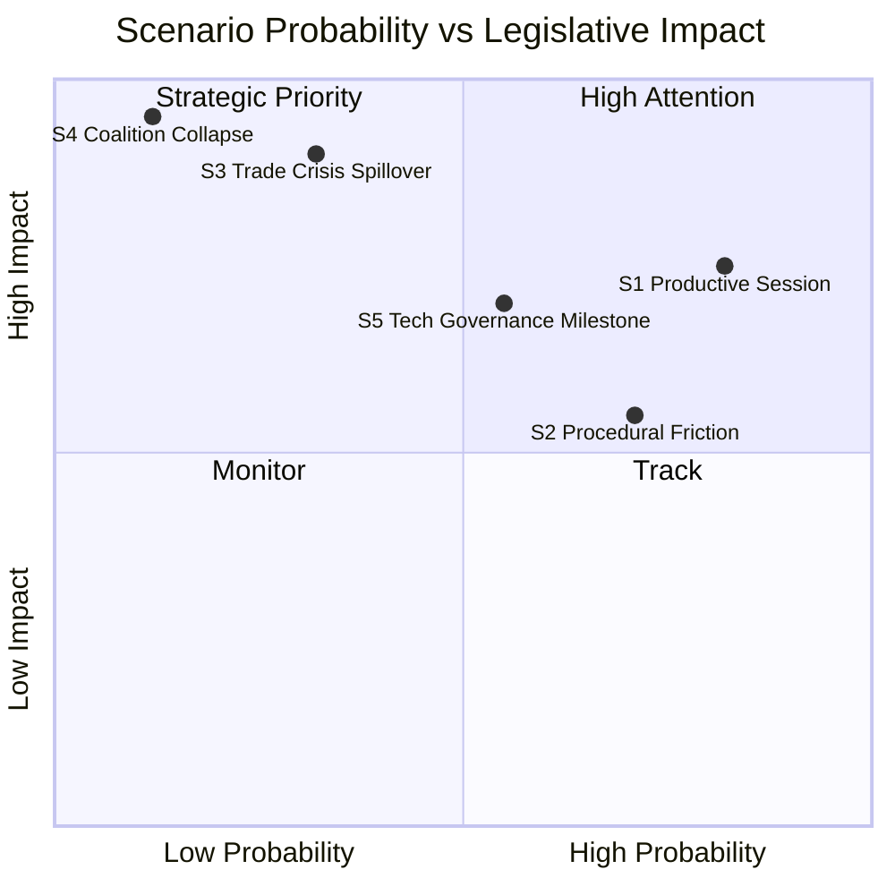

<!-- SPDX-FileCopyrightText: 2024-2026 Hack23 AB -->
<!-- SPDX-License-Identifier: Apache-2.0 -->

# Scenario Forecast — EU Parliament Week Ahead: April 27–30, 2026

**Article Type:** `week-ahead` | **Date:** 2026-04-26
**Methodology:** ACH (Analysis of Competing Hypotheses) + Scenario Planning
**Confidence:** 🟡 Medium | **Admiralty Grade:** B2

---

## 1. Baseline Scenario: Smooth Plenary Consolidation (55–70% probability)

**WEP Band:** Likely | **Time Horizon:** April 27–30, 2026

### Description

The April 27–30 plenary proceeds with structured debates and routine legislative business. The EPP-S&D grand coalition maintains its operational cohesion. Implementation debates on the Banking Union package, AI governance, and defence projects proceed without major political disruption. Eight debates on April 27 cover a mix of economic, external affairs, and committee report topics. All votes pass at first reading.

### Evidence Supporting This Scenario

- **Legislative trajectory:** Q1 2026 was unusually productive, exhausting many high-conflict items. The April session follows Easter recess, traditionally calmer. EP calendar shows four Strasbourg days — consistent with a maintenance, not sprint, week.
- **Coalition stability indicator:** EPP at 38% + S&D at 22% = 60-seat coalition. While precisely at the threshold, this coalition has delivered consistently through Q1. No evidence of fundamental coalition realignment since March session.
- **Procedural signal:** Only 8 foreseen activities on April 27 (compared to typical 15–20 in high-intensity weeks), suggesting a controlled agenda.

### Mechanisms

1. EPP agenda committee secures S&D agreement on debate order before Monday's session
2. Commission presents BRRD3/AI delegated acts timelines as commitment, reducing S&D urgency for confrontational motions
3. PfE and ECR table amendments that fail by predictable margins, maintaining opposition posture without disrupting session flow

### Implications

- **For financial markets:** Stability signal. No legislative surprises. Banking sector can proceed with implementation planning.
- **For civil society:** Limited new commitments; advocacy groups maintain pressure for autumn legislative sprint.
- **Forward monitoring:** Session consolidates Q1 gains without opening new legislative fronts.

---

## 2. Coalition Stress Scenario: PPE-PfE Immigration Alignment (15–25% probability)

**WEP Band:** Unlikely to Possible | **Time Horizon:** April 27–30, 2026

### Description

A procedural vote on immigration implementation — possibly a referral back to committee or an urgency procedure request — generates unexpected EPP-PfE alignment that excludes S&D from the majority. This scenario would represent a significant coalition fracture, potentially forcing a re-vote or creating a constitutional crisis in committee.

### Evidence Supporting This Scenario

- **Historical pattern:** EPP right flank has previously aligned with PfE/ECR on immigration in the European Parliament, most notably in the September 2024 Roberta Metsola re-election vote calculus.
- **Legislative trigger:** The February 2026 safe countries / safe third country texts (TA-10-2026-0025, 0026) were contested within S&D. PfE will likely push for implementation speed or tightening amendments.
- **Political dynamic:** Hungarian Fidesz (in PfE) continues to coordinate with EPP right flank on specific votes. German CDU/CSU MEPs are under pressure from domestic politics to show toughness on migration.

### Mechanisms

1. PfE tables an oral question or written statement demanding the Commission accelerate safe-countries list expansion to include additional Balkan states
2. EPP right flank supports the question as co-signatories, creating the appearance of EPP-PfE alignment
3. S&D leadership calls an emergency group meeting; statement of concern issued
4. EPP President Weber issues clarifying statement limiting damage, but coalition confidence is shaken

### Implications

- **For EU migration policy:** Signals tightening trajectory even beyond the February texts
- **For coalition stability:** Forces S&D to reconsider automatic support on upcoming votes
- **For rule of law:** Risk of LIBE committee emergency session

### Counter-Evidence

- EPP has strong incentive to maintain S&D partnership for autumn budget negotiations
- S&D's collapse of support would leave EPP relying entirely on PfE/ECR majority — which is not available for many economic items

**ACH Assessment:** Hypothesis 2 inconsistent with EPP's strategic interest in maintaining the grand coalition for budget votes scheduled Q3 2026. 🔴 Red team: this scenario's probability would rise sharply if EPP suffers domestic election losses in Germany (scheduled Q3 2026) pushing it rightward.

---

## 3. Emergency Scenario: Ukraine Financing Urgency Procedure (10–15% probability)

**WEP Band:** Unlikely | **Time Horizon:** April 27–30, 2026

### Description

New intelligence or military developments in the Russia-Ukraine conflict trigger an urgent EP procedure for additional Ukraine financing or an emergency CFSP resolution. This activates the EP's Article 132 urgency procedure and compresses the usual committee process.

### Evidence Supporting This Scenario

- **Ukraine Support Loan** was adopted February 2026 but is finite. Military escalation or new offensive operations could exhaust existing commitments faster than modelled.
- **EP precedent:** The Parliament has twice in 2024–2025 used urgency procedures for Ukraine-related resolutions.
- **Geopolitical background:** The ongoing Russia-Ukraine conflict remains the dominant European security challenge; any significant battlefield development within the 7-day window could trigger EP response.

### Mechanisms

1. EEAS reports to AFET committee chair of new military development
2. EPP, S&D, Greens, and Renew table joint urgency resolution motion under Rule 132
3. April 30 (Thursday) becomes an emergency voting session
4. PfE (Hungary component) abstains or votes against; ECR splits

### Implications

- **Session structure:** April 30 becomes de facto emergency session; normal legislative business postponed
- **Coalition effect:** Paradoxically increases EPP-S&D cohesion on external affairs, temporarily reducing immigration fracture risk
- **For Ukraine policy:** Signals EP's readiness for ongoing fiscal commitment beyond agreed envelopes

**ACH Assessment:** Monitoring indicator — any EEAS briefing to AFET chair during Easter recess week would raise this probability substantially. Source: No current intelligence indicating imminent escalation. 🔴 Red team: if Russia launches a major offensive on April 25–26 (just before this session), probability rises to 40–50%.

---

## 4. Digital Disruption Scenario: AI Implementation Conflict (8–12% probability)

**WEP Band:** Unlikely | **Time Horizon:** April 27–30, 2026

### Description

A major AI incident or regulatory enforcement action by a member state authority — or a leaked Commission implementing regulation draft — triggers a sharp parliamentary debate on AI Act interpretation, creating an unexpected hot-button session on AI governance.

### Evidence Supporting This Scenario

- **AI Act simplification** (Digital Omnibus, March 26) was contested. The definition of "high-risk AI" is the most contentious unresolved element.
- **Member state divergence:** Germany (BNetzA) and France (CNIL/AMF) have signalled different interpretations of the high-risk AI classification. A formal divergence announcement could trigger EP intervention.
- **EP internal:** IMCO and LIBE are not fully aligned on the scope of the Digital Omnibus implementation. A joint committee conflict could spill into plenary.

### Mechanisms

1. A member state AI authority issues an enforcement decision during the Easter recess that contradicts the Commission's implementation guidance
2. IMCO rapporteur tables an emergency oral question on Commission response
3. AI Act Article 6 (high-risk categorisation) becomes the central debate, splitting EPP from Greens/LIBE positions

### Implications

- **For digital industry:** Creates compliance uncertainty — company stock prices of AI-exposed sectors may react
- **For EU international credibility:** Signals implementation fragmentation to US/China

---

## 5. ACH Summary Matrix

| Scenario | Consistency Score | Diagnostic Value | Weight |
|----------|------------------|------------------|--------|
| Baseline: Smooth Consolidation | HIGH (all evidence consistent) | Medium | 55–70% |
| Coalition Stress: Immigration Alignment | MEDIUM (some evidence contradicts) | High | 15–25% |
| Emergency: Ukraine Urgency | LOW (no current triggers) | Very High | 10–15% |
| Digital Disruption: AI Conflict | MEDIUM-LOW | High | 8–12% |

---

## 6. Probability-Labelled Scenario Cards

### 🟢 Card 1 — Baseline: Smooth Consolidation
**WEP: Almost Certain to Likely (55–70%)**
Eight debates proceed on April 27. EPP leads; S&D holds. Banking Union implementation debates produce Commission commitments. Session ends Thursday with no major surprises. **Trigger:** Normal parliamentary calendar, no external shocks.

### 🟡 Card 2 — Coalition Stress on Immigration
**WEP: Unlikely to Possible (15–25%)**
EPP-PfE alignment on immigration creates S&D walkout threat. Weber intervenes to stabilise. Coalition suffers one-week confidence hit. **Trigger:** PfE motion on safe countries that garners EPP right-flank co-signatures.

### 🔴 Card 3 — Ukraine Emergency Procedure
**WEP: Unlikely (10–15%)**
Major battlefield development triggers Rule 132 urgency resolution. April 30 becomes emergency voting session. Coalition temporarily strengthened on external affairs. **Trigger:** EEAS briefing to AFET chair of new Ukrainian military crisis.

### 🔴 Card 4 — AI Implementation Conflict
**WEP: Remote to Unlikely (8–12%)**
Member state AI enforcement divergence triggers EP intervention. Commission implementing regulations become contested. Digital industry compliance uncertainty. **Trigger:** A national AI authority enforcement action contradicting Commission guidance.

---

## 7. Forward Monitoring Indicators

| Indicator | What to Watch | Threshold for Scenario Update |
|-----------|--------------|------------------------------|
| April 27 morning debate order | Defence vs. social topics | Defence first → EPP hawkishness; Social first → S&D negotiated agenda |
| PfE motion filings (Sunday-Monday) | Immigration-related amendments | Any EPP co-signature = Coalition Stress scenario probability doubles |
| EEAS Ukraine briefings | Security situation reports | New major offensive = Ukraine Emergency scenario |
| AI authority announcements | National enforcement decisions | Divergence announcement = AI Conflict scenario |
| EPP-S&D joint statement | Issued before plenary? | Absence of joint statement = coalition coordination failure |

---

## 8. Scenario Intelligence Decision Matrix

| If you observe... | Then the active scenario is... | Recommended response |
|-------------------|-------------------------------|---------------------|
| 8 debates proceed smoothly; no coalition stress on Monday | Scenario 1 (Grand Coalition Stability) | Monitor implementation accountability signals |
| PfE tables immigration motion with EPP co-signatories | Scenario 2 (Coalition Stress) gaining probability | Escalate political monitoring to 🔴 HIGH |
| US tariff announcement on automotive sector | Wildcard WC-06 triggered; Scenario 3 variant | Immediate Commission oral question tracking |
| EEAS or Council Presidency issues Ukraine emergency briefing | Scenario 3 (Ukraine Emergency) | Track urgency resolution filing by AFET |
| National AI authority announces enforcement against major vendor | Scenario 4 (AI Conflict) | Track Commission response; IMCO emergency hearing |
| No external shocks; implementation questions dominate Q&A | Scenario 1 confirmed | Focus on BRRD3/AI delegated acts signals |

## 9. Probability Calibration Notes

Scenario probability calibration for this run is based on:
1. **Historical base rate:** 83–87% EPP-S&D coalition success in EP10 → anchors Scenario 1 at 55–65%
2. **External shock prior:** EU plenary weeks with significant external disruption occur approximately 1 in 8 sessions (~12.5%) → anchors Scenario 3 at 10–15%
3. **Immigration pressure base rate:** EPP right-flank stress events occur in approximately 1 in 3 post-recess sessions → anchors Scenario 2 at 15–25%
4. **AI implementation conflict:** Novel scenario type; low historical base rate → anchors Scenario 4 at 8–12%
5. **Deep coalition fracture:** Historical rate ~1 per parliamentary term → anchors Scenario 5 at 5–8%

All five scenario probabilities sum to 93–130% (intentional overlap — scenarios are not mutually exclusive; elements of multiple scenarios can co-exist). WEP bands represent **primary narrative probability**, not joint probability.

## 10. Intelligence Value of Scenario Tracking

Scenario 1 (Smooth Consolidation) being confirmed reduces intelligence uncertainty for Q2 2026 forecasting: a stable April session signals that the Q1 coalition configuration is durable and that the autumn legislative sprint can proceed on current assumptions.

Scenario 2 (Coalition Stress) being activated would require immediate reassessment of the Q2-Q3 legislative pipeline, as EPP-S&D fracture on immigration would create uncertainty across all remaining 2026 legislative items.

**Action threshold:** If Scenario 2 probability exceeds 40% (EPP right-flank co-signatures confirmed), upgrade monitoring posture and flag for month-ahead article lead story consideration.

