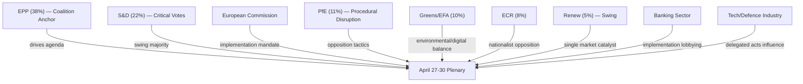
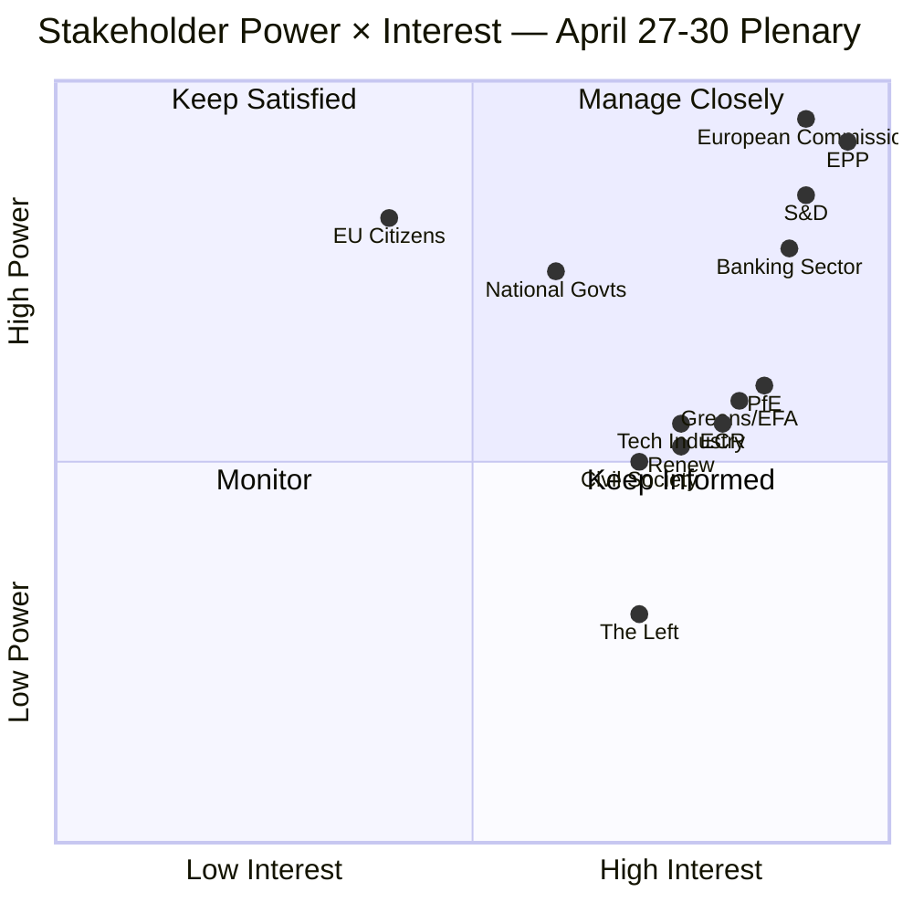

<!-- SPDX-FileCopyrightText: 2024-2026 Hack23 AB -->
<!-- SPDX-License-Identifier: Apache-2.0 -->

# Stakeholder Map — EU Parliament Week Ahead: April 27–30, 2026

**Article Type:** `week-ahead` | **Date:** 2026-04-26
**Methodology:** Mendelow Power × Interest Matrix | **Confidence:** 🟡 Medium
**Admiralty Grade:** B2

---

## 1. Actor Roster

| Actor | Role | Power Level | Interest Level | Quadrant |
|-------|------|-------------|----------------|---------|
| European People's Party (EPP) | Dominant coalition anchor | HIGH | HIGH | Manage closely |
| Socialists & Democrats (S&D) | Grand coalition partner | HIGH | HIGH | Manage closely |
| European Commission | Legislative initiator & delegated acts | HIGH | HIGH | Manage closely |
| Patriots for Europe (PfE) | Opposition/right populist bloc | MEDIUM | HIGH | Keep informed |
| European Conservatives & Reformists (ECR) | Opposition/nationalist bloc | MEDIUM | HIGH | Keep informed |
| Greens/EFA | Swing vote on environmental/tech | MEDIUM | HIGH | Keep satisfied |
| Renew Europe | Swing vote on single market/AI | MEDIUM | HIGH | Keep satisfied |
| The Left | Minority opposition | LOW | HIGH | Monitor |
| Non-Inscrits (NI) | Wildcards | LOW | MEDIUM | Monitor |
| Banking sector (EBF, ECB) | Stakeholder in BRRD3/SRMR3 | HIGH | HIGH | Manage closely |
| Digital industry (Digital Europe) | AI Act/Digital Omnibus implementation | MEDIUM | HIGH | Keep informed |
| Defence industry (ASD) | Flagship defence projects | MEDIUM | HIGH | Keep informed |
| Civil society (ETUC, Social Platform) | Housing, anti-poverty, gender | MEDIUM | HIGH | Keep informed |
| EU citizens (27 member states) | Ultimate beneficiaries | HIGH | LOW | Keep satisfied |

---

## 2. Detailed Stakeholder Perspectives (6-Lens Model)

### Lens 1: EP Political Groups

#### EPP (38% of seats — dominant group)

**Mechanism of impact:** The EPP's legislative agenda dominates through committee chairmanships and the ability to invoke Article 187 (committee votes) to advance or block texts. EPP can stall any item by requesting a second reading or a return to committee.

**EP-data evidence:** EPP delivered the Banking Union package (BRRD3/SRMR3 voted March 26), the AI Act simplification, and multiple defence texts in March 2026. This legislative productivity is evidence of EPP agenda control. The political landscape data confirms EPP at 38% — controlling the largest single-group bloc.

**Likely response to April session:** EPP will seek to project governing competence by ensuring smooth plenary logistics. Internal tension: EPP's right flank (including German CDU/CSU and some Italian FdI-linked MEPs) is restless on immigration policy after the February safe-countries texts, which they support but want tightened further. EPP leadership will need to manage this during any immigration-adjacent debate.

**Confidence: 🟢 High**

#### S&D (22% of seats — grand coalition partner)

**Mechanism of impact:** S&D provides the critical vote margin that converts EPP plurality into majorities. Without S&D, EPP cannot pass most legislation. This gives S&D effective veto power but requires it to pick battles carefully — excessive vetoes risk being seen as obstructionist.

**EP-data evidence:** S&D supported the Banking Union package, anti-poverty strategy, European Semester social priorities, gender pay gap text, and housing resolution — all adopted with S&D votes critical. The EU Talent Pool (EMPL/IMMI) was a priority S&D legislative victory.

**Likely response:** S&D will enter the April session with demands for implementation speed on social policy texts: (1) housing — push for Commission legislative proposal timeline by June 2026; (2) anti-poverty strategy — ask for Commission to publish Green Paper; (3) gender pay gap — pressure EMPL committee hearings schedule. S&D may table an oral question on DGSD2 implementation timeline.

**Confidence: 🟡 Medium**

#### PfE (11% — right populist, in opposition)

**Mechanism of impact:** PfE leverages procedural tools — amendments to delay, referral to committee requests, points of order — to slow EPP-S&D agenda items it opposes. In coalition politics, PfE can occasionally poach EPP votes on immigration, digital sovereignty, and military spending nationalism.

**EP-data evidence:** PfE group is relatively new in EP10 but has 11 seats, making it the third-largest group. Its composition (Hungarian Fidesz, French RN, Italian Lega, others) gives it tactical flexibility. The political landscape confirms PfE at 11%.

**Likely response:** PfE will focus on immigration implementation — the safe countries and safe third country texts are PfE wins they want to accelerate. They may also raise concerns about the AI Act's impact on national security capabilities and push for carve-outs. On defence, PfE is split: Hungary objects to Ukraine financing, while French RN has softened on European defence autonomy.

**Confidence: 🟡 Medium**

#### Greens/EFA (10% — progressive environmental bloc)

**Mechanism of impact:** Greens hold balance-of-power on environmental, AI, and civil liberties votes. They can form a blocking minority with The Left on some items, or swing to support EPP on environmental legislation that S&D opposes.

**EP-data evidence:** Greens backed the climate neutrality framework (with reservations) and the CoE AI Convention. They have been active in ENVI, LIBE, and IMCO committees. Greens/EFA at 10% is the fourth largest group.

**Likely response:** Greens will table oral questions or written statements on (1) climate neutrality implementation flexibility clauses — demanding Commission codify its 2040 intermediate target; (2) housing crisis — calling for social housing investment at EU level; (3) AI governance — seeking updates on high-risk AI system oversight. In the plenary, they may call for a vote on a urgency resolution if any new environmental crisis emerges over the Easter recess.

**Confidence: 🟡 Medium**

---

### Lens 2: Civil Society & NGOs

**Mechanism of impact:** Civil society organisations (ETUC for labour, Housing Europe for housing, European Disability Forum, Social Platform) monitor implementation and provide evidence bases for MEP interventions. Their written submissions are cited in committee debates and can influence oral question language.

**EP-data evidence:** The anti-poverty strategy (TA-10-2026-0049), the housing crisis resolution (TA-10-2026-0064), and the gender pay gap text (TA-10-2026-0074) all incorporated civil society input — evidenced by their breadth of stakeholder references in the procedure records.

**Likely response this week:** ETUC and Social Platform will be monitoring the just transition directive follow-up (from January's TA-10-2026-0003). Housing Europe will intensify lobbying for a formal Commission legislative proposal on affordable housing, citing the March resolution as a mandate. CCME (Churches' migration body) will monitor safe-countries implementation.

**Confidence: 🟡 Medium**

---

### Lens 3: Industry & Business

**Banking Sector (European Banking Federation, ECB Supervisory Board):**

**Mechanism of impact:** The banking sector's implementation of BRRD3/SRMR3/DGSD2 is the most consequential near-term regulatory change. Banks need delegated act clarity to plan capital requirements and resolution fund contributions. EBF will be lobbying Commission and ECON committee MEPs for implementation timelines.

**EP-data evidence:** Banking Union package adopted March 26 (TA-10-2026-0090, 0091, 0092). The Vice-President of the ECB was appointed March 10 (TA-10-2026-0060), indicating a leadership transition that creates brief institutional uncertainty.

**Likely response:** Major European banks (BNP Paribas, Deutsche Bank, Unicredit, Banco Santander) will be seeking bilateral meetings with ECON committee MEPs this week. EBF position: implementation timeline extension requests for smaller banks. Industry preference: phase-in over 5 years rather than 3. Probability of industry achieving timeline extension: 🟡 45%.

**Digital Technology Industry (Digital Europe, BSA, DigitalEurope):**

**Mechanism of impact:** The AI Act simplification (Digital Omnibus) directly benefits tech companies by reducing compliance costs. Industry will want Commission implementing regulations that interpret "high-risk AI" narrowly. They have significant lobbying resources in Brussels.

**Likely response:** Industry will push for narrow implementation of AI system classification. They will also monitor the copyright and generative AI text (TA-10-2026-0066) for any signs of precautionary implementation that restricts large language model training on EU data.

**Defence Industry (ASD — Aerospace and Defence Industries Association):**

**Mechanism of impact:** The flagship European defence projects text (TA-10-2026-0080) and barriers to single market for defence (TA-10-2026-0079) directly shape procurement frameworks. ASD has strong relationships with AFET and BUDG committees.

**Likely response:** ASD will be pushing for faster Eurodrone, MGCS, and FCAS programme funding. They have a direct interest in ensuring the defence single market barriers text is implemented without re-nationalising procurement. Industry preference for "European preference" clauses in defence contracts.

**Confidence: 🟡 Medium**

---

### Lens 4: National Governments

**Large Member States (Germany, France, Italy, Spain, Poland):**

**Mechanism of impact:** National governments influence their MEP delegations and can pressure group positions through national party channels. On BRRD3 implementation, Germany's concern about using Single Resolution Fund resources for failing bank recapitalisation is a key political variable. France's defence industrial interest (Airbus, Thales, Naval Group) shapes its position on defence single market.

**EP-data evidence:** Banking Union package and defence texts are the most nationally sensitive items from the recent legislative sprint. Poland's position on migration (supportive of safe countries/safe third country) differs from Hungary's more obstructionist stance.

**Likely national signals this week:** Germany will signal caution on Banking Union timeline acceleration; France will support defence single market but push for "strategic autonomy" language carve-outs; Poland will be monitoring Ukraine financing continuity closely given proximity to the conflict.

**Confidence: 🟡 Medium**

---

### Lens 5: EU Citizens

**Profile: A Polish nurse (Agnieszka, 34) seeking work in Germany under the EU Talent Pool:**

**Mechanism of impact:** The EU Talent Pool (TA-10-2026-0058), adopted March 10, directly affects how third-country workers are matched to EU labour markets. For an EU citizen nurse in Poland, the adjacent policy is freedom of movement and mutual recognition of qualifications — but the Talent Pool signals a broader EU strategy on labour mobility that will affect domestic healthcare wages.

**What it means for Agnieszka this week:** If the April session sees follow-up on the Talent Pool's delegated acts or a Commission communication on healthcare workforce strategy, Agnieszka's professional mobility prospects improve. If the immigration debate (safe countries/safe third country) spills over into anti-mobility populism, her professional reputation as a "migrant worker" becomes politically sensitive.

**Profile: A French homeowner (Jean-Pierre, 58) in Lyon concerned about housing affordability:**

**Mechanism of impact:** The housing crisis resolution (TA-10-2026-0064) committed the EP to seeking EU-level solutions. If the April session sees a Commission response on housing policy legislative proposals, Jean-Pierre's housing market is affected by potential EU investment stimulus.

**What it means this week:** Low probability of direct legislative action; higher probability of Commission signals on housing policy direction (🟡 Medium probability of oral exchange).

**Confidence: 🔴 Low** (policy-to-citizen transmission takes time)

---

### Lens 6: EU Institutions

**European Commission:**
The Commission under President von der Leyen (second term) is in heavy implementation mode — managing delegated acts for BRRD3/SRMR3, AI Act, Digital Omnibus, and Climate Neutrality framework simultaneously. The April session creates scrutiny pressure on all these implementation timelines.

**European Central Bank:**
With the new Vice-President in place (appointed March 10), the ECB is monitoring Banking Union reform implementation closely. Any EP signal on SRMR3 implementation speed affects the ECB's supervisory planning.

**Court of Justice of the EU:**
The EU-Mercosur compatibility request (TA-10-2026-0008, January 21) is now before the CJEU. Any preliminary signal from the Court would create significant trade policy turbulence in the April session. Probability of CJEU signal this week: 🔴 Very low (5%).

---

## 3. Power Dynamics Matrix

---

## 4. Alliance Patterns

**Grand Coalition (EPP+S&D):** Holds on all non-controversial items. Fractures on: far-right immigration demands (S&D breaks); social spending expansion (EPP right wing breaks). Stability: 🟡 Medium.

**Progressive Alliance (S&D + Greens + Renew + Left):** ~37 seats — insufficient for majority alone but can block with abstentions. Most effective on civil liberties and social policy. Stability: 🟢 High on environmental items.

**Sovereignist Bloc (PfE + ECR + some NI):** ~23 seats. Most effective on immigration and digital sovereignty. Cannot win majorities but can extract concessions. Stability: 🟡 Medium.

---

## 5. Key Power Brokers This Week

1. **EPP Group President / EPP Bureau** — Controls majority through agenda-setting
2. **ECON Committee Chair** — Banking Union delegated acts oversight
3. **AFET Committee Chair** — Defence and Ukraine financing
4. **IMCO-LIBE Joint Rapporteurs on AI** — Post-Digital Omnibus implementation
5. **Commission VP for Digital Economy** — AI Act implementing regulations

---

## 6. Stakeholder Information Matrix

| Stakeholder | Key Information Needs | Primary Information Gap |
|-------------|----------------------|------------------------|
| EPP | Coalition discipline signals, right-flank temperature | Internal EPP vote intentions on immigration items |
| S&D | Commission implementation timelines | Housing policy legislative proposals timeline |
| PfE/ECR | Immigration implementation speed, national carve-out language | Commission implementing acts on safe countries |
| Banking sector | BRRD3 delegated acts timeline | Commission's internal legal review completion date |
| Tech industry | AI high-risk classification interpretation | Commission implementing regulation draft |
| Defence industry | Flagship projects funding distribution | BUDG committee schedule for defence appropriations |

---

## Mendelow Matrix Summary

