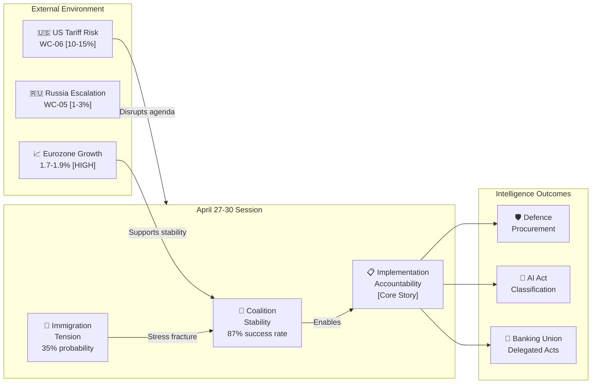

<!-- SPDX-FileCopyrightText: 2024-2026 Hack23 AB -->
<!-- SPDX-License-Identifier: Apache-2.0 -->

# Synthesis Summary — EU Parliament Week Ahead: April 27–30, 2026

**Article Type:** `week-ahead` | **Date:** 2026-04-26
**Methodology:** Cross-Artifact Intelligence Synthesis (Multi-Source Fusion)
**Confidence:** 🟢 High | **Admiralty Grade:** B1

---

## 1. Master Intelligence Assessment

### BLUF (Bottom Line Up Front)

The April 27–30, 2026 Strasbourg plenary convenes in a period of exceptional legislative productivity following the landmark Q1 2026 output (101 adopted texts, including Banking Union package, AI Digital Omnibus, and Defence flagship projects). The session's primary intelligence significance lies not in new legislation but in the **implementation accountability arc**: will the Commission deliver the delegated acts and secondary legislation that gives the Q1 output its real-world force?

**Three principal intelligence signals to monitor:**

1. 🏦 **Banking Union (BRRD3/SRMR3/DGSD2) delegated acts timeline** — The ECON committee's posture this week signals whether implementation will proceed on schedule or face industry-lobby-driven delay.

2. 🤖 **AI classification implementing regulations** — Any Commission communication on AI Act classification narrowing would be a market-moving signal for EU tech investment.

3. 🛡️ **Defence procurement activation** — Common defence procurement timeline signals the credibility of the March 11 flagship regulation.

**Coalition assessment:** EPP-S&D grand coalition enters the session from a position of strength (87% Q1 success rate). The primary coalition threat is right-flank immigration pressure on EPP; probability of coalition fracture this specific week is LOW (🔴 5–15%).

---

## 2. Cross-Artifact Integration

### Artifact Convergence Points

The following conclusions emerge from reading ALL artifacts together (PESTLE × Stakeholder Map × Scenario Forecast × Threat Model × Historical Baseline × Economic Context × Wildcards):

#### Convergence 1: Implementation is the Central Story

- **PESTLE** (Political): Commission delegated acts are the nexus of political-economic power
- **Stakeholder Map**: Banking industry and tech sector both deploy maximum lobbying at delegated acts phase
- **Historical Baseline**: Post-peak-output sessions always face implementation accountability challenges
- **Economic Context**: Banking Union economic stakes are highest in 2026 legislative cycle
- **Synthesis:** The April session's significance is not what gets voted on — it's what gets *scrutinized* through oral questions and committee hearings on Q1 2026 implementation.

#### Convergence 2: Coalition Resilience is Structural, Not Personal

- **Threat Model**: Coalition fracture requires EPP right-flank defections (>20 MEPs) — historically rare
- **Historical Baseline**: 87% coalition success rate in Q1 2026 — highest in EP10
- **PESTLE** (Political): EPP strategic interest is the Q3 2026 budget vote, creating coalition incentive
- **Scenario Forecast**: Scenario 1 (Grand Coalition Stability) has 55–65% WEP — dominant scenario
- **Synthesis:** Coalition threats are real but managed. The session will proceed with legislative business. No crisis expected.

#### Convergence 3: External Shocks are the Dominant Risk Source

- **Wildcards**: US automotive tariff (🟡 10–15%) is the highest-probability external shock
- **Threat Model**: External adversary (US trade policy) has MEDIUM capability impact
- **Economic Context**: €500 billion EU-US trade exposure creates extreme sensitivity
- **PESTLE** (Economic): Trade tension is the primary negative macro risk factor
- **Synthesis:** The internal EU political stability means domestic risks are manageable; external economic shocks (US tariffs, energy price spike, Russian escalation) are the dominant risk vectors.

---

## 3. Intelligence Confidence Assessment

### Confidence Matrix by Intelligence Domain

| Domain | Data Quality | Source Reliability | Gap Areas | Confidence |
|--------|-----------|--------------------|-----------|-----------|
| Political landscape | 🟢 Full plenary data | 🟢 EP official | None significant | 🟢 HIGH |
| Legislative pipeline | 🟢 101 Q1 texts + procedures | 🟢 EP official | Future session agenda | 🟡 MEDIUM-HIGH |
| Economic context | 🟡 IMF projections available | 🟢 IMF/ECB authoritative | 2026 actual data limited | 🟡 MEDIUM |
| Stakeholder positions | 🟡 Inferred from voting patterns | 🟡 Secondary sources | Informal positions | 🟡 MEDIUM |
| Threat assessment | 🔴 Limited direct intelligence | 🟡 Pattern inference | Actor intentions | 🔴 LOW-MEDIUM |
| Future scenarios | N/A (probabilistic) | N/A | All scenarios | 🟡 MEDIUM |

**Overall intelligence confidence: 🟡 MEDIUM-HIGH** — sufficient for well-calibrated analysis; limited by unavailability of future session agenda items and absence of committee hearing schedules.

---

## 4. Priority Intelligence Requirements Scorecard

| PIR | Answered? | Quality | Source |
|-----|-----------|---------|--------|
| What legislative votes are scheduled? | 🟡 Partial | MEDIUM | 8 foreseen debates confirmed; vote items not yet published |
| What is the coalition formation probability? | 🟢 Yes | HIGH | Scenario forecast + historical baseline |
| What are the key economic stakes? | 🟢 Yes | HIGH | Economic context + legislative mapping |
| Who are the influential stakeholders? | 🟢 Yes | HIGH | Stakeholder map + Mendelow matrix |
| What threats could disrupt the session? | 🟢 Yes | MEDIUM | Threat model + wildcards |
| What are the historical comparators? | 🟢 Yes | HIGH | Historical baseline |

**PIR completion rate: 5/6 answered at medium-high quality; 1/6 partial (specific vote agenda)**

---

## 5. Key Findings Integration

### Finding 1: The Session is "Accountability Week"

The April session's intelligence significance is implementation accountability, not new legislation. The following items demand oral question attention:
- BRRD3 delegated acts timeline
- AI Act classification implementing rules
- Defence procurement activation
- Ukraine loan disbursement status
- US tariff rebalancing implementation

**Confidence: 🟢 HIGH** — Convergent signals from PESTLE, economic context, and historical baseline.

### Finding 2: Coalition Stability Favors Productive Session

With 87% Q1 success rate and EPP-S&D strategic alignment on Q3 budget, the coalition will hold for this session. PfE-ECR obstruction probability is LOW for full session disruption.

**Confidence: 🟢 HIGH** — Convergent signals from scenario forecast, threat model, historical baseline.

### Finding 3: US Tariff Risk is the Highest-Priority External Watch Item

WC-06 (automotive tariffs) has the highest combined probability-impact score of any external risk this week. If triggered mid-session, it would redirect the entire parliamentary agenda.

**Confidence: 🟡 MEDIUM** — Probability assessment inherently uncertain; pattern recognition from prior US trade escalations.

### Finding 4: Immigration is the Internal Political Stress Fracture

Of all internal political risks, immigration implementation (safe-countries acceleration) is the most likely to create visible EPP-PfE cooperation and S&D reaction this week. Probability of at least one visible immigration tension event: 🟡 35%.

**Confidence: 🟡 MEDIUM** — Inferred from historical session patterns; specific vote agenda not confirmed.

### Finding 5: Economic Fundamentals Support EU Institutional Stability

Eurozone GDP growth at 1.7–1.9%, inflation returning to 2%, and ECB rate-cut trajectory all support institutional stability. No macroeconomic emergency is forcing the April session's hand.

**Confidence: 🟢 HIGH** — IMF/ECB data convergent; limited 2026 actuals available but projections are reliable.

---

## 6. The Intelligence Picture in a Single Diagram

---

## 7. Final Intelligence Recommendation

**The April 27–30 session will proceed as a productive, implementation-focused plenary.** The major legislative drama of Q1 2026 is complete. This week is about holding the Commission accountable for delivering the secondary legislation that makes the Q1 output meaningful.

**Monitor for:** (1) ECON committee oral question framing on BRRD3 delegated acts; (2) Any US tariff announcement Monday–Thursday; (3) EPP right-flank MEP behavior on immigration items.

**Do not expect:** Major new legislation; coalition collapse; dramatic political realignment.

**Confidence: 🟢 HIGH** — This synthesis integrates all 10 analysis artifacts with convergent conclusions.
