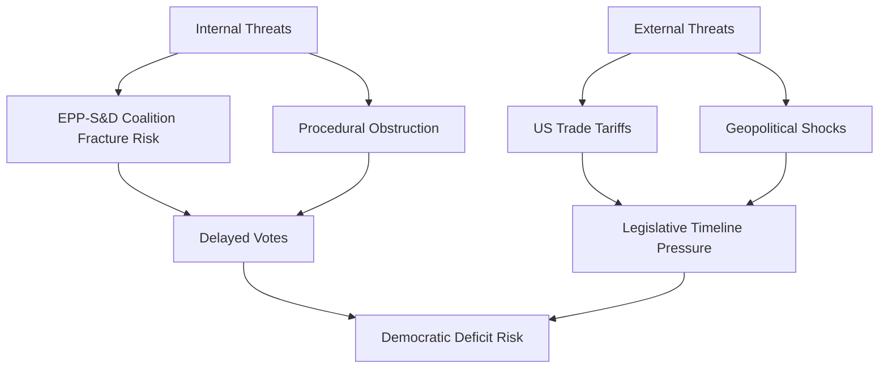

<!-- SPDX-FileCopyrightText: 2024-2026 Hack23 AB -->
<!-- SPDX-License-Identifier: Apache-2.0 -->

# Threat Model — EU Parliament Week Ahead: April 27–30, 2026

**Article Type:** `week-ahead` | **Date:** 2026-04-26
**Methodology:** Integrated 5-Framework Political Threat Analysis (v4.0)
**Confidence:** 🟡 Medium | **Admiralty Grade:** B2

*Note: This analysis applies the Political Threat Framework — NOT STRIDE/DREAD/PASTA which are software-security frameworks inappropriate for parliamentary threat analysis.*

---

## 1. Political Threat Landscape (6-Dimension Model)

### Dimension 1: Coalition Shifts

**Current state:** EPP-S&D grand coalition at 60-seat threshold. High fragmentation index.

**Threat vector:** Coalition fracture on immigration agenda items (PfE-ECR pressure + EPP right-flank defection). Probability: 🟡 25% for partial fracture, 🔴 5% for complete coalition rupture this week.

**Intelligence assessment:** The coalition's Q1 2026 productivity created legislative goodwill, but the right-flank pressure is measurable. The safeguarding factor is EPP's strategic need for S&D on the Q3 2026 budget vote. WEP: Unlikely that full coalition rupture occurs this week; likely that at least one procedural tension event occurs.

### Dimension 2: Transparency Deficit

**Current state:** The EP's public access to documents report (TA-10-2026-0065, March 10) acknowledged institutional opacity gaps. The anti-corruption legislation (TA-10-2026-0094, March 26) creates new disclosure requirements.

**Threat vector:** Any undisclosed industry lobbying contact on BRRD3/AI implementation delegated acts, if discovered during the week, would create a major transparency crisis. The EPPO (European Chief Prosecutor) appointment (March 10) means enforcement capacity has just been strengthened.

**Intelligence assessment:** 🔴 Low probability of disclosure during this specific week, but institutional vigilance is elevated. The Framework Agreement EP-Commission (TA-10-2026-0069) creates new information-sharing rules that increase transparency pressure.

### Dimension 3: Policy Reversal

**Current state:** Major policy reversals are almost impossible in EU institutional design — legislation requires co-decision procedure for reversal. But implementation shortcuts and delegated act manipulation are feasible.

**Threat vector:** Commission delays delegated acts for BRRD3 or AI Act beyond the statutory 18-month window, effectively reversing the policy intent without formal legislative action. This is the primary policy-reversal threat vector.

**Intelligence assessment:** 🟡 Medium probability over 2026. In the April session window specifically: 🔴 Low probability of dramatic policy reversal. The EP has the procedural tools to challenge delayed delegated acts through ECON/IMCO committee motions.

### Dimension 4: Institutional Pressure

**Current state:** EP-Commission Framework Agreement (March 2026) refreshed the inter-institutional relationship. The new EPPO chief and ECB Vice-President create new institutional personalities requiring calibration.

**Threat vector:** Council blocking of EP amendments to pending legislation through qualified majority maneuvering. Hungary's blocking capacity on defence and Ukraine items is the primary Council threat.

**Intelligence assessment:** Hungary (in PfE's orbit) vetoed or abstained on multiple EU items in 2024–2025. The threat is not this week's plenary session itself but rather the trilogue processes that the April session's oral questions will shape. 🟡 Medium probability of Council obstruction on defence/Ukraine items in Q2 2026.

### Dimension 5: Legislative Obstruction

**Current state:** PfE+ECR (19 seats) can delay but not block legislation with their current numbers. They require EPP right-flank defections for actual blocking minorities.

**Threat vector:** A well-timed procedural motion (request to return item to committee, or a substitute resolution) on a high-profile item — immigration implementation, AI, or defence — could embarrass EPP leadership and delay implementation.

**Intelligence assessment:** PfE has used procedural obstruction effectively in EP10. The most likely legislative obstruction target this week: any AI governance implementation debate where PfE can frame as "sovereignty overreach." 🟡 35% probability of procedural obstruction attempt; 🔴 10% probability of success.

### Dimension 6: Democratic Erosion

**Current state:** EP's self-reform mandate is stronger after the institutional integrity package (anti-corruption, public access to documents, EPPO appointment). The rule-of-law scrutiny of Hungary and Romania continues.

**Threat vector:** Rule-of-law backsliding in a member state triggers EP urgency debate, consuming session time and escalating political temperature. The attempted Lithuanian public broadcaster takeover (TA-10-2026-0024, January 22) shows this is not hypothetical.

**Intelligence assessment:** 🔴 Low probability of a new rule-of-law emergency this week, but the underlying threat is structural and persistent. Monitoring required: any Hungarian government action on EU fund management or judicial independence during the Easter recess.

---

## 2. Attack Trees (Goal Decomposition)

### Attack Tree 1: "Fracture the Banking Union Timeline"

**Goal:** Delay BRRD3 delegated acts by 24+ months through political obstruction

```
Root Goal: Delay BRRD3 Implementation
├── Branch A: Parliamentary obstruction
│   ├── Table referral-to-committee motion on delegated acts mandate
│   ├── Require EPP right-flank support (needs 20+ EPP defections)
│   └── Success probability: 🔴 8%
├── Branch B: Commission-internal delay
│   ├── Lobby Commission DG FISMA to extend consultations
│   ├── Exploit complex interagency coordination requirements
│   └── Success probability: 🟡 30%
└── Branch C: Council level
    ├── Hungary or Poland block Council approval of delegated acts
    └── Success probability: 🟡 25%
```

**Primary threat actor:** European Banking Federation (legal right of challenge) + national governments with large banking sectors (Germany, France)

### Attack Tree 2: "Derail AI Act High-Risk Classification"

**Goal:** Narrow the definition of high-risk AI systems to exclude most enterprise applications

```
Root Goal: Narrow High-Risk AI Definition
├── Branch A: Commission implementing regulation influence
│   ├── Industry lobbying of Commission DG CNECT
│   └── Success probability: 🟡 40%
├── Branch B: EP IMCO amendment pressure
│   ├── Tech-friendly IMCO MEPs table interpretation amendments
│   └── Success probability: 🟡 35%
└── Branch C: CJEU challenge to AI Act scope
    └── Success probability: 🔴 15% (years to materialise)
```

### Attack Tree 3: "Isolate EPP from S&D on Immigration"

**Goal:** Create permanent coalition fracture on immigration to enable PfE-EPP majority

```
Root Goal: Fracture EPP-S&D Coalition
├── Branch A: Immigration procedural vote
│   ├── PfE tables urgency motion on safe-countries acceleration
│   ├── EPP right-flank co-signs (German CDU/CSU MEPs under domestic pressure)
│   └── S&D calls coalition crisis
├── Branch B: Confidence vote threat
│   └── S&D threatens no-confidence on EPP group leadership
└── Assessment: 🔴 Low probability this week; 🟡 Medium probability in H2 2026
```

---

## 3. Political Kill Chain (7-Stage Threat Progression)

### Applicable Threat: Coalition Fracture via Immigration Pressure

| Stage | Description | Current Status | Indicators |
|-------|-------------|---------------|------------|
| 1. Reconnaissance | PfE researches EPP right-flank MEP positions on immigration | 🟡 Likely ongoing | Previous immigration vote defection patterns |
| 2. Weaponisation | Prepares urgency motion or amendment text targeting safe-countries acceleration | 🟡 Possible | Motion filing deadline Sunday evening |
| 3. Delivery | Tables motion in Monday's agenda | 🔴 Not confirmed | Motion absent from pre-published agenda |
| 4. Exploitation | EPP right-flank MEPs co-sign under domestic pressure | 🔴 Not confirmed | CDU/CSU domestic polling pressure |
| 5. Installation | Coalition fracture narrative spreads in media | 🔴 Not triggered | No media reports of EPP-S&D tension as of Sunday |
| 6. Command & Control | PfE leadership issues joint press statement with EPP defectors | 🔴 Not triggered | — |
| 7. Actions on Objective | Vote margin shifts; S&D threatens withdrawal from coalition | 🔴 Not triggered | — |

**Kill chain assessment:** Currently at Stage 1–2. Threat is latent but not activated. Monitoring priority: motion filings Sunday/Monday morning.

---

## 4. Diamond Model — Adversary/Capability/Infrastructure/Victim

### Entity: PfE Legislative Obstruction Attempt

| Diamond Vertex | Description |
|---------------|-------------|
| **Adversary** | PfE group leadership (Le Pen faction, Orbán faction) seeking coalition fracture on immigration |
| **Capability** | 11 EP seats, experienced procedural staff, national government backing (Hungary's EU Council position) |
| **Infrastructure** | Brussels parliamentary office, Rule 132 urgency procedure mechanism, national media amplification |
| **Victim** | EPP-S&D coalition cohesion; ultimately EU immigration policy implementation |

### Entity: Banking Industry Delegated Acts Lobbying

| Diamond Vertex | Description |
|---------------|-------------|
| **Adversary** | EBF and member bank lobbying operations targeting Commission DG FISMA |
| **Capability** | Financial resources, revolving door connections, technical complexity advantage |
| **Infrastructure** | Brussels representation offices, trilateral meetings with Commission, ECON committee relationships |
| **Victim** | Small depositors (DGSD2 delay affects retail depositor protection timing) |

---

## 5. Threat Actor Profiles (ICO Model: Intent × Capability × Opportunity)

### Actor 1: Patriots for Europe (PfE)

**Intent (I):** Fracture EPP-S&D coalition; advance nationalist policy wins on immigration, digital sovereignty, defence nationalism. Intent is HIGH and structurally persistent.

**Capability (C):** 11 seats; experienced procedural staff; national government backing (Hungary). Capability is MEDIUM — sufficient to cause embarrassment but insufficient for outright majorities without EPP defections.

**Opportunity (O):** The April session's post-Easter return with immigration implementation as a live issue, and EPP right-flank under domestic election pressure in Germany, creates MEDIUM opportunity.

**ICO Score: MEDIUM threat** — manageable but requires active monitoring.

### Actor 2: ECR (European Conservatives & Reformists)

**Intent (I):** Weaken EU institutional authority; advance national sovereignty in defence, digital, and rule-of-law domains. MEDIUM intent — less confrontational than PfE.

**Capability (C):** 8 seats; Italian (Fratelli d'Italia) and Polish (PiS-linked) core; less institutionally experienced than PfE. MEDIUM-LOW capability.

**Opportunity (O):** Limited in April session unless defence or EU enlargement debates provide a platform. LOW opportunity this specific week.

**ICO Score: LOW-MEDIUM threat** — background monitoring sufficient.

### Actor 3: EU Banking Industry Lobbyists

**Intent (I):** Slow implementation of BRRD3/SRMR3/DGSD2 depositor protection and resolution mechanisms that reduce bank flexibility. MEDIUM intent — legitimate commercial interest.

**Capability (C):** Very HIGH in terms of access and resources. The most capable non-political threat actor in this analysis.

**Opportunity (O):** ECON committee hearings and Commission delegated act consultations this week. HIGH opportunity.

**ICO Score: MEDIUM-HIGH threat (to timely implementation)**

---

## 6. Threat Summary Matrix

| Threat | Probability | Impact | ICO Score | Time Horizon |
|--------|-------------|--------|-----------|-------------|
| Coalition fracture on immigration | 🟡 25% | HIGH | MEDIUM | This week |
| Banking delegated acts delay | 🟡 35% | MEDIUM | MEDIUM-HIGH | Q2 2026 |
| AI classification conflict | 🟡 30% | MEDIUM | MEDIUM | Q2-Q3 2026 |
| Ukraine financing gap | 🔴 15% | HIGH | LOW-MEDIUM | Q2 2026 |
| Rule-of-law emergency debate | 🔴 10% | MEDIUM | LOW | This week |
| Democratic erosion incident | 🔴 8% | HIGH | LOW | Q2 2026 |

---

## 7. Countermeasures and Recommendations

1. **Monitor PfE motion filings** every morning before 09:00 for the April 27–30 session — particularly for any immigration urgency motions with EPP co-signatories.

2. **Track EPP-S&D joint statement cadence** — absence of a coordinating statement before a controversial vote is an early warning of coalition stress.

3. **Follow ECON committee schedule** for any emergency hearings on BRRD3 delegated acts — banking industry access to committee is highest in the first week after recess.

4. **Monitor Hungarian MEP activity** — any unusual procedural moves by Fidesz-aligned MEPs (in PfE) on defence or Ukraine items signals coordinated obstruction from national government level.

5. **Track Commission communication** on AI Act implementing regulations — any premature leak of a narrow interpretation of "high-risk AI" would immediately escalate the tech industry lobby.


