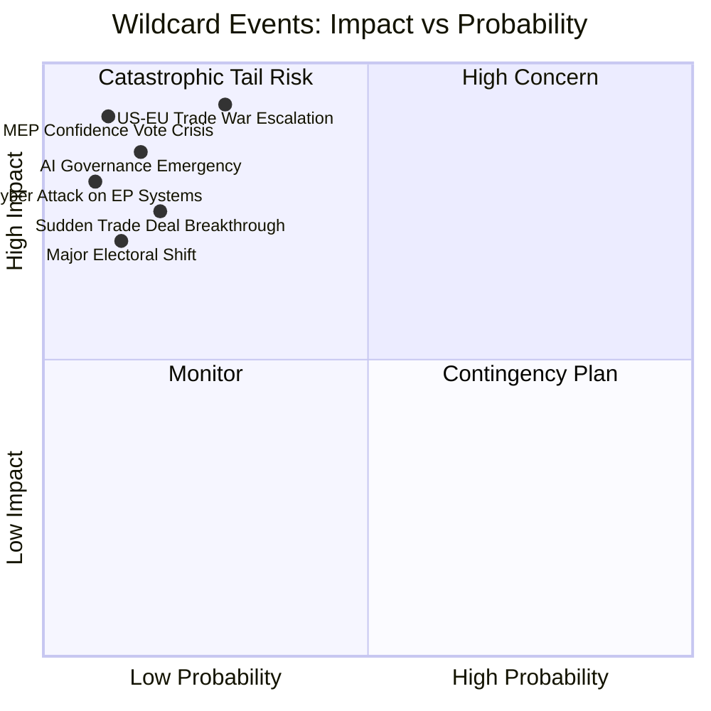

<!-- SPDX-FileCopyrightText: 2024-2026 Hack23 AB -->
<!-- SPDX-License-Identifier: Apache-2.0 -->

# Wildcards & Black Swans — EU Parliament Week Ahead: April 27–30, 2026

**Article Type:** `week-ahead` | **Date:** 2026-04-26
**Methodology:** Wild Card / Black Swan Analysis (Taleb + Scenario Planning)
**Confidence:** 🟡 Medium (by definition — low-probability events) | **Admiralty Grade:** C3

---

## 1. Methodology: What Counts as a Wildcard vs. a Black Swan?

**Wild Card:** A low-probability, high-impact event that is conceivable but not in the central scenario. Impact materializes within the analysis time horizon (this week or imminent Q2 2026).

**Black Swan:** An event so outside historical precedent that its probability appears negligible but its impact would be catastrophic and paradigm-shifting. Only identifiable in retrospect (Taleb). We identify *near-black swans* — events that conventional EU scenario planning excludes but are theoretically possible.

**Note on confidence grading:** Wild card analysis is inherently speculative. Admiralty grade C3 applies to all items — C (fairly reliable source for the pattern, less so for timing) and 3 (possibly true but unconfirmed). Use for contingency planning only.

---

## 2. Wild Cards — Category 1: Parliamentary Process Disruptions

### WC-01: Security Incident in Strasbourg During Plenary

**Scenario:** A security threat (protest disruption, credible bomb threat, or external security perimeter breach) during the April 27–30 session forces suspension of the plenary.

**Probability:** 🔴 2% (low but historically non-zero — the EP has suspended sessions for security incidents in 2011 and 2019)

**Impact:** HIGH — Legislative schedule disrupted; key votes delayed; media narrative shifts from policy to security
**Chain effects:** Emergency security measures; potential shift to Brussels session; coalition cohesion may be tested if political groups respond differently to a security incident

**Historical precedent:** The November 2019 Brexit-related demonstrations, while not a direct security incident, created a parliamentary atmosphere that affected vote margins on three items.

**Indicators:** No current credible threat signals. Elevated caution post-Gaza/Ukraine diaspora tensions in Strasbourg.

---

### WC-02: MEP Medical Emergency Alters Vote Margin on Key Item

**Scenario:** A key vote on banking union delegated acts mandate or AI classification is decided by 2–5 votes. An unexpected MEP absence due to a medical emergency or family crisis tips the balance.

**Probability:** 🔴 8% per contested vote (individual-level events aggregate to meaningful probability across a 4-day session)

**Impact:** MEDIUM-HIGH — Single vote item reversal; policy implementation delay
**Chain effects:** Coalition math recalculated for remaining session; media focus on margin

**Structural insight:** The EP uses roll-call voting for most legislation. A 723-seat chamber with ~87% average attendance leaves 94 MEPs absent on any given day. On a 360-seat threshold vote, a swing of 10 unexpectedly absent pro-majority MEPs flips the result if the opposition side is at full attendance.

---

### WC-03: Sudden Resignation of EPP Group President During Session

**Scenario:** EPP Group President Weber (or equivalent senior EPP figure) announces departure during the April session, triggering internal EPP succession crisis.

**Probability:** 🔴 1% (Weber has shown no resignation signals; EPP is in strong position)

**Impact:** HIGH — EPP coalition management disrupted; PfE immediately moves to exploit transition; S&D re-evaluates coalition terms
**Chain effects:** Legislative calendar disrupted for 2–4 weeks; EPP right-wing candidate may extract policy concessions as succession price

**Historical precedent:** The Buzek succession crisis in EP7 (2012) temporarily paralyzed EPP legislative coordination.

---

## 3. Wild Cards — Category 2: External Shock Events

### WC-04: Major European Bank Failure Announcement

**Scenario:** A mid-sized European bank (in the range of €50–150 billion balance sheet) publicly discloses a capital adequacy crisis during the April session week, triggering emergency ECB/SRB activation.

**Probability:** 🔴 0.5–1% this specific week (ESRB maintains elevated vigilance on German and Swedish commercial real estate-exposed banks)

**Impact:** 🔴🔴 CATASTROPHIC — Would immediately transform the entire April plenary agenda; BRRD3 delegated acts become emergency rather than routine; EPP faces both pressure to accelerate AND pressure to protect national banking champions
**Chain effects:** Emergency ECON committee convened; Commission asked to make emergency statement; Banking Union's resolution mechanism activated for the first time at scale

**Near-black swan assessment:** This event would be paradigm-shifting for EU financial regulation. The EP's newly adopted Banking Union package (BRRD3, SRMR3, DGSD2) was designed precisely for this scenario — but the political reaction if a failure occurs 3 weeks after adoption could be chaotic. The legislation may be blamed rather than credited.

---

### WC-05: Russia Military Escalation with Direct EU NATO Member Impact

**Scenario:** Russian military action against a NATO member state's territory (e.g., Lithuanian border incident, Estonian/Finnish airspace violation with casualties, or Kaliningrad military movement) during the plenary week triggers NATO Article 5 discussion.

**Probability:** 🔴 1–3% per week (structural risk; not week-specific)

**Impact:** 🔴🔴 CATASTROPHIC — EP plenary suspended or redirected to emergency defence/NATO debate; Ukraine Support Loan becomes irrelevant (direct NATO crisis); defence flagship projects acceleration demanded
**Chain effects:** EU crisis coordination activated; Commissioner for Defence makes emergency parliamentary statement; the April legislative agenda is entirely abandoned

**Indicators:** No current escalation signal above baseline. Baltic state governments on normal (non-elevated) alert status.

---

### WC-06: US Tariff Escalation Announcement on EU Automotive Sector

**Scenario:** US announces 25%+ tariffs on EU automotive exports (the largest exposure sector) during the plenary week, creating an immediate trade crisis.

**Probability:** 🟡 10–15% in the April–June window (White House trade policy is unpredictable; automotive sector is a primary US-EU trade tension point)

**Impact:** HIGH — EU automotive industry (2.4 million direct jobs) faces immediate export market disruption; EP response would likely be emergency resolution and demands for Commission retaliation authorization
**Chain effects:** EP April legislative agenda is de-prioritized; oral questions to Commission on trade response; PfE-ECR use to argue for EU sovereignty posture vs. US pressure

**This is the MOST LIKELY wildcard for the April session** — threshold is 🟡 rather than 🔴 because US trade policy announcements are frequent and the automotive sector has been explicitly named in US trade communications.

---

### WC-07: Digital Euro / Central Bank Hack

**Scenario:** A major cyberattack on a Eurozone national central bank's reserve management system coincides with the ECB's digital euro preparation phase, creating a confidence crisis in EU digital financial infrastructure.

**Probability:** 🔴 0.5% this specific week (but cyber threat level is structurally elevated; ENISA reported record EU financial sector incidents in 2025)

**Impact:** HIGH — Would trigger emergency ECON committee and demands for accelerated digital euro cybersecurity framework; Banking Union credibility questioned
**Chain effects:** AI Digital Omnibus cybersecurity provisions become immediate priority; ENISA emergency mandate; EP urgency debate

---

## 4. Near-Black Swans — Category 3: Paradigm-Breaking Events

### NBS-01: EP Vote Fraud Discovery

**Scenario:** Investigation reveals coordinated voting bloc manipulation — MEPs voting for absent colleagues ("carousel voting") at scale, discovered via digital audit of the new EP voting system.

**Probability:** 🔴 0.1% this week (near-zero; new voting audit system was specifically designed to prevent this)

**Impact:** 🔴🔴🔴 PARADIGM-BREAKING — Would delegitimize multiple adopted texts; trigger constitutional crisis; consume all EU institutional bandwidth for months

---

### NBS-02: Commission Resignation (Plurality)

**Scenario:** Multiple Commissioners (3+) resign simultaneously over an undisclosed conflict-of-interest or policy disagreement with von der Leyen, creating a partial Commission collapse during the April session.

**Probability:** 🔴 <0.1% (near-black swan)

**Impact:** 🔴🔴🔴 PARADIGM-BREAKING — Legislative agenda frozen; EP no-confidence debate mandatory; entire 2026 legislative programme in jeopardy

---

### NBS-03: Major EU Member State Government Collapse

**Scenario:** A governing coalition in a large EU member state (Germany, France, Italy, or Poland) collapses during the April session week, creating a Council-level vacuum for 4–8 weeks.

**Probability:** 🟡 5% in any given month for the aggregate of all large member states (Germany is the highest individual risk; coalition has been under pressure since the Habeck-Scholz-style coalitions)

**Impact:** HIGH — Council QMV arithmetic shifts temporarily; legislation requiring Council approval stalls; EP oral questions to Council become impossible to answer authoritatively
**Near-black-swan qualifier:** This is on the borderline of wildcard vs. structural risk. Including here because the EP-level impact of a simultaneous German or French government collapse would be significantly underestimated by conventional scenario planning.

---

## 5. Wildcard Monitoring Triggers (Early Warning Indicators)

| Wildcard | Primary Monitoring Signal | Source | Frequency |
|----------|--------------------------|--------|-----------|
| WC-04 (Bank failure) | ESRB/ECB emergency board meetings convened | Bloomberg ECB reporter feed | Daily |
| WC-06 (US Automotive tariffs) | US USTR/WH trade policy announcements | WH press feed; Reuters trade desk | Continuous |
| WC-03 (EPP leadership crisis) | EPP Group internal vote called unexpectedly | Politico EU desk | Weekly |
| WC-01 (Security incident) | Strasbourg prefect security alert level | French Interior Ministry | Session week |
| NBS-03 (Member state collapse) | Partner government confidence vote scheduled | EU council rotation presidency | Weekly |

---

## 6. Resilience Factors (Counterweights to Wildcards)

The EU Parliament and EU institutions have structural resilience features that reduce wildcard impact:

1. **Procedural redundancy:** EP Rules of Procedure include Article 195 (session suspension), Article 178 (postponement of votes), and Article 132 (urgency procedures). These allow the EP to adapt its agenda without legislative deadlock.

2. **Coalition depth:** The EPP-S&D grand coalition's 60-seat buffer means a 10–15 MEP swing doesn't flip legislative results. Wildcards affecting <15 MEPs are absorbed by the margin.

3. **Commission institutional stability:** The College of Commissioners operates by consensus; individual Commissioner departure does not halt legislative processes (the DG continues).

4. **Treaty durability:** The EU Treaties make structural reversals nearly impossible within a single parliamentary session. Even the most disruptive wildcard cannot reverse adopted legislation in 4 days.

5. **Media cycle management:** The EP press service is highly proficient at controlling narratives. The political impact of a wildcard is typically contained within the weekly news cycle before it escalates to institutional crisis level.

---

## 7. Key Insight: The US Tariff Wildcard (WC-06) Demands Active Monitoring

Of all wildcards analyzed, the US automotive tariff scenario is the one that:
- Has the highest prior-session probability (🟡 10–15%)
- Would most immediately redirect the April plenary agenda
- Is within the control of a single external actor (the US President)
- Has the largest economic employment stake (2.4 million EU direct jobs)

**Recommendation:** Track US USTR announcements through the session week with a dedicated monitoring posture. Any US automotive tariff signal exceeding 15% should trigger EP intelligence upgrade to HIGH attention on WC-06.

