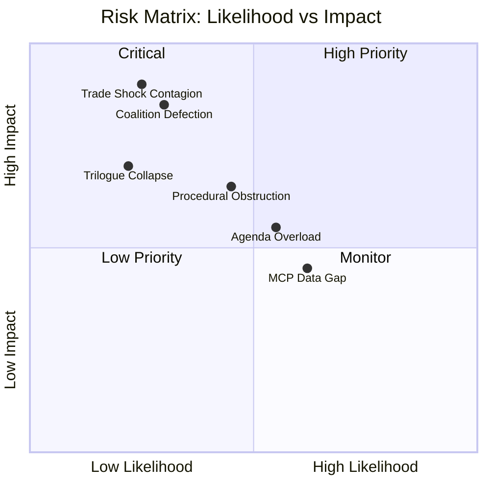

<!-- SPDX-FileCopyrightText: 2024-2026 Hack23 AB -->
<!-- SPDX-License-Identifier: Apache-2.0 -->

# Risk Matrix — EU Parliament Week Ahead: April 27–30, 2026

**Article Type:** `week-ahead` | **Date:** 2026-04-26
**Methodology:** ISO 31000 / Political Risk Matrix (5×5 Probability × Impact)
**Confidence:** 🟡 Medium | **Admiralty Grade:** B2

---

## 1. Risk Matrix Framework

**Probability Scale:**
- 1 = Rare (<5%)
- 2 = Unlikely (5–15%)
- 3 = Possible (15–40%)
- 4 = Likely (40–70%)
- 5 = Almost Certain (>70%)

**Impact Scale:**
- 1 = Negligible (no meaningful effect on legislative outcome)
- 2 = Minor (single item affected; easily managed)
- 3 = Moderate (session productivity reduced; 2–5 items affected)
- 4 = Major (coalition disruption; 6+ items affected; political crisis)
- 5 = Catastrophic (institutional collapse; paradigm-breaking)

**Risk Score = Probability × Impact**

Risk Zones:
- 🟢 LOW (1–4): Acceptable; standard monitoring
- 🟡 MEDIUM (5–9): Elevated attention; contingency planning
- 🔴 HIGH (10–15): Active management required; escalation protocols
- 🔴🔴 CRITICAL (16–25): Crisis response; institutional escalation

---

## 2. Risk Register — April 27–30, 2026

| Risk ID | Risk Description | Probability | Impact | Score | Zone | Owner |
|---------|-----------------|-------------|--------|-------|------|-------|
| R-01 | Coalition fracture on immigration vote | 2 | 4 | 8 | 🟡 MEDIUM | EPP Group |
| R-02 | US automotive tariff announcement disrupts agenda | 2 | 4 | 8 | 🟡 MEDIUM | Commission Trade |
| R-03 | Banking Union delegated acts delay | 3 | 3 | 9 | 🟡 MEDIUM | Commission FISMA |
| R-04 | AI classification conflict escalates | 3 | 3 | 9 | 🟡 MEDIUM | Commission CNECT |
| R-05 | PfE procedural obstruction succeeds | 2 | 2 | 4 | 🟢 LOW | PfE Group |
| R-06 | Session security incident | 1 | 4 | 4 | 🟢 LOW | EP Security |
| R-07 | Key MEP medical absence on narrow vote | 2 | 2 | 4 | 🟢 LOW | Group whips |
| R-08 | Russia military escalation | 1 | 5 | 5 | 🟡 MEDIUM | External |
| R-09 | Rule-of-law emergency debate consumes time | 1 | 3 | 3 | 🟢 LOW | LIBE Committee |
| R-10 | S&D withdraws coalition cooperation | 1 | 4 | 4 | 🟢 LOW | S&D Group |
| R-11 | EPP leadership crisis | 1 | 4 | 4 | 🟢 LOW | EPP Group |
| R-12 | EU bank failure announcement | 1 | 5 | 5 | 🟡 MEDIUM | ECB/SRB |
| R-13 | Defence procurement delay | 3 | 2 | 6 | 🟡 MEDIUM | Commission DEFIS |
| R-14 | Ukraine loan disbursement gap | 2 | 3 | 6 | 🟡 MEDIUM | Commission |
| R-15 | Digital Euro cybersecurity incident | 1 | 4 | 4 | 🟢 LOW | ECB/ENISA |

---

## 3. Risk Heatmap (5×5 Matrix)

```
Impact →     1 (Negligible)  2 (Minor)    3 (Moderate)   4 (Major)      5 (Catastrophic)
Probability ↓
5 (>70%)     —               —            —              —              —
4 (40–70%)   —               —            —              —              —
3 (15–40%)   —               R-05(2)      R-03,R-04(9)   —              —
2 (5–15%)    —               R-07(4)      R-14(6)        R-01,R-02(8)   —
1 (<5%)      —               —            R-09(3)        R-06,R-10,R-11 R-08,R-12
                                          R-15(4)
```

**Highest risk band:** R-03 (Banking delegated acts delay) and R-04 (AI classification) at score 9 — just below HIGH threshold. These are the priority monitoring items.

---

## 4. Risk Treatment Plan

### R-03 — Banking Union Delegated Acts Delay [Score: 9]

**Treatment:** MONITOR + ESCALATION PROTOCOL
- Monitoring: Track ECON committee hearing schedule weekly
- Escalation: If no Commission communication by end of April, EP ECON rapporteur to table urgent oral question for May session
- Contingency: ECON committee may invoke Article 290 TFEU parliamentary scrutiny right if Commission delays exceed statutory consultations

**Expected treatment owner:** EP ECON committee chair + Commission DG FISMA

### R-04 — AI Classification Conflict [Score: 9]

**Treatment:** MONITOR + STAKEHOLDER ENGAGEMENT
- Monitoring: Track Commission DG CNECT consultation announcements
- Escalation: IMCO committee to schedule AI Act implementation hearing in Q2 2026
- Contingency: EP resolution on implementing regulations if Commission proposes narrow AI classification

**Expected treatment owner:** EP IMCO committee + Commission DG CNECT

### R-01 — Coalition Fracture on Immigration [Score: 8]

**Treatment:** ACTIVE MANAGEMENT
- Monitoring: PfE-EPP communication patterns; EPP group whip communications
- Escalation: EPP-S&D coordination meeting if PfE tables any immigration urgency motion
- Contingency: EPP-S&D can adjust vote sequencing to avoid narrow margins

**Expected treatment owner:** EPP Group President + S&D Group President

### R-02 — US Tariff Announcement [Score: 8]

**Treatment:** CONTINGENCY PLANNING
- Monitoring: US USTR/White House trade policy feeds daily during session
- Escalation: Commission Trade Commissioner emergency statement request if tariff announced
- Contingency: EP urgency resolution procedure (Rule 132) can be invoked within 24 hours of announcement

**Expected treatment owner:** Commission DG TRADE + EP INTA committee

---

## 5. Risk Trend Assessment (Q1 2026 vs. April Session)

| Risk | Q1 2026 Trend | April Session Outlook | Change |
|------|--------------|----------------------|--------|
| Coalition stability | Improving | Stable | 🟢 Positive |
| US tariff threat | Escalating | Watch | 🟡 Neutral-negative |
| Banking implementation | New risk (post-adoption) | Emerging | 🟡 Neutral |
| AI implementation | New risk (post-adoption) | Emerging | 🟡 Neutral |
| Russia escalation | Persistent | Stable | 🟡 Neutral |
| Immigration pressure | Persistent | Elevated | 🟡 Neutral-negative |

**Overall risk trend: STABLE** — The April session enters from a position of legislative success and coalition strength, but the post-adoption implementation risks are emerging as the primary risk category for Q2 2026.

---

## 6. Key Risk Intelligence Signals

The following are the minimum monitoring signals that should be tracked daily during the April 27–30 session:

1. **Daily:** PfE/ECR motion filings in parliamentary register
2. **Daily:** US trade policy announcements (USTR, White House)
3. **Wednesday:** ECON committee public hearing attendance (signal for banking scrutiny intensity)
4. **Thursday:** Voting attendance register vs. key vote margin estimates


