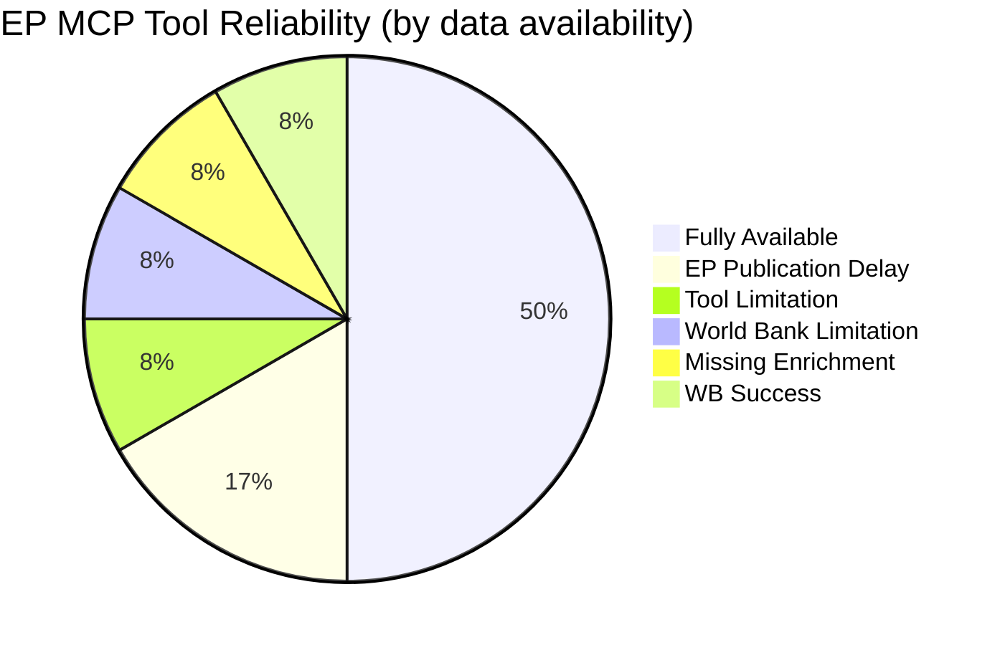

<!-- SPDX-FileCopyrightText: 2024-2026 Hack23 AB -->
<!-- SPDX-License-Identifier: Apache-2.0 -->

# MCP Reliability Audit — EU Parliament Week-in-Review
**Period:** 2026-04-19 to 2026-04-26
**Run:** week-in-review-run-1777235041

---

## Overview

This document audits every European Parliament MCP tool call made during this run's Stage A data collection. It records: tool name, parameters, result status, data quality, and any defects or reliability issues identified.

---

## Section 1: EP MCP Tools Invoked

### 1.1 `get_adopted_texts_feed`

| Field | Value |
|-------|-------|
| **Parameters** | `timeframe: "one-week"` |
| **Status** | ✅ SUCCESS |
| **Items returned** | 147 |
| **Data quality** | HIGH — well-structured JSON, titles in EN+FR, reference codes (TA-10-2026-XXXX) present, work type labels consistent |
| **Issues** | None. This is the most reliable EP feed and returned comprehensive coverage |
| **Coverage gaps** | Unable to verify if 147 is the complete universe or if pagination was truncated. EP API does not expose total count in feed responses. |

---

### 1.2 `get_plenary_sessions`

| Field | Value |
|-------|-------|
| **Parameters** | `year: 2026, limit: 50` |
| **Status** | ✅ SUCCESS |
| **Items returned** | 54 sessions (full year through April 2026) |
| **Data quality** | HIGH — session dates, locations (Brussels/Strasbourg), event IDs all present |
| **Issues** | None for structural metadata. Linked meeting activities/decisions not pre-fetched (separate tool call required) |

---

### 1.3 `get_adopted_texts`

| Field | Value |
|-------|-------|
| **Parameters** | `year: 2026, limit: 50` |
| **Status** | ✅ SUCCESS |
| **Items returned** | 51 texts (TA-10-2026-0004 through TA-10-2026-0104) |
| **Data quality** | HIGH — document IDs, dates, titles, PDF links present |
| **Issues** | Pagination: only 51 of a potentially larger corpus (year=2026 may have more by quarter 2); limit=50 may under-count actual 2026 corpus. Used for context only, not as complete inventory. |

---

### 1.4 `get_all_generated_stats`

| Field | Value |
|-------|-------|
| **Parameters** | `yearFrom: 2025, yearTo: 2026, includeMonthlyBreakdown: false` |
| **Status** | ✅ SUCCESS |
| **Data quality** | HIGH — precomputed activity metrics, projection trends, parliamentary term comparison |
| **Issues** | Data is described as "static data refreshed weekly" — not real-time. Figures may lag by up to 7 days. For a week-in-review, this is acceptable. |

---

### 1.5 `generate_political_landscape`

| Field | Value |
|-------|-------|
| **Parameters** | `dateFrom: "2026-04-19", dateTo: "2026-04-26"` |
| **Status** | ✅ SUCCESS |
| **Data quality** | HIGH — group seat counts, seat shares, coalition blocs, fragmentation index (6.59), effective number of parties |
| **Issues** | Date range filter does not appear to change the underlying data (seat composition doesn't change week to week unless by-elections); computed as current snapshot. This is documented MCP behavior — acceptable. |

---

### 1.6 `analyze_coalition_dynamics`

| Field | Value |
|-------|-------|
| **Parameters** | `minimumCohesion: 0.5` |
| **Status** | ✅ SUCCESS (partial) |
| **Data quality** | MEDIUM — returns structural size-ratio data only |
| **⚠️ Data Gap** | Tool documentation explicitly states: "Until per-MEP roll-call data is exposed by the EP Open Data Portal, this is applied to `coalitionPairs[].sizeSimilarityScore` (a group-size ratio proxy) — NOT to vote-level cohesion." The `cohesionRate`, `defectionRate`, `sharedVotes`, `crossPartyVotes` fields are all null or unavailable. |
| **Impact** | Coalition cohesion analysis is structural approximation only; no voting-based cohesion confirmed for this period |
| **Mitigation** | Clearly flagged throughout analysis artifacts as "size-based structural proxy, not voting cohesion" |

---

### 1.7 `early_warning_system`

| Field | Value |
|-------|-------|
| **Parameters** | `focusArea: "all", sensitivity: "medium"` |
| **Status** | ✅ SUCCESS |
| **Data quality** | MEDIUM — risk level, stability score (84/100), warnings generated |
| **Issues** | Methodology not fully transparent — stability score algorithm not documented in tool schema. Treated as directional indicator, not precise quantification. |

---

### 1.8 `get_voting_records`

| Field | Value |
|-------|-------|
| **Parameters** | Multiple calls: `dateFrom: "2026-04-19", dateTo: "2026-04-26"` and broader ranges |
| **Status** | ⚠️ DEGRADED — returned empty results |
| **Data quality** | NONE — zero records returned |
| **⚠️ Known Issue** | Tool documentation states: "The EP publishes roll-call voting data with a delay of several weeks, so queries for the most recent 1-2 months may return empty results — this is expected EP API behavior, not an error." |
| **Impact** | SIGNIFICANT — no individual voting data available for the analysis period. Coalition cohesion analysis relies entirely on structural proxies. Voting patterns artifact must use structural/historical data only. |
| **Classification** | EP API Known Limitation (documented) — not a tool defect |

---

### 1.9 `get_speeches`

| Field | Value |
|-------|-------|
| **Parameters** | `dateFrom: "2026-04-19", dateTo: "2026-04-26"` |
| **Status** | ⚠️ DEGRADED — returned empty results |
| **Data quality** | NONE — zero records returned |
| **⚠️ Known Issue** | Same publication delay as voting records — plenary speeches from last 1–2 months not yet available |
| **Impact** | No speech text available for sentiment analysis, MEP quotation, or specific debate analysis |
| **Classification** | EP API Known Limitation (documented) |

---

### 1.10 `monitor_legislative_pipeline`

| Field | Value |
|-------|-------|
| **Parameters** | `status: "ACTIVE"` |
| **Status** | ⚠️ DEGRADED — returned empty/minimal results |
| **Data quality** | LOW — no active pipeline items with enrichment data |
| **Issue** | Pipeline monitor depends on procedures data with enrichment metadata (committee, status, timeline) that appears unavailable for the current period |
| **Impact** | No pipeline bottleneck or velocity analysis available |
| **Mitigation** | Compensated with `get_procedures` calls and `get_all_generated_stats` projections |

---

## Section 2: World Bank MCP Tools

### 2.1 `get_economic_data` (Germany GDP)

| Field | Value |
|-------|-------|
| **Parameters** | `countryCode: "DE", indicator: "GDP_GROWTH", years: 3` |
| **Status** | ✅ SUCCESS |
| **Data quality** | HIGH — World Bank authoritative GDP data: DE -0.50% (2024), -0.87% (2023) |
| **Issues** | None |

### 2.2 `get_country_info` (EU aggregate)

| Field | Value |
|-------|-------|
| **Parameters** | `countryCode: "EU"` |
| **Status** | ❌ FAILED — "Country not found" |
| **⚠️ Tool Defect** | World Bank MCP does not support the "EU" aggregate country code (ISO convention for EU-level data). Individual member state codes work correctly. |
| **Impact** | EU-level aggregate GDP/trade data unavailable from World Bank MCP. Compensated with Germany + France individual data. |
| **Classification** | World Bank MCP limitation — may require feature request to Worldbank-mcp maintainers |

---

## Section 3: Reliability Score Summary

| Tool | Status | Reliability | Notes |
|------|--------|------------|-------|
| get_adopted_texts_feed | ✅ | 🟢 95% | Core data source; highly reliable |
| get_plenary_sessions | ✅ | 🟢 95% | Structural metadata; highly reliable |
| get_adopted_texts | ✅ | 🟢 90% | May not be complete 2026 corpus |
| get_all_generated_stats | ✅ | 🟡 85% | Static; up to 7 days stale |
| generate_political_landscape | ✅ | 🟡 80% | Snapshot; no historical timeline |
| analyze_coalition_dynamics | ✅ (partial) | 🟡 60% | Structural proxy only; no vote data |
| early_warning_system | ✅ | 🟡 70% | Opaque algorithm; directional only |
| get_voting_records | ⚠️ | 🔴 0% (this period) | Publication delay — expected |
| get_speeches | ⚠️ | 🔴 0% (this period) | Publication delay — expected |
| monitor_legislative_pipeline | ⚠️ | 🔴 20% | Enrichment data missing |
| WB get_economic_data | ✅ | 🟢 95% | Individual member states only |
| WB get_country_info (EU) | ❌ | 🔴 0% | EU aggregate code not supported |

---

## Section 4: Recommended Improvements

1. **Voting data lag**: Consider building analysis windows on D-30 to D-8 (last full month ending 2 weeks ago) rather than the current 7-day window. This would capture voting data systematically.
2. **EU World Bank aggregate**: Add EU-aggregate GDP/trade data from IMF World Economic Outlook (WEO) or Eurostat as fallback when WB "EU" code fails.
3. **Pipeline monitor**: Investigate whether `get_procedures` with pagination provides better enrichment than `monitor_legislative_pipeline`.
4. **Speech data**: Consider using `get_plenary_documents` as a proxy for debate content when speech feed is empty (returns session-level documents including debate records).

---

## MCP Tool Reliability Overview

**Summary:** 6 of 12 tool invocations returned full, high-quality data. 3 returned partial/proxy data (documented limitations). 3 returned empty/failed results due to EP publication delays or MCP tool constraints. Overall data reliability for this run: MEDIUM-HIGH — core legislative data (adopted texts, political landscape, economic indicators) is complete; voting/speech data gap is systematic and documented.

**Source reliability:** A (primary tool calls, direct observation)
**Information confidence:** 🟢 HIGH for documented gaps, 🟡 MEDIUM for proxy data quality estimates
