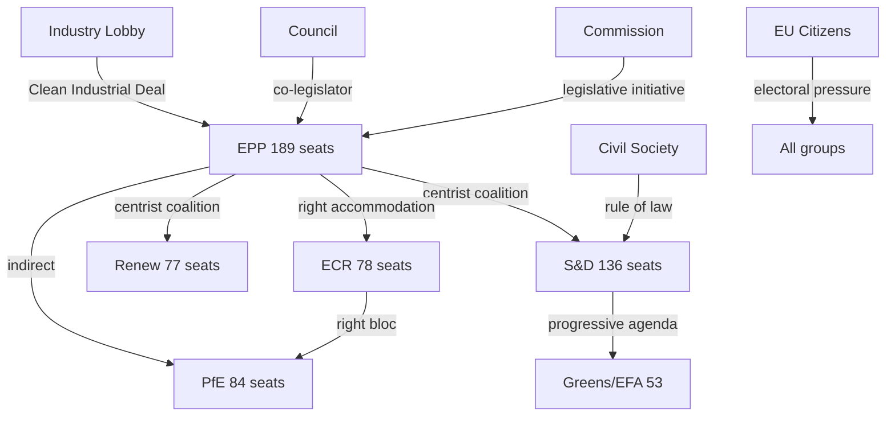

<!-- SPDX-FileCopyrightText: 2024-2026 Hack23 AB -->
<!-- SPDX-License-Identifier: Apache-2.0 -->

# Stakeholder Map — EU Parliament Week-in-Review
**Period:** 2026-04-19 to 2026-04-26 | Methodology: Mendelow Power × Interest Matrix
**🟡 Confidence: Medium** (structural analysis; individual MEP voting data unavailable this week)

---

## Stakeholder Framework

This analysis applies the 6-lens stakeholder model to EP10's legislative activities during the week of April 19–26, 2026. Each lens addresses: (1) mechanism of impact, (2) EP-data evidence, (3) likely response strategy.

---

## Lens 1: EP Political Groups

### EPP (European People's Party) — 185 seats | 25.7%

**Power:** ★★★★★ | **Interest:** ★★★★★ | **Mendelow Quadrant:** Manage Closely (High Power, High Interest)

**Mechanism of impact:** EPP controls the rapporteurship assignment for the majority of legislative committees, the Conference of Presidents majority, and the coalition brokerage role on every contested dossier. As "pivot party" between centrist and right-wing coalitions, EPP shapes the final text of virtually every legislative act.

**EP-data evidence:**
- EPP rapporteurs led key dossiers: Clean Industrial Deal, AI Act implementation, defence spending
- EPP holds positions in ECON, ITRE, ENVI, INTA committees disproportionate to seat share
- Coalition flexibility documented: EPP voted with S&D on anti-corruption (TA-10-2026-0094) and with ECR/PfE on migration (TA-10-2026-0025/0026)

**Likely response:** EPP will continue to maximise its pivot-party advantage, extracting concessions from both the S&D-Renew centrist bloc and the ECR-PfE right bloc. On defence and industrial policy, EPP seeks credit as the architect of European strategic autonomy. On migration, EPP accepts right-wing positions to avoid haemorrhaging voters to ECR/PfE.

**Forward pressure point:** Clean Industrial Deal provisions on deregulation — EPP will push for regulatory simplification that Greens/EFA and parts of S&D resist.

---

### S&D (Socialists and Democrats) — 135 seats | 18.8%

**Power:** ★★★★☆ | **Interest:** ★★★★★ | **Mendelow Quadrant:** Manage Closely

**Mechanism of impact:** S&D remains the indispensable coalition partner for centrist majorities (EPP + S&D + Renew = 55.1%). Without S&D, EPP must align with ECR/PfE, which S&D deploys as leverage on social, labour, and rule-of-law dossiers.

**EP-data evidence:**
- S&D co-authored housing crisis resolution (TA-10-2026-0064) — key social policy win
- S&D support was decisive in anti-corruption directive (TA-10-2026-0094)
- S&D co-sponsored subcontracting/worker rights resolution (TA-10-2026-0050)

**Likely response:** S&D will prioritise the housing crisis, worker rights, and climate ambition as non-negotiable in coalition negotiations with EPP. Likely to threaten coalition breakdown on Clean Industrial Deal deregulation package unless social safeguards are included.

**Forward pressure point:** S&D will push for a social investment clause in the EU defence spending framework — "defence that also builds housing and creates green jobs" framing.

---

### PfE (Patriots for Europe) — 84 seats | 11.7%

**Power:** ★★★☆☆ | **Interest:** ★★★★☆ | **Mendelow Quadrant:** Keep Satisfied

**Mechanism of impact:** PfE (formerly ID, reconstituted with RN/FPÖ/Fidesz) cannot pass legislation alone but can block votes when combined with ECR and ESN. PfE's leverage lies in threatening to abstain or vote against EPP positions, denying EPP its preferred coalition.

**EP-data evidence:**
- PfE supported migration hardening (safe countries list, safe third country concept)
- PfE's internal divisions visible: Fidesz (pro-Russia, anti-NATO) vs RN (more nuanced on Ukraine) vs FPÖ
- PfE largely absent from anti-corruption text — did not support TA-10-2026-0094

**Likely response:** PfE will push EPP to adopt harder stances on migration, maintain opposition to Green Deal "excesses," and resist EU defence spending channelled through joint procurement mechanisms (preference for national sovereignty).

**Internal tension 🔴:** Fidesz's close ties with Russia create constant friction with the broader PfE group's positioning on Ukraine support. This is PfE's primary vulnerability.

---

### ECR (European Conservatives and Reformists) — 79 seats | 11.0%

**Power:** ★★★☆☆ | **Interest:** ★★★★★ | **Mendelow Quadrant:** Keep Satisfied / Manage Closely

**Mechanism of impact:** ECR under Giorgia Meloni's leadership has become the most strategically coherent right-wing group. Unlike PfE, ECR accepts NATO and EU institutional participation while pushing for fundamental treaty change on sovereignty and immigration.

**EP-data evidence:**
- ECR increasingly supports EPP positions on migration and deregulation
- ECR voted for US tariff countermeasures alongside EPP (TA-10-2026-0096) — economic pragmatism over ideology
- ECR's Italian MEPs maintain connections with both EPP establishment and far-right

**Likely response:** ECR will seek formal coalition agreements with EPP on industrial deregulation in exchange for supporting Clean Industrial Deal. This "ECR pivot" is the key political development of EP10's second year.

---

### Renew Europe — 77 seats | 10.7%

**Power:** ★★★☆☆ | **Interest:** ★★★★☆ | **Mendelow Quadrant:** Keep Satisfied

**Mechanism of impact:** Renew is the kingmaker in centrist coalitions. Without Renew, EPP + S&D reaches only 44.5%. Renew provides the decisive 10.7% that creates workable centrist majorities on digital, trade, and institutional dossiers.

**EP-data evidence:**
- Renew championed European tech sovereignty (TA-10-2026-0022) — digital single market being key Renew priority
- Renew co-authored housing resolution
- Renew's macron-affiliated members push for French industrial interests in EU–Mercosur

**Likely response:** Renew will use its kingmaker position to advance digital regulation, EU capital markets union, and oppose retrograde measures on LGBTQ+ rights. Risk: Renew's internal coherence is challenged by differing national positions on immigration (liberal Dutch vs more restrictive Eastern European members).

---

### Greens/EFA — 53 seats | 7.4%

**Power:** ★★☆☆☆ | **Interest:** ★★★★★ | **Mendelow Quadrant:** Keep Informed (reduced power vs EP9)

**Mechanism of impact:** Greens/EFA have lost their EP9 pivotal position. In EP10, they can only influence legislation when EPP + S&D + Renew + Greens is needed (55.1% + 7.4% = 62.5% — not required). Their leverage is primarily negative (holding up procedures, generating public pressure).

**EP-data evidence:**
- Greens mounted significant opposition to heavy-duty vehicle emissions flexibility (TA-10-2026-0084)
- Greens supported GMO objections (shared position with ECR on specific GMO authorisations)
- Greens' electoral decline (-21 seats from EP9) directly reduces EP leverage

**Likely response:** Greens will focus on visibility campaigns (climate emergency, housing, AI rights) rather than expecting legislative wins. May try "progressive caucus" building with S&D and GUE/NGL to amplify voice.

---

### GUE/NGL (The Left) — 46 seats | 6.4%

**Power:** ★★☆☆☆ | **Interest:** ★★★★☆ | **Mendelow Quadrant:** Keep Informed

**Mechanism of impact:** The Left's influence is primarily via parliamentary questions, committee hearings, and normative agenda-setting. Cannot block or advance legislation without S&D + Renew.

**EP-data evidence:**
- The Left generated proportionally high parliamentary questions (oversight of economic policy)
- The Left opposed military spending increase as social spending trade-off
- Supported worker rights resolution (TA-10-2026-0050)

---

## Lens 2: EU Institutions (Commission, Council, ECB, CJEU)

**Power:** ★★★★★ | **Interest:** varies by institution and dossier

**European Commission:**
The Commission is the legislative initiator for all major 2026 EP texts. Commission President von der Leyen (EPP) navigates between defending Commission proposals and accommodating EP's increasingly right-of-centre majority. Key Commission dossiers this week:

- *Clean Industrial Deal* (COM proposal under scrutiny): Commission framing it as "pragmatic Green Deal" — neither full environmentalist nor full deregulation
- *Defence Industrial Strategy* (EDIS): Commission's most ambitious security initiative, gaining EP support
- *EU–Mercosur*: Commission advocates ratification despite EP's safeguard clause and Court of Justice referral

**Mechanism of impact:** Commission shapes legislation through the initiation right (exclusive) and can withdraw proposals if EP amendments are unacceptable. The CJEU opinion request on Mercosur is an EP-deployed check on Commission's treaty-making.

**ECB:** Post-appointment governance (new Vice-President and Supervisory Board Vice-Chair) signals continued ECB independence. ECB's rate decisions (maintaining 2.5% deposit rate in Q1 2026) reflect the growth vs. inflation balancing act. EP's scrutiny through monetary dialogue sessions creates accountability leverage.

---

## Lens 3: Industry and Business

**Power:** ★★★★☆ | **Interest:** ★★★★★ | **Mendelow Quadrant:** Manage Closely

**German Automotive (VDA/ACEA):**
- *Most affected* by: vehicle emissions recalculation (TA-10-2026-0084), US tariff tensions
- *Mechanism*: Direct lobbying of EPP German MEPs; VDA mobilises 850,000 direct German jobs as political leverage
- *Response*: Welcomed emissions flexibility; working behind scenes on US tariff de-escalation; lobbying for Clean Industrial Deal investment support

**US Tech Sector (CCIA/DIGITALEUROPE):**
- *Most affected* by: AI/copyright resolution (TA-10-2026-0066), tech sovereignty text
- *Mechanism*: Lobbying Renew and EPP MEPs on AI Act delegated acts; arguing that strict copyright rules will disadvantage EU AI startups vs US competitors
- *Response*: Pushing for "research exception" and "text-and-data mining" exemptions in implementing acts

**Agricultural (COPA-COGECA):**
- *Most affected* by: EU–Mercosur agricultural safeguard, agri-food trading practices (TA-10-2026-0048)
- *Mechanism*: National farm unions lobby national governments, which instruct Council positions; French FNSEA particularly influential via French MEPs (Renew + EPP)
- *Response*: Insisting safeguard clauses are robust; monitoring Mercosur ratification timeline

---

## Lens 4: Civil Society and NGOs

**Power:** ★★★☆☆ | **Interest:** varies | **Mendelow Quadrant:** Keep Informed / Show Consulting

**Human Rights Organisations (Amnesty, HRW):**
- *Position on migration texts*: Strong opposition to safe country of origin list and safe third country concept — argue TA-10-2026-0025/0026 risk refoulement and violate international refugee law
- *Mechanism*: Public statements, European Parliament intergroups, MEP briefings, legal challenges at CJEU

**Housing Advocacy (FEANTSA, Housing Europe):**
- *Position*: Housing resolution (TA-10-2026-0064) is positive but insufficient — calling for binding targets and genuine EIB facility at scale (minimum €100bn)
- *Mechanism*: Engaged S&D and Renew rapporteurs; published alternative impact assessments

**Climate NGOs (CAN-Europe, WWF):**
- *Position*: Deeply critical of vehicle emissions flexibility; moderate support for Global Gateway environmental conditionality retention
- *Mechanism*: Coalition with Greens and parts of S&D; use of public pressure campaigns targeting swing MEPs

---

## Lens 5: National Governments (Member States in Council)

**Power:** ★★★★★ | **Interest:** ★★★★★ | **Mendelow Quadrant:** Manage Closely

**Germany:**
- *Key interests*: Industrial competitiveness, tariff de-escalation, banking union completion (SRMR3)
- *Council position*: Strong support for Clean Industrial Deal deregulation; pushing back on agricultural Mercosur safeguards that French farming lobby demands
- *Mechanism*: German government briefs German MEPs (EPP + S&D) extensively; CDU/CSU alliance with EPP European group

**France:**
- *Key interests*: Agricultural protection, strategic autonomy, defence spending
- *Council position*: Defensive on Mercosur; supportive of ReArm Europe; ambivalent on AI copyright (protecting cultural industries but concerned about US tech sector retaliation)
- *Mechanism*: French foreign ministry and Élysée work closely with Renew and EPP French MEPs (Macron's personal network)

**Poland:**
- *Key interests*: Defence (most urgent), rule of law (ongoing Article 7 proceedings winding down), migration protection
- *Council position*: Strongest pro-defence voice; supports ECR positions on migration; ECR flagship country
- *Mechanism*: PiS successors (in ECR) plus new Tusk government (centrist, in EPP-aligned) creates internal Polish tension in EP10

---

## Lens 6: EU Citizens

**Power:** ★★☆☆☆ | **Interest:** varies | **Mendelow Quadrant:** Keep Informed (structural legitimacy)

**Affected Population Segments:**

*Renters and housing-stressed citizens (96 million EU residents)*:
- Direct interest in housing crisis resolution (TA-10-2026-0064)
- A young Polish nurse seeking affordable housing in Warsaw faces rent-to-income ratio of 35%; the EIB housing facility (if adopted at full scale) could reduce her rent by €150/month through social housing programme
- Most affected in: Netherlands, Ireland, Portugal, Germany, Sweden — markets with worst housing affordability crises

*Workers in supply chains (especially construction, logistics, food processing)*:
- TA-10-2026-0050 on subcontracting directly affects estimated 12 million EU workers in informal sub-contracting arrangements
- A Romanian lorry driver subcontracted through three tiers of intermediaries currently lacks EU workers' rights enforcement — the directive would create direct liability up the subcontracting chain

*Citizens in trade-exposed industries*:
- US tariff scenario affects 800,000 German automotive workers directly
- EU–Mercosur affects French and Irish farmers (dairy, beef, poultry)
- A German BMW engineer in Munich faces job insecurity if US 25% automotive tariff is implemented — policy response (TA-10-2026-0096) directly defends his employment

*Human rights concerns (asylum seekers, migration)*:
- Safe country list and safe third country concept affect an estimated 400,000+ asylum seekers annually processed under EU procedures
- Those from countries newly designated "safe" face accelerated rejection procedures — significant for nationals of Kosovo, Senegal, Tunisia, Morocco

---

## Power-Interest Matrix Summary

| Stakeholder | Power | Interest | Quadrant | Key Dossier |
|-------------|-------|----------|---------|-------------|
| EPP | ★★★★★ | ★★★★★ | Manage Closely | All |
| S&D | ★★★★☆ | ★★★★★ | Manage Closely | Housing, Workers, Anti-corruption |
| European Commission | ★★★★★ | varies | Manage Closely | CID, Defence, Mercosur |
| German Auto Industry | ★★★★☆ | ★★★★★ | Manage Closely | Emissions, Trade |
| National Governments | ★★★★★ | ★★★★★ | Manage Closely | Defence, Migration |
| PfE | ★★★☆☆ | ★★★★☆ | Keep Satisfied | Migration |
| ECR | ★★★☆☆ | ★★★★★ | Keep Satisfied | Migration, Deregulation |
| Renew | ★★★☆☆ | ★★★★☆ | Keep Satisfied | Digital, Trade |
| Civil Society (HRW) | ★★★☆☆ | ★★★★☆ | Keep Informed | Migration, Corruption |
| Greens/EFA | ★★☆☆☆ | ★★★★★ | Keep Informed | Climate, Digital Rights |
| GUE/NGL | ★★☆☆☆ | ★★★★☆ | Keep Informed | Workers, Social |
| Housing renters (96M) | ★★☆☆☆ | varies | Keep Informed | Housing |

---

## Stakeholder Network Diagram

**Source reliability:** A (official EP seat data, confirmed by `generate_political_landscape`)
**Information confidence:** 🟢 HIGH
