<!-- SPDX-FileCopyrightText: 2024-2026 Hack23 AB -->
<!-- SPDX-License-Identifier: Apache-2.0 -->

# Workflow Audit — EU Parliament Week-in-Review
**Period:** 2026-04-19 to 2026-04-26
**Run ID:** week-in-review-run-1777235041
**Workflow Start Epoch:** 1777235041 (2026-04-26T20:23:25Z)

---

## Stage Execution Log

| Stage | Planned Budget | Actual Execution | Status |
|-------|---------------|-----------------|--------|
| A (Data Collection) | ≤ 4 min | ~2 min | ✅ Completed within budget |
| B (Analysis Pass 1) | 12–15 min (part of ≥18 total) | In progress | ⏳ |
| B (Analysis Pass 2) | Remaining B budget | Pending | ⏳ |
| C (Completeness Gate) | ≤ 3 min | Pending | ⏳ |
| D (Article Render) | ≤ 2 min | Pending | ⏳ |
| E (Single PR) | ≤ 1–2 min | Pending | ⏳ |

---

## MCP Tool Call Summary

| Phase | EP MCP calls | WB MCP calls | Memory | Sequential-thinking |
|-------|-------------|-------------|--------|---------------------|
| Stage A | 10 | 2 | 0 | 0 |
| Stage B Pass 1 | 0 (artifact writing only) | 0 | 0 | 0 |
| **Total** | **10** | **2** | **0** | **0** |

---

## Data Gaps Encountered

1. **Voting records** — empty (EP publication delay — documented)
2. **Speeches** — empty (EP publication delay — documented)
3. **Legislative pipeline monitor** — empty (enrichment data missing)
4. **World Bank EU aggregate** — "Country not found" (WB MCP limitation)

All gaps documented in `intelligence/mcp-reliability-audit.md` with mitigations applied.

---

## Artifact Completion Tracker

| Artifact | Status | Line Floor | Estimated Lines |
|----------|--------|-----------|----------------|
| analysis-index.md | ✅ | 120 | ~130 |
| historical-baseline.md | ✅ | 150 | ~165 |
| economic-context.md | ✅ | 150 | ~170 |
| pestle-analysis.md | ✅ | 200 | ~220 |
| stakeholder-map.md | ✅ | 240 | ~255 |
| scenario-forecast.md | ✅ | 220 | ~230 |
| threat-model.md | ✅ | 180 | ~200 |
| wildcards-blackswans.md | ✅ | 200 | ~210 |
| synthesis-summary.md | ✅ | 180 | ~190 |
| mcp-reliability-audit.md | ✅ | 200 | ~210 |
| reference-analysis-quality.md | ✅ | 140 | ~145 |
| voting-patterns.md | ✅ | 150 | ~155 |
| cross-session-intelligence.md | ✅ | 150 | ~155 |
| workflow-audit.md (this file) | ✅ | 100 | ~110 |
| methodology-reflection.md | ⏳ | 180 | TBD |
| risk-scoring/risk-matrix.md | ⏳ | 120 | TBD |
| risk-scoring/quantitative-swot.md | ⏳ | 120 | TBD |
| executive-brief.md | ⏳ | 180 | TBD |

**Completed: 14/18** | **Remaining: 4/18**

---

## Known Issues

- No Pass 2 re-read completed yet on completed artifacts — required before Stage C
- Manifest.json needs final update after all artifacts written

---

## Quality Control Checkpoints

- [x] Stage A data collection within 4-min budget
- [x] ANALYSIS_DIR canonical path (no `-run<NN>` suffix)
- [x] World Bank EU aggregate failure documented
- [x] EP voting data gap documented
- [ ] Pass 2 read-back all 18 artifacts
- [ ] Stage C validator run
- [ ] Git branch created for PR
- [ ] Single PR call (exactly once)

---

## Workflow Stage Timeline

```mermaid
gantt
    title Week-in-Review Workflow Timeline
    dateFormat mm
    axisFormat %M min
    Stage A Data Collection: 00, 4m
    Stage B Pass 1 artifacts: 04, 15m
    Stage B Pass 2 readback: 19, 3m
    Stage C Gate Check: 22, 2m
    Stage D Article Render: 24, 2m
    Stage E PR Commit: 26, 2m
```

**Elapsed time at workflow-audit write time:** ~17 minutes
**Status:** Stage B Pass 1 complete (14/18 artifacts). Remaining 4 artifacts pending. Stage C pending.
**Source reliability:** A (direct observation, this run)
**Information confidence:** 🟢 HIGH
