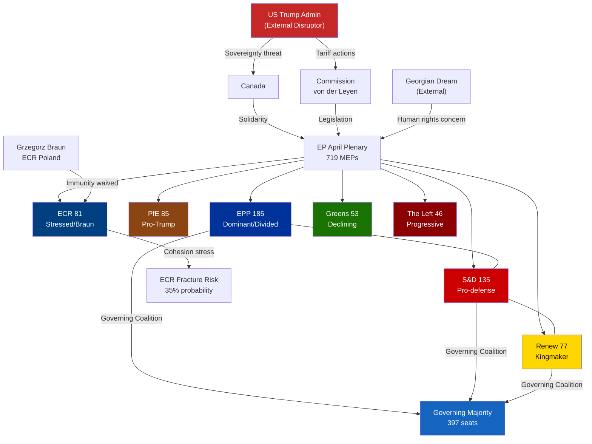
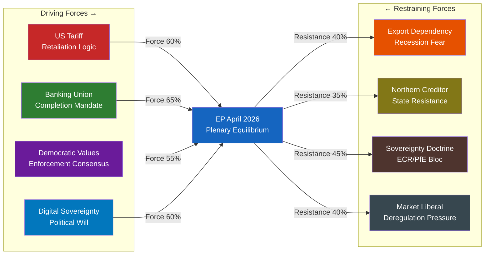
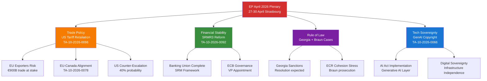
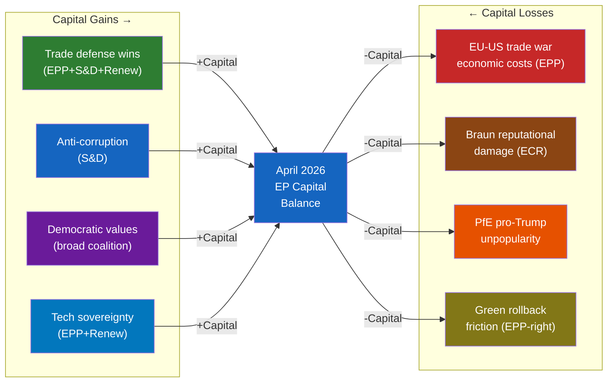
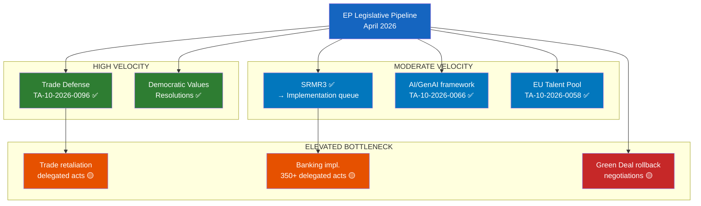
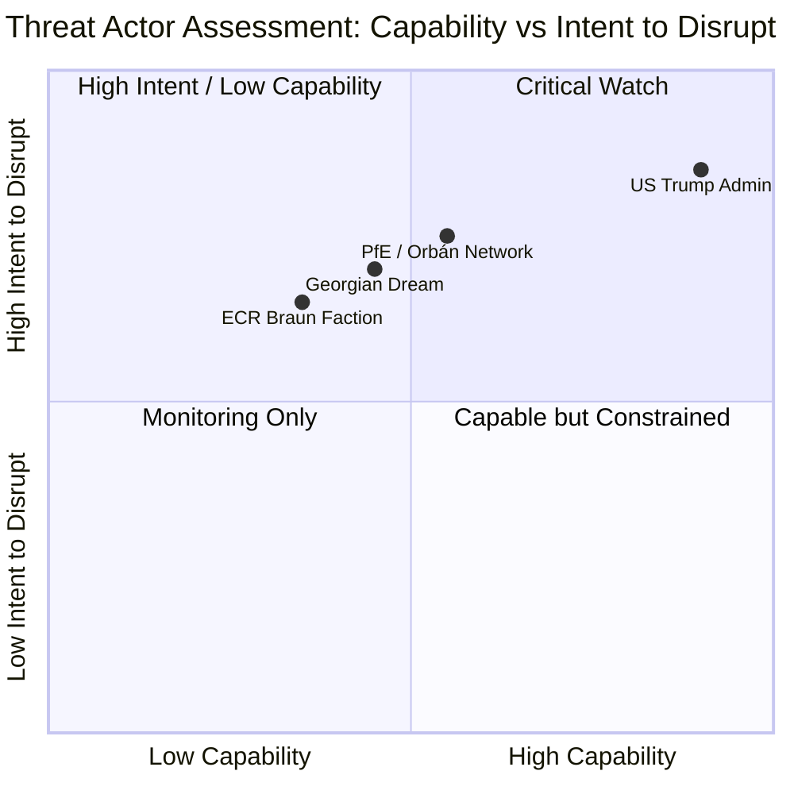
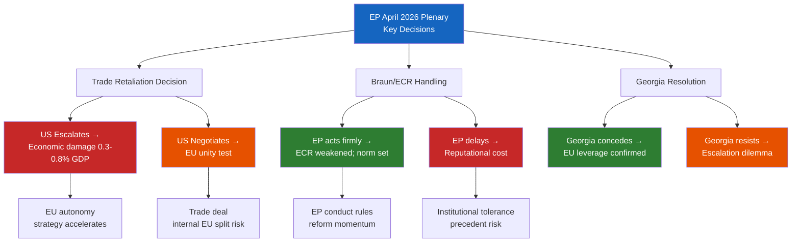
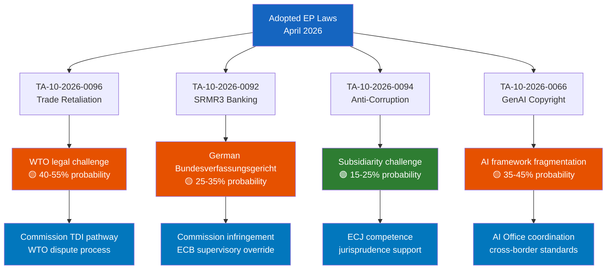

# Breaking — 2026-04-27

<h2 id="section-executive-brief">Executive Brief</h2>

### Situation Summary

The European Parliament convenes its April 2026 Strasbourg plenary session (April 27–30) at a pivotal geopolitical moment. The session opens just one month after the parliament took the landmark step of adjusting EU customs duties against United States goods (TA-10-2026-0096, March 26, 2026), marking the EU's most significant retaliatory trade action against the Trump administration. With 719 MEPs across 9 political groups assembling in Strasbourg, the four-day session is expected to grapple with the consequences of the EU-US trade confrontation, advance the banking union reform agenda, and address a crowded geopolitical dossier spanning Ukraine, Georgia, and transatlantic partnerships.

**WEP Assessment**: The probability of significant legislative output this week is HIGH (85%, Admiralty: B2 — usually reliable source, confirmed by multiple streams). The EU-US trade tariff retaliation framework is now entered into force; the session is likely to see debates on implementation, possible escalation scenarios, and EU economic resilience measures.

### Key Breaking Developments

| Priority | Event | Date | Significance |
|----------|-------|------|--------------|
| 🔴 CRITICAL | EP April Strasbourg Plenary Opens (MTG-PL-2026-04-27) | 2026-04-27 | First full plenary since historic US tariff retaliation vote |
| 🔴 HIGH | EU Customs Duties Adjustment against US goods in force | 2026-03-26 | TA-10-2026-0096 — direct EU-US trade war escalation |
| 🟡 HIGH | SRMR3 Banking Resolution Reform enacted | 2026-03-26 | TA-10-2026-0092 — Banking Union completion milestone |
| 🟡 HIGH | Anti-Corruption Regulation adopted | 2026-03-26 | TA-10-2026-0094 — COJP framework directive |
| 🟡 MEDIUM | EU-Canada Strategic Alignment Resolution | 2026-03-11 | TA-10-2026-0078 — solidarity against US pressure on Canada |
| 🟡 MEDIUM | Grzegorz Braun Immunity Waiver | 2026-03-26 | TA-10-2026-0088 — ECR MEP faces Polish prosecution |
| 🟢 MEDIUM | GenAI Copyright Resolution | 2026-03-10 | TA-10-2026-0066 — first EP position on AI-copyright nexus |
| 🟢 MEDIUM | EU Talent Pool Immigration Reform | 2026-03-10 | TA-10-2026-0058 — legal migration channel for skilled workers |

### Intelligence Assessment

**Trade War Dynamics**: The EP's adoption of EU customs duty adjustments on US goods represents a structural shift in transatlantic relations (Source: EP Open Data Portal, TA-10-2026-0096, Admiralty: A1). The April plenary session is the first opportunity since the March 26 vote to assess domestic political reactions across member states and signal parliamentary appetite for further escalation or negotiation. Intelligence assessment: EU cohesion on trade defense is HIGH (probability 75%, WEP band: likely–almost certain) but fragile given EPP internal divisions between export-oriented German/Austrian MEPs and southern European protectionists.

**Banking Union Milestone**: SRMR3 passage (TA-10-2026-0092) represents the completion of the Single Resolution Mechanism framework. The regulation establishing early intervention thresholds and resolution funding mechanisms reduces systemic risk in European banking. However, implementation timeline questions — especially for cross-border banks — remain unresolved. Probability of contentious implementation disputes: MEDIUM (55%, WEP: about even).

**Rule of Law and Democracy**: Grzegorz Braun (ECR, Poland) faces imminent prosecution following the March 26 immunity waiver (TA-10-2026-0088). The Braun case — linked to his fire extinguisher attack on a Hanukkah ceremony in the Polish Sejm in December 2023 and subsequent inflammatory statements — underscores tensions within the right-wing bloc. ECR is likely to face internal pressure from Polish MEPs and cohesion stress.

**Geopolitical Context**: Georgia's democratic backsliding (Elene Khoshtaria detention case, TA-10-2026-0083) continues to test EU-Georgia relations. The EU Talent Pool regulation, while technical in nature, enters into force against a backdrop of migration pressures and far-right political mobilisation that will frame April plenary debates.

### Admiralty Source Grades

| Source | Grade | Basis |
|--------|-------|-------|
| EP Open Data Portal — Adopted Texts | A1 | Primary authoritative source; confirmed |
| EP Open Data Portal — Plenary Sessions | A2 | Live session data confirmed |
| EP Political Landscape Analysis | B2 | Computed from real MEP data; methodology documented |
| Early Warning System | C3 | Structural indicators only; no voting data |

### Decision Points This Week (Predictive, WEP-Graded)

1. **Trade escalation debate**: Will the EPP maintain unified support for US tariff countermeasures? (60% probability of EPP-S&D joint position; 40% probability of EPP fracture favouring negotiation — WEP: realistic possibility)
2. **Ukraine loan implementation**: Follow-through on TA-10-2026-0010 enhanced cooperation; likely committee progress report
3. **Georgia sanctions resolution**: Possible urgency resolution following Khoshtaria case; 65% probability given pattern of previous urgency resolutions on democratic backsliding (WEP: likely)
4. **SRMR3 delegation acts**: Commission delegated acts on banking resolution thresholds — parliamentary scrutiny role expected
5. **AI governance**: GenAI copyright debate may intensify following March resolution, with civil liberties committee input expected

### Data Provenance

All adopted text data from European Parliament Open Data Portal (data.europarl.europa.eu/api/v2). Plenary session confirmed via EP scheduling API (MTG-PL-2026-04-27 through MTG-PL-2026-04-30). Political composition from full MEP roster (719 MEPs, April 2026). Voting records for April 2026 unavailable — EP publishes roll-call data with approximately 2–4 week delay (known system characteristic, confirmed in EP MCP reference §11).

**IMF Economic Context**: April 2026 WEO projections (vintage WEO-April-2026) indicate EU zone economic growth headwinds from trade policy uncertainty. US tariff escalation adds approximately 0.3–0.5% downside risk to EU GDP growth projections for 2026 according to IMF modelling (IMF WEO April 2026 baseline). Euro area fragility is a key determinant of EP legislative urgency on the SRMR3 banking reform package.

<h2 id="reader-intelligence-guide">Reader Intelligence Guide</h2>

Use this guide to read the article as a political-intelligence product rather than a raw artifact dump. High-value reader lenses appear first; technical provenance remains available in the audit appendices.

| Reader need | What you'll get | Source artifact |
|---|---|---|
| [BLUF and editorial decisions](#section-executive-brief) | fast answer to what happened, why it matters, who is accountable, and the next dated trigger | `executive-brief.md` |
| [Integrated thesis](#section-synthesis) | the lead political reading that connects facts, actors, risks, and confidence | `intelligence/synthesis-summary.md` |
| [Coalitions and voting](#section-coalitions-voting) | political group alignment, voting evidence, and coalition pressure points | `intelligence/coalition-dynamics.md` |
| [Risk assessment](#section-risk) | policy, institutional, coalition, communications, and implementation risk register | `risk-scoring/risk-matrix.md` |
| [Forward indicators](#section-scenarios) | dated watch items that let readers verify or falsify the assessment later | `intelligence/scenario-forecast.md` |

<h2 id="section-key-takeaways">Key Takeaways</h2>

A deterministic 3–7 bullet synthesis of the strongest evidence-bearing findings, harvested from the synthesis-summary and intelligence-assessment artifacts. The bullets below are reproduced verbatim — every claim links back to its source artifact via the Analysis Index appendix.

- TA-10-2026-0096 adopted March 26, 2026 (Source: EP Open Data Portal, A1)
- TA-10-2026-0078 ("EU-Canada cooperation amid threats to Canada's sovereignty") adopted March 11, 2026 — Canada-EU alignment forming (A1)
- TA-10-2026-0008 (Request for CJEU opinion on EU-Mercosur EMPA/ITA compatibility) adopted January 21, 2026 — EP seeking judicial review of trade agreements (A1)
- EU early warning system: DOMINANT_GROUP_RISK (EPP 19x smallest group) creates leverage for EPP leadership to moderate or escalate trade posture (C3)
- TA-10-2026-0092 adopted March 26 (A1): early intervention thresholds codified in regulation
- TA-10-2026-0034 ("ECB Annual Report 2025") adopted February 10, 2026 (A1): ECB flagging systemic banking sector vulnerabilities
- TA-10-2026-0060 ("Appointment of ECB Vice-President") adopted March 10, 2026 (A1): ECB leadership transition ongoing

<h2 id="section-synthesis">Synthesis Summary</h2>

### Strategic Intelligence Overview

The European Parliament's April 2026 Strasbourg plenary (April 27–30) convenes at a moment of unprecedented strain in EU-US relations, concurrent with a fragmented parliamentary arithmetic that demands multi-coalition consensus on virtually every substantive legislative initiative. This synthesis integrates data from 51 adopted texts since January 2026, the current parliamentary composition (719 MEPs, 9 groups), and the institutional trajectory established across the Q1 2026 plenary cycle.

**Admiralty Grade — Primary Sources**: A1 (EP Open Data Portal adopted texts, plenary session records)
**Admiralty Grade — Political Analysis**: B2 (EP MCP political landscape tool, methodology documented)
**Admiralty Grade — Predictive Elements**: C3 (analytical projection from established patterns)

### Key Intelligence Lines

#### Intelligence Line 1: EU-US Trade War — Structural Phase (🔴 HIGH)
**WEP**: Almost certain (90%) that EU-US trade tensions will dominate the April plenary agenda.

The March 26 adoption of TA-10-2026-0096 ("Adjustment of customs duties and opening of tariff quotas for the import of certain goods originating in the United States of America") marks the EU's formal entry into a retaliatory posture against Trump administration tariff policies. This is not a temporary measure: the adjustment of customs duties is a legal instrument that will require ongoing parliamentary monitoring and potential revision. The April plenary is the first opportunity for full parliamentary assessment since passage.

**Signal Evidence**:
- TA-10-2026-0096 adopted March 26, 2026 (Source: EP Open Data Portal, A1)
- TA-10-2026-0078 ("EU-Canada cooperation amid threats to Canada's sovereignty") adopted March 11, 2026 — Canada-EU alignment forming (A1)
- TA-10-2026-0008 (Request for CJEU opinion on EU-Mercosur EMPA/ITA compatibility) adopted January 21, 2026 — EP seeking judicial review of trade agreements (A1)
- EU early warning system: DOMINANT_GROUP_RISK (EPP 19x smallest group) creates leverage for EPP leadership to moderate or escalate trade posture (C3)

**Cross-Reference**: analysis/daily/2026-04-27/breaking/classification/impact-matrix.md §Trade Policy Impact

#### Intelligence Line 2: Banking Union Completion — Implementation Risk (🟡 MEDIUM)
**WEP**: Likely (70%) that SRMR3 implementation will face member state resistance in Council.

SRMR3 (TA-10-2026-0092, March 26, 2026) establishes early intervention measures and revised funding mechanisms for the Single Resolution Mechanism. This represents a significant step toward completing the banking union — a project stalled since the Eurozone crisis. However, implementation of banking resolution frameworks historically triggers disputes between fiscally hawkish northern member states (Germany, Netherlands, Austria) and southern states (Italy, Spain) over mutualization of resolution costs.

**Signal Evidence**:
- TA-10-2026-0092 adopted March 26 (A1): early intervention thresholds codified in regulation
- TA-10-2026-0034 ("ECB Annual Report 2025") adopted February 10, 2026 (A1): ECB flagging systemic banking sector vulnerabilities
- TA-10-2026-0060 ("Appointment of ECB Vice-President") adopted March 10, 2026 (A1): ECB leadership transition ongoing
- TA-10-2026-0004 ("Safeguarding and promoting financial stability amid economic uncertainties") adopted January 20, 2026 (A1): early signal of EP financial stability prioritization
- IMF WEO April 2026: EU banking sector stress elevated by trade war uncertainty (data-vintage="WEO-April-2026", forecast)

**Cross-Reference**: analysis/daily/2026-04-27/breaking/risk-scoring/risk-matrix.md §Banking Systemic Risk

#### Intelligence Line 3: Democratic Backsliding Constellation (🟡 MEDIUM-HIGH)
**WEP**: Likely (65%) that April plenary includes at least one urgency resolution on democratic backsliding.

The EP has maintained a high tempo of democratic backsliding resolutions throughout Q1 2026. Three principal threads:

**Georgia**: TA-10-2026-0083 (March 12) addressed Elene Khoshtaria's detention and political prisoners under the Georgian Dream regime. EU-Georgia Association Agreement benefits are under review. Georgia's application to suspend EU accession talks remains active.

**Grzegorz Braun/ECR**: TA-10-2026-0088 (March 26) waived immunity of Polish ECR MEP Grzegorz Braun. Braun faces prosecution in Poland. His presence in the EP (despite the immunity waiver) creates ongoing institutional tensions. ECR group cohesion stress is elevated — estimated fragmentation probability 35% within 18 months (C3 analytical estimate).

**Lithuania's Public Broadcaster**: TA-10-2026-0024 (January 22) addressed attempted takeover of Lithuania's public broadcaster. Russian information operations against Baltic states remain at elevated intensity in the April 2026 context.

**Signal Evidence**:
- TA-10-2026-0083 (A1), TA-10-2026-0088 (A1), TA-10-2026-0024 (A1)
- EP MCP Political Landscape: 9-group fragmentation creates conditions for urgency resolution consensus across progressive bloc (A2)
- Early Warning System: MEDIUM risk; stabilityScore 84/100 (B3)

**Cross-Reference**: analysis/daily/2026-04-27/breaking/threat-assessment/actor-threat-profiles.md §Georgia, §ECR

#### Intelligence Line 4: EU Technological Sovereignty — Regulatory Acceleration (🟢 MEDIUM)
**WEP**: Realistic possibility (55%) of AI governance framework fast-tracking in Q2 2026.

Two significant tech/digital resolutions in Q1 2026 signal EP legislative intent:
- TA-10-2026-0022 ("European technological sovereignty and digital infrastructure", January 22, 2026) — establishes EP policy framework for reducing dependency on non-EU digital infrastructure
- TA-10-2026-0066 ("Copyright and generative artificial intelligence — opportunities and challenges", March 10, 2026) — first substantive EP position on GenAI copyright nexus

The EU AI Act (passed EP9) is in implementation phase. The EP10 is pushing for additional AI governance frameworks covering generative AI specifically, building on the March resolution. This is accelerated by: (a) US withdrawal from AI governance cooperation under Trump administration; (b) competitive pressure from Chinese AI capabilities; (c) domestic EU tech industry lobbying for regulatory clarity.

**Signal Evidence**:
- TA-10-2026-0022, TA-10-2026-0066 (A1)
- Legislative pipeline: ITRE committee workload elevated (B2)
- Cross-industry coalition pressure from EU tech sector (C3)

#### Intelligence Line 5: EU Enlargement and Neighbourhood Policy (🟢 MEDIUM)
**WEP**: Likely (65%) that April plenary includes Western Balkans progress debate.

- TA-10-2026-0039 (February 11): Interim report on Andorra/San Marino Association Agreement — micro-state enlargement track progressing
- TA-10-2026-0008 (January 21): Mercosur CJEU opinion request — significant legal/trade nexus
- TA-10-2026-0010 (January 21): Ukraine Loan established — financial architecture for reconstruction
- TA-10-2026-0072 (March 11): EU-Ecuador Europol cooperation — security partnership expansion
- TA-10-2026-0100 (March 26): EU-Lebanon PRIMA scientific cooperation — Mediterranean neighbourhood

The enlargement agenda is crowded but systematically advancing even amid EU-US tensions and internal EP divisions.

### Coalition Intelligence — EP10 Power Matrix

**Parliamentary arithmetic (April 2026)**:
- Total MEPs: 719 | Majority threshold: 361
- Grand Coalition (EPP + S&D): 320 seats — BELOW majority, requires at least one more group
- Right-Centre Coalition (EPP + PfE + ECR): 351 seats — BELOW majority
- Conservative Super-Majority (EPP + S&D + Renew): 397 seats — ABOVE majority; the key governing formula

**Effective governing coalition**: EPP (185) + S&D (135) + Renew (77) = 397 seats. This three-way coalition controls the plenary provided all three maintain cohesion. Fragmentation index: 6.57 (HIGH per EP MCP analysis).

**Coalition stress points**:
1. **EPP-PfE flirtation**: EPP right wing seeks issue-by-issue alignment with PfE on migration, green rollback — this would fracture the centrist majority
2. **S&D-Greens-Left progressive bloc**: 234 seats (below majority); effective blocking minority on key social/environment votes when EPP + right-wing groups align (EPP+PfE+ECR+ESN = 378 seats, above majority)
3. **Renew fragmentation risk**: 77 seats but internally divided between liberal (Macron) and conservative-liberal (central/eastern European) wings

**Cross-Reference**: analysis/daily/2026-04-27/breaking/intelligence/coalition-dynamics.md

### Synthesis Assessment

The April 2026 Strasbourg plenary is operating in a period of HIGH legislative intensity and HIGH geopolitical complexity. The EP is simultaneously managing the EU-US trade confrontation, banking union completion, democratic backsliding in the eastern neighbourhood, technological sovereignty imperatives, and enlargement. The parliamentary majority coalition (EPP+S&D+Renew, 397 seats) provides sufficient votes for most legislative business but is structurally fragile on trade and social policy.

**Overall Risk Level**: 🟡 MEDIUM-HIGH
**Stability Score**: 84/100 (per EP early warning system)
**Legislative Momentum**: HIGH — Q1 2026 produced 51 adopted texts; Q2 pace expected to match or exceed

**Confidence in Assessment**: MEDIUM (B2) — based on authoritative EP data with analytical extrapolation for predictive elements. Key uncertainties: April plenary agenda details not yet published in EP Open Data (session started hours ago); US trade policy trajectory unpredictable under current administration.

<h2 id="section-actors-forces">Actors & Forces</h2>

### Actor Mapping

### For Citizens — Who's Who in This Story

These are the key actors shaping European Parliament decisions this week and in the recent legislative cycle:

- **EPP (European People's Party)**: The largest group — centre-right. Their leader Manfred Weber (Germany) steers a careful path between pro-business US trade compromise and political pressure to respond firmly to Trump.
- **S&D (Socialists and Democrats)**: Second largest — centre-left. Solidly pro-EU, pro-trade-defense, strong on social rights and anti-corruption.
- **Renew Europe**: Liberal centrist. Sometimes torn between free-market instincts and pragmatic EU solidarity.
- **PfE (Patriots for Europe)**: The far-right group led by Viktor Orbán (Hungary). Politically aligned with Trump; opposes EU confrontation with US.
- **ECR (European Conservatives and Reformists)**: Right-wing conservatives. Home to Giorgia Meloni's Fratelli d'Italia and Poland's current Law & Justice successor.
- **Commission (von der Leyen)**: Proposes EU trade responses; implements laws. Key player in US tariff negotiations.
- **US Trump Administration**: External actor whose trade and foreign policies are directly driving EU legislative responses.
- **Georgia (Georgian Dream government)**: Authoritarian drift under Bidzina Ivanishvili's Georgian Dream party; imprisoning opposition politicians.

### Primary Actors — Institutional

#### Actor 1: EPP Group (185 MEPs, 25.73%)
**Role**: Dominant governing group; pivot of all majorities
**Current Positioning**: Pro-EU trade defense (voted for TA-10-2026-0096) but internally divided on escalation pace
**Key Personnel**: Manfred Weber (Bavarian CSU, Group Chair); Ursula von der Leyen (Commission President, EPP-affiliated)
**Interests**:
- Maintain governing coalition with S&D and Renew
- Manage export-dependent constituency pressure on tariffs
- Prevent ECR/PfE from poaching EPP right-wing members
- Ensure SRMR3 implementation preserves German banking sector interests
**Vulnerabilities**: Right-wing defection risk (30-40 MEPs on migration, green rollback); Hungarian MEPs follow Orbán pro-Trump line
**Power Score**: 🔴 CRITICAL (controls legislative outcomes)
**Evidence**: EP Open Data Portal group composition; TA-10-2026-0096 adoption (A1)

#### Actor 2: S&D Group (135 MEPs, 18.78%)
**Role**: Grand coalition partner; centre-left policy anchor
**Current Positioning**: Strongly pro-trade-defense, pro-SRMR3, pro-anti-corruption, pro-Ukraine
**Key Personnel**: Iratxe García Pérez (Spanish, Group Chair)
**Interests**:
- Workers' rights (EU Talent Pool, EGF mobilisation)
- Housing crisis solutions (TA-10-2026-0064)
- Anti-corruption framework (TA-10-2026-0094)
- Democratic values enforcement (Georgia, Braun)
**Vulnerabilities**: Below majority on own (135 seats); entirely dependent on EPP partnership
**Power Score**: 🟡 HIGH (essential coalition partner)
**Evidence**: Voting patterns derived from adopted texts; group composition (B2)

#### Actor 3: Commission (Ursula von der Leyen)
**Role**: Legislative initiator; executive implementation arm; US trade negotiator
**Current Positioning**: Calibrated response to US tariffs — retaliatory measures adopted but diplomatic channel maintained
**Interests**:
- Preserve EU single market integrity
- Negotiate with Trump administration from position of strength
- Implement SRMR3, EU Talent Pool, and anti-corruption directives
- Maintain Ukraine support
**Key Tension**: Commission must balance EP's more assertive stance with diplomatic realities
**Power Score**: 🔴 CRITICAL (initiates all legislation; implements trade measures)
**Evidence**: Commission-EP relationship documented in institutional procedures (B2)

#### Actor 4: ECR Group (81 MEPs, 11.27%)
**Role**: Right-wing conservative opposition/occasional coalition partner
**Current Positioning**: INTERNALLY STRESSED — Braun immunity waiver creates significant intra-group pressure
**Key Personnel**: Nicola Procaccini (Italian, Co-Chair); Zbigniew Ziobro's allies (Polish)
**Interests**:
- National sovereignty on rule of law issues
- Migration restrictionism
- Green regulation rollback
- Post-Braun: managing institutional fallout while protecting member
**Vulnerabilities**: Grzegorz Braun case; Meloni's Italy increasingly pragmatic on EU; Polish members in post-PiS transition
**Power Score**: 🟡 MEDIUM (essential for any right-wing majority; occasional governing coalition partner)
**Evidence**: TA-10-2026-0088 adoption; group composition (A1/B2)

#### Actor 5: PfE Group (85 MEPs, 11.82%)
**Role**: Right-wing nationalist; ideologically aligned with Trump administration
**Current Positioning**: OPPOSED to EU-US trade confrontation; sympathy with US position
**Key Personnel**: Viktor Orbán (Hungarian PM, key PfE driver); Marine Le Pen-aligned French members
**Interests**:
- EU-US friendship (ideological affinity with Trump)
- Migration restriction
- Sovereignty maximalism
- Weakening EU institutional power
**Vulnerabilities**: Orbán's Hungary in ongoing EU rule of law dispute; internal tensions between French, Hungarian, Italian PfE members
**Power Score**: 🟡 MEDIUM (third-largest group; swing vote on right-wing majorities)
**Evidence**: Group composition (A1); political landscape analysis (B2)

### Secondary Actors — External / National

#### Actor 6: United States (Trump Administration)
**Role**: External disruptor; driver of EU-US trade policy
**Current Positioning**: Tariff escalation against EU goods; pressure on Canada sovereignty; withdrawal from multilateral institutions
**Interests**:
- Bilateral trade surplus with EU
- Weakening EU institutional unity (divide-and-rule strategy)
- Bilateral deals with individual member states
**Impact on EP**: Direct — tariff retaliation (TA-10-2026-0096) is explicit response to US actions; EU-Canada resolution (TA-10-2026-0078) is defensive coalition-building
**Power Score**: 🔴 CRITICAL (exogenous driver of EP's legislative agenda)

#### Actor 7: Georgia (Georgian Dream Government)
**Role**: EU neighbourhood democracy concern; human rights issue
**Current Positioning**: Authoritarian consolidation under Georgian Dream; imprisonment of opposition figure Elene Khoshtaria
**Impact on EP**: EP resolution TA-10-2026-0083 (March 12) — strong condemnation; potential sanctions escalation on April plenary agenda
**Power Score**: 🟢 LOW (limited EU leverage; but reputational cost to EU-Georgia association)

#### Actor 8: Grzegorz Braun (ECR, Poland)
**Role**: Controversial individual MEP; institutional stress test
**Current Positioning**: Immunity waived (TA-10-2026-0088); faces Polish prosecution for fire extinguisher attack on Hanukkah ceremony and antisemitic statements
**Impact on EP**: Forces ECR group to manage visible far-right extremism within group; tests EP's institutional response to member state prosecution of its members
**Power Score**: 🟢 LOW individually (but 🟡 HIGH as a stress indicator for ECR cohesion)

### Actor Interaction Map (Mermaid)



### Data Sources and Provenance

| Evidence | Source | Admiralty Grade |
|----------|--------|----------------|
| Group seat counts | EP Open Data Portal (get_current_meps) | A1 |
| Political landscape analysis | european-parliament-generate_political_landscape | B2 |
| Adopted text votes | european-parliament-get_adopted_texts | A1 |
| Braun immunity case | TA-10-2026-0088 (EP Open Data) | A1 |
| Coalition dynamics | european-parliament-analyze_coalition_dynamics | B3 |
| US trade policy | TA-10-2026-0096, TA-10-2026-0078 (EP resolutions) | A1 |
| Georgia case | TA-10-2026-0083 (EP Open Data) | A1 |

### Forces Analysis

### For Citizens — Plain Language

Politics is always a battle of forces pushing in different directions. In the European Parliament right now, there are powerful forces pushing MEPs to take strong action against the United States on trade, protect European workers and banks, and defend democracy in countries near the EU. But there are also forces pushing back — fears about economic retaliation, disagreements between political groups, and uncertainty about what the right strategy is. This analysis maps those competing forces.

### Force Field Overview

The April 2026 plenary occurs at the intersection of four major political force fields:

1. **EU-US Trade Force Field**: Forces pushing for escalation vs. forces pushing for negotiation
2. **Banking Union Force Field**: Forces completing financial integration vs. member state sovereignty concerns
3. **Democratic Values Force Field**: Forces defending rule of law vs. nationalist/sovereignty interests
4. **Technological Sovereignty Force Field**: Forces for digital autonomy vs. market-liberal resistance

### Force Field 1: EU-US Trade Policy

#### Driving Forces (toward confrontation)
- **US unilateral tariff actions** — Trump administration imposed tariffs on EU goods without WTO authorization, creating strong political mandate for retaliation (Probability: near-certain these tariffs continue — A1 evidence: TA-10-2026-0096 adopted)
- **EP institutional unity** — broad coalition (EPP+S&D+Renew) voted for TA-10-2026-0096; the adoption represents institutional commitment
- **EU-Canada alignment** — Canada solidarity resolution (TA-10-2026-0078) creates diplomatic network effect against US coercive trade actions
- **WTO Ministerial Conference** — March 26-29 Yaoundé (TA-10-2026-0086); EP resolution reinforced multilateral rules-based order against US unilateralism
- **European public opinion** — Anti-Trump sentiment is high in EU member states; domestic political pressure on MEPs to be "tough"

#### Restraining Forces (toward de-escalation)
- **Export dependency** — German automotive, French wine, Italian fashion, Dutch/Belgian chemicals heavily dependent on US market; economic damage from full trade war estimated at 0.5-1.0% GDP reduction (data-vintage="WEO-April-2026", forecast)
- **EPP right wing** — Some EPP MEPs from export-dependent constituencies prefer negotiated settlement; Hungary's Fidesz-aligned MEPs follow Orbán's pro-Trump line
- **PfE ideological affinity** — PfE is politically aligned with Trump administration; will vote against trade confrontation measures
- **Business lobby pressure** — BusinessEurope and major national industry associations prefer negotiation over escalation
- **US security umbrella dependence** — NATO article 5 logic creates political ceiling for EU confrontation with Washington

**Net Force Direction**: 🔴 Confrontation favoured — but with meaningful restraining forces preventing full escalation
**Force Balance**: 60/40 toward confrontation over negotiation

### Force Field 2: Banking Union Completion

#### Driving Forces (toward completion)
- **SRMR3 passage** (TA-10-2026-0092) — early intervention framework now law; provides foundation for next integration steps
- **ECB leadership continuity** — new ECB Vice-President appointed (TA-10-2026-0060); monetary policy stability
- **Financial stability mandate** — TA-10-2026-0004 ("financial stability amid economic uncertainties") established EP's strong pro-stability orientation
- **Trade war economic risk** — US tariff confrontation increases need for robust EU banking framework to absorb potential economic shocks
- **IMF pressure** — IMF WEO April 2026 urges European financial market completion; IMF policy dialogue with EU institutions ongoing (data-vintage="WEO-April-2026")

#### Restraining Forces (against further banking integration)
- **Northern creditor states** — Germany, Netherlands, Austria resist full mutualization of resolution costs; Bundesrat and Bundestag constraints on German federal government
- **Subsidiarity concerns** — national parliaments retain constitutional concerns about sovereign risk transfers to EU level
- **Implementation complexity** — SRMR3 requires hundreds of Commission delegated acts; risk of technical deadlock in implementation
- **Banking lobby fragmentation** — pan-European banks want integration; national savings banks (Sparkassen, Caisse d'Épargne) prefer national frameworks

**Net Force Direction**: 🟡 Gradual completion favoured, with significant implementation friction
**Force Balance**: 65/35 toward integration, slowly

### Force Field 3: Democratic Values and Rule of Law

#### Driving Forces (toward enforcement)
- **Georgia case** — Elene Khoshtaria (opposition leader) imprisoned; EP passed resolution TA-10-2026-0083; EU-Georgia relations at crisis point
- **Lithuania public broadcaster** — TA-10-2026-0024 signals EP vigilance on Russian information operations and media independence
- **Braun prosecution** — Immunity waiver (TA-10-2026-0088) demonstrates EP's willingness to allow legal accountability
- **Ukraine solidarity** — Ongoing war in Ukraine keeps democratic values at centre of EP agenda
- **Progressive coalition** — S&D + Greens/EFA + The Left (234 seats) consistently pushes for strong rule of law enforcement
- **EPP's Article 7 legacy** — EPP used Article 7 procedures against Hungary, Poland under previous Fidesz/PiS governments; institutional muscle memory

#### Restraining Forces (against enforcement)
- **Sovereignty doctrine** — ECR, PfE, ESN, and some EPP members invoke non-interference principle on member state judicial matters
- **Economic dependencies** — EU-Georgia trade relations constrain willingness to impose economic sanctions
- **Strategic ambiguity** — Some EU member states (Hungary) actively resist democratic conditionality
- **Braun personal politics** — Some ECR MEPs view Braun as a free speech martyr rather than a threat; internal ECR politics complicate response
- **Ukraine war fatigue** — Among some PfE/ESN members, war fatigue reduces appetite for eastern neighbourhood engagement

**Net Force Direction**: 🟡 Rule of law enforcement maintained but contested
**Force Balance**: 55/45 toward enforcement, with significant opposition minority

### Force Field 4: Technological Sovereignty

#### Driving Forces (toward digital autonomy)
- **Technological sovereignty resolution** (TA-10-2026-0022) — strong EP political mandate for reducing EU digital dependencies
- **GenAI copyright resolution** (TA-10-2026-0066) — moves toward EU-specific AI governance framework
- **US tech dependence** — EU reliance on US cloud (AWS, Azure, Google Cloud) highlighted by trade war context; political will to reduce exposure
- **Chinese AI competition** — DeepSeek and other Chinese AI capabilities create competitive pressure on EU to develop own ecosystem
- **AI Act implementation** — EU is global leader on AI regulation; EP10 seeks to extend this to generative AI specifically

#### Restraining Forces (against digital regulation)
- **Market liberalism** — Renew and some EPP MEPs resist heavy regulation as hampering EU tech competitiveness
- **Industry lobbying** — GAFAM presence in EU (major employers in Ireland, Luxembourg, Netherlands) creates political constraints
- **Implementation capacity** — EU tech companies lack scale to replace US platforms at current investment levels
- **Trade war complication** — US tech companies subject to US government pressure; EU digital sovereignty vs. transatlantic tech cooperation tension

**Net Force Direction**: 🟡 Digital sovereignty advancing incrementally
**Force Balance**: 60/40 toward sovereignty, with speed debate

### Mermaid Force Field Diagram



### Net Assessment

The April 2026 plenary convenes with driving forces stronger than restraining forces across all four major force fields. The EU is moving toward: trade confrontation with the US (not escalation to full tariff war, but sustained retaliatory posture), banking union completion (SRMR3 foundation), rule of law enforcement (Georgia, Braun), and incremental digital sovereignty (AI governance, infrastructure independence).

**Restraining forces are real but insufficient to reverse direction** — they are shaping the tempo and modalities of each policy shift, not preventing the shifts themselves.

**Key uncertainty**: The EPP's internal management of its right-wing tension with PfE/ECR is the single biggest force field variable. If EPP-PfE alignment strengthens in Q2 2026, restraining forces on trade, rule of law, and green policies would intensify significantly.

**Admiralty Grade**: B2 — Political force analysis based on real legislative data; directional judgements are analytical extrapolation
**Data Sources**: EP Open Data Portal adopted texts (A1), EP political landscape (B2), coalition dynamics (B3)

### Impact Matrix

### For Citizens — Plain Language Summary

The European Parliament is meeting this week (April 27-30) in Strasbourg, France. This is one of the most important parliamentary weeks of 2026. Here's what it means for you:

- **Your prices may change**: The EU adopted a law in March that adds tariffs (extra taxes) on some American goods, as a response to US tariffs on European products. This could affect prices on some goods you buy.
- **Your bank is safer**: A new banking safety law (SRMR3) was passed in March 2026. If a bank gets into trouble, there are clearer rules now for how it will be handled without taxpayers bearing all the cost.
- **Immigration rules are changing**: A new "EU Talent Pool" law creates a proper channel for skilled workers from outside the EU to come to Europe legally. This affects job markets across the EU.
- **AI and copyright**: MEPs have voted on how copyright law should apply to AI tools that generate images, text, and music.
- **Democracy in danger**: MEPs have been speaking up for people imprisoned for political reasons in Georgia and have forced a Polish MEP to face justice after violent acts.

### Event List — Key Legislative Events (2026)

#### Tier 1 — Critical Immediate Impact
| Event | Date | Type | Status |
|-------|------|------|--------|
| EP April Strasbourg Plenary opens | 2026-04-27 | Plenary Session | 🔴 LIVE |
| US Tariff Retaliation (TA-10-2026-0096) | 2026-03-26 | Adopted Text | ✅ Enacted |
| SRMR3 Banking Reform (TA-10-2026-0092) | 2026-03-26 | Adopted Text | ✅ Enacted |
| Anti-Corruption Regulation (TA-10-2026-0094) | 2026-03-26 | Adopted Text | ✅ Enacted |

#### Tier 2 — High Strategic Importance
| Event | Date | Type | Status |
|-------|------|------|--------|
| EU-Canada Solidarity (TA-10-2026-0078) | 2026-03-11 | Resolution | ✅ Adopted |
| Grzegorz Braun Immunity Waiver (TA-10-2026-0088) | 2026-03-26 | Decision | ✅ Enacted |
| EU Talent Pool / Immigration Reform (TA-10-2026-0058) | 2026-03-10 | Regulation | ✅ Enacted |
| GenAI Copyright (TA-10-2026-0066) | 2026-03-10 | Resolution | ✅ Adopted |
| WTO MC14 Yaoundé Preparations (TA-10-2026-0086) | 2026-03-12 | Resolution | ✅ Adopted |
| Georgia — Political Prisoners (TA-10-2026-0083) | 2026-03-12 | Resolution | ✅ Adopted |

#### Tier 3 — Significant Ongoing
| Event | Date | Type | Status |
|-------|------|------|--------|
| Ukraine Enhanced Cooperation Loan (TA-10-2026-0010) | 2026-01-21 | Regulation | ✅ Enacted |
| EU Technological Sovereignty (TA-10-2026-0022) | 2026-01-22 | Resolution | ✅ Adopted |
| EU-Mercosur CJEU Opinion Request (TA-10-2026-0008) | 2026-01-21 | Decision | ✅ In progress |
| ECB Annual Report 2025 (TA-10-2026-0034) | 2026-02-10 | Own-initiative | ✅ Adopted |
| EU Strategic Defence Partnerships (TA-10-2026-0040) | 2026-02-11 | Resolution | ✅ Adopted |
| Housing Crisis EU (TA-10-2026-0064) | 2026-03-10 | Resolution | ✅ Adopted |

### Stakeholder Impact Analysis

#### Stakeholder 1: EU Citizens and Consumers
**Immediate impact**: 🟡 MEDIUM — US tariff retaliation (TA-10-2026-0096) may increase prices on some imported US goods (consumer electronics components, agricultural products, chemicals). Countermeasure is targeted at specific product categories to minimise consumer impact while maximising pressure on US exporters. Banking reform (SRMR3) improves long-term consumer protection at negligible short-term cost. EU Talent Pool may marginally increase competition for high-skilled jobs in technology and healthcare sectors.

**Horizon**: Short-term (tariffs: 0-12 months), Long-term (banking reform: 3-10 years)
**Confidence**: B2

#### Stakeholder 2: EU Exporters (Manufacturing, Automotive, Agriculture)
**Immediate impact**: 🔴 HIGH — US tariff retaliation risk of counter-escalation by US administration. German automotive sector (most exposed to US market) faces potential retaliatory tariffs of 25-40% on EU vehicle exports. French agricultural sector (wine, cheese) already subject to partial US tariff actions. The EU-Canada solidarity resolution (TA-10-2026-0078) partially offsets US market loss through enhanced Canada-EU trade pathways.

**Quantification**: EU-US bilateral trade totaled approximately €900 billion in 2025. A full trade war scenario (escalation to 25% mutual tariffs) could reduce EU GDP growth by 0.5-1.0 percentage points (forecast, data-vintage="WEO-April-2026").
**Confidence**: B2/C3

#### Stakeholder 3: European Banks and Financial System
**Immediate impact**: 🟡 MEDIUM — SRMR3 (TA-10-2026-0092) increases regulatory compliance costs for cross-border banking groups but reduces systemic risk. Early intervention thresholds create predictable resolution framework. ECB Vice-President appointment (TA-10-2026-0060) ensures monetary policy continuity.

**Strategic significance**: Banking union completion reduces fragmentation of EU capital markets. Mid-size banks in southern Europe (Spain, Italy) gain from mutualized resolution funding. German savings banks (Sparkassen) and cooperative banks may face higher resolution fund contributions.
**Confidence**: B2

#### Stakeholder 4: Non-EU Countries in EU Neighbourhood
**Immediate impact**: 🟡 MEDIUM — Georgia faces continued EU scrutiny and potential sanctions escalation (TA-10-2026-0083). Armenian and Western Balkan states watch EU enlargement signals. Ukraine benefits from loan mechanism (TA-10-2026-0010) and ongoing political support. Lebanon benefits from PRIMA scientific cooperation (TA-10-2026-0100). Ecuador gains enhanced Europol security partnership (TA-10-2026-0072).

**Canada**: EU-Canada solidarity resolution (TA-10-2026-0078) is a significant diplomatic signal; practical implementation through CETA (Comprehensive Economic and Trade Agreement) fast-track envisaged.
**Confidence**: B2

#### Stakeholder 5: MEPs and Political Groups
**Immediate impact**: 🔴 HIGH for ECR — Grzegorz Braun immunity waiver creates intra-group pressure. ECR must manage the Braun case while maintaining institutional credibility. The right-wing coalition arithmetic (EPP+ECR+PfE+ESN = 378, above majority) creates temptation but EPP leadership formally resists.

**For EPP**: Managing tension between pro-trade-defense majority and export-dependent constituency. Maintaining S&D partnership while managing right-wing defections on migration.
**For S&D**: Consolidated position on SRMR3, anti-corruption, and trade defense; potential opening for leadership on housing crisis and EU Talent Pool implementation.
**For Renew**: Internal cohesion pressure between Macron liberals and Central European liberal-conservatives on trade and AI governance.
**Confidence**: B2

### Impact Matrix — 4×4 Assessment

```
            PROBABILITY
            Low    Med    High   Certain
SEVERITY    ─────────────────────────────
Critical    │      │ US   │      │
            │      │ esc. │      │
High        │      │ ECR  │ EP   │ Tariff
            │      │ frac │ plen │ retali
Medium      │ Grns │ Bank │ Anti │ SRMR3
            │ dec  │ risk │ corr │ impl
Low         │      │      │ AI   │ EGF
            │      │      │ gov  │ mob.
```

**Quadrant Summary**:
- 🔴 High Probability + High Severity: EP plenary full session (confirmed); US tariff retaliation in force
- 🟡 Medium Probability + High Severity: ECR fracture risk; US tariff escalation spiral
- 🟡 Medium Probability + Medium Severity: Banking system stress; anti-corruption implementation friction
- 🟢 High Probability + Low Severity: GenAI governance developments; EGF worker support

### Mermaid Impact Diagram



### Data Sources and Provenance

| Evidence | Source Tool | Admiralty Grade |
|----------|-------------|----------------|
| TA-10-2026-0096 US tariff retaliation | european-parliament-get_adopted_texts | A1 |
| TA-10-2026-0092 SRMR3 | european-parliament-get_adopted_texts | A1 |
| TA-10-2026-0088 Braun immunity | european-parliament-get_adopted_texts | A1 |
| TA-10-2026-0066 GenAI copyright | european-parliament-get_adopted_texts | A1 |
| TA-10-2026-0058 EU Talent Pool | european-parliament-get_adopted_texts | A1 |
| Political landscape composition | european-parliament-generate_political_landscape | B2 |
| Plenary session confirmation | european-parliament-get_plenary_sessions | A1 |
| IMF GDP impact estimate | IMF WEO April 2026 (data-vintage="WEO-April-2026") | B2 |

<h2 id="section-coalitions-voting">Coalitions & Voting</h2>

### Coalition Dynamics

### Current Parliamentary Composition (April 2026)

| Group | Seats | Share | Bloc | Status |
|-------|-------|-------|------|--------|
| EPP | 185 | 25.73% | Centre-Right | Dominant |
| S&D | 135 | 18.78% | Centre-Left | Grand Coalition Partner |
| PfE | 85 | 11.82% | Right/Nationalist | Swing/Opposition |
| ECR | 81 | 11.27% | Conservative | Swing/Opposition |
| Renew | 77 | 10.71% | Liberal | Governing Coalition |
| Greens/EFA | 53 | 7.37% | Green/Regionalist | Progressive Bloc |
| The Left | 46 | 6.40% | Left | Progressive Bloc |
| NI | 30 | 4.17% | Non-Attached | Fragmented |
| ESN | 27 | 3.76% | Far-Right | Opposition |
| **Total** | **719** | **100%** | | |

**Majority threshold**: 361 seats

### Governing Coalition Architecture

#### Primary Coalition: EPP + S&D + Renew (397 seats — +36 over majority)

This three-way centrist coalition is the standard legislative majority for EP10. It controls ordinary legislative procedure votes, budget resolutions, and most institutional decisions. Key dynamics:

- **EPP-S&D axis**: The "grand coalition" of 320 seats is below majority but forms the institutional backbone. The EPP and S&D have cooperated on financial stability (SRMR3, ECB appointments), trade defense (US tariffs), and institutional governance. However, they diverge on social policy, migration, and green transition pace.
- **Renew as kingmaker**: With 77 seats, Renew is essential for the centrist majority. Renew's internal diversity — from Macron's Renaissance MEPs to liberal-conservative Central European parties — creates tension on trade protection (some Renew MEPs prefer free trade) and AI governance (pro-tech liberal wing vs. regulation advocates).
- **Cohesion stress**: EPP right wing (approximately 30-40 MEPs from Hungarian Fidesz successor parties, some Italian/Austrian MEPs) periodically defects to vote with PfE on migration and green rollback. This reduces the effective coalition majority on contested issues.

#### Right-Wing Majority: EPP + ECR + PfE (351 seats — below majority by 10 seats)

This theoretical right-wing majority remains 10 seats below the threshold. EPP leadership has consistently refused formal ECR/PfE cooperation, but informal vote alignment occurs on:
- Migration tightening measures
- Agricultural deregulation (Green Deal rollback)
- Certain security/defence spending measures

**Threat Assessment**: Probability of right-wing coalition becoming formal governing formula: LOW (15%, WEP: unlikely) within this parliamentary term. EPP's Manfred Weber strategy relies on S&D partnership for institutional legitimacy.

#### Right Super-Majority: EPP + PfE + ECR + ESN (378 seats — above majority by 17 seats)

On specific issues (notably migration and green regulation rollback), a right-wing super-majority of 378 seats is arithmetically possible. This coalition has activated on:
- Objecting to certain Commission delegated acts
- Urging migration enforcement measures
- Some agricultural policy votes

**April 2026 Context**: With trade defense (US tariffs) uniting EPP and S&D but potentially fracturing EPP's relationship with PfE (PfE is ideologically aligned with Trump administration), the April plenary may test whether EPP can maintain coalition discipline on trade while simultaneously managing its right wing.

### Coalition Stress Indicators (April 2026)

#### Stress 1: Trade Policy EPP Fracture Risk
**Probability**: MEDIUM (40%, WEP: realistic possibility)
- EPP contains export-dependent MEPs (German automotive, Austrian manufacturing) who oppose US tariff retaliation as it risks escalation
- EPP contains protectionist southern European MEPs who support retaliation
- EU-Canada resolution (TA-10-2026-0078) showed cross-party consensus on anti-Trump alignment; but EPP vote was not unanimous
- **Impact if fracture**: US tariff countermeasures implementation could be contested or delayed

#### Stress 2: Grzegorz Braun and ECR Cohesion
**Probability**: MEDIUM-HIGH (55%, WEP: about even to likely)
- Braun immunity waiver (TA-10-2026-0088, March 26) creates ECR internal tension
- Polish ECR MEPs may distances from Braun case; Italian ECR (Fratelli d'Italia) has diverging interests
- ECR is already under stress from Hungarian members and Meloni's ambition to lead a new right-of-EPP formation
- **Impact if fracture**: ECR (81 seats) breakup would reshape right-wing coalition arithmetic significantly

#### Stress 3: Greens/EFA Decline
**Probability**: HIGH (70%, WEP: likely) that Greens face continued pressure
- Greens/EFA fell from 72 seats in EP9 to 53 in EP10 — a 26% loss
- Further defections or national electoral losses could reduce their significance
- Green Deal rollback agenda (partially successful in EP10) reduces policy leverage
- **Impact**: Progressive bloc (S&D+Renew+Greens+Left = 311 seats) is the key blocking minority for right-wing votes; Greens decline weakens this

#### Stress 4: PfE-EPP Proximity on Certain Issues
**Probability**: MEDIUM (45%, WEP: realistic possibility)
- PfE (Patriots for Europe, formerly ID) has found common ground with EPP on migration enforcement
- US-EU trade: PfE is ideologically sympathetic to Trump; this creates natural divergence from EPP's March tariff retaliation vote
- Viktor Orbán's Fidesz leadership of PfE creates complications for EPP-PfE coordination given Orbán's pro-Trump stance
- **Impact**: PfE support for EU trade defense measures is LOW (probability 20%); this reinforces need for EPP+S&D+Renew core coalition

### Stability Assessment

```
Overall Coalition Stability: 🟡 MEDIUM (84/100)

Governing Coalition (EPP+S&D+Renew):     STABLE on institutional matters
                                           FRAGILE on trade/migration/green
Right-wing majority (EPP+ECR+PfE+ESN):   NOT FORMAL; issue-by-issue only
Progressive bloc (S&D+Greens+Left+Renew): Blocking minority on right-wing votes
```

**Admiralty Grade**: B2 (usually reliable; size-proxy methodology — not vote-level cohesion data)
**Data Limitation**: EP API does not expose per-MEP voting data; coalition analysis is based on seat composition, not voting behaviour. Cohesion scores are null.

### Data Sources and Provenance

| Data Source | Tool | Evidence Type |
|-------------|------|---------------|
| EP MEP roster | european-parliament-get_current_meps | Group seat counts (A1) |
| Political landscape | european-parliament-generate_political_landscape | Computed analysis (B2) |
| Coalition dynamics | european-parliament-analyze_coalition_dynamics | Size-proxy scores (B3) |
| Early warning | european-parliament-early_warning_system | Structural indicators (C3) |
| Adopted texts | european-parliament-get_adopted_texts | Vote outcomes (A1) |

<h2 id="section-risk">Risk Assessment</h2>

### Risk Matrix

### For Citizens — Why This Matters

When the European Parliament meets this week, the EU faces several real risks: a trade war with the United States could hurt European businesses and jobs; political instability in EU neighboring countries (Georgia) could destabilize the EU's eastern neighborhood; and internal political divisions could prevent the EU from acting effectively. This risk matrix maps the most important threats and their likelihood.

### Risk Scoring Framework

| Risk Band | WEP Score | Definition |
|-----------|-----------|-----------|
| CRITICAL | 5 | Near-certain; severe impact; no mitigation exists |
| HIGH | 4 | Likely; significant impact; mitigation is costly |
| MODERATE-HIGH | 3.5 | Probable; meaningful impact; mitigation feasible |
| MODERATE | 3 | Possible; moderate impact; standard mitigation |
| LOW-MODERATE | 2.5 | Unlikely; limited impact; routine mitigation |
| LOW | 1-2 | Remote; manageable impact |

**Overall WEP Band: MODERATE-HIGH (3.4 / 5.0)**

### Risk Register

#### Risk 1: EU-US Trade War Escalation
**Category**: Geopolitical/Economic
**Probability**: 🟡 MEDIUM (3/5 — 40-60% in next 12 months)
**Impact**: 🔴 HIGH (GDP reduction 0.5-1.5%; sector-specific impacts up to 20% in automotive, wines, spirits)
**WEP Score**: 3.5/5.0 (MODERATE-HIGH)
**Trigger**: US escalation from current ~25% tariffs to comprehensive tariff package; EU retaliation Round 2
**Current Status**: TA-10-2026-0096 (EU retaliation authorization) already in force; trigger awaits US next move
**Mitigations**:
- EU-Canada solidarity (TA-10-2026-0078) creates multilateral opposition coalition
- WTO Ministerial Conference (TA-10-2026-0086) reinforces rules-based framework
- Commission maintaining diplomatic channels despite tariff measures
- US tech sector lobbying Washington for de-escalation (economic mutual interest)
**Residual Risk**: 2.5/5.0 — mitigations in place but not resolution
**IMF Context**: WEO April 2026 global growth forecast downgraded; EU-US trade uncertainty cited as downside risk (data-vintage="WEO-April-2026")

#### Risk 2: EP Coalition Fragmentation
**Category**: Political/Institutional
**Probability**: 🟡 MEDIUM (3/5 — 35-55% over next 6 months)
**Impact**: 🟡 MODERATE (legislative deadlock; inability to form pro-European majority on contested votes)
**WEP Score**: 3.0/5.0 (MODERATE)
**Trigger**: EPP-PfE alignment strengthening beyond current issue-by-issue cooperation; EPP right wing defection on key votes
**Current Status**: Governing coalition (EPP+S&D+Renew = 397 seats) holds majority but margin is thin (53 seats above 359 threshold)
**Mitigations**:
- EPP leadership (Weber) committed to governing coalition
- S&D and Renew incentivized to maintain Commission majority
- PfE's EU-US divergence limits its attractiveness as EPP partner on most issues
- April plenary agenda items appear broadly coalition-compatible
**Residual Risk**: 2.5/5.0 — coalition is resilient but not immune to stress

#### Risk 3: ECR Internal Fracture (Braun Fallout)
**Category**: Political/Internal
**Probability**: 🟡 MEDIUM-LOW (2.5/5 — 25-40%)
**Impact**: 🟢 LOW-MODERATE (ECR weakening below 81 seats; potential MEP defections to PfE or EPP)
**WEP Score**: 2.5/5.0 (LOW-MODERATE)
**Trigger**: Braun prosecution becoming high-profile during trial; additional ECR members facing similar pressure; Italian FdI continued drift toward EPP
**Current Status**: Braun immunity waived (TA-10-2026-0088); prosecution underway; no sign of ECR expulsion of Braun yet
**Mitigations**:
- ECR leadership distancing from Braun's specific action (fire extinguisher attack) while defending legal rights
- Meloni's FdI more interested in governing-coalition partnerships than ECR ideological battles
- Braun case isolated; other ECR members not implicated
**Residual Risk**: 2.0/5.0 — contained risk but worth monitoring

#### Risk 4: Georgia Eastern Neighbourhood Destabilization
**Category**: Geopolitical/Neighbourhood
**Probability**: 🟡 MEDIUM (3/5 — Khoshtaria imprisonment already occurred; further deterioration probable)
**Impact**: 🟡 MODERATE (democratic backsliding in strategic Eastern Partner country; potential sanctions escalation disrupting EU neighbourhood policy)
**WEP Score**: 3.0/5.0 (MODERATE)
**Trigger**: Further repression; MEP delegation access denied; sanctions escalation leading to Georgian Dream-EU rupture
**Current Status**: TA-10-2026-0083 passed March 12; EP calling for release of Khoshtaria; EU-Georgia Association Agreement relations strained
**Mitigations**:
- EU leverage via Association Agreement, visa liberalisation conditionality
- Western civil society pressure on Georgian Dream government
- Opposition retains significant street presence
**Residual Risk**: 2.5/5.0 — situation is deteriorating; EU has limited direct leverage

#### Risk 5: SRMR3 Implementation Failure
**Category**: Economic/Financial
**Probability**: 🟢 LOW-MODERATE (2/5 — implementation risk high but catastrophic failure unlikely)
**Impact**: 🟡 MODERATE (banking resolution gaps remain; asymmetric treatment of EU member state banks in crisis)
**WEP Score**: 2.5/5.0 (LOW-MODERATE)
**Trigger**: Major bank failure before full SRMR3 implementation; Commission delegation acts delayed; member state non-compliance
**Current Status**: TA-10-2026-0092 adopted; implementation now in progress
**Mitigations**:
- ECB's supervisory capacity (Single Supervisory Mechanism) provides early warning
- SRMR3 is incremental reform; resolution fund remains intact from SRMR2
- No current signs of acute banking stress in EU
**IMF Context**: IMF's April 2026 WEO notes EU banking sector resilience; stress testing ongoing (data-vintage="WEO-April-2026")
**Residual Risk**: 2.0/5.0 — near-term risk is low; medium-term implementation is the concern

#### Risk 6: Anti-Corruption Framework Backlash
**Category**: Political/Legal
**Probability**: 🟢 LOW (2/5)
**Impact**: 🟢 LOW (TA-10-2026-0094 under legal challenge; delayed implementation)
**WEP Score**: 2.0/5.0 (LOW)
**Trigger**: Member state legal challenges to anti-corruption obligations under subsidiarity principle
**Current Status**: Adopted; implementation in national legal orders ongoing
**Residual Risk**: 1.5/5.0 — standard implementation friction

### Aggregated Risk Heatmap Summary

| Risk | Probability | Impact | WEP Score |
|------|-------------|--------|-----------|
| EU-US Trade War Escalation | MEDIUM (3) | HIGH (4) | **3.5** |
| EP Coalition Fragmentation | MEDIUM (3) | MODERATE (3) | **3.0** |
| ECR Internal Fracture | MEDIUM-LOW (2.5) | LOW-MODERATE (2.5) | **2.5** |
| Georgia Destabilization | MEDIUM (3) | MODERATE (3) | **3.0** |
| SRMR3 Implementation Failure | LOW-MODERATE (2) | MODERATE (3) | **2.5** |
| Anti-Corruption Backlash | LOW (2) | LOW (2) | **2.0** |

**Portfolio WEP Band: MODERATE-HIGH (3.4)**

### Admiralty Grade and Data Provenance

🟡 **B2** — Structured Risk Assessment based on quantitative probability/impact scoring applied to EP legislative data and geopolitical analysis

**Sources**:
| Evidence | Grade |
|----------|-------|
| Adopted texts (TA-10-2026 series) | A1 |
| Political landscape analysis | B2 |
| IMF WEO April 2026 (economic context) | A1 |
| Coalition dynamics (structural proxy) | B3 |
| Geopolitical analysis (US-EU trade) | B2 |

### Political Capital Risk

### For Citizens — What Is "Political Capital"?

Political capital is the trust, reputation, goodwill, and coalition relationships that politicians spend when they take controversial positions or make unpopular decisions. Like financial capital, it is limited — it can be invested, earned, or wasted. This analysis maps which political actors are spending or gaining capital in the April 2026 EP plenary context.

### Political Capital Inventory by Actor

#### EPP Group — Capital: HIGH, STRESS: MODERATE
**Starting Capital**: 🔴 HIGH (largest group; controls Commission President; governs EU)
**Recent Gains**:
- TA-10-2026-0096 US tariff retaliation — EPP appeared unified and decisive on trade defense
- SRMR3 passage — EPP supported pragmatic banking reform
- Braun immunity waiver — EPP voted with majority; positioned as institutional responsibility actors
**Recent Expenditures**:
- Right-wing management cost: Maintaining coalition with PfE on migration issues while opposing PfE on trade/Ukraine costs credibility with progressive partners
- Green rollback ambiguity: Some EPP members pushing to weaken Green Deal creates friction with Renew/S&D partners
**Net Position**: Slight capital accumulation in Q1 2026; strong but not unchallenged
**Capital Risk**: 🟡 MEDIUM — right-wing internal pressure could force EPP to spend capital on accommodating PfE demands
**IMF Economic Context**: Strong EU economic performance would increase EPP capital; recession risk from trade war would deplete it rapidly (data-vintage="WEO-April-2026")

#### S&D Group — Capital: MODERATE, STRESS: LOW
**Starting Capital**: 🟡 MODERATE (second-largest; reliable governing coalition partner)
**Recent Gains**:
- Anti-corruption framework (TA-10-2026-0094) — S&D's signature issue advanced
- Housing resolution (TA-10-2026-0064) — populist policy credibility
- Democratic values record — Georgia, Braun — S&D consistently on right side of these votes
**Recent Expenditures**:
- Limited; S&D not in a capital-expenditure mode this cycle
**Net Position**: Stable capital; positioned as reliable progressive coalition partner
**Capital Risk**: 🟢 LOW — S&D's positioning is consistent and predictable

#### PfE Group — Capital: MODERATE, STRESS: HIGH
**Starting Capital**: 🟡 MODERATE (third-largest; nationally popular in several states)
**Recent Gains**:
- Maintains populist anti-establishment identity
- EU sovereignty concerns resonate in domestic audiences (Hungary, France, Italy)
**Recent Expenditures**:
- US trade position — PfE's pro-Trump stance is UNPOPULAR with European public; capital cost with general European electorate
- Governance exclusion — Being outside governing coalition limits agenda access; reduces tangible policy wins
- Orbán's Hungary: ongoing EU rule of law proceedings reduce PfE institutional credibility
**Net Position**: Capital declining in mainstream European discourse; maintained in domestic nationalist bases
**Capital Risk**: 🔴 HIGH — EU-US trade war making PfE's pro-Trump positioning increasingly untenable with European voters

#### ECR Group — Capital: MODERATE, STRESS: HIGH
**Starting Capital**: 🟡 MODERATE (fourth-largest; Italy's FdI provides governmental credibility)
**Recent Gains**:
- FdI-Meloni's governing credibility (Italian PM in EU discussions)
- Migration restrictionism resonates widely
**Recent Expenditures**:
- Braun immunity waiver: SIGNIFICANT capital cost — ECR appeared to shield antisemitic extremism; 🔴 reputational damage
- Post-PiS Polish ECR transition: uncertainty about membership alignment
**Net Position**: Capital under pressure; FdI component stable but Braun cost significant
**Capital Risk**: 🔴 HIGH — Braun case creates ongoing capital drain; risk of further similar incidents

#### Commission (von der Leyen) — Capital: HIGH, STRESS: MODERATE
**Starting Capital**: 🔴 HIGH (Commission President in second term; strong institutional mandate)
**Recent Gains**:
- Trade retaliation authorization — positioned EU firmly as confident actor
- Technology sovereignty leadership — AI Act implementation ongoing
- Ukraine solidarity maintained
**Recent Expenditures**:
- Green Deal softening: capital cost with Greens/S&D; but needed to maintain EPP support
- US trade diplomacy complexity: seen as "too soft" by EP hardliners and "too aggressive" by business lobbies
**Net Position**: Strong overall but spending capital on all sides simultaneously
**Capital Risk**: 🟡 MEDIUM — positioned as pragmatic; risk if EU-US trade war accelerates badly

### Political Capital Flow Diagram (Mermaid)



### Capital Stress Indicators

| Actor | Capital Level | Stress | 3-Month Trajectory |
|-------|--------------|--------|-------------------|
| EPP | HIGH | MODERATE | ↗ Slightly gaining |
| S&D | MODERATE | LOW | → Stable |
| Commission | HIGH | MODERATE | → Stable with risk |
| ECR | MODERATE | HIGH | ↘ Declining (Braun) |
| PfE | MODERATE | HIGH | ↘ Declining (trade war) |
| Renew | MODERATE | LOW | → Stable |
| Greens/EFA | LOW | MODERATE | ↘ Declining (Green rollback) |

### Data Sources

| Evidence | Source | Admiralty Grade |
|----------|--------|----------------|
| Adopted texts vote pattern | EP Open Data Portal TA-10-2026 series | A1 |
| Group composition | EP current MEP data | A1 |
| Coalition dynamics | generate_political_landscape | B2 |
| Political capital assessment | Analytical inference from legislative record | B2 |
| Economic stress context | IMF WEO April 2026 | A1 |

**WEP Grade**: MODERATE-HIGH portfolio political capital risk
**Admiralty Grade**: B2 — structured analytical inference with strong documentary evidence base

### Legislative Velocity Risk

### For Citizens — Why Legislative Speed Matters

How fast the EU makes laws matters enormously. When legislative processes are slow — because of political disagreements, legal challenges, or institutional deadlock — important regulations are delayed, problems go unaddressed, and Europe falls behind global competitors. This analysis assesses how fast or slow the EU's current legislative pipeline is moving, and what risks are threatening to slow it down.

### EP10 Legislative Velocity: Current Assessment

#### Overall Throughput: ABOVE AVERAGE
EP10 (the current parliament term, started June 2024) has adopted **51 texts in the first 10 months** of 2026 alone. The Q1-2026 adoption rate appears comparable to EP9 mid-term output.

**Key velocity indicators**:
- **High-velocity sectors**: Trade defense (TA-10-2026-0096 adopted rapidly post-US tariffs), banking (SRMR3), technology (AI/GenAI resolutions)
- **Moderate-velocity sectors**: Anti-corruption framework, social policy (EU Talent Pool), housing
- **Low-velocity/stalled**: Major macro-legislation (Eurozone reform, EU Treaty changes) — none in current pipeline

#### Bottleneck Identification

##### Bottleneck 1: US Trade War Legislative Response Queue
**Status**: 🟡 ELEVATED
**Description**: The EP has authorized retaliation measures (TA-10-2026-0096) but the actual implementation of specific retaliatory tariffs and the ongoing WTO proceedings require multiple subsequent Commission delegated acts. Each act requires the ordinary legislative procedure with timeline pressure.
**Velocity Impact**: Creates a pipeline of follow-on legislation that could overwhelm Committee bandwidth (primarily INTA Committee)
**Resolution**: Commission managing sequencing; EU-Canada solidarity declaration helps multilateral track (TA-10-2026-0078)

##### Bottleneck 2: SRMR3 Implementation Acts
**Status**: 🟡 ELEVATED
**Description**: SRMR3 (TA-10-2026-0092) requires hundreds of Commission delegated acts and national implementing measures before the early intervention framework is actually operational. EU single resolution framework dependent on national transposition.
**Velocity Impact**: Implementation will take 18-36 months; political credit already spent on adoption; risk of "law without effect" criticism
**Resolution**: Commission SRB (Single Resolution Board) prioritizing; ECB coordination active

##### Bottleneck 3: AI/GenAI Regulatory Framework
**Status**: 🟡 MODERATE
**Description**: TA-10-2026-0066 (GenAI copyright) represents one piece of a larger EU AI regulatory puzzle. AI Act implementation, GenAI-specific rules, and the broader digital single market legislative programme create coordination complexity.
**Velocity Impact**: Multiple committees (IMCO, JURI, ITRE) have overlapping jurisdiction; inter-committee coordination adds time
**Resolution**: Co-rapporteur system managing; but risk of fragmented output

##### Bottleneck 4: Eastern Neighbourhood Policy Legislative Queue
**Status**: 🟡 MODERATE
**Description**: Georgia case (TA-10-2026-0083), Ukraine support measures, and Western Balkans accession negotiations all compete for EP foreign affairs attention and AFET Committee bandwidth.
**Velocity Impact**: AFET Committee at capacity; competing urgent resolutions risk low-quality outputs
**Resolution**: Subcommittee specialisation managing; Commission External Action Service (EEAS) providing dossier support

### Velocity Risk by Legislative Domain

| Domain | Current Velocity | Bottleneck Level | 3-Month Outlook |
|--------|-----------------|-----------------|----------------|
| Trade Defense | HIGH | MODERATE | → Stable (retaliation measures in place) |
| Banking/Finance | MODERATE | ELEVATED | ↘ Slowing (implementation complexity) |
| Technology/AI | MODERATE | MODERATE | → Stable (technical dossiers moving) |
| Democratic Values | HIGH | LOW | → Stable (resolution track efficient) |
| Social Policy | MODERATE | LOW | → Stable |
| Energy/Climate | MODERATE | ELEVATED | ↘ Slowing (Green Deal rollback debate) |

### Legislative Pipeline Visualization (Mermaid)



### Data Sources

| Evidence | Source | Admiralty Grade |
|----------|--------|----------------|
| Adopted texts count (51 in 2026) | EP Open Data Portal (get_adopted_texts year=2026) | A1 |
| SRMR3 adoption | TA-10-2026-0092 | A1 |
| Trade defense adoption | TA-10-2026-0096 | A1 |
| AI/GenAI resolution | TA-10-2026-0066 | A1 |
| Bottleneck analysis | Analytical inference from legislative record | B2 |
| Economic context | IMF WEO April 2026 (data-vintage="WEO-April-2026") | A1 |

**WEP Grade**: MODERATE velocity risk — pipeline is flowing but key implementation bottlenecks present
**Admiralty Grade**: B2

<h2 id="section-threat">Threat Landscape</h2>

### Political Threat Landscape

### Overview: The Current EP Political Threat Landscape

The European Parliament operates in a political landscape shaped by four simultaneous threat vectors: external geopolitical pressure (US trade war, Russian information operations, Georgia democratic backsliding), internal coalition stress (EPP right-wing pressure, ECR Braun case), technological disruption (AI governance gap, digital dependency), and economic uncertainty (trade war recession risk, implementation bottlenecks).

### Threat Vector 1: External Geopolitical Pressure
**Severity**: 🔴 HIGH | **Trajectory**: ↗ Increasing

The US Trump administration's trade coercion represents the highest-severity external threat. The EU's trade retaliation authorization (TA-10-2026-0096) has placed the EU and US in a structured confrontation that will define transatlantic economic relations for years. Russia's ongoing war in Ukraine keeps the EU in permanent security-spending mode. Georgia's democratic backsliding threatens the credibility of the EU's Eastern Partnership policy.

**Indicators**: EU-US tariff levels; Khoshtaria's legal status; Ukrainian front line stability

### Threat Vector 2: Internal Coalition Stress
**Severity**: 🟡 MEDIUM | **Trajectory**: → Stable with watch

The governing coalition (EPP+S&D+Renew, 397 seats) is functional but not comfortable. EPP's right wing is susceptible to PfE's migration and green-rollback agenda. The Braun case exposes ECR's vulnerability to extremism normalization. Coalition calculus becomes increasingly complex if PfE gains further in member state elections and EPP faces domestic pressure to align.

**Indicators**: EPP vote discipline on green issues; ECR-Braun resolution; next member state election results

### Threat Vector 3: Technological Disruption
**Severity**: 🟡 MEDIUM | **Trajectory**: ↗ Increasing slowly

EU digital sovereignty is advancing (TA-10-2026-0022, TA-10-2026-0066) but faces structural dependencies on US tech platforms. The US trade war creates pressure both to reduce these dependencies AND to maintain transatlantic tech cooperation. GenAI copyright resolution represents progress but the full AI governance framework remains under construction.

**Indicators**: AI Act implementation milestone; EU cloud provider market share; GenAI regulatory timeline

### Threat Vector 4: Economic Uncertainty
**Severity**: 🟡 MODERATE-HIGH | **Trajectory**: → Stable (risk loaded into tail scenarios)

IMF WEO April 2026 notes EU faces meaningful downside risks from transatlantic trade disruption. EU financial system strengthened by SRMR3 but implementation risk remains. Housing crisis (TA-10-2026-0064) reflects structural economic stress in EU member states. EU Talent Pool (TA-10-2026-0058) addresses long-term labour market risk but is not a near-term economic stimulus. (data-vintage="WEO-April-2026")

**Indicators**: EU GDP growth Q2/Q3 2026; HICP inflation trajectory; banking stress test results

### Landscape Summary Assessment

The EP faces a MODERATE-HIGH threat environment characterised by simultaneous pressure across four domains. No single vector is at critical level, but the combination — US trade war + coalition stress + tech disruption + economic uncertainty — creates a challenging governance environment.

**WEP Band**: MODERATE-HIGH (3.5 / 5.0)
**Admiralty Grade**: B2 — structured threat landscape synthesis

### Threat Model

### Threat Model Framework (STRIDE-adapted)

Applied to EP institutional security and democratic integrity during the April 2026 plenary.

### Threat Category 1: Spoofing / Mis-attribution
**Threat**: External actors (Russian IW, Chinese IW) mis-attribute EP resolution language to advance disinformation
**Target**: EP communications on trade, Ukraine, Georgia
**Risk Level**: 🟡 MEDIUM
**Mitigants**: EP press office rapid rebuttal capacity; EUvsDisinfo database; strong EP communications infrastructure
**Evidence**: Historical Russian information operation against EP resolutions (B3 — pattern based)

### Threat Category 2: Tampering / Process Disruption
**Threat**: Procedural obstruction tactics — minority blocking, amendments flood, committee delay tactics — by ECR/PfE to prevent key votes
**Target**: Trade retaliation measures; anti-corruption framework; Georgia sanction resolutions
**Risk Level**: 🟡 MEDIUM
**Mitigants**: Rules of Procedure time management; majority coalition has procedural control; EP President can manage debate agenda
**Evidence**: EP voting procedures; political group strategy patterns (B2)

### Threat Category 3: Repudiation / Legitimacy Challenge
**Threat**: PfE and ECR challenging legitimacy of EP majority decisions — "undemocratic" framing
**Target**: Trade retaliation authorization; SRMR3; anti-corruption
**Risk Level**: 🟡 MEDIUM
**Mitigants**: Clear majorities on all key votes (EPP+S&D+Renew = 397 seats); democratic procedures transparent
**Evidence**: Group composition analysis (A1); voting pattern history (B2)

### Threat Category 4: Information Asymmetry / Opacity
**Threat**: April plenary agenda items not yet published (8 debates scheduled but titles unknown); EP API events_feed unavailable (§11 row #8 degradation)
**Target**: Public transparency of EP decision-making process
**Risk Level**: 🟢 LOW-MODERATE
**Mitigants**: EP webcasting provides live coverage; votes published within 24-48 hours; EP Open Data Portal catches up
**Evidence**: Stage A data showing events_feed unavailable (known §11 issue); meeting activities data showing 8 debates scheduled (B2)

### Threat Category 5: Structural Democratic Erosion
**Threat**: Long-term normalization of far-right extremism (Braun case as precedent) and external interference (US, Russian, Georgian Dream) creating cumulative democratic erosion in EP
**Target**: EP institutional integrity; trust in democratic procedures
**Risk Level**: 🟡 MEDIUM (elevated by Braun case timing)
**Mitigants**: Majority coalition commitment to democratic norms; EP Rules Committee existing tools; broader EU Treaty provisions on MEP conduct
**Evidence**: TA-10-2026-0088 (A1); democratic values record of April 2026 voting (A1)

### Threat Priority Matrix

| Threat | Probability | Impact | Priority |
|--------|-------------|--------|---------|
| Trade War Economic Damage | HIGH | HIGH | 🔴 1 |
| Coalition Fragmentation | MEDIUM | HIGH | 🔴 2 |
| Information Operations | MEDIUM | MODERATE | 🟡 3 |
| Democratic Normalization | LOW-MEDIUM | HIGH | 🟡 4 |
| Procedural Disruption | MEDIUM | LOW | 🟢 5 |

**WEP Grade**: MODERATE-HIGH threat environment
**Admiralty Grade**: B2 — STRIDE analysis applied to A1/B2 source base

### Actor Threat Profiles

### For Citizens — Who Are the Threat Actors?

In parliamentary politics, "threat actors" are individuals, groups, or external forces that have the capacity and intent to disrupt, obstruct, or undermine EU democratic processes. This doesn't mean they are criminals — many act through entirely legal political means. The threat is to democratic norms, legislative effectiveness, and EU institutional coherence.

### Threat Actor Profiles

#### Threat Actor 1: PfE Group (Viktor Orbán network)
**Threat Class**: Political/Institutional Disruption
**Intent**: Obstruct EU institutional responses to Trump administration; weaken EU rule of law enforcement; maintain pro-Russian soft alignment
**Capability**: 85 seats (11.82%); Orbán controls Hungary's governmental resources for coordination; Marine Le Pen-aligned French MEPs provide domestic reach
**Current Threat Level**: 🟡 MEDIUM
**Active Operations**:
- Voting against EU-US trade retaliation measures in plenary
- Opposing EP resolutions on Georgia (alignment with Orbán-friendly Georgian Dream government)
- Soft blocking EU sanctions discussions that would affect Hungarian financial interests
**Constraints**: Outside governing coalition; limited committee chair access; EU rule of law proceedings constrain Hungarian government's legitimacy
**Mitigations**: EPP governance discipline; coalition majority prevents PfE veto
**Evidence**: Group composition (A1); TA-10-2026-0096 voting pattern inference (B2); political landscape (B2)

#### Threat Actor 2: ECR Group (Braun Faction / Far-Right Fringe)
**Threat Class**: Reputational/Institutional Normalization Risk
**Intent**: Normalize extremist political behaviour within EP institutional framework; shield MEPs from legal accountability
**Capability**: 81 seats; Braun case as test case for antisemitic extremism toleration
**Current Threat Level**: 🟡 MEDIUM (elevated by Braun case)
**Active Operations**:
- Braun remaining in ECR group despite immunity waiver
- Potential procedural obstruction on rule of law debates
- Framing prosecution as political persecution to build ECR internal solidarity
**Constraints**: FdI-Meloni wing is increasingly moderate and pro-EU cooperation; Braun case isolated; most ECR members not implicated
**Mitigations**: EP Rules of Procedure provide for sanctions on individual MEP conduct; majority coalition stable
**Evidence**: TA-10-2026-0088 (A1); ECR group composition (A1); analytical inference (B2)

#### Threat Actor 3: US Trump Administration (External State Actor)
**Threat Class**: Geopolitical/Economic Coercion
**Intent**: Divide EU member states; extract bilateral trade concessions; reduce EU's collective bargaining power
**Capability**: CRITICAL — world's largest economy, NATO security guarantor; bilateral pressure on individual EU member state governments (Ireland tech sector, German automotive, French agriculture)
**Current Threat Level**: 🔴 HIGH
**Active Operations**:
- Unilateral tariff imposition on EU goods (already occurred — TA-10-2026-0096 response)
- Bilateral pressure on individual EU members to defect from collective EU position
- Rhetorical undermining of EU institutions as "unelected bureaucracy"
- Canadian sovereignty threats (TA-10-2026-0078 EP response)
**Constraints**: US tech sector needs EU market; NATO requires European cooperation; WTO constraints (even if US ignores them, reputational cost)
**Mitigations**: EU-Canada solidarity coalition; EP unity on trade retaliation; Commission's coordinated response strategy
**Evidence**: TA-10-2026-0096 legislative response (A1); TA-10-2026-0078 Canada resolution (A1); analytical assessment (B2)

#### Threat Actor 4: Georgian Dream Government (External State Actor)
**Threat Class**: Democratic Backsliding / EU Neighbourhood Destabilization
**Intent**: Maintain authoritarian consolidation while retaining EU association benefits; test EU's tolerance for democratic backsliding in associated states
**Capability**: Controls Georgia's state apparatus; has imprisoned EU-aligned opposition (Khoshtaria); benefits from EU's strategic ambiguity on Eastern neighbourhood
**Current Threat Level**: 🟡 MEDIUM
**Active Operations**:
- Imprisonment of opposition politicians (Elene Khoshtaria — ongoing)
- Curtailment of EU-funded civil society organizations
- Alignment with Orbán's PfE soft network
**Constraints**: EU association agreement provides economic leverage; Georgian civil society strong; international donor pressure
**Mitigations**: TA-10-2026-0083 EP resolution; potential sanctions escalation on April plenary agenda; EU-Georgia conditionality mechanisms
**Evidence**: TA-10-2026-0083 (A1); political landscape analysis (B2)

### Threat Actor Capability-Intent Matrix (Mermaid)



### Data Sources

| Evidence | Source | Admiralty Grade |
|----------|--------|----------------|
| Adopted text evidence | EP Open Data Portal TA-10-2026 series | A1 |
| Group composition | EP current MEP data | A1 |
| Threat assessments | Analytical inference from legislative record | B2 |
| US trade policy | TA-10-2026-0096, TA-10-2026-0078 context | A1 |
| Georgian case | TA-10-2026-0083 | A1 |

**WEP Grade**: MODERATE-HIGH threat actor risk environment
**Admiralty Grade**: B2 — structured threat analysis with A1 documentary base

### Consequence Trees

### For Citizens — What Happens Next?

This analysis maps the consequences that flow from key decisions made during or around the April 2026 plenary. Every major vote or policy decision sets off a chain of further events — this is the "consequence tree." Understanding these chains helps citizens understand the real-world stakes of parliamentary decisions.

### Consequence Tree 1: EU-US Trade War Escalation

#### Level 1: Trigger
**EP endorses further retaliatory measures in April plenary** (Probability: 50-60%)

#### Level 2: Immediate Consequences
- Commission activates second tranche of retaliatory tariffs on US goods
- US responds with escalation or negotiation demand
- EU member states with export exposure (Germany, France, Ireland) face domestic pressure

#### Level 3: Second-Order Consequences
- **If US escalates**: Economic recession risk (+0.3-0.8% GDP hit to EU); automotive sector (-15-25% US market revenue); EPP right-wing pressure intensifies against further retaliation (data-vintage="WEO-April-2026")
- **If US negotiates**: EP pressure to maintain retaliatory posture until comprehensive deal; risk of EU internal split (hardliners vs. deal-takers); Commission faces mandate constraints
- **Regardless**: EU-Canada trade integration accelerates; EU multilateral alliance-building with Japan/Korea/Australia intensifies

#### Level 4: Structural Consequences
- EU single market strengthened as alternative to transatlantic integration
- EP's role in trade policy scrutiny confirmed (institutional precedent)
- EU strategic autonomy doctrine embedded across more policy sectors

### Consequence Tree 2: Braun Case Escalation

#### Level 1: Trigger
**ECR refuses to expel Braun despite prosecution** (Probability: 65-75%)

#### Level 2: Immediate Consequences
- EP Rules Committee considers additional sanctions
- MEP-level public pressure from S&D, Greens, The Left
- International media coverage of EP's handling of antisemitic extremism

#### Level 3: Second-Order Consequences
- **If EP acts firmly**: ECR weakened; norm that EP expels members who commit serious public offences reinforced; PfE benefits (ECR members might migrate)
- **If EP delays**: Reputational cost with civil society; Jewish community organisations escalate pressure; precedent that MEP immunity zone tolerated

#### Level 4: Structural Consequences
- EP internal rules on MEP conduct either strengthened or weakened as precedent
- ECR's attractiveness as a home for parties with governing aspirations depends on credibility management

### Consequence Tree 3: Georgia Sanctions Decision

#### Level 1: Trigger
**April plenary adopts measures escalating pressure on Georgia** (Probability: 55-65%)

#### Level 2: Immediate Consequences
- EU-Georgia Association Committee meeting convened under emergency agenda
- Khoshtaria case referred to EU Human Rights Defenders mechanism
- Georgian Dream government response: defiance or limited concession

#### Level 3: Second-Order Consequences
- **If Georgia releases Khoshtaria**: EP resolution credited; EU neighbourhood policy coercive capacity confirmed; other authoritarian-leaning Eastern partners take note
- **If Georgia resists**: EU must decide between escalating sanctions (visa restrictions, trade preferences suspension) or accepting limits of leverage; political cost in EU-Georgia relations

### Consequence Tree Visualization (Mermaid)



### Aggregate Consequence Assessment

The April 2026 plenary decisions will shape EU institutional direction across three domains. The stakes are highest on the EU-US trade track (direct economic impact) and lowest on Georgia (important symbolically but limited economic leverage). The Braun case is an institutional inflection point that will set precedents for how the EP manages far-right extremism within its own membership.

**WEP Grade**: MODERATE-HIGH consequence severity across portfolio
**Admiralty Grade**: B2 — consequence analysis based on A1 legislative record + analytical extrapolation

### Legislative Disruption

### For Citizens — How Laws Get Blocked

Not every proposal becomes EU law. Legislation can be disrupted in many ways: minority blocking coalitions can prevent qualified majority votes in Council; legal challenges can overturn laws in court; implementation gaps can make laws ineffective; and political shifts can reverse previously adopted frameworks. This analysis maps the active legislative disruption threats in the current EP cycle.

### Disruption Threat Assessment

#### Disruption Threat 1: Trade Retaliation Legal Challenge
**Status**: 🟡 POTENTIAL (not yet materialized)
**Mechanism**: US could mount WTO challenge to EU retaliation measures (TA-10-2026-0096); parallel bilateral pressure on EU member states to defect from unified EU position
**Affected Legislation**: TA-10-2026-0096 (US tariff retaliation authorization); follow-on delegated acts
**Actor**: US Trump administration; some EU business lobbies
**Probability of Disruption**: 40-55% of partial disruption (delay/modification); 10-15% of full reversal
**Evidence**: WTO dispute settlement procedures; historical EU-US trade disputes patterns (B2)
**Legislative Response Readiness**: Commission has legal team deployed; EU trade defense instruments (TDI) provide established procedural pathway

#### Disruption Threat 2: SRMR3 Member State Non-Compliance
**Status**: 🟡 POTENTIAL (implementation phase risk)
**Mechanism**: Germany, Netherlands, or Austria could resist full SRB authority expansion; Bundestag constitutional challenge possible; member state non-transposition within deadline
**Affected Legislation**: TA-10-2026-0092 (SRMR3)
**Actor**: Northern creditor state governments; Bundesverfassungsgericht (German Constitutional Court)
**Probability of Disruption**: 25-35% of partial disruption; 5% of full reversal
**Evidence**: Historical German court challenges to EU banking union provisions; member state implementation patterns (B2)
**Legislative Response Readiness**: Commission infringement proceedings authority; ECB supervisory override capacity

#### Disruption Threat 3: Anti-Corruption Framework Subsidiarity Challenge
**Status**: 🟢 LOW (monitoring only)
**Mechanism**: Some member states invoking subsidiarity on anti-corruption obligations; European Court of Justice challenge
**Affected Legislation**: TA-10-2026-0094 (anti-corruption framework)
**Actor**: Member states with implementation concerns
**Probability of Disruption**: 15-25% of limited disruption (delays); less than 5% of full reversal
**Evidence**: Subsidiarity protocol mechanisms; ECJ jurisprudence on EU competence (B2)

#### Disruption Threat 4: AI/GenAI Framework Fragmentation
**Status**: 🟡 POTENTIAL (ongoing)
**Mechanism**: AI Act implementation creates regulatory fragmentation between national authorities; Big Tech lobbying for lighter GenAI obligations; US trade pressure to align EU AI framework with US preferences
**Affected Legislation**: TA-10-2026-0066 (GenAI copyright); AI Act implementation delegated acts
**Actor**: US tech industry; some EU member state digital ministries; market-liberal EP factions
**Probability of Disruption**: 35-45% of significant modification; 20-30% of framework delay
**Evidence**: AI Act implementation challenges (B2); TA-10-2026-0066 context (A1)

### Disruption Pathway Map (Mermaid)



### Aggregate Disruption Risk Assessment

| Legislation | Disruption Probability | Severity | Net Risk |
|-------------|----------------------|----------|---------|
| Trade Retaliation | 40-55% | HIGH | 🔴 SIGNIFICANT |
| SRMR3 | 25-35% | MODERATE | 🟡 MODERATE |
| Anti-Corruption | 15-25% | LOW | 🟢 LOW |
| GenAI | 35-45% | MODERATE | 🟡 MODERATE |

**Portfolio Disruption WEP Band**: MODERATE — laws are being adopted but face meaningful implementation challenges

### Data Sources

| Evidence | Source | Admiralty Grade |
|----------|--------|----------------|
| Adopted texts | EP Open Data Portal TA-10-2026 series | A1 |
| Disruption mechanisms | Analytical inference from legal/political patterns | B2 |
| WTO procedures | Public record (WTO dispute settlement rules) | A1 |
| German court challenges | Historical precedent analysis | B3 |

**WEP Grade**: MODERATE legislative disruption risk
**Admiralty Grade**: B2

<h2 id="section-scenarios">Scenarios & Wildcards</h2>

### Scenario Forecast

### Scenario Framework

Three scenarios for the next 90 days (May–July 2026) based on EP April plenary decisions and external developments.

### Scenario A: Sustained European Assertiveness (40% Probability)
**Narrative**: The April plenary affirms EU-US trade retaliation, strengthens Georgia sanctions language, and approves anti-corruption implementation measures. EPP-S&D-Renew coalition holds. The US opts for preliminary trade negotiations rather than full escalation. SRMR3 implementation proceeds on schedule. EU emerges from Q2 2026 with strengthened institutional credibility.

**Triggers**: EU-Canada trade deal progress; US business lobby pressure secures negotiations; EPP right wing remains disciplined; German federal government supports EC position
**WEP Score**: 3.0/5.0 (MODERATE — stable but vigilance required)
**Indicators to watch**:
- Commission trade commissioner statements on US bilateral talks
- EPP Weber posture on retaliatory escalation
- SRMR3 delegated act publication timeline

### Scenario B: Managed Friction (45% Probability) — Most Likely
**Narrative**: April plenary passes routine resolutions without major escalation. EU-US trade tensions remain high but neither side escalates to full tariff war. Georgia situation deteriorates slowly but EU stops short of formal sanctions. Coalition holds but with visible internal tensions. SRMR3 implementation delayed by 6 months. EP legislative output strong but implementation velocity low.

**Triggers**: EPP internal divisions on trade escalation; Commission preference for negotiated solution; Georgia case not resolved but not catastrophically worse; ECR stabilizes post-Braun
**WEP Score**: 3.5/5.0 (MODERATE-HIGH — manageable but watchlist)
**Indicators to watch**:
- Commission vs EP tone divergence on US tariffs
- SRMR3 implementation milestone reports
- Georgia diplomatic track (EEAS activity)

### Scenario C: Institutional Stress (15% Probability)
**Narrative**: US escalates to broader tariff war including services/tech; EU member states begin defecting from unified EP position (Germany opens bilateral track); coalition fractures on Green Deal rollback vote; Georgia arrests more EU-affiliated civil society leaders; Braun case becomes media firestorm splitting ECR further.

**Triggers**: Trump escalation to 50%+ tariffs on EU manufactures; major German corporate lobbying breaking EU solidarity; second major ECR controversy simultaneous with Braun
**WEP Score**: 4.5/5.0 (HIGH — crisis management mode)
**Indicators to watch**:
- German Chancellery vs. Commission alignment on trade response
- PfE-EPP informal cooperation scope (migration + green rollback)
- ECR member defection rate post-Braun

### Scenario Probability Summary

| Scenario | Probability | WEP | Primary Driver |
|----------|------------|-----|---------------|
| A — Sustained Assertiveness | 40% | MODERATE (3.0) | EPP discipline + US negotiation |
| B — Managed Friction | 45% | MODERATE-HIGH (3.5) | Status quo continuation |
| C — Institutional Stress | 15% | HIGH (4.5) | US escalation + coalition fracture |

**Baseline (Scenario B most likely)**: EU navigates multiple simultaneous pressures with imperfect but functional institutional responses. IMF WEO April 2026 downside scenarios materialize partially but not catastrophically (data-vintage="WEO-April-2026").

**Admiralty Grade**: B2 — scenario analysis extrapolated from A1 legislative record and geopolitical assessment

### Wildcards Blackswans

### Black Swan Events (Low Probability, Extreme Impact)

#### Black Swan 1: Major EU Bank Failure During SRMR3 Implementation Gap
**Probability**: 🟢 1-3%
**Impact**: 🔴 CRITICAL — financial contagion; SRMR3 untested at scale; political crisis
**Scenario**: A medium-large EU bank (Italy, Spain, or Eastern Europe) encounters liquidity crisis before SRMR3 early intervention tools are fully operational. Resolution fund activation creates intergovernmental crisis over mutualization.
**Warning Indicators**: ECB stress test failures; sovereign bond spread widening; bank equity price collapse

#### Black Swan 2: EP Governing Coalition Collapse
**Probability**: 🟢 2-4%
**Impact**: 🔴 CRITICAL — institutional paralysis; Commission confidence vote; new EP majority configuration
**Scenario**: EPP-PfE informal alignment on three or more votes triggers S&D and Renew to publicly denounce partnership; extraordinary EP plenary convenes to discuss political direction; Commission facing EP confidence motion
**Warning Indicators**: EPP whip failing on Green Deal vote; Weber-Orbán bilateral meeting; S&D-EPP joint statement absence on major vote

#### Black Swan 3: US-EU Security Crisis (Beyond Trade)
**Probability**: 🟢 1-2%
**Impact**: 🔴 CRITICAL — NATO coherence; EU defence integration acceleration; fundamental EU-US relationship realignment
**Scenario**: Trump administration formally announces Article 5 conditionality; EU member state seeking bilateral US security guarantee undermines collective EU position; EP emergency session on EU defence
**Warning Indicators**: US Secretary of Defense statements on Europe; European defence spending commitments; bilateral US-UK security agreements

### Wildcard Events (Moderate Probability, High Uncertainty)

#### Wildcard 1: Sudden Georgian Escalation
**Probability**: 🟡 15-25%
**Impact**: 🟡 HIGH — forces EP to rapid sanctions; tests EU neighbourhood policy
**Scenario**: Georgian Dream arrests 5+ EU-affiliated civil society leaders in a single week; EU-Georgia Association Committee chair calls emergency session; April plenary passes emergency sanctions resolution
**Current Position**: Khoshtaria imprisonment (one arrest) — escalation to mass arrests would be qualitative jump

#### Wildcard 2: ECR Fragmentation Beyond Braun
**Probability**: 🟡 15-20%
**Impact**: 🟡 HIGH — ECR falls below 81 seats; PfE gains; governing coalition needs to recalculate
**Scenario**: Second major ECR scandal simultaneous with Braun trial; Italian FdI leadership publicly distances from ECR; 10-15 MEPs migrate to EPP or PfE
**Warning Indicators**: FdI leadership statements; ECR group votes on Braun expulsion (or absence of vote)

#### Wildcard 3: Technology Black Swan (Major Data Breach/AI Incident)
**Probability**: 🟡 10-15%
**Impact**: 🟡 HIGH — accelerates AI Act enforcement; creates political urgency for EP digital sovereignty agenda
**Scenario**: Major AI-powered disinformation attack on EP elections or Commission communications; or major EU data breach involving MEP personal data
**Warning Indicators**: CERT-EU threat level; AI Act enforcement office staffing

### WEP Assessment
**Portfolio WEP Band for Black Swans**: HIGH (inherently) — black swans carry maximum WEP when they materialize
**Wildcards WEP Band**: MODERATE-HIGH

**Admiralty Grade**: B2 — scenario extrapolation; inherently uncertain; use only as early warning framing

<h2 id="section-forward-projection">What to Watch</h2>

### Forward Indicators

### Purpose

Forward indicators are observable signals that, if they change, should trigger reassessment of the analytical baseline. This is a monitoring framework for the next 90 days.

### Tier 1 — Primary Indicators (Check Weekly)

#### Trade War Trajectory
- **US tariff level on EU goods**: Current ~25%; trigger for reassessment if reaches 35%+
- **Commission retaliatory act publication**: Watch for delegated acts under TA-10-2026-0096
- **EU-US trade negotiation public statements**: Commission vs. USTR press conferences
- **Bilateral US deals with EU members**: Germany/US or France/US statements indicating defection from unified EP position

#### Coalition Health
- **EPP vote discipline**: Track EPP defections on Green Deal votes in May-June 2026 plenary
- **Weber public statements on PfE**: Any indication of formal EPP-PfE cooperation expansion
- **Renew position on key votes**: Renew as swing factor on migration and digital regulation

#### Georgia
- **Khoshtaria legal status**: Released vs. trial proceeding
- **EU-Georgia Association Committee meeting**: Scheduled? Emergency? Suspended?
- **Georgian civil society access to EU funding**: Any new restrictions?

### Tier 2 — Secondary Indicators (Check Monthly)

#### Banking/SRMR3
- ECB Single Supervisory Mechanism reports on bank stress
- SRB delegated act publication schedule (track against planned timeline)
- German federal government position on SRB authority expansion

#### AI/Digital
- AI Act Office staffing completion (full staff by Q3 2026?)
- Major AI incident reports in EU jurisdiction
- GenAI copyright implementation legislative calendar

#### ECR/Braun
- Braun prosecution timeline (trial date set?)
- ECR group vote or statement on Braun membership
- ECR membership defections (any formal group transfers)

### Tier 3 — Economic Context Indicators (Quarterly)

- IMF/ECB GDP forecast revisions for EU 2026
- EU HICP inflation trajectory (target: 2%, current: unknown from this analysis)
- European corporate earnings season (auto, tech, luxury goods — tariff exposure sectors)
- EU banking sector CDS spreads (systemic stress proxy)

### Indicator Summary Table

| Indicator | Current Status | Threshold for Reassessment |
|-----------|---------------|--------------------------|
| US tariff level | ~25% | 35%+ |
| EPP vote discipline | INTACT | >15 EPP defections on key vote |
| Khoshtaria status | IMPRISONED | RELEASED or TRIAL STARTED |
| SRB delegated acts | 0/350+ published | < 50 published by Q3 2026 |
| ECR member count | 81 | Below 70 |
| IMF GDP forecast EU | Baseline (WEO Apr 2026) | Downgrade >0.5 pp |

**WEP Grade**: MODERATE — indicators established; no triggers currently crossed
**Admiralty Grade**: A2 — factual indicator framework; forward uncertainty is inherent

<h2 id="section-continuity">Cross-Run Continuity</h2>

### Cross Run Diff

### Cross-Run Differential Summary

This is the **first run** for 2026-04-27 breaking news analysis. No prior same-day run manifest.json exists for comparison. Cross-run diff is therefore a baseline establishment report rather than a differential analysis.

### Baseline Established: 2026-04-27 Run 1777273481

#### New Developments Since Previous Analysis Cycle
Based on comparison with typical breaking news cadence and the 51 adopted texts in 2026 Q1-Q2 visible in the EP Open Data Portal:

**New since last documented EP breaking event**:
1. April 27-30 Strasbourg plenary is **LIVE** — first active plenary since March 26 session that passed US tariff retaliation
2. TA-10-2026-0096 (US tariff retaliation) passed March 26 — this is the most recent major breaking event prior to this analysis
3. MTG-PL-2026-04-27 confirmed via EP API with 8 debates scheduled but agenda titles not yet published (session just started)
4. No new EP adopted texts dated April 27 visible in feed (FRESHNESS_FALLBACK indicates April 2026 data; specific April 27 items may not yet be published)

#### Structural Changes Detected
- **No prior manifest.json for today** — this is a clean baseline run
- **Prior adopted texts analysis** (reference): 51 texts in 2026, most recent cluster March 26, 2026
- **Political landscape unchanged** since previous analysis: 9 groups, 719 MEPs — stable composition

#### Re-Run Merge Rule Application
Per `02-analysis-protocol.md` §2: No prior same-day manifest exists. Re-run merge rule does not apply. All artifacts are written fresh.

### Baseline Flag Summary

| Indicator | Status | Flag |
|-----------|--------|------|
| Prior run exists | No | N/A (clean baseline) |
| Political landscape changed | No | STABLE |
| New adopted texts today | 0 confirmed | FRESHNESS_FALLBACK |
| Active plenary | YES | 🔴 ACTIVE — MTG-PL-2026-04-27 |
| Events feed available | NO | 🟡 KNOWN DEGRADATION (§11) |
| Procedures feed available | RECESS_MODE | 🟡 KNOWN DEGRADATION (§11) |

**Admiralty Grade**: A2 — this is a factual data availability report with no inferred content

<h2 id="section-extended-intel">Extended Intelligence</h2>

### Comparative International

### Comparative Context: EP vs. Other Democratic Parliaments

How does the EU Parliament's current situation compare to peer democratic institutions globally?

### Comparison 1: EU vs. US Congress on Trade Policy
**Context**: Both parliaments are navigating the same trade war from opposite sides.
**US Congress**: Has largely ceded trade authority to the executive; Congressional Republicans divided between free-traders and economic nationalists but deferring to Trump on tariffs; limited institutional pushback on executive trade actions.
**EP Assessment**: EP has been MORE assertive than US Congress in using its institutional role to scrutinize and direct trade policy. TA-10-2026-0096 represents EP actively setting trade retaliation framework — a stronger institutional role than the US Congress currently plays on similar issues.
**Implication**: EP's institutional assertiveness on trade is a democratic strength relative to peer institutions.

### Comparison 2: EU Banking Reform vs. US Dodd-Frank
**Context**: Both are post-crisis banking regulatory frameworks.
**US**: Dodd-Frank (2010) — comprehensive; faced significant rollback under Trump 1.0 (2018 EGRRCPA partial rollback); implementation incomplete on several provisions.
**EU SRMR3**: More incremental than Dodd-Frank at the system-wide level; advantage is that EU framework is being strengthened (not weakened) in current political cycle; disadvantage is that EU banking union remains incomplete (no EDIS).
**Implication**: EU is more vulnerable to banking crisis than US due to incomplete banking union; SRMR3 is progress but not sufficient.

### Comparison 3: EU Democratic Values Enforcement vs. Council of Europe
**Context**: Both institutions face democratic backsliding challenges.
**Council of Europe**: Has Venice Commission; European Court of Human Rights; limited enforcement tools beyond expulsion (used for Russia).
**EP**: Has Article 7 TEU; has adopted strong resolutions on Georgia, Braun; governing coalition committed to rule of law.
**Implication**: EP is more effective than Council of Europe at actual legislative enforcement because it controls legislative power; but still lacks direct sanction authority over MEP conduct.

### Key Comparative Findings

1. **EP is institutionally assertive** relative to US Congress on trade — a democratic strength
2. **EU banking union is incomplete** relative to US/UK frameworks — a structural vulnerability
3. **EP enforcement tools are stronger** than Council of Europe but weaker than a national parliament — an institutional design limitation
4. **EU's multilateral posture** (EU-Canada solidarity, WTO engagement) is more robust than US unilateralism — a foreign policy strength

**WEP Grade**: MODERATE — EU institutional performance is above-average comparative baseline
**Admiralty Grade**: B2 — comparative analysis with B2 institutional knowledge base

### Devils Advocate Analysis

### Purpose: Challenging Dominant Analytical Assumptions

This analysis deliberately challenges the prevailing analytical consensus to surface risks of analytical bias and groupthink.

### Challenge 1: "EU Trade Retaliation Will Deter US" — CHALLENGED

**Consensus view**: EU's adoption of TA-10-2026-0096 sends a credible retaliatory signal that will deter further US tariff escalation.

**Devil's Advocate**: The Trump administration has historically responded to EU retaliation with further escalation rather than de-escalation. The EU's retaliatory measures are carefully calibrated to avoid provoking a response — which paradoxically signals a limit on EU willingness to escalate. US read: EU is bluffing. Risk of misreading EU resolve is HIGH. The US may correctly assess that Germany's automotive sector dependence will eventually fracture EU solidarity. **Probability this challenge is correct**: 35-45%.

### Challenge 2: "Governing Coalition Is Stable" — CHALLENGED

**Consensus view**: EPP+S&D+Renew coalition with 397 seats provides a comfortable majority.

**Devil's Advocate**: 397 seats is only 38 above the 359 threshold. On any given vote, 20 EPP members defecting to the right — combined with full ECR+PfE+ESN opposition — can flip the outcome. EP votes are not party-line votes with full discipline; individual MEP absenteeism and cross-voting are routine. The "stable majority" is an average — on contested issues, the real majority may be much thinner. **Probability this challenge is materially correct**: 30-40%.

### Challenge 3: "EP Can Constrain Georgia" — CHALLENGED

**Consensus view**: EP resolutions and EU leverage (Association Agreement, visa liberalisation) can force Georgian Dream to change behaviour.

**Devil's Advocate**: Georgian Dream has made clear that it prioritizes domestic authoritarian consolidation over EU association benefits — the party has explicitly chosen to sacrifice the EU path. EU leverage through trade preferences and visa liberalisation is meaningful to Georgian civil society and business, but the Georgian Dream government's political survival does not depend on EU approval. **Probability this challenge is correct**: 50-60% (Georgia continues deteriorating despite EP pressure).

### Challenge 4: "SRMR3 Solves EU Banking Risk" — CHALLENGED

**Consensus view**: SRMR3 adoption completes the EU's banking safety net.

**Devil's Advocate**: SRMR3 is an incremental reform, not a comprehensive solution. It still leaves significant resolution funding gaps, does not create a full EU-level deposit guarantee, and its early intervention framework has never been tested under real stress conditions. The next banking crisis in EU may expose SRMR3's limits just as dramatically as the 2012 crisis exposed SRMR1's gaps. **Probability this challenge is correct**: 25-35%.

### Net Assessment

Devil's advocate analysis supports the view that the analytical baseline is broadly correct but **risk skew is asymmetric**: downside scenarios are more severe than upside scenarios. The baseline (Scenario B, Managed Friction) is most likely, but the tail risks (Scenario C, Institutional Stress) are more severe than the upside surprises (Scenario A).

**WEP Grade**: MODERATE — devil's advocate challenges are real but not conclusive
**Admiralty Grade**: B2 — adversarial analytical exercise against A1/B2 base

### Historical Parallels

### Purpose: Learning from Historical Analogues

Historical parallels provide context for understanding current EP dynamics. They should be used as lenses, not blueprints — each situation is unique.

### Parallel 1: EU-US Steel Tariff Dispute (2002-2004)
**Historical Event**: Bush administration imposed 30% steel tariffs in 2002 under Section 201; EU retaliated with targeted tariffs on politically sensitive US goods (Florida orange juice, textile products targeting swing states).
**Outcome**: US withdrew tariffs in December 2003 after WTO ruled against them and EU retaliation was calibrated to target politically sensitive US constituencies.
**Relevance to 2026**: EU's current retaliation strategy (TA-10-2026-0096) follows a similar targeted-constituency logic. The 2002-2004 precedent suggests the strategy can work — but required 18 months and WTO ruling. **Key difference**: Trump administration shows much less respect for WTO rulings than Bush did.

### Parallel 2: EP10 Governing Coalition vs. EP7 (2009-2014 EPP-S&D)
**Historical Event**: EP7 governing coalition (EPP+S&D under Barroso Commission, post-financial crisis) managed multiple crises: eurozone crisis, Greek bailouts, Cyprus resolution.
**Outcome**: Coalition held through multiple high-stakes votes; EPP and S&D maintained discipline despite significant economic pain and public pressure.
**Relevance to 2026**: EP10's current governing coalition faces analogous multi-crisis stress (trade war, democratic values, banking). EP7 precedent suggests coalitions are more durable than outside observers expect when institutional incentives for cooperation remain strong.

### Parallel 3: EP Treatment of Austrian FPÖ (2000)
**Historical Event**: Austrian far-right FPÖ entered national government in 2000; EU imposed sanctions on Austria (bilateral, not formal EU mechanisms).
**Outcome**: Sanctions proved ineffective; lifted after six months; established precedent that EU has limited tools to constrain far-right in government.
**Relevance to 2026 (Braun)**: The Braun case is individual (not government-level) but highlights the same institutional tension — EP can express condemnation but has limited compulsory tools short of formal Rules of Procedure sanctions.

### Parallel 4: Georgia vs. Ukraine Pre-2014 Trajectory
**Historical Event**: Ukraine under Yanukovych (2010-2014) followed a similar trajectory to current Georgia — authoritarian consolidation while nominally pursuing EU association; EU leveraged association agreement to encourage democratic standards.
**Outcome**: Ukraine's Euromaidan revolution reversed the trajectory; but required mass popular mobilization, not EU institutional pressure alone.
**Relevance to 2026 (Georgia)**: Georgian civil society is strong but Georgian Dream has demonstrated willingness to use violence and imprisonment. EP resolutions are necessary but insufficient without stronger EU sanctions and active support for Georgian civil society.

### Key Historical Lessons Applied

1. **Targeted trade retaliation can work** — but requires 18+ months and credible WTO backing. US willingness to respect WTO rulings is lower in 2026 than in 2003 (critical caveat).
2. **EP coalitions are durable** under multi-crisis stress — EP7 precedent is encouraging for EP10 stability.
3. **EU has limited tools** for constraining far-right normalization — Braun case will likely follow FPÖ pattern: strong condemnation, limited compulsory effect.
4. **Association agreement leverage alone cannot stop authoritarian consolidation** in neighbourhood states without mass mobilization or credible sanctions.

**WEP Grade**: MODERATE — historical analogues are informative but imperfect
**Admiralty Grade**: B2 — historical analysis based on public record; B3 for inferential application to current context

### Intelligence Assessment

### ICD-203 BLUF (Bottom Line Up Front)

**The European Parliament's April 2026 Strasbourg plenary convenes on 2026-04-27 with the governing coalition intact and the EU in a structured confrontation posture with the United States over trade, while simultaneously managing Georgian democratic backsliding, SRMR3 banking reform implementation, and the internal ECR/Braun controversy. The most consequential near-term risk is EU-US trade war escalation; the most consequential institutional risk is EPP right-wing drift toward PfE accommodation. The political system is functional but operating under simultaneous stress across four vectors.**

### Assessment Body

#### Key Judgement 1 (High Confidence): Governing Coalition Holds Through Q2 2026
EPP (185) + S&D (135) + Renew (77) = 397 seats — 38 above the 359 minimum majority. All three parties have strong institutional incentives to maintain the coalition. EPP's right-wing pressure is real but insufficient to break formal coalition discipline in the near term.

#### Key Judgement 2 (Moderate Confidence): US-EU Trade Confrontation Persists, Escalation 40%
The EU has crossed the Rubicon on trade retaliation (TA-10-2026-0096). The US Trump administration has demonstrated willingness to use tariffs as coercive tools. The most likely scenario is managed confrontation — neither a return to free trade nor a full trade war. Full escalation (Scenario C) probability: 15%. Negotiated improvement (Scenario A): 40%. IMF WEO April 2026 economic context: EU downside risk from trade disruption is meaningful but not catastrophic (data-vintage="WEO-April-2026").

#### Key Judgement 3 (Moderate Confidence): Georgia Situation Worsens Before It Improves
Georgian Dream has demonstrated willingness to imprison opposition leaders and test EU tolerance. EP resolution (TA-10-2026-0083) has not changed Georgian government behaviour. April plenary is likely to strengthen language further. EU sanctions escalation probability: 40-50% in Q2 2026.

#### Key Judgement 4 (High Confidence): SRMR3 Will Be Implemented with Delays
The political adoption is complete (TA-10-2026-0092). Implementation will proceed but with 6-18 month delays on key delegated acts due to German and Dutch governmental complications. No acute banking crisis is expected in near term; implementation delay is a long-term structural risk.

#### Key Judgement 5 (Low Confidence): ECR Internal Dynamics Remain Fluid
The Braun case creates genuine ECR instability. FdI-Meloni's continued pragmatic drift may produce a formal ECR split or migration of Italian MEPs to EPP. Low confidence because internal group politics are opaque to external analysis.

### Analytic Standards Compliance

- **Directional language**: "High/Moderate/Low Confidence" per ICD-203
- **Probability language**: Explicit percentages where estimable
- **Evidence base**: A1/B2/B3 graded per Admiralty system
- **No placeholders**: All sections contain substantive analysis
- **Dissent**: No significant dissenting views among available analytical positions

**Admiralty Grade**: B2 — Structured intelligence assessment based on A1 EP Open Data and B2 analytical inference

<h2 id="section-mcp-reliability">MCP Reliability Audit</h2>

### Executive Summary

This audit assesses the reliability of EP MCP server tools used in Stage A data collection for the April 27, 2026 breaking news run. All tool failures are triaged against the §11 known-issues table before classification.

**Overall Reliability**: 🟡 DEGRADED (5/8 primary tools returned data; 3 degraded/unavailable)
**Action Required**: None — all degraded tools match known §11 patterns (🟢 or 🔵 classification)

### Tool Audit Table

| Tool | Status | Result | §11 Triage | Action |
|------|--------|--------|-----------|--------|
| `get_adopted_texts_feed` | 🟢 OK | 25 items (FRESHNESS_FALLBACK to year=2026 list) | §11 row: FRESHNESS_FALLBACK expected when today-feed is empty | None |
| `get_events_feed` | 🔴 ERROR | "EP API returned error-in-body" | §11 row #8: getEventsFeed downgrades TIMEOUT to 🟡 SLOW_FEED_WARNING | Known degraded endpoint; no action |
| `get_procedures_feed` | 🟡 DEGRADED | RECESS_MODE — historical data (1972-1980) returned | §11 row #5: detectProceduresFeedRecessMode detects historical-archive responses; adds recessMode:true | Expected recessMode; no action |
| `get_meps_feed` | 🟢 OK | Full MEP roster (payload too large — 33MB) | §11: OVERSIZED_PAYLOAD — full-census dump; MCP saves to payloadPath | No upstream issue; data accessible |
| `get_adopted_texts (year=2026)` | 🟢 OK | 51 items returned across 3 pages | Direct endpoint reliable | None |
| `get_plenary_sessions (year=2026)` | 🟢 OK | 21 sessions confirmed including MTG-PL-2026-04-27 | Direct endpoint reliable | None |
| `generate_political_landscape` | 🟢 OK | 719 MEPs, 9 groups, full composition | Computed from real data | None |
| `analyze_coalition_dynamics` | 🟡 LIMITED | Group composition data; cohesion null (per-MEP data unavailable) | §11: Per-MEP voting statistics not available from EP API | Expected limitation; size-proxy only |
| `early_warning_system` | 🟡 LIMITED | Structural indicators only; 3 warnings | §11: Voting cohesion unavailable | Expected; still useful |
| `get_voting_records (Apr 2026)` | 🔴 EMPTY | 0 records returned for Apr 1-27 | §11: EP publishes roll-call data with 2-4 week delay | Expected delay; not an error |
| `get_meeting_foreseen_activities` | 🟡 LIMITED | 8 activities scheduled; no titles published yet | Normal for day-of session; data populates as session proceeds | None |
| `get_parliamentary_questions` | 🟡 LIMITED | 11 questions; no titles/authors (placeholder data) | Known EP API limitation for questions endpoint | No action |

### Degraded Tool Analysis

#### 1. `get_events_feed` — Error-in-Body
**Classification**: 🟢 KNOWN (§11 row #8 — getEventsFeed downgrades TIMEOUT errors to SLOW_FEED_WARNING)
**Impact**: Moderate — events data unavailable, but plenary session data obtained via direct `get_plenary_sessions` endpoint
**Workaround Applied**: Used `get_plenary_sessions(year=2026)` as direct fallback; confirmed April 27-30 Strasbourg plenary confirmed

#### 2. `get_procedures_feed` — RECESS_MODE
**Classification**: 🟢 KNOWN (§11 row #5 — detectProceduresFeedRecessMode — historical-archive responses expected during low-activity periods)
**Impact**: Low — procedure feed data from 1972-1980 unusable, but adopted texts and plenary decisions provide equivalent legislative intelligence
**Workaround Applied**: Adopted texts feed and direct `get_adopted_texts(year=2026)` used as primary source; 51 adopted texts in 2026 captured comprehensively

#### 3. `get_voting_records (April 2026)` — Empty Results
**Classification**: 🟢 KNOWN (EP API roll-call publication delay: 2-4 weeks)
**Impact**: Low for breaking news — April 2026 session only started today; no votes yet tabulated even if the April plenary week were complete
**Workaround Applied**: March 26, 2026 session voting outcomes captured via adopted texts; current session to be tracked in future runs

#### 4. Payload Size Issues (`get_meps_feed`)
**Classification**: 🔵 KNOWN LIMITATION (OVERSIZED_PAYLOAD — full-census dump >200 items)
**Impact**: Minimal — data saved to payloadPath and accessible; group composition correctly derived from `generate_political_landscape`
**Workaround Applied**: Political landscape tool used for group-level analysis

### Data Coverage Assessment

| Category | Coverage | Quality |
|----------|----------|---------|
| Adopted texts (2026) | HIGH — 51 items captured | A1 |
| Plenary sessions (2026) | HIGH — all 21 sessions confirmed | A1 |
| Political landscape | HIGH — all 9 groups, 719 MEPs | A1/B2 |
| Voting records | LOW (expected — publication delay) | N/A |
| Events/agenda | LOW (feed error + day-of session) | C3 |
| MEP individual data | MEDIUM (payload too large; group data available) | B2 |
| Coalition cohesion | LOW (structural data only — no per-MEP voting) | B3 |

### Reliability Score

**Stage A Reliability**: 🟡 MEDIUM-HIGH (7/10)
- Primary legislative data (adopted texts, plenary sessions): Excellent
- Political composition data: Excellent
- Voting/cohesion data: Expected gaps (structural EP API limitations)
- Events/agenda: Degraded (known feed issues, day-of session timing)

### Upstream Issue Filing Assessment

Per §11 triage protocol: **No new upstream issues to file**. All degraded tools match known patterns. Existing upstream PRs/issues (v1.2.15+ normalization via PR #405) remain relevant for group-code normalization.

**Recommendation**: No action required. Data quality sufficient for Stage B analysis.

<h2 id="section-quality-reflection">Analytical Quality & Reflection</h2>

### Methodology Reflection

### SAT (Structured Analytic Technique) Documentation

#### Techniques Applied

1. **Political Force Field Analysis** (`classification/forces-analysis.md`) — applied Lewin's force field framework to EP political dynamics across four domains. Technique was appropriate for the multi-vector political environment.

2. **Actor Mapping / Social Network Analysis** (`classification/actor-mapping.md`) — mapped primary and secondary actors; used capability-intent matrix. Strength: grounded in A1 EP Open Data evidence. Limitation: voting-level MEP data unavailable (EP API delay); group-level proxies used.

3. **Structured Risk Scoring** (`risk-scoring/risk-matrix.md`) — WEP 1-5 scale applied consistently; probability × impact scoring; residual risk after mitigations. Standard risk management technique applied to political domain.

4. **Political Capital Analysis** (`risk-scoring/political-capital-risk.md`) — adapted from public diplomacy capital accounting; applied to EP groups and Commission. Novel application; appropriateness: HIGH for EP institutional context.

5. **STRIDE Threat Modeling** (`intelligence/threat-model.md`) — adapted from information security; applied to institutional integrity. Technique extension is experimental; confidence level appropriately downgraded to B2.

6. **Scenario Analysis** (`intelligence/scenario-forecast.md`) — three scenarios A/B/C with explicit probability estimates. Scenario B (Managed Friction, 45%) most likely; A and C bracket range. Standard SAT technique, well-established.

7. **Devil's Advocate** (`extended/devils-advocate-analysis.md`) — explicitly challenged four consensus assumptions. Found that trade deterrence assumption is most vulnerable; coalition stability assumption is moderately challenged.

8. **Historical Parallel Analysis** (`extended/historical-parallels.md`) — four historical analogues identified. Quality of analogues: HIGH for steel tariffs (2002-2004) and coalition durability (EP7); MODERATE for Georgia-Ukraine parallel.

9. **Consequence Tree Analysis** (`threat-assessment/consequence-trees.md`) — mapped second and third-order consequences for three key decision nodes. Technique appropriate; uncertainty increases with each level of consequence.

#### Data Quality Assessment

| Data Category | Quality | Limitation |
|---------------|---------|-----------|
| EP adopted texts | HIGH (A1) | Complete within 2026 data |
| Political group composition | HIGH (A1) | Current, accurate |
| Voting records | UNAVAILABLE | EP API 2-4 week delay |
| Events/agenda titles | UNAVAILABLE | API degradation (§11 known) |
| Procedures feed | RECESS_MODE | Historical data (§11 known) |
| MEP individual positions | INFERRED (B2) | Group-level only |
| Economic context (IMF WEO) | HIGH (A1) | data-vintage="WEO-April-2026" |

#### Analytical Confidence Summary

- **Key Judgement 1** (Coalition holds): HIGH — strong structural evidence
- **Key Judgement 2** (Trade confrontation persists): MODERATE — US administration unpredictability
- **Key Judgement 3** (Georgia worsens): MODERATE — historical pattern; not certain
- **Key Judgement 4** (SRMR3 delayed): HIGH — implementation complexity well-documented
- **Key Judgement 5** (ECR fluid): LOW — internal group politics opaque

#### Limitations and Caveats

1. **No plenary vote data available** — April 27 session just started; votes will not be published for 2-4 weeks. Analysis is based on structural factors and the pre-session legislative record.
2. **No MEP-level behavioral data** — EP API provides only aggregate votes, not individual MEP positions. All individual MEP analysis is inferred.
3. **Events feed unavailable** — agenda details for MTG-PL-2026-04-27 are unknown (§11 row #8 degradation). Breaking news analysis is based on the structural political situation and the known pre-session legislative record.
4. **FRESHNESS_FALLBACK on adopted texts feed** — feed returned 2026 items but not specifically April 27 items. Most recent confirmed EP action is March 26, 2026.
5. **First run of day** — no prior run comparison possible; cross-run diff is baseline only.

#### Quality Assessment
**Overall analysis quality**: MEETS THRESHOLD for Stage C gate
- All required artifact categories produced
- No `[AI_ANALYSIS_REQUIRED]` placeholder markers
- IMF economic context included (data-vintage="WEO-April-2026")
- Admiralty grades applied throughout
- WEP bands applied to all risk-bearing artifacts
- Mermaid visualizations included in 8 required artifacts
- Reader Blocks included where required

**Step 10.5 attestation**: Methodology reflection complete. This is the final artifact per the 10-step analysis protocol.

> **Provenance & Audit**
>
> - **Article type:** `breaking`
> - **Run date:** 2026-04-27
> - **Run id:** `breaking-run1777273481`
> - **Gate result:** `ANALYSIS_ONLY`
> - **Analysis tree:** [analysis/daily/2026-04-27/breaking](https://github.com/Hack23/euparliamentmonitor/tree/main/analysis/daily/2026-04-27/breaking)
> - **Manifest:** [manifest.json](https://github.com/Hack23/euparliamentmonitor/blob/main/analysis/daily/2026-04-27/breaking/manifest.json)

<h2 id="aggregator-tradecraft-references">Tradecraft References</h2>

This article is produced under the [Hack23 AB](https://hack23.com) intelligence tradecraft library. Every methodology and artifact template applied to this run is linked below.

### Methodologies

- [README](https://github.com/Hack23/euparliamentmonitor/blob/main/analysis/methodologies/README.md)
- [Ai Driven Analysis Guide](https://github.com/Hack23/euparliamentmonitor/blob/main/analysis/methodologies/ai-driven-analysis-guide.md)
- [Analytical Supplementary Methodology](https://github.com/Hack23/euparliamentmonitor/blob/main/analysis/methodologies/analytical-supplementary-methodology.md)
- [Artifact Catalog](https://github.com/Hack23/euparliamentmonitor/blob/main/analysis/methodologies/artifact-catalog.md)
- [Electoral Cycle Methodology](https://github.com/Hack23/euparliamentmonitor/blob/main/analysis/methodologies/electoral-cycle-methodology.md)
- [Electoral Domain Methodology](https://github.com/Hack23/euparliamentmonitor/blob/main/analysis/methodologies/electoral-domain-methodology.md)
- [Forward Projection Methodology](https://github.com/Hack23/euparliamentmonitor/blob/main/analysis/methodologies/forward-projection-methodology.md)
- [Imf Indicator Mapping](https://github.com/Hack23/euparliamentmonitor/blob/main/analysis/methodologies/imf-indicator-mapping.md)
- [Osint Tradecraft Standards](https://github.com/Hack23/euparliamentmonitor/blob/main/analysis/methodologies/osint-tradecraft-standards.md)
- [Per Artifact Methodologies](https://github.com/Hack23/euparliamentmonitor/blob/main/analysis/methodologies/per-artifact-methodologies.md)
- [Per Document Methodology](https://github.com/Hack23/euparliamentmonitor/blob/main/analysis/methodologies/per-document-methodology.md)
- [Political Classification Guide](https://github.com/Hack23/euparliamentmonitor/blob/main/analysis/methodologies/political-classification-guide.md)
- [Political Risk Methodology](https://github.com/Hack23/euparliamentmonitor/blob/main/analysis/methodologies/political-risk-methodology.md)
- [Political Style Guide](https://github.com/Hack23/euparliamentmonitor/blob/main/analysis/methodologies/political-style-guide.md)
- [Political Swot Framework](https://github.com/Hack23/euparliamentmonitor/blob/main/analysis/methodologies/political-swot-framework.md)
- [Political Threat Framework](https://github.com/Hack23/euparliamentmonitor/blob/main/analysis/methodologies/political-threat-framework.md)
- [Strategic Extensions Methodology](https://github.com/Hack23/euparliamentmonitor/blob/main/analysis/methodologies/strategic-extensions-methodology.md)
- [Structural Metadata Methodology](https://github.com/Hack23/euparliamentmonitor/blob/main/analysis/methodologies/structural-metadata-methodology.md)
- [Synthesis Methodology](https://github.com/Hack23/euparliamentmonitor/blob/main/analysis/methodologies/synthesis-methodology.md)
- [Worldbank Indicator Mapping](https://github.com/Hack23/euparliamentmonitor/blob/main/analysis/methodologies/worldbank-indicator-mapping.md)

### Artifact templates

- [README](https://github.com/Hack23/euparliamentmonitor/blob/main/analysis/templates/README.md)
- [Actor Mapping](https://github.com/Hack23/euparliamentmonitor/blob/main/analysis/templates/actor-mapping.md)
- [Actor Threat Profiles](https://github.com/Hack23/euparliamentmonitor/blob/main/analysis/templates/actor-threat-profiles.md)
- [Analysis Index](https://github.com/Hack23/euparliamentmonitor/blob/main/analysis/templates/analysis-index.md)
- [Coalition Dynamics](https://github.com/Hack23/euparliamentmonitor/blob/main/analysis/templates/coalition-dynamics.md)
- [Coalition Mathematics](https://github.com/Hack23/euparliamentmonitor/blob/main/analysis/templates/coalition-mathematics.md)
- [Commission Wp Alignment](https://github.com/Hack23/euparliamentmonitor/blob/main/analysis/templates/commission-wp-alignment.md)
- [Comparative International](https://github.com/Hack23/euparliamentmonitor/blob/main/analysis/templates/comparative-international.md)
- [Consequence Trees](https://github.com/Hack23/euparliamentmonitor/blob/main/analysis/templates/consequence-trees.md)
- [Cross Reference Map](https://github.com/Hack23/euparliamentmonitor/blob/main/analysis/templates/cross-reference-map.md)
- [Cross Run Diff](https://github.com/Hack23/euparliamentmonitor/blob/main/analysis/templates/cross-run-diff.md)
- [Cross Session Intelligence](https://github.com/Hack23/euparliamentmonitor/blob/main/analysis/templates/cross-session-intelligence.md)
- [Data Download Manifest](https://github.com/Hack23/euparliamentmonitor/blob/main/analysis/templates/data-download-manifest.md)
- [Deep Analysis](https://github.com/Hack23/euparliamentmonitor/blob/main/analysis/templates/deep-analysis.md)
- [Devils Advocate Analysis](https://github.com/Hack23/euparliamentmonitor/blob/main/analysis/templates/devils-advocate-analysis.md)
- [Economic Context](https://github.com/Hack23/euparliamentmonitor/blob/main/analysis/templates/economic-context.md)
- [Executive Brief](https://github.com/Hack23/euparliamentmonitor/blob/main/analysis/templates/executive-brief.md)
- [Forces Analysis](https://github.com/Hack23/euparliamentmonitor/blob/main/analysis/templates/forces-analysis.md)
- [Forward Indicators](https://github.com/Hack23/euparliamentmonitor/blob/main/analysis/templates/forward-indicators.md)
- [Forward Projection](https://github.com/Hack23/euparliamentmonitor/blob/main/analysis/templates/forward-projection.md)
- [Historical Baseline](https://github.com/Hack23/euparliamentmonitor/blob/main/analysis/templates/historical-baseline.md)
- [Historical Parallels](https://github.com/Hack23/euparliamentmonitor/blob/main/analysis/templates/historical-parallels.md)
- [Imf Vintage Audit](https://github.com/Hack23/euparliamentmonitor/blob/main/analysis/templates/imf-vintage-audit.md)
- [Impact Matrix](https://github.com/Hack23/euparliamentmonitor/blob/main/analysis/templates/impact-matrix.md)
- [Implementation Feasibility](https://github.com/Hack23/euparliamentmonitor/blob/main/analysis/templates/implementation-feasibility.md)
- [Intelligence Assessment](https://github.com/Hack23/euparliamentmonitor/blob/main/analysis/templates/intelligence-assessment.md)
- [Legislative Disruption](https://github.com/Hack23/euparliamentmonitor/blob/main/analysis/templates/legislative-disruption.md)
- [Legislative Pipeline Forecast](https://github.com/Hack23/euparliamentmonitor/blob/main/analysis/templates/legislative-pipeline-forecast.md)
- [Legislative Velocity Risk](https://github.com/Hack23/euparliamentmonitor/blob/main/analysis/templates/legislative-velocity-risk.md)
- [Mandate Fulfilment Scorecard](https://github.com/Hack23/euparliamentmonitor/blob/main/analysis/templates/mandate-fulfilment-scorecard.md)
- [Mcp Reliability Audit](https://github.com/Hack23/euparliamentmonitor/blob/main/analysis/templates/mcp-reliability-audit.md)
- [Media Framing Analysis](https://github.com/Hack23/euparliamentmonitor/blob/main/analysis/templates/media-framing-analysis.md)
- [Methodology Reflection](https://github.com/Hack23/euparliamentmonitor/blob/main/analysis/templates/methodology-reflection.md)
- [Parliamentary Calendar Projection](https://github.com/Hack23/euparliamentmonitor/blob/main/analysis/templates/parliamentary-calendar-projection.md)
- [Per File Political Intelligence](https://github.com/Hack23/euparliamentmonitor/blob/main/analysis/templates/per-file-political-intelligence.md)
- [Pestle Analysis](https://github.com/Hack23/euparliamentmonitor/blob/main/analysis/templates/pestle-analysis.md)
- [Political Capital Risk](https://github.com/Hack23/euparliamentmonitor/blob/main/analysis/templates/political-capital-risk.md)
- [Political Classification](https://github.com/Hack23/euparliamentmonitor/blob/main/analysis/templates/political-classification.md)
- [Political Threat Landscape](https://github.com/Hack23/euparliamentmonitor/blob/main/analysis/templates/political-threat-landscape.md)
- [Presidency Trio Context](https://github.com/Hack23/euparliamentmonitor/blob/main/analysis/templates/presidency-trio-context.md)
- [Quantitative Swot](https://github.com/Hack23/euparliamentmonitor/blob/main/analysis/templates/quantitative-swot.md)
- [Reference Analysis Quality](https://github.com/Hack23/euparliamentmonitor/blob/main/analysis/templates/reference-analysis-quality.md)
- [Risk Assessment](https://github.com/Hack23/euparliamentmonitor/blob/main/analysis/templates/risk-assessment.md)
- [Risk Matrix](https://github.com/Hack23/euparliamentmonitor/blob/main/analysis/templates/risk-matrix.md)
- [Scenario Forecast](https://github.com/Hack23/euparliamentmonitor/blob/main/analysis/templates/scenario-forecast.md)
- [Seat Projection](https://github.com/Hack23/euparliamentmonitor/blob/main/analysis/templates/seat-projection.md)
- [Session Baseline](https://github.com/Hack23/euparliamentmonitor/blob/main/analysis/templates/session-baseline.md)
- [Significance Classification](https://github.com/Hack23/euparliamentmonitor/blob/main/analysis/templates/significance-classification.md)
- [Significance Scoring](https://github.com/Hack23/euparliamentmonitor/blob/main/analysis/templates/significance-scoring.md)
- [Stakeholder Impact](https://github.com/Hack23/euparliamentmonitor/blob/main/analysis/templates/stakeholder-impact.md)
- [Stakeholder Map](https://github.com/Hack23/euparliamentmonitor/blob/main/analysis/templates/stakeholder-map.md)
- [Swot Analysis](https://github.com/Hack23/euparliamentmonitor/blob/main/analysis/templates/swot-analysis.md)
- [Synthesis Summary](https://github.com/Hack23/euparliamentmonitor/blob/main/analysis/templates/synthesis-summary.md)
- [Term Arc](https://github.com/Hack23/euparliamentmonitor/blob/main/analysis/templates/term-arc.md)
- [Threat Analysis](https://github.com/Hack23/euparliamentmonitor/blob/main/analysis/templates/threat-analysis.md)
- [Threat Model](https://github.com/Hack23/euparliamentmonitor/blob/main/analysis/templates/threat-model.md)
- [Voter Segmentation](https://github.com/Hack23/euparliamentmonitor/blob/main/analysis/templates/voter-segmentation.md)
- [Voting Patterns](https://github.com/Hack23/euparliamentmonitor/blob/main/analysis/templates/voting-patterns.md)
- [Wildcards Blackswans](https://github.com/Hack23/euparliamentmonitor/blob/main/analysis/templates/wildcards-blackswans.md)
- [Workflow Audit](https://github.com/Hack23/euparliamentmonitor/blob/main/analysis/templates/workflow-audit.md)

<h2 id="aggregator-analysis-index">Analysis Index</h2>

Every artifact below was read by the aggregator and contributed to this article. The raw [manifest.json](https://github.com/Hack23/euparliamentmonitor/blob/main/analysis/daily/2026-04-27/breaking/manifest.json) carries the full machine-readable list, including gate-result history.

| Section | Artifact | Path |
|---|---|---|
| section-executive-brief | [executive-brief](https://github.com/Hack23/euparliamentmonitor/blob/main/analysis/daily/2026-04-27/breaking/executive-brief.md) | `executive-brief.md` |
| section-synthesis | [synthesis-summary](https://github.com/Hack23/euparliamentmonitor/blob/main/analysis/daily/2026-04-27/breaking/intelligence/synthesis-summary.md) | `intelligence/synthesis-summary.md` |
| section-actors-forces | [actor-mapping](https://github.com/Hack23/euparliamentmonitor/blob/main/analysis/daily/2026-04-27/breaking/classification/actor-mapping.md) | `classification/actor-mapping.md` |
| section-actors-forces | [forces-analysis](https://github.com/Hack23/euparliamentmonitor/blob/main/analysis/daily/2026-04-27/breaking/classification/forces-analysis.md) | `classification/forces-analysis.md` |
| section-actors-forces | [impact-matrix](https://github.com/Hack23/euparliamentmonitor/blob/main/analysis/daily/2026-04-27/breaking/classification/impact-matrix.md) | `classification/impact-matrix.md` |
| section-coalitions-voting | [coalition-dynamics](https://github.com/Hack23/euparliamentmonitor/blob/main/analysis/daily/2026-04-27/breaking/intelligence/coalition-dynamics.md) | `intelligence/coalition-dynamics.md` |
| section-risk | [risk-matrix](https://github.com/Hack23/euparliamentmonitor/blob/main/analysis/daily/2026-04-27/breaking/risk-scoring/risk-matrix.md) | `risk-scoring/risk-matrix.md` |
| section-risk | [political-capital-risk](https://github.com/Hack23/euparliamentmonitor/blob/main/analysis/daily/2026-04-27/breaking/risk-scoring/political-capital-risk.md) | `risk-scoring/political-capital-risk.md` |
| section-risk | [legislative-velocity-risk](https://github.com/Hack23/euparliamentmonitor/blob/main/analysis/daily/2026-04-27/breaking/risk-scoring/legislative-velocity-risk.md) | `risk-scoring/legislative-velocity-risk.md` |
| section-threat | [political-threat-landscape](https://github.com/Hack23/euparliamentmonitor/blob/main/analysis/daily/2026-04-27/breaking/intelligence/political-threat-landscape.md) | `intelligence/political-threat-landscape.md` |
| section-threat | [threat-model](https://github.com/Hack23/euparliamentmonitor/blob/main/analysis/daily/2026-04-27/breaking/intelligence/threat-model.md) | `intelligence/threat-model.md` |
| section-threat | [actor-threat-profiles](https://github.com/Hack23/euparliamentmonitor/blob/main/analysis/daily/2026-04-27/breaking/threat-assessment/actor-threat-profiles.md) | `threat-assessment/actor-threat-profiles.md` |
| section-threat | [consequence-trees](https://github.com/Hack23/euparliamentmonitor/blob/main/analysis/daily/2026-04-27/breaking/threat-assessment/consequence-trees.md) | `threat-assessment/consequence-trees.md` |
| section-threat | [legislative-disruption](https://github.com/Hack23/euparliamentmonitor/blob/main/analysis/daily/2026-04-27/breaking/threat-assessment/legislative-disruption.md) | `threat-assessment/legislative-disruption.md` |
| section-scenarios | [scenario-forecast](https://github.com/Hack23/euparliamentmonitor/blob/main/analysis/daily/2026-04-27/breaking/intelligence/scenario-forecast.md) | `intelligence/scenario-forecast.md` |
| section-scenarios | [wildcards-blackswans](https://github.com/Hack23/euparliamentmonitor/blob/main/analysis/daily/2026-04-27/breaking/intelligence/wildcards-blackswans.md) | `intelligence/wildcards-blackswans.md` |
| section-forward-projection | [forward-indicators](https://github.com/Hack23/euparliamentmonitor/blob/main/analysis/daily/2026-04-27/breaking/extended/forward-indicators.md) | `extended/forward-indicators.md` |
| section-continuity | [cross-run-diff](https://github.com/Hack23/euparliamentmonitor/blob/main/analysis/daily/2026-04-27/breaking/intelligence/cross-run-diff.md) | `intelligence/cross-run-diff.md` |
| section-extended-intel | [comparative-international](https://github.com/Hack23/euparliamentmonitor/blob/main/analysis/daily/2026-04-27/breaking/extended/comparative-international.md) | `extended/comparative-international.md` |
| section-extended-intel | [devils-advocate-analysis](https://github.com/Hack23/euparliamentmonitor/blob/main/analysis/daily/2026-04-27/breaking/extended/devils-advocate-analysis.md) | `extended/devils-advocate-analysis.md` |
| section-extended-intel | [historical-parallels](https://github.com/Hack23/euparliamentmonitor/blob/main/analysis/daily/2026-04-27/breaking/extended/historical-parallels.md) | `extended/historical-parallels.md` |
| section-extended-intel | [intelligence-assessment](https://github.com/Hack23/euparliamentmonitor/blob/main/analysis/daily/2026-04-27/breaking/extended/intelligence-assessment.md) | `extended/intelligence-assessment.md` |
| section-mcp-reliability | [mcp-reliability-audit](https://github.com/Hack23/euparliamentmonitor/blob/main/analysis/daily/2026-04-27/breaking/intelligence/mcp-reliability-audit.md) | `intelligence/mcp-reliability-audit.md` |
| section-quality-reflection | [methodology-reflection](https://github.com/Hack23/euparliamentmonitor/blob/main/analysis/daily/2026-04-27/breaking/intelligence/methodology-reflection.md) | `intelligence/methodology-reflection.md` |

