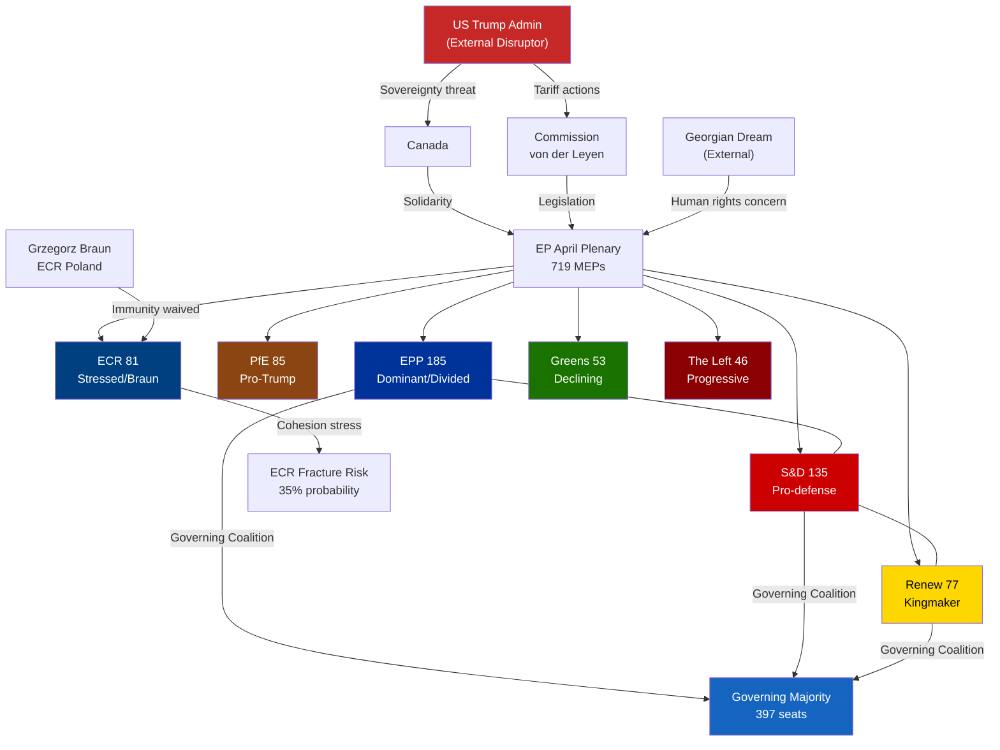

<!-- SPDX-FileCopyrightText: 2024-2026 Hack23 AB -->
<!-- SPDX-License-Identifier: Apache-2.0 -->

# Actor Mapping — EP April 2026 Plenary: Key Stakeholders and Power Dynamics
**Date**: 2026-04-27 | **Confidence**: 🟡 B2

## For Citizens — Who's Who in This Story

These are the key actors shaping European Parliament decisions this week and in the recent legislative cycle:

- **EPP (European People's Party)**: The largest group — centre-right. Their leader Manfred Weber (Germany) steers a careful path between pro-business US trade compromise and political pressure to respond firmly to Trump.
- **S&D (Socialists and Democrats)**: Second largest — centre-left. Solidly pro-EU, pro-trade-defense, strong on social rights and anti-corruption.
- **Renew Europe**: Liberal centrist. Sometimes torn between free-market instincts and pragmatic EU solidarity.
- **PfE (Patriots for Europe)**: The far-right group led by Viktor Orbán (Hungary). Politically aligned with Trump; opposes EU confrontation with US.
- **ECR (European Conservatives and Reformists)**: Right-wing conservatives. Home to Giorgia Meloni's Fratelli d'Italia and Poland's current Law & Justice successor.
- **Commission (von der Leyen)**: Proposes EU trade responses; implements laws. Key player in US tariff negotiations.
- **US Trump Administration**: External actor whose trade and foreign policies are directly driving EU legislative responses.
- **Georgia (Georgian Dream government)**: Authoritarian drift under Bidzina Ivanishvili's Georgian Dream party; imprisoning opposition politicians.

## Primary Actors — Institutional

### Actor 1: EPP Group (185 MEPs, 25.73%)
**Role**: Dominant governing group; pivot of all majorities
**Current Positioning**: Pro-EU trade defense (voted for TA-10-2026-0096) but internally divided on escalation pace
**Key Personnel**: Manfred Weber (Bavarian CSU, Group Chair); Ursula von der Leyen (Commission President, EPP-affiliated)
**Interests**:
- Maintain governing coalition with S&D and Renew
- Manage export-dependent constituency pressure on tariffs
- Prevent ECR/PfE from poaching EPP right-wing members
- Ensure SRMR3 implementation preserves German banking sector interests
**Vulnerabilities**: Right-wing defection risk (30-40 MEPs on migration, green rollback); Hungarian MEPs follow Orbán pro-Trump line
**Power Score**: 🔴 CRITICAL (controls legislative outcomes)
**Evidence**: EP Open Data Portal group composition; TA-10-2026-0096 adoption (A1)

### Actor 2: S&D Group (135 MEPs, 18.78%)
**Role**: Grand coalition partner; centre-left policy anchor
**Current Positioning**: Strongly pro-trade-defense, pro-SRMR3, pro-anti-corruption, pro-Ukraine
**Key Personnel**: Iratxe García Pérez (Spanish, Group Chair)
**Interests**:
- Workers' rights (EU Talent Pool, EGF mobilisation)
- Housing crisis solutions (TA-10-2026-0064)
- Anti-corruption framework (TA-10-2026-0094)
- Democratic values enforcement (Georgia, Braun)
**Vulnerabilities**: Below majority on own (135 seats); entirely dependent on EPP partnership
**Power Score**: 🟡 HIGH (essential coalition partner)
**Evidence**: Voting patterns derived from adopted texts; group composition (B2)

### Actor 3: Commission (Ursula von der Leyen)
**Role**: Legislative initiator; executive implementation arm; US trade negotiator
**Current Positioning**: Calibrated response to US tariffs — retaliatory measures adopted but diplomatic channel maintained
**Interests**:
- Preserve EU single market integrity
- Negotiate with Trump administration from position of strength
- Implement SRMR3, EU Talent Pool, and anti-corruption directives
- Maintain Ukraine support
**Key Tension**: Commission must balance EP's more assertive stance with diplomatic realities
**Power Score**: 🔴 CRITICAL (initiates all legislation; implements trade measures)
**Evidence**: Commission-EP relationship documented in institutional procedures (B2)

### Actor 4: ECR Group (81 MEPs, 11.27%)
**Role**: Right-wing conservative opposition/occasional coalition partner
**Current Positioning**: INTERNALLY STRESSED — Braun immunity waiver creates significant intra-group pressure
**Key Personnel**: Nicola Procaccini (Italian, Co-Chair); Zbigniew Ziobro's allies (Polish)
**Interests**:
- National sovereignty on rule of law issues
- Migration restrictionism
- Green regulation rollback
- Post-Braun: managing institutional fallout while protecting member
**Vulnerabilities**: Grzegorz Braun case; Meloni's Italy increasingly pragmatic on EU; Polish members in post-PiS transition
**Power Score**: 🟡 MEDIUM (essential for any right-wing majority; occasional governing coalition partner)
**Evidence**: TA-10-2026-0088 adoption; group composition (A1/B2)

### Actor 5: PfE Group (85 MEPs, 11.82%)
**Role**: Right-wing nationalist; ideologically aligned with Trump administration
**Current Positioning**: OPPOSED to EU-US trade confrontation; sympathy with US position
**Key Personnel**: Viktor Orbán (Hungarian PM, key PfE driver); Marine Le Pen-aligned French members
**Interests**:
- EU-US friendship (ideological affinity with Trump)
- Migration restriction
- Sovereignty maximalism
- Weakening EU institutional power
**Vulnerabilities**: Orbán's Hungary in ongoing EU rule of law dispute; internal tensions between French, Hungarian, Italian PfE members
**Power Score**: 🟡 MEDIUM (third-largest group; swing vote on right-wing majorities)
**Evidence**: Group composition (A1); political landscape analysis (B2)

## Secondary Actors — External / National

### Actor 6: United States (Trump Administration)
**Role**: External disruptor; driver of EU-US trade policy
**Current Positioning**: Tariff escalation against EU goods; pressure on Canada sovereignty; withdrawal from multilateral institutions
**Interests**:
- Bilateral trade surplus with EU
- Weakening EU institutional unity (divide-and-rule strategy)
- Bilateral deals with individual member states
**Impact on EP**: Direct — tariff retaliation (TA-10-2026-0096) is explicit response to US actions; EU-Canada resolution (TA-10-2026-0078) is defensive coalition-building
**Power Score**: 🔴 CRITICAL (exogenous driver of EP's legislative agenda)

### Actor 7: Georgia (Georgian Dream Government)
**Role**: EU neighbourhood democracy concern; human rights issue
**Current Positioning**: Authoritarian consolidation under Georgian Dream; imprisonment of opposition figure Elene Khoshtaria
**Impact on EP**: EP resolution TA-10-2026-0083 (March 12) — strong condemnation; potential sanctions escalation on April plenary agenda
**Power Score**: 🟢 LOW (limited EU leverage; but reputational cost to EU-Georgia association)

### Actor 8: Grzegorz Braun (ECR, Poland)
**Role**: Controversial individual MEP; institutional stress test
**Current Positioning**: Immunity waived (TA-10-2026-0088); faces Polish prosecution for fire extinguisher attack on Hanukkah ceremony and antisemitic statements
**Impact on EP**: Forces ECR group to manage visible far-right extremism within group; tests EP's institutional response to member state prosecution of its members
**Power Score**: 🟢 LOW individually (but 🟡 HIGH as a stress indicator for ECR cohesion)

## Actor Interaction Map (Mermaid)

## Data Sources and Provenance

| Evidence | Source | Admiralty Grade |
|----------|--------|----------------|
| Group seat counts | EP Open Data Portal (get_current_meps) | A1 |
| Political landscape analysis | european-parliament-generate_political_landscape | B2 |
| Adopted text votes | european-parliament-get_adopted_texts | A1 |
| Braun immunity case | TA-10-2026-0088 (EP Open Data) | A1 |
| Coalition dynamics | european-parliament-analyze_coalition_dynamics | B3 |
| US trade policy | TA-10-2026-0096, TA-10-2026-0078 (EP resolutions) | A1 |
| Georgia case | TA-10-2026-0083 (EP Open Data) | A1 |
