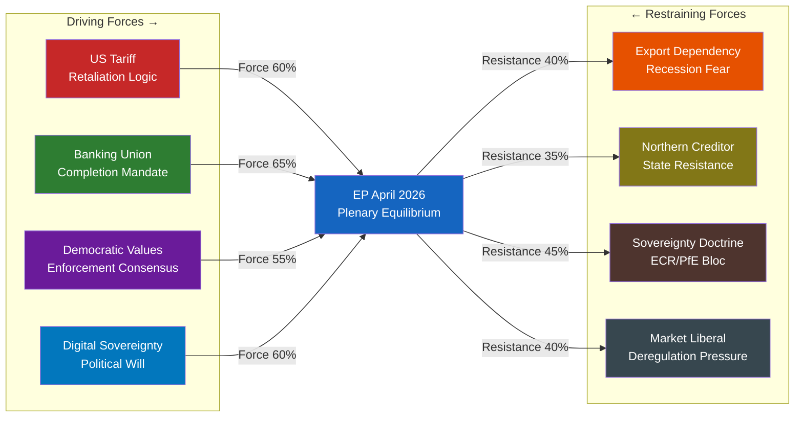

<!-- SPDX-FileCopyrightText: 2024-2026 Hack23 AB -->
<!-- SPDX-License-Identifier: Apache-2.0 -->

# Forces Analysis — EP April 2026 Political Dynamics
**Date**: 2026-04-27 | **Confidence**: 🟡 B2 | **Method**: Political Force Field Analysis

## For Citizens — Plain Language

Politics is always a battle of forces pushing in different directions. In the European Parliament right now, there are powerful forces pushing MEPs to take strong action against the United States on trade, protect European workers and banks, and defend democracy in countries near the EU. But there are also forces pushing back — fears about economic retaliation, disagreements between political groups, and uncertainty about what the right strategy is. This analysis maps those competing forces.

## Force Field Overview

The April 2026 plenary occurs at the intersection of four major political force fields:

1. **EU-US Trade Force Field**: Forces pushing for escalation vs. forces pushing for negotiation
2. **Banking Union Force Field**: Forces completing financial integration vs. member state sovereignty concerns
3. **Democratic Values Force Field**: Forces defending rule of law vs. nationalist/sovereignty interests
4. **Technological Sovereignty Force Field**: Forces for digital autonomy vs. market-liberal resistance

## Force Field 1: EU-US Trade Policy

### Driving Forces (toward confrontation)
- **US unilateral tariff actions** — Trump administration imposed tariffs on EU goods without WTO authorization, creating strong political mandate for retaliation (Probability: near-certain these tariffs continue — A1 evidence: TA-10-2026-0096 adopted)
- **EP institutional unity** — broad coalition (EPP+S&D+Renew) voted for TA-10-2026-0096; the adoption represents institutional commitment
- **EU-Canada alignment** — Canada solidarity resolution (TA-10-2026-0078) creates diplomatic network effect against US coercive trade actions
- **WTO Ministerial Conference** — March 26-29 Yaoundé (TA-10-2026-0086); EP resolution reinforced multilateral rules-based order against US unilateralism
- **European public opinion** — Anti-Trump sentiment is high in EU member states; domestic political pressure on MEPs to be "tough"

### Restraining Forces (toward de-escalation)
- **Export dependency** — German automotive, French wine, Italian fashion, Dutch/Belgian chemicals heavily dependent on US market; economic damage from full trade war estimated at 0.5-1.0% GDP reduction (data-vintage="WEO-April-2026", forecast)
- **EPP right wing** — Some EPP MEPs from export-dependent constituencies prefer negotiated settlement; Hungary's Fidesz-aligned MEPs follow Orbán's pro-Trump line
- **PfE ideological affinity** — PfE is politically aligned with Trump administration; will vote against trade confrontation measures
- **Business lobby pressure** — BusinessEurope and major national industry associations prefer negotiation over escalation
- **US security umbrella dependence** — NATO article 5 logic creates political ceiling for EU confrontation with Washington

**Net Force Direction**: 🔴 Confrontation favoured — but with meaningful restraining forces preventing full escalation
**Force Balance**: 60/40 toward confrontation over negotiation

## Force Field 2: Banking Union Completion

### Driving Forces (toward completion)
- **SRMR3 passage** (TA-10-2026-0092) — early intervention framework now law; provides foundation for next integration steps
- **ECB leadership continuity** — new ECB Vice-President appointed (TA-10-2026-0060); monetary policy stability
- **Financial stability mandate** — TA-10-2026-0004 ("financial stability amid economic uncertainties") established EP's strong pro-stability orientation
- **Trade war economic risk** — US tariff confrontation increases need for robust EU banking framework to absorb potential economic shocks
- **IMF pressure** — IMF WEO April 2026 urges European financial market completion; IMF policy dialogue with EU institutions ongoing (data-vintage="WEO-April-2026")

### Restraining Forces (against further banking integration)
- **Northern creditor states** — Germany, Netherlands, Austria resist full mutualization of resolution costs; Bundesrat and Bundestag constraints on German federal government
- **Subsidiarity concerns** — national parliaments retain constitutional concerns about sovereign risk transfers to EU level
- **Implementation complexity** — SRMR3 requires hundreds of Commission delegated acts; risk of technical deadlock in implementation
- **Banking lobby fragmentation** — pan-European banks want integration; national savings banks (Sparkassen, Caisse d'Épargne) prefer national frameworks

**Net Force Direction**: 🟡 Gradual completion favoured, with significant implementation friction
**Force Balance**: 65/35 toward integration, slowly

## Force Field 3: Democratic Values and Rule of Law

### Driving Forces (toward enforcement)
- **Georgia case** — Elene Khoshtaria (opposition leader) imprisoned; EP passed resolution TA-10-2026-0083; EU-Georgia relations at crisis point
- **Lithuania public broadcaster** — TA-10-2026-0024 signals EP vigilance on Russian information operations and media independence
- **Braun prosecution** — Immunity waiver (TA-10-2026-0088) demonstrates EP's willingness to allow legal accountability
- **Ukraine solidarity** — Ongoing war in Ukraine keeps democratic values at centre of EP agenda
- **Progressive coalition** — S&D + Greens/EFA + The Left (234 seats) consistently pushes for strong rule of law enforcement
- **EPP's Article 7 legacy** — EPP used Article 7 procedures against Hungary, Poland under previous Fidesz/PiS governments; institutional muscle memory

### Restraining Forces (against enforcement)
- **Sovereignty doctrine** — ECR, PfE, ESN, and some EPP members invoke non-interference principle on member state judicial matters
- **Economic dependencies** — EU-Georgia trade relations constrain willingness to impose economic sanctions
- **Strategic ambiguity** — Some EU member states (Hungary) actively resist democratic conditionality
- **Braun personal politics** — Some ECR MEPs view Braun as a free speech martyr rather than a threat; internal ECR politics complicate response
- **Ukraine war fatigue** — Among some PfE/ESN members, war fatigue reduces appetite for eastern neighbourhood engagement

**Net Force Direction**: 🟡 Rule of law enforcement maintained but contested
**Force Balance**: 55/45 toward enforcement, with significant opposition minority

## Force Field 4: Technological Sovereignty

### Driving Forces (toward digital autonomy)
- **Technological sovereignty resolution** (TA-10-2026-0022) — strong EP political mandate for reducing EU digital dependencies
- **GenAI copyright resolution** (TA-10-2026-0066) — moves toward EU-specific AI governance framework
- **US tech dependence** — EU reliance on US cloud (AWS, Azure, Google Cloud) highlighted by trade war context; political will to reduce exposure
- **Chinese AI competition** — DeepSeek and other Chinese AI capabilities create competitive pressure on EU to develop own ecosystem
- **AI Act implementation** — EU is global leader on AI regulation; EP10 seeks to extend this to generative AI specifically

### Restraining Forces (against digital regulation)
- **Market liberalism** — Renew and some EPP MEPs resist heavy regulation as hampering EU tech competitiveness
- **Industry lobbying** — GAFAM presence in EU (major employers in Ireland, Luxembourg, Netherlands) creates political constraints
- **Implementation capacity** — EU tech companies lack scale to replace US platforms at current investment levels
- **Trade war complication** — US tech companies subject to US government pressure; EU digital sovereignty vs. transatlantic tech cooperation tension

**Net Force Direction**: 🟡 Digital sovereignty advancing incrementally
**Force Balance**: 60/40 toward sovereignty, with speed debate

## Mermaid Force Field Diagram

## Net Assessment

The April 2026 plenary convenes with driving forces stronger than restraining forces across all four major force fields. The EU is moving toward: trade confrontation with the US (not escalation to full tariff war, but sustained retaliatory posture), banking union completion (SRMR3 foundation), rule of law enforcement (Georgia, Braun), and incremental digital sovereignty (AI governance, infrastructure independence).

**Restraining forces are real but insufficient to reverse direction** — they are shaping the tempo and modalities of each policy shift, not preventing the shifts themselves.

**Key uncertainty**: The EPP's internal management of its right-wing tension with PfE/ECR is the single biggest force field variable. If EPP-PfE alignment strengthens in Q2 2026, restraining forces on trade, rule of law, and green policies would intensify significantly.

**Admiralty Grade**: B2 — Political force analysis based on real legislative data; directional judgements are analytical extrapolation
**Data Sources**: EP Open Data Portal adopted texts (A1), EP political landscape (B2), coalition dynamics (B3)
