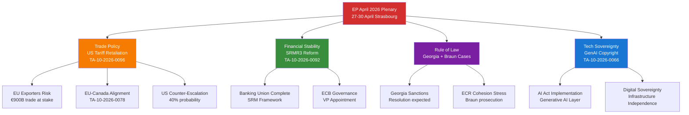

<!-- SPDX-FileCopyrightText: 2024-2026 Hack23 AB -->
<!-- SPDX-License-Identifier: Apache-2.0 -->

# Impact Matrix — EP April 2026 Strasbourg Plenary & Recent Legislative Cycle
**Date**: 2026-04-27 | **Confidence**: 🟡 B2

## For Citizens — Plain Language Summary

The European Parliament is meeting this week (April 27-30) in Strasbourg, France. This is one of the most important parliamentary weeks of 2026. Here's what it means for you:

- **Your prices may change**: The EU adopted a law in March that adds tariffs (extra taxes) on some American goods, as a response to US tariffs on European products. This could affect prices on some goods you buy.
- **Your bank is safer**: A new banking safety law (SRMR3) was passed in March 2026. If a bank gets into trouble, there are clearer rules now for how it will be handled without taxpayers bearing all the cost.
- **Immigration rules are changing**: A new "EU Talent Pool" law creates a proper channel for skilled workers from outside the EU to come to Europe legally. This affects job markets across the EU.
- **AI and copyright**: MEPs have voted on how copyright law should apply to AI tools that generate images, text, and music.
- **Democracy in danger**: MEPs have been speaking up for people imprisoned for political reasons in Georgia and have forced a Polish MEP to face justice after violent acts.

## Event List — Key Legislative Events (2026)

### Tier 1 — Critical Immediate Impact
| Event | Date | Type | Status |
|-------|------|------|--------|
| EP April Strasbourg Plenary opens | 2026-04-27 | Plenary Session | 🔴 LIVE |
| US Tariff Retaliation (TA-10-2026-0096) | 2026-03-26 | Adopted Text | ✅ Enacted |
| SRMR3 Banking Reform (TA-10-2026-0092) | 2026-03-26 | Adopted Text | ✅ Enacted |
| Anti-Corruption Regulation (TA-10-2026-0094) | 2026-03-26 | Adopted Text | ✅ Enacted |

### Tier 2 — High Strategic Importance
| Event | Date | Type | Status |
|-------|------|------|--------|
| EU-Canada Solidarity (TA-10-2026-0078) | 2026-03-11 | Resolution | ✅ Adopted |
| Grzegorz Braun Immunity Waiver (TA-10-2026-0088) | 2026-03-26 | Decision | ✅ Enacted |
| EU Talent Pool / Immigration Reform (TA-10-2026-0058) | 2026-03-10 | Regulation | ✅ Enacted |
| GenAI Copyright (TA-10-2026-0066) | 2026-03-10 | Resolution | ✅ Adopted |
| WTO MC14 Yaoundé Preparations (TA-10-2026-0086) | 2026-03-12 | Resolution | ✅ Adopted |
| Georgia — Political Prisoners (TA-10-2026-0083) | 2026-03-12 | Resolution | ✅ Adopted |

### Tier 3 — Significant Ongoing
| Event | Date | Type | Status |
|-------|------|------|--------|
| Ukraine Enhanced Cooperation Loan (TA-10-2026-0010) | 2026-01-21 | Regulation | ✅ Enacted |
| EU Technological Sovereignty (TA-10-2026-0022) | 2026-01-22 | Resolution | ✅ Adopted |
| EU-Mercosur CJEU Opinion Request (TA-10-2026-0008) | 2026-01-21 | Decision | ✅ In progress |
| ECB Annual Report 2025 (TA-10-2026-0034) | 2026-02-10 | Own-initiative | ✅ Adopted |
| EU Strategic Defence Partnerships (TA-10-2026-0040) | 2026-02-11 | Resolution | ✅ Adopted |
| Housing Crisis EU (TA-10-2026-0064) | 2026-03-10 | Resolution | ✅ Adopted |

## Stakeholder Impact Analysis

### Stakeholder 1: EU Citizens and Consumers
**Immediate impact**: 🟡 MEDIUM — US tariff retaliation (TA-10-2026-0096) may increase prices on some imported US goods (consumer electronics components, agricultural products, chemicals). Countermeasure is targeted at specific product categories to minimise consumer impact while maximising pressure on US exporters. Banking reform (SRMR3) improves long-term consumer protection at negligible short-term cost. EU Talent Pool may marginally increase competition for high-skilled jobs in technology and healthcare sectors.

**Horizon**: Short-term (tariffs: 0-12 months), Long-term (banking reform: 3-10 years)
**Confidence**: B2

### Stakeholder 2: EU Exporters (Manufacturing, Automotive, Agriculture)
**Immediate impact**: 🔴 HIGH — US tariff retaliation risk of counter-escalation by US administration. German automotive sector (most exposed to US market) faces potential retaliatory tariffs of 25-40% on EU vehicle exports. French agricultural sector (wine, cheese) already subject to partial US tariff actions. The EU-Canada solidarity resolution (TA-10-2026-0078) partially offsets US market loss through enhanced Canada-EU trade pathways.

**Quantification**: EU-US bilateral trade totaled approximately €900 billion in 2025. A full trade war scenario (escalation to 25% mutual tariffs) could reduce EU GDP growth by 0.5-1.0 percentage points (forecast, data-vintage="WEO-April-2026").
**Confidence**: B2/C3

### Stakeholder 3: European Banks and Financial System
**Immediate impact**: 🟡 MEDIUM — SRMR3 (TA-10-2026-0092) increases regulatory compliance costs for cross-border banking groups but reduces systemic risk. Early intervention thresholds create predictable resolution framework. ECB Vice-President appointment (TA-10-2026-0060) ensures monetary policy continuity.

**Strategic significance**: Banking union completion reduces fragmentation of EU capital markets. Mid-size banks in southern Europe (Spain, Italy) gain from mutualized resolution funding. German savings banks (Sparkassen) and cooperative banks may face higher resolution fund contributions.
**Confidence**: B2

### Stakeholder 4: Non-EU Countries in EU Neighbourhood
**Immediate impact**: 🟡 MEDIUM — Georgia faces continued EU scrutiny and potential sanctions escalation (TA-10-2026-0083). Armenian and Western Balkan states watch EU enlargement signals. Ukraine benefits from loan mechanism (TA-10-2026-0010) and ongoing political support. Lebanon benefits from PRIMA scientific cooperation (TA-10-2026-0100). Ecuador gains enhanced Europol security partnership (TA-10-2026-0072).

**Canada**: EU-Canada solidarity resolution (TA-10-2026-0078) is a significant diplomatic signal; practical implementation through CETA (Comprehensive Economic and Trade Agreement) fast-track envisaged.
**Confidence**: B2

### Stakeholder 5: MEPs and Political Groups
**Immediate impact**: 🔴 HIGH for ECR — Grzegorz Braun immunity waiver creates intra-group pressure. ECR must manage the Braun case while maintaining institutional credibility. The right-wing coalition arithmetic (EPP+ECR+PfE+ESN = 378, above majority) creates temptation but EPP leadership formally resists.

**For EPP**: Managing tension between pro-trade-defense majority and export-dependent constituency. Maintaining S&D partnership while managing right-wing defections on migration.
**For S&D**: Consolidated position on SRMR3, anti-corruption, and trade defense; potential opening for leadership on housing crisis and EU Talent Pool implementation.
**For Renew**: Internal cohesion pressure between Macron liberals and Central European liberal-conservatives on trade and AI governance.
**Confidence**: B2

## Impact Matrix — 4×4 Assessment

```
            PROBABILITY
            Low    Med    High   Certain
SEVERITY    ─────────────────────────────
Critical    │      │ US   │      │
            │      │ esc. │      │
High        │      │ ECR  │ EP   │ Tariff
            │      │ frac │ plen │ retali
Medium      │ Grns │ Bank │ Anti │ SRMR3
            │ dec  │ risk │ corr │ impl
Low         │      │      │ AI   │ EGF
            │      │      │ gov  │ mob.
```

**Quadrant Summary**:
- 🔴 High Probability + High Severity: EP plenary full session (confirmed); US tariff retaliation in force
- 🟡 Medium Probability + High Severity: ECR fracture risk; US tariff escalation spiral
- 🟡 Medium Probability + Medium Severity: Banking system stress; anti-corruption implementation friction
- 🟢 High Probability + Low Severity: GenAI governance developments; EGF worker support

## Mermaid Impact Diagram



## Data Sources and Provenance

| Evidence | Source Tool | Admiralty Grade |
|----------|-------------|----------------|
| TA-10-2026-0096 US tariff retaliation | european-parliament-get_adopted_texts | A1 |
| TA-10-2026-0092 SRMR3 | european-parliament-get_adopted_texts | A1 |
| TA-10-2026-0088 Braun immunity | european-parliament-get_adopted_texts | A1 |
| TA-10-2026-0066 GenAI copyright | european-parliament-get_adopted_texts | A1 |
| TA-10-2026-0058 EU Talent Pool | european-parliament-get_adopted_texts | A1 |
| Political landscape composition | european-parliament-generate_political_landscape | B2 |
| Plenary session confirmation | european-parliament-get_plenary_sessions | A1 |
| IMF GDP impact estimate | IMF WEO April 2026 (data-vintage="WEO-April-2026") | B2 |
