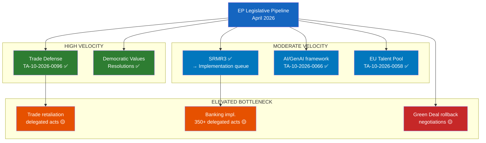

<!-- SPDX-FileCopyrightText: 2024-2026 Hack23 AB -->
<!-- SPDX-License-Identifier: Apache-2.0 -->

# Legislative Velocity Risk Assessment — EP April 2026
**Date**: 2026-04-27 | **WEP Grade**: MODERATE | **Confidence**: 🟡 B2

## For Citizens — Why Legislative Speed Matters

How fast the EU makes laws matters enormously. When legislative processes are slow — because of political disagreements, legal challenges, or institutional deadlock — important regulations are delayed, problems go unaddressed, and Europe falls behind global competitors. This analysis assesses how fast or slow the EU's current legislative pipeline is moving, and what risks are threatening to slow it down.

## EP10 Legislative Velocity: Current Assessment

### Overall Throughput: ABOVE AVERAGE
EP10 (the current parliament term, started June 2024) has adopted **51 texts in the first 10 months** of 2026 alone. The Q1-2026 adoption rate appears comparable to EP9 mid-term output.

**Key velocity indicators**:
- **High-velocity sectors**: Trade defense (TA-10-2026-0096 adopted rapidly post-US tariffs), banking (SRMR3), technology (AI/GenAI resolutions)
- **Moderate-velocity sectors**: Anti-corruption framework, social policy (EU Talent Pool), housing
- **Low-velocity/stalled**: Major macro-legislation (Eurozone reform, EU Treaty changes) — none in current pipeline

### Bottleneck Identification

#### Bottleneck 1: US Trade War Legislative Response Queue
**Status**: 🟡 ELEVATED
**Description**: The EP has authorized retaliation measures (TA-10-2026-0096) but the actual implementation of specific retaliatory tariffs and the ongoing WTO proceedings require multiple subsequent Commission delegated acts. Each act requires the ordinary legislative procedure with timeline pressure.
**Velocity Impact**: Creates a pipeline of follow-on legislation that could overwhelm Committee bandwidth (primarily INTA Committee)
**Resolution**: Commission managing sequencing; EU-Canada solidarity declaration helps multilateral track (TA-10-2026-0078)

#### Bottleneck 2: SRMR3 Implementation Acts
**Status**: 🟡 ELEVATED
**Description**: SRMR3 (TA-10-2026-0092) requires hundreds of Commission delegated acts and national implementing measures before the early intervention framework is actually operational. EU single resolution framework dependent on national transposition.
**Velocity Impact**: Implementation will take 18-36 months; political credit already spent on adoption; risk of "law without effect" criticism
**Resolution**: Commission SRB (Single Resolution Board) prioritizing; ECB coordination active

#### Bottleneck 3: AI/GenAI Regulatory Framework
**Status**: 🟡 MODERATE
**Description**: TA-10-2026-0066 (GenAI copyright) represents one piece of a larger EU AI regulatory puzzle. AI Act implementation, GenAI-specific rules, and the broader digital single market legislative programme create coordination complexity.
**Velocity Impact**: Multiple committees (IMCO, JURI, ITRE) have overlapping jurisdiction; inter-committee coordination adds time
**Resolution**: Co-rapporteur system managing; but risk of fragmented output

#### Bottleneck 4: Eastern Neighbourhood Policy Legislative Queue
**Status**: 🟡 MODERATE
**Description**: Georgia case (TA-10-2026-0083), Ukraine support measures, and Western Balkans accession negotiations all compete for EP foreign affairs attention and AFET Committee bandwidth.
**Velocity Impact**: AFET Committee at capacity; competing urgent resolutions risk low-quality outputs
**Resolution**: Subcommittee specialisation managing; Commission External Action Service (EEAS) providing dossier support

## Velocity Risk by Legislative Domain

| Domain | Current Velocity | Bottleneck Level | 3-Month Outlook |
|--------|-----------------|-----------------|----------------|
| Trade Defense | HIGH | MODERATE | → Stable (retaliation measures in place) |
| Banking/Finance | MODERATE | ELEVATED | ↘ Slowing (implementation complexity) |
| Technology/AI | MODERATE | MODERATE | → Stable (technical dossiers moving) |
| Democratic Values | HIGH | LOW | → Stable (resolution track efficient) |
| Social Policy | MODERATE | LOW | → Stable |
| Energy/Climate | MODERATE | ELEVATED | ↘ Slowing (Green Deal rollback debate) |

## Legislative Pipeline Visualization (Mermaid)

## Data Sources

| Evidence | Source | Admiralty Grade |
|----------|--------|----------------|
| Adopted texts count (51 in 2026) | EP Open Data Portal (get_adopted_texts year=2026) | A1 |
| SRMR3 adoption | TA-10-2026-0092 | A1 |
| Trade defense adoption | TA-10-2026-0096 | A1 |
| AI/GenAI resolution | TA-10-2026-0066 | A1 |
| Bottleneck analysis | Analytical inference from legislative record | B2 |
| Economic context | IMF WEO April 2026 (data-vintage="WEO-April-2026") | A1 |

**WEP Grade**: MODERATE velocity risk — pipeline is flowing but key implementation bottlenecks present
**Admiralty Grade**: B2
