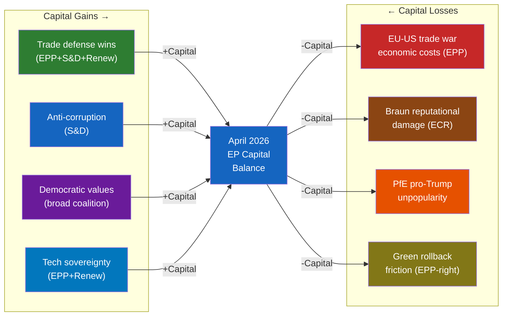

<!-- SPDX-FileCopyrightText: 2024-2026 Hack23 AB -->
<!-- SPDX-License-Identifier: Apache-2.0 -->

# Political Capital Risk Assessment — EP April 2026
**Date**: 2026-04-27 | **WEP Grade**: MODERATE-HIGH | **Confidence**: 🟡 B2

## For Citizens — What Is "Political Capital"?

Political capital is the trust, reputation, goodwill, and coalition relationships that politicians spend when they take controversial positions or make unpopular decisions. Like financial capital, it is limited — it can be invested, earned, or wasted. This analysis maps which political actors are spending or gaining capital in the April 2026 EP plenary context.

## Political Capital Inventory by Actor

### EPP Group — Capital: HIGH, STRESS: MODERATE
**Starting Capital**: 🔴 HIGH (largest group; controls Commission President; governs EU)
**Recent Gains**:
- TA-10-2026-0096 US tariff retaliation — EPP appeared unified and decisive on trade defense
- SRMR3 passage — EPP supported pragmatic banking reform
- Braun immunity waiver — EPP voted with majority; positioned as institutional responsibility actors
**Recent Expenditures**:
- Right-wing management cost: Maintaining coalition with PfE on migration issues while opposing PfE on trade/Ukraine costs credibility with progressive partners
- Green rollback ambiguity: Some EPP members pushing to weaken Green Deal creates friction with Renew/S&D partners
**Net Position**: Slight capital accumulation in Q1 2026; strong but not unchallenged
**Capital Risk**: 🟡 MEDIUM — right-wing internal pressure could force EPP to spend capital on accommodating PfE demands
**IMF Economic Context**: Strong EU economic performance would increase EPP capital; recession risk from trade war would deplete it rapidly (data-vintage="WEO-April-2026")

### S&D Group — Capital: MODERATE, STRESS: LOW
**Starting Capital**: 🟡 MODERATE (second-largest; reliable governing coalition partner)
**Recent Gains**:
- Anti-corruption framework (TA-10-2026-0094) — S&D's signature issue advanced
- Housing resolution (TA-10-2026-0064) — populist policy credibility
- Democratic values record — Georgia, Braun — S&D consistently on right side of these votes
**Recent Expenditures**:
- Limited; S&D not in a capital-expenditure mode this cycle
**Net Position**: Stable capital; positioned as reliable progressive coalition partner
**Capital Risk**: 🟢 LOW — S&D's positioning is consistent and predictable

### PfE Group — Capital: MODERATE, STRESS: HIGH
**Starting Capital**: 🟡 MODERATE (third-largest; nationally popular in several states)
**Recent Gains**:
- Maintains populist anti-establishment identity
- EU sovereignty concerns resonate in domestic audiences (Hungary, France, Italy)
**Recent Expenditures**:
- US trade position — PfE's pro-Trump stance is UNPOPULAR with European public; capital cost with general European electorate
- Governance exclusion — Being outside governing coalition limits agenda access; reduces tangible policy wins
- Orbán's Hungary: ongoing EU rule of law proceedings reduce PfE institutional credibility
**Net Position**: Capital declining in mainstream European discourse; maintained in domestic nationalist bases
**Capital Risk**: 🔴 HIGH — EU-US trade war making PfE's pro-Trump positioning increasingly untenable with European voters

### ECR Group — Capital: MODERATE, STRESS: HIGH
**Starting Capital**: 🟡 MODERATE (fourth-largest; Italy's FdI provides governmental credibility)
**Recent Gains**:
- FdI-Meloni's governing credibility (Italian PM in EU discussions)
- Migration restrictionism resonates widely
**Recent Expenditures**:
- Braun immunity waiver: SIGNIFICANT capital cost — ECR appeared to shield antisemitic extremism; 🔴 reputational damage
- Post-PiS Polish ECR transition: uncertainty about membership alignment
**Net Position**: Capital under pressure; FdI component stable but Braun cost significant
**Capital Risk**: 🔴 HIGH — Braun case creates ongoing capital drain; risk of further similar incidents

### Commission (von der Leyen) — Capital: HIGH, STRESS: MODERATE
**Starting Capital**: 🔴 HIGH (Commission President in second term; strong institutional mandate)
**Recent Gains**:
- Trade retaliation authorization — positioned EU firmly as confident actor
- Technology sovereignty leadership — AI Act implementation ongoing
- Ukraine solidarity maintained
**Recent Expenditures**:
- Green Deal softening: capital cost with Greens/S&D; but needed to maintain EPP support
- US trade diplomacy complexity: seen as "too soft" by EP hardliners and "too aggressive" by business lobbies
**Net Position**: Strong overall but spending capital on all sides simultaneously
**Capital Risk**: 🟡 MEDIUM — positioned as pragmatic; risk if EU-US trade war accelerates badly

## Political Capital Flow Diagram (Mermaid)

## Capital Stress Indicators

| Actor | Capital Level | Stress | 3-Month Trajectory |
|-------|--------------|--------|-------------------|
| EPP | HIGH | MODERATE | ↗ Slightly gaining |
| S&D | MODERATE | LOW | → Stable |
| Commission | HIGH | MODERATE | → Stable with risk |
| ECR | MODERATE | HIGH | ↘ Declining (Braun) |
| PfE | MODERATE | HIGH | ↘ Declining (trade war) |
| Renew | MODERATE | LOW | → Stable |
| Greens/EFA | LOW | MODERATE | ↘ Declining (Green rollback) |

## Data Sources

| Evidence | Source | Admiralty Grade |
|----------|--------|----------------|
| Adopted texts vote pattern | EP Open Data Portal TA-10-2026 series | A1 |
| Group composition | EP current MEP data | A1 |
| Coalition dynamics | generate_political_landscape | B2 |
| Political capital assessment | Analytical inference from legislative record | B2 |
| Economic stress context | IMF WEO April 2026 | A1 |

**WEP Grade**: MODERATE-HIGH portfolio political capital risk
**Admiralty Grade**: B2 — structured analytical inference with strong documentary evidence base
