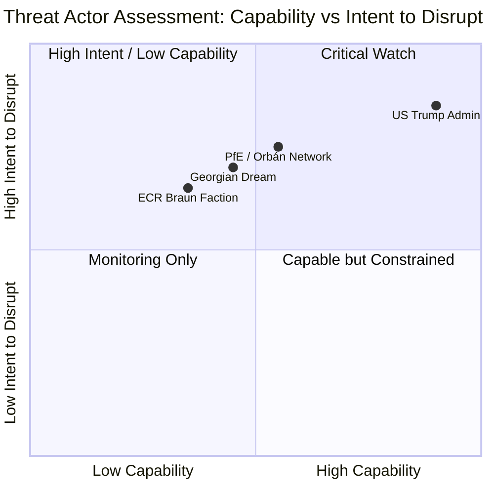

<!-- SPDX-FileCopyrightText: 2024-2026 Hack23 AB -->
<!-- SPDX-License-Identifier: Apache-2.0 -->

# Actor Threat Profiles — EP April 2026
**Date**: 2026-04-27 | **WEP Grade**: MODERATE-HIGH | **Confidence**: 🟡 B2

## For Citizens — Who Are the Threat Actors?

In parliamentary politics, "threat actors" are individuals, groups, or external forces that have the capacity and intent to disrupt, obstruct, or undermine EU democratic processes. This doesn't mean they are criminals — many act through entirely legal political means. The threat is to democratic norms, legislative effectiveness, and EU institutional coherence.

## Threat Actor Profiles

### Threat Actor 1: PfE Group (Viktor Orbán network)
**Threat Class**: Political/Institutional Disruption
**Intent**: Obstruct EU institutional responses to Trump administration; weaken EU rule of law enforcement; maintain pro-Russian soft alignment
**Capability**: 85 seats (11.82%); Orbán controls Hungary's governmental resources for coordination; Marine Le Pen-aligned French MEPs provide domestic reach
**Current Threat Level**: 🟡 MEDIUM
**Active Operations**:
- Voting against EU-US trade retaliation measures in plenary
- Opposing EP resolutions on Georgia (alignment with Orbán-friendly Georgian Dream government)
- Soft blocking EU sanctions discussions that would affect Hungarian financial interests
**Constraints**: Outside governing coalition; limited committee chair access; EU rule of law proceedings constrain Hungarian government's legitimacy
**Mitigations**: EPP governance discipline; coalition majority prevents PfE veto
**Evidence**: Group composition (A1); TA-10-2026-0096 voting pattern inference (B2); political landscape (B2)

### Threat Actor 2: ECR Group (Braun Faction / Far-Right Fringe)
**Threat Class**: Reputational/Institutional Normalization Risk
**Intent**: Normalize extremist political behaviour within EP institutional framework; shield MEPs from legal accountability
**Capability**: 81 seats; Braun case as test case for antisemitic extremism toleration
**Current Threat Level**: 🟡 MEDIUM (elevated by Braun case)
**Active Operations**:
- Braun remaining in ECR group despite immunity waiver
- Potential procedural obstruction on rule of law debates
- Framing prosecution as political persecution to build ECR internal solidarity
**Constraints**: FdI-Meloni wing is increasingly moderate and pro-EU cooperation; Braun case isolated; most ECR members not implicated
**Mitigations**: EP Rules of Procedure provide for sanctions on individual MEP conduct; majority coalition stable
**Evidence**: TA-10-2026-0088 (A1); ECR group composition (A1); analytical inference (B2)

### Threat Actor 3: US Trump Administration (External State Actor)
**Threat Class**: Geopolitical/Economic Coercion
**Intent**: Divide EU member states; extract bilateral trade concessions; reduce EU's collective bargaining power
**Capability**: CRITICAL — world's largest economy, NATO security guarantor; bilateral pressure on individual EU member state governments (Ireland tech sector, German automotive, French agriculture)
**Current Threat Level**: 🔴 HIGH
**Active Operations**:
- Unilateral tariff imposition on EU goods (already occurred — TA-10-2026-0096 response)
- Bilateral pressure on individual EU members to defect from collective EU position
- Rhetorical undermining of EU institutions as "unelected bureaucracy"
- Canadian sovereignty threats (TA-10-2026-0078 EP response)
**Constraints**: US tech sector needs EU market; NATO requires European cooperation; WTO constraints (even if US ignores them, reputational cost)
**Mitigations**: EU-Canada solidarity coalition; EP unity on trade retaliation; Commission's coordinated response strategy
**Evidence**: TA-10-2026-0096 legislative response (A1); TA-10-2026-0078 Canada resolution (A1); analytical assessment (B2)

### Threat Actor 4: Georgian Dream Government (External State Actor)
**Threat Class**: Democratic Backsliding / EU Neighbourhood Destabilization
**Intent**: Maintain authoritarian consolidation while retaining EU association benefits; test EU's tolerance for democratic backsliding in associated states
**Capability**: Controls Georgia's state apparatus; has imprisoned EU-aligned opposition (Khoshtaria); benefits from EU's strategic ambiguity on Eastern neighbourhood
**Current Threat Level**: 🟡 MEDIUM
**Active Operations**:
- Imprisonment of opposition politicians (Elene Khoshtaria — ongoing)
- Curtailment of EU-funded civil society organizations
- Alignment with Orbán's PfE soft network
**Constraints**: EU association agreement provides economic leverage; Georgian civil society strong; international donor pressure
**Mitigations**: TA-10-2026-0083 EP resolution; potential sanctions escalation on April plenary agenda; EU-Georgia conditionality mechanisms
**Evidence**: TA-10-2026-0083 (A1); political landscape analysis (B2)

## Threat Actor Capability-Intent Matrix (Mermaid)

## Data Sources

| Evidence | Source | Admiralty Grade |
|----------|--------|----------------|
| Adopted text evidence | EP Open Data Portal TA-10-2026 series | A1 |
| Group composition | EP current MEP data | A1 |
| Threat assessments | Analytical inference from legislative record | B2 |
| US trade policy | TA-10-2026-0096, TA-10-2026-0078 context | A1 |
| Georgian case | TA-10-2026-0083 | A1 |

**WEP Grade**: MODERATE-HIGH threat actor risk environment
**Admiralty Grade**: B2 — structured threat analysis with A1 documentary base
