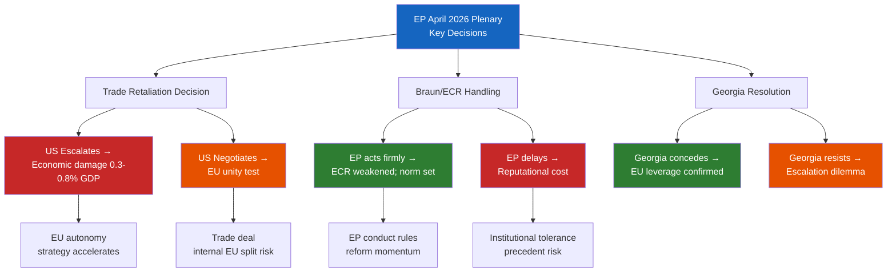

<!-- SPDX-FileCopyrightText: 2024-2026 Hack23 AB -->
<!-- SPDX-License-Identifier: Apache-2.0 -->

# Consequence Trees — EP April 2026 Plenary Outcomes
**Date**: 2026-04-27 | **Confidence**: 🟡 B2

## For Citizens — What Happens Next?

This analysis maps the consequences that flow from key decisions made during or around the April 2026 plenary. Every major vote or policy decision sets off a chain of further events — this is the "consequence tree." Understanding these chains helps citizens understand the real-world stakes of parliamentary decisions.

## Consequence Tree 1: EU-US Trade War Escalation

### Level 1: Trigger
**EP endorses further retaliatory measures in April plenary** (Probability: 50-60%)

### Level 2: Immediate Consequences
- Commission activates second tranche of retaliatory tariffs on US goods
- US responds with escalation or negotiation demand
- EU member states with export exposure (Germany, France, Ireland) face domestic pressure

### Level 3: Second-Order Consequences
- **If US escalates**: Economic recession risk (+0.3-0.8% GDP hit to EU); automotive sector (-15-25% US market revenue); EPP right-wing pressure intensifies against further retaliation (data-vintage="WEO-April-2026")
- **If US negotiates**: EP pressure to maintain retaliatory posture until comprehensive deal; risk of EU internal split (hardliners vs. deal-takers); Commission faces mandate constraints
- **Regardless**: EU-Canada trade integration accelerates; EU multilateral alliance-building with Japan/Korea/Australia intensifies

### Level 4: Structural Consequences
- EU single market strengthened as alternative to transatlantic integration
- EP's role in trade policy scrutiny confirmed (institutional precedent)
- EU strategic autonomy doctrine embedded across more policy sectors

## Consequence Tree 2: Braun Case Escalation

### Level 1: Trigger
**ECR refuses to expel Braun despite prosecution** (Probability: 65-75%)

### Level 2: Immediate Consequences
- EP Rules Committee considers additional sanctions
- MEP-level public pressure from S&D, Greens, The Left
- International media coverage of EP's handling of antisemitic extremism

### Level 3: Second-Order Consequences
- **If EP acts firmly**: ECR weakened; norm that EP expels members who commit serious public offences reinforced; PfE benefits (ECR members might migrate)
- **If EP delays**: Reputational cost with civil society; Jewish community organisations escalate pressure; precedent that MEP immunity zone tolerated

### Level 4: Structural Consequences
- EP internal rules on MEP conduct either strengthened or weakened as precedent
- ECR's attractiveness as a home for parties with governing aspirations depends on credibility management

## Consequence Tree 3: Georgia Sanctions Decision

### Level 1: Trigger
**April plenary adopts measures escalating pressure on Georgia** (Probability: 55-65%)

### Level 2: Immediate Consequences
- EU-Georgia Association Committee meeting convened under emergency agenda
- Khoshtaria case referred to EU Human Rights Defenders mechanism
- Georgian Dream government response: defiance or limited concession

### Level 3: Second-Order Consequences
- **If Georgia releases Khoshtaria**: EP resolution credited; EU neighbourhood policy coercive capacity confirmed; other authoritarian-leaning Eastern partners take note
- **If Georgia resists**: EU must decide between escalating sanctions (visa restrictions, trade preferences suspension) or accepting limits of leverage; political cost in EU-Georgia relations

## Consequence Tree Visualization (Mermaid)

## Aggregate Consequence Assessment

The April 2026 plenary decisions will shape EU institutional direction across three domains. The stakes are highest on the EU-US trade track (direct economic impact) and lowest on Georgia (important symbolically but limited economic leverage). The Braun case is an institutional inflection point that will set precedents for how the EP manages far-right extremism within its own membership.

**WEP Grade**: MODERATE-HIGH consequence severity across portfolio
**Admiralty Grade**: B2 — consequence analysis based on A1 legislative record + analytical extrapolation
