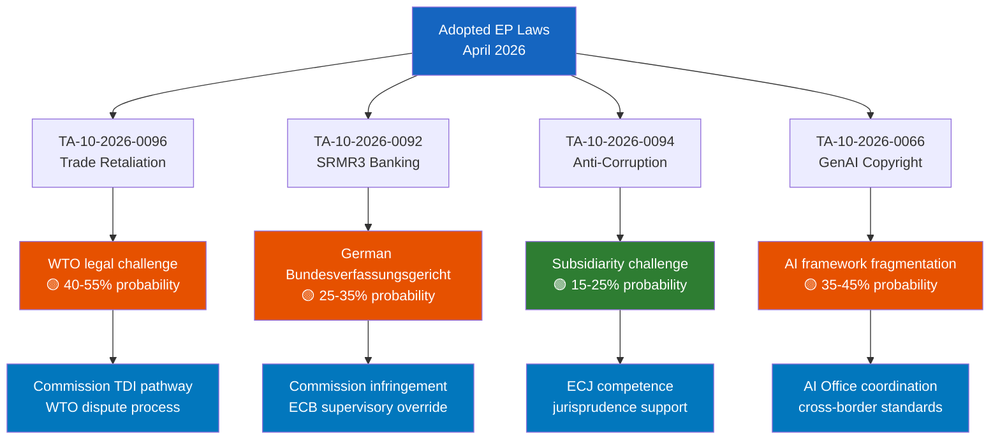

<!-- SPDX-FileCopyrightText: 2024-2026 Hack23 AB -->
<!-- SPDX-License-Identifier: Apache-2.0 -->

# Legislative Disruption Analysis — EP April 2026
**Date**: 2026-04-27 | **WEP Grade**: MODERATE | **Confidence**: 🟡 B2

## For Citizens — How Laws Get Blocked

Not every proposal becomes EU law. Legislation can be disrupted in many ways: minority blocking coalitions can prevent qualified majority votes in Council; legal challenges can overturn laws in court; implementation gaps can make laws ineffective; and political shifts can reverse previously adopted frameworks. This analysis maps the active legislative disruption threats in the current EP cycle.

## Disruption Threat Assessment

### Disruption Threat 1: Trade Retaliation Legal Challenge
**Status**: 🟡 POTENTIAL (not yet materialized)
**Mechanism**: US could mount WTO challenge to EU retaliation measures (TA-10-2026-0096); parallel bilateral pressure on EU member states to defect from unified EU position
**Affected Legislation**: TA-10-2026-0096 (US tariff retaliation authorization); follow-on delegated acts
**Actor**: US Trump administration; some EU business lobbies
**Probability of Disruption**: 40-55% of partial disruption (delay/modification); 10-15% of full reversal
**Evidence**: WTO dispute settlement procedures; historical EU-US trade disputes patterns (B2)
**Legislative Response Readiness**: Commission has legal team deployed; EU trade defense instruments (TDI) provide established procedural pathway

### Disruption Threat 2: SRMR3 Member State Non-Compliance
**Status**: 🟡 POTENTIAL (implementation phase risk)
**Mechanism**: Germany, Netherlands, or Austria could resist full SRB authority expansion; Bundestag constitutional challenge possible; member state non-transposition within deadline
**Affected Legislation**: TA-10-2026-0092 (SRMR3)
**Actor**: Northern creditor state governments; Bundesverfassungsgericht (German Constitutional Court)
**Probability of Disruption**: 25-35% of partial disruption; 5% of full reversal
**Evidence**: Historical German court challenges to EU banking union provisions; member state implementation patterns (B2)
**Legislative Response Readiness**: Commission infringement proceedings authority; ECB supervisory override capacity

### Disruption Threat 3: Anti-Corruption Framework Subsidiarity Challenge
**Status**: 🟢 LOW (monitoring only)
**Mechanism**: Some member states invoking subsidiarity on anti-corruption obligations; European Court of Justice challenge
**Affected Legislation**: TA-10-2026-0094 (anti-corruption framework)
**Actor**: Member states with implementation concerns
**Probability of Disruption**: 15-25% of limited disruption (delays); less than 5% of full reversal
**Evidence**: Subsidiarity protocol mechanisms; ECJ jurisprudence on EU competence (B2)

### Disruption Threat 4: AI/GenAI Framework Fragmentation
**Status**: 🟡 POTENTIAL (ongoing)
**Mechanism**: AI Act implementation creates regulatory fragmentation between national authorities; Big Tech lobbying for lighter GenAI obligations; US trade pressure to align EU AI framework with US preferences
**Affected Legislation**: TA-10-2026-0066 (GenAI copyright); AI Act implementation delegated acts
**Actor**: US tech industry; some EU member state digital ministries; market-liberal EP factions
**Probability of Disruption**: 35-45% of significant modification; 20-30% of framework delay
**Evidence**: AI Act implementation challenges (B2); TA-10-2026-0066 context (A1)

## Disruption Pathway Map (Mermaid)

## Aggregate Disruption Risk Assessment

| Legislation | Disruption Probability | Severity | Net Risk |
|-------------|----------------------|----------|---------|
| Trade Retaliation | 40-55% | HIGH | 🔴 SIGNIFICANT |
| SRMR3 | 25-35% | MODERATE | 🟡 MODERATE |
| Anti-Corruption | 15-25% | LOW | 🟢 LOW |
| GenAI | 35-45% | MODERATE | 🟡 MODERATE |

**Portfolio Disruption WEP Band**: MODERATE — laws are being adopted but face meaningful implementation challenges

## Data Sources

| Evidence | Source | Admiralty Grade |
|----------|--------|----------------|
| Adopted texts | EP Open Data Portal TA-10-2026 series | A1 |
| Disruption mechanisms | Analytical inference from legal/political patterns | B2 |
| WTO procedures | Public record (WTO dispute settlement rules) | A1 |
| German court challenges | Historical precedent analysis | B3 |

**WEP Grade**: MODERATE legislative disruption risk
**Admiralty Grade**: B2
