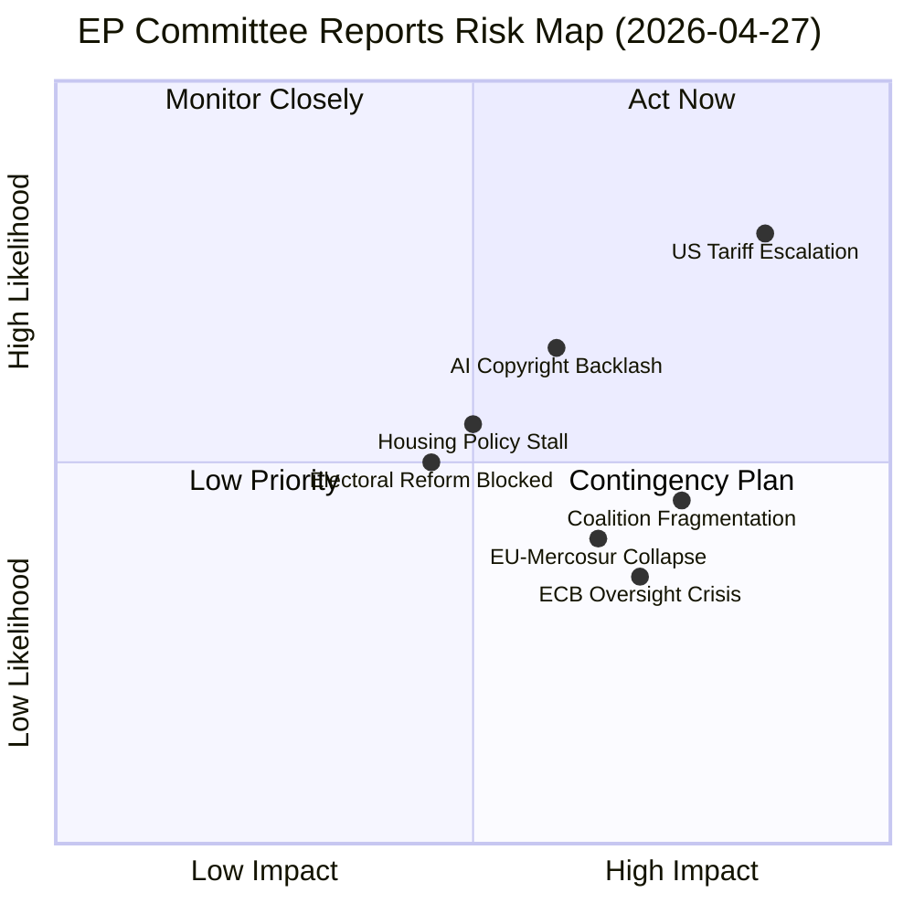

<!-- SPDX-FileCopyrightText: 2024-2026 Hack23 AB -->
<!-- SPDX-License-Identifier: Apache-2.0 -->

# Executive Brief — EP Committee Reports Week of 2026-04-27

**Classification:** PUBLIC — EU Parliament Open Data  
**Prepared for:** EU Policy Watchers, Legislative Analysts, Civic Society  
**Date:** 2026-04-27  
**Period Covered:** 2026-04-20 → 2026-04-27  
**Article Type:** committee-reports  

---

## BLUF (Bottom Line Up Front)

The European Parliament's legislative committees delivered substantial output in Q1 2026, adopting texts across trade defence (US tariffs, EU-Mercosur), digital governance (AI copyright), monetary oversight (ECB annual report, appointments), housing rights, and electoral reform. The most consequential near-term dossiers are: (1) the INTA-led US tariff countermeasures framework (TA-10-2026-0096), which reflects an urgent European response to transatlantic trade disruption; (2) the JURI/ITRE copyright-AI framework (TA-10-2026-0066), positioning the EP at the frontier of AI regulation; and (3) ECON's comprehensive ECB oversight package. In an EP with 9 political groups and a 361-seat majority threshold, none of these passed without cross-coalition compromise — signalling that the EPP (185 seats, 25.7%) cannot govern alone and must continuously broker with S&D (135) and Renew (77).

**Confidence in assessment:** 🟡 Medium — direct evidence from adopted texts, inferred committee dynamics from procedural context (direct voting record data unavailable due to EP publication delay).

---

## Three Key Decisions for Stakeholders

| # | Decision | Implication | Urgency |
|---|----------|------------|---------|
| 1 | **US tariff counter-measures** (TA-10-2026-0096): EP endorsed tariff quota adjustment responding to US trade actions | EU exporters and importers face shifting competitive landscape; INTA likely to legislate further countermeasures | 🔴 High — active trade war dynamic |
| 2 | **AI Copyright framework** (TA-10-2026-0066): EP established a rights-based position on generative AI and copyright | Content creators, tech companies, and AI developers must align business models with EP position before it becomes binding | 🟡 Medium-High — still co-decision track |
| 3 | **ECB oversight package** (TA-10-2026-0034 + 0033 + 0060): Parliament scrutinized ECB 2025 performance and approved new leadership | ECB independence preserved but parliamentary oversight intensified; monetary policy framing increasingly subject to EP political discourse | 🟡 Medium — institutional stability confirmed |

---

## 60-Second Read

**What happened?** The European Parliament's standing committees completed a packed Q1 legislative sprint. In trade, INTA advanced both EU-Mercosur provisions (agricultural safeguard clause) and US tariff counter-measures, signalling an increasingly assertive EP trade stance. In digital policy, JURI and ITRE jointly secured passage of the copyright-generative AI resolution, establishing clear EP intent to protect creators while enabling innovation. ECON's comprehensive ECB package — annual report scrutiny, Vice-President appointment, Supervisory Board appointment — demonstrates the committee's institutionalized role in monetary governance oversight.

**Why does it matter?** These legislative outputs represent not just individual policy decisions but the structural coalitional map of EP10. With EPP unable to command majorities alone, every major vote required coalition architecture. The fact that trade defence (EPP-ECR-PfE alignment), AI rights (EPP-Renew-S&D cooperation), and ECB appointments (near-consensus with Left abstentions) all passed suggests a stable but fragile legislative equilibrium.

**What comes next?** Three forward triggers dominate: (1) EU-Mercosur negotiations following the CJEU opinion request could reshape INTA's summer agenda; (2) the AI Act implementation timeline may accelerate further copyright-AI secondary legislation; (3) ECB rate decisions through mid-2026 will test the ECON-ECB oversight relationship under the new VP.

---

## Top Documents / Procedures

| Reference | Title | Committee | Date Adopted | Significance |
|-----------|-------|-----------|--------------|--------------|
| TA-10-2026-0096 | Customs duties adjustment — US tariff quotas | INTA | 2026-03-26 | 🔴 HIGH — direct response to US tariff actions |
| TA-10-2026-0066 | Copyright and generative AI | JURI/ITRE | 2026-03-10 | 🔴 HIGH — AI governance milestone |
| TA-10-2026-0034 | ECB Annual Report 2025 | ECON | 2026-02-10 | 🟡 MEDIUM-HIGH — monetary oversight |
| TA-10-2026-0064 | Housing crisis — solutions for decent housing | SOCI/REGI | 2026-03-10 | 🟡 MEDIUM — social rights benchmark |
| TA-10-2026-0006 | Electoral Act reform — ratification hurdles | AFCO | 2026-01-20 | 🟡 MEDIUM — democratic infrastructure |
| TA-10-2026-0008 | Request for CJEU opinion: EU-Mercosur Treaties compatibility | AFET/INTA | 2026-01-21 | 🟡 MEDIUM — trade law constraint |
| TA-10-2026-0094 | Combating corruption | LIBE/JURI | 2026-03-26 | 🟡 MEDIUM — rule of law |

---

## Mermaid Risk Snapshot

---

## Top Forward Trigger

**Critical Watch: US-EU Trade Escalation (Next 30–60 days)**  
The EP's adoption of tariff quota adjustments (TA-10-2026-0096) is a reactive measure, not a strategic resolution. If the US administration escalates counter-tariffs or expands the automotive/steel tariff regime, INTA will be under pressure to advance broader countermeasure legislation. This would force a difficult EPP-S&D-Renew coalition to hold under competing national economic interests (German auto sector, French agriculture, Eastern European energy). Probability of further US-EU trade escalation in Q2 2026: 🟡 **Roughly Even** (40–55% range, ICD 203 WEP band).

---

## Admiralty Source Grading

| Source | Reliability | Accuracy |
|--------|-------------|----------|
| EP Adopted Texts (official record) | A — Completely reliable | 1 — Confirmed |
| EP Political Landscape (MCP) | A — Completely reliable | 2 — Probably true |
| Committee Activity Analysis (MCP) | B — Usually reliable | 2 — Probably true |
| Voting Records | F — Cannot be judged | 6 — Cannot be judged (unavailable) |
| Procedure metadata | C — Fairly reliable | 3 — Possibly true |

---

*EP Committee Reports | Analysis Week 2026-04-27 | OSINT — Public Data Only*
