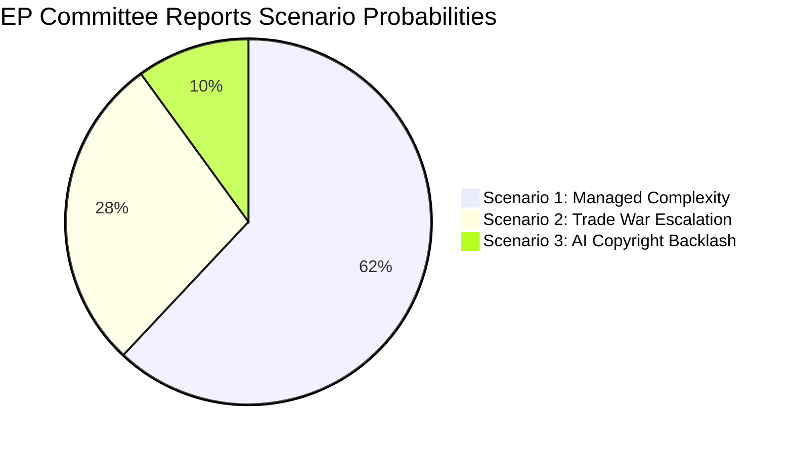

<!-- SPDX-FileCopyrightText: 2024-2026 Hack23 AB -->
<!-- SPDX-License-Identifier: Apache-2.0 -->

# Scenario Forecast — EP Committee Reports (2026-04-27)

**Article Type:** committee-reports  
**Period:** 2026-04-20 → 2026-04-27  
**Methodology:** Structured Scenario Planning, WEP probability bands, CIA ACH  
**Horizon:** 30–90 days from analysis date  

---

## Scenario Framework Overview

Three scenarios structure the committee reports outlook for Q2 2026. All three assume the current 9-group EP10 composition persists (no early elections). Scenarios differ on two key pivots: (1) US-EU trade trajectory and (2) AI copyright legislative follow-through.

---

## Scenario 1: "Managed Complexity" (Legislative Equilibrium)

**WEP Probability Band:** 🟡 **Likely** (55–70%)  
**Time Horizon:** 30–60 days  
**Key Assumptions:**
- US-EU trade tensions remain elevated but below escalation threshold
- ECON, INTA, JURI/ITRE continue structured legislative work on their respective dossiers
- EPP-S&D-Renew coalition holds on procedurally complex files
- ECB monetary policy remains stable (no emergency rate actions)
- CJEU EU-Mercosur opinion process proceeds on standard timeline

**Scenario Narrative:**
Committees continue their specialized workstreams with deliberate but manageable fragmentation. INTA's US tariff framework enters trilogue negotiations with the Council; ECON holds formal dialogue with the new ECB VP; JURI begins the secondary legislation process on AI copyright. The EP adopts positions through issue-specific coalition-building: EPP + ECR on trade defence, EPP + S&D + Renew on monetary affairs, S&D + Renew + Greens on AI rights.

**Indicators confirming this scenario:**
- No US escalation announcement above current tariff levels
- CJEU accepts EU-Mercosur opinion request (procedural step)
- EP and Council reach trilogue agenda agreement on AI Act implementation
- ECB holds rates steady at May 2026 governing council meeting

**Key risks within this scenario:**
- Cumulative committee workload creates capacity bottlenecks (ITRE, JURI both stretched)
- Coalition fatigue on complex cross-cutting dossiers
- National elections in EU member states introducing new coalition pressures on national delegates

---

## Scenario 2: "Trade War Escalation" (External Shock)

**WEP Probability Band:** 🟡 **Roughly Even** (35–50%)  
**Time Horizon:** 30–90 days  
**Key Assumptions:**
- US administration announces new tariff category (automotive, pharmaceuticals, or tech)
- EU response moves beyond tariff quota adjustment toward Article 207 TFEU countermeasure legislation
- INTA becomes the legislative epicentre — emergency sitting or accelerated procedure

**Scenario Narrative:**
A US tariff escalation triggers accelerated INTA action. The EPP faces internal divisions between export-oriented industry (German automotive, Dutch chemicals) and domestic market protectionists (Eastern European manufacturers). S&D and Greens/EFA push for social and environmental countermeasure conditionality. Renew holds the swing vote on countermeasure scope. This creates a legislative logjam that requires direct EPP-S&D negotiation at party leader level.

**Indicators triggering this scenario:**
- US Federal Register notice of new tariff category affecting EU exports
- Commission invocation of Trade Defence Instruments (TDI) emergency procedures
- EP Conference of Presidents calling extraordinary committee sitting

**Legislative impact:**
- INTA budget and staffing emergency expansion
- Committee chair forced to postpone other agenda items (EU-Mercosur, supply chain due diligence)
- Potential use of Rule 163 (urgent procedure) to compress timelines

**Outcome uncertainty:** 🔴 Low confidence — US trade policy is notoriously unpredictable under current administration; escalation and de-escalation both possible within 30-day windows.

---

## Scenario 3: "AI Copyright Backlash and Trilogue Crisis"

**WEP Probability Band:** 🟡 **Unlikely** (20–35%)  
**Time Horizon:** 60–90 days  
**Key Assumptions:**
- Major US and EU tech companies announce EU market restructuring in response to copyright-AI framework
- Council (member states) resists EP's creator-protection position in trilogue
- Renew breaks with S&D on scope of TDM exemption, creating EP internal fracture

**Scenario Narrative:**
The adopted copyright-AI resolution (TA-10-2026-0066) is non-binding, but as the EP position it feeds into Commission secondary legislation under the AI Act. If the Commission proposes secondary legislation closely tracking the EP resolution, major AI developers (OpenAI, Google DeepMind, Meta AI) signal market exit or restructuring. This creates a political crisis for Renew — caught between digital innovation (tech sector, startup communities) and creator rights (publishers, authors). EPP moderates push for a "proportionality carve-out" for small models. The coalition fractures.

**Scenario specific to committee-reports context:** JURI and ITRE chairs convene emergency joint hearing; rapporteurs propose compromise amendment narrowing application scope. S&D and Greens resist. The file stalls in committee, delaying any Commission proposal.

**Indicators triggering this scenario:**
- Big Tech public statements about market restructuring in response to EP position
- Commission DG CONNECT signalling departure from EP resolution in its draft secondary legislation
- Renew MEPs tabling amendments contradicting voted resolution text

**Why this is unlikely (but not remote):**
- EP resolutions are politically significant but legally non-binding
- Commission historically retains drafting autonomy even after EP resolutions
- Industry lobbying post-resolution is standard; usually results in modification, not crisis

---

## Scenario Probability Summary

*Note: Probabilities are illustrative WEP-band central estimates; see text for full ranges.*

---

## Cross-Scenario Key Variables

| Variable | S1 Value | S2 Value | S3 Value |
|----------|----------|----------|----------|
| US tariff trajectory | Stable/elevated | Escalating | Stable |
| EPP-S&D cohesion | Holds | Stressed | Fractured (AI file) |
| Renew pivot direction | Centre | Centre-right (export) | Centre-right (tech) |
| CJEU EU-Mercosur opinion | Normal timeline | Expedited request | Normal timeline |
| ECB monetary stance | Stable | Emergency (growth shock) | Stable |
| Commission alignment with EP AI resolution | Partial | N/A | Divergent |

---

## Critical Uncertainties

1. **US trade policy:** The most consequential external driver is outside EP control. WEP estimate for further US tariff escalation Q2 2026: **Roughly Even** (35–50%).

2. **ECB rate trajectory:** If Eurozone inflation resurges or growth collapses unexpectedly, ECON committee work will be dominated by crisis mode rather than normal legislative output.

3. **CJEU opinion timeline and content:** The EU-Mercosur opinion request creates a legal wildcard. If CJEU accepts the request, it signals to the Commission that the trade agreement may face Treaty-level obstacles. If rejected, INTA loses its legal trump card.

4. **AI Act GPAI implementing rules:** Commission's handling of General Purpose AI (GPAI) transparency requirements will determine whether JURI's copyright resolution has any practical effect.

---

## Watchlist (30-day indicators)

| Indicator | Significance | WEP |
|-----------|-------------|-----|
| US tariff announcement Q2 | Triggers S2 | 40% |
| CJEU acceptability decision on EU-Mercosur | Confirms legal strategy | 65% |
| Commission GPAI implementing act text | Reveals AI copyright impact | 75% |
| ECON-ECB formal dialogue on 2025 annual report | Confirms institutional stability | 85% |
| PfE-ECR coordination on safe third country | Signals right-wing coalition cohesion | 55% |

---

*Scenario Forecast — EP Committee Reports 2026-04-27 | WEP bands, ACH, Structured Scenario Planning*
