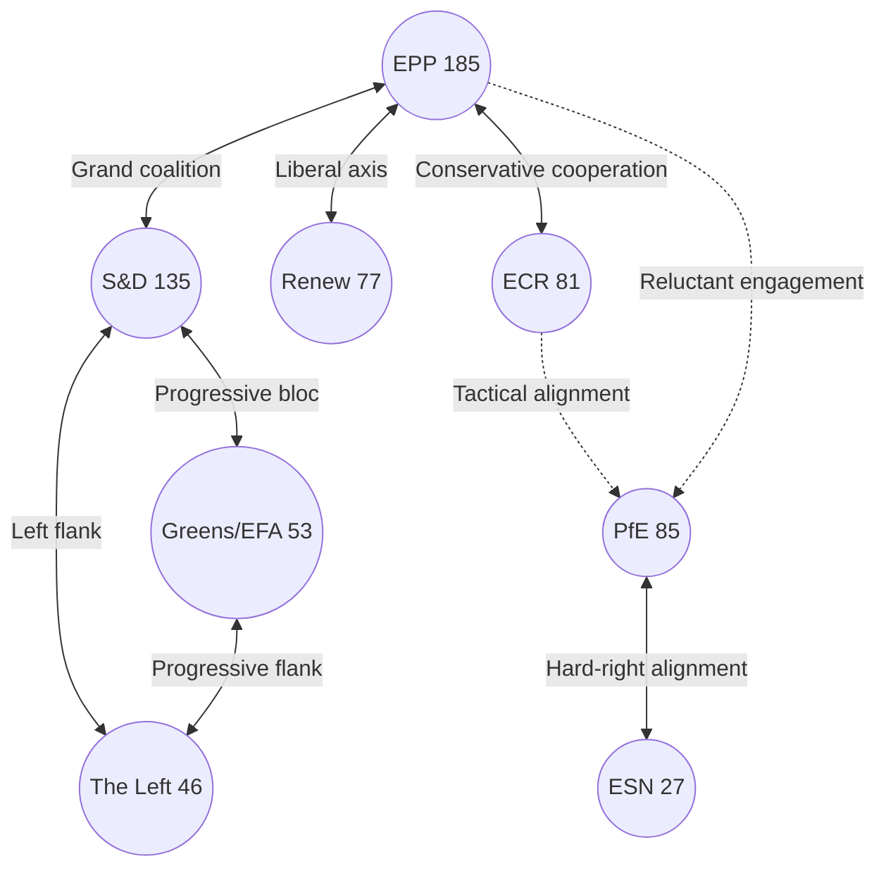

<!-- SPDX-FileCopyrightText: 2024-2026 Hack23 AB -->
<!-- SPDX-License-Identifier: Apache-2.0 -->

# Stakeholder Map — EP Committee Reports (2026-04-27)

**Article Type:** committee-reports  
**Period:** 2026-04-20 → 2026-04-27  
**Methodology:** Influence Matrix, Actor Network Analysis, Coalition Mapping  

---

## Actor Roster

The EP committee landscape involves three tiers of actors: (1) institutional principals (political groups, committee chairs, rapporteurs), (2) institutional counterparts (Council, Commission, ECB, CJEU), and (3) external stakeholders (industry, civil society, member state capitals).

---

## Tier 1: EP Political Groups as Committee Principals

### 1.1 EPP (185 seats, 25.7%) — Dominant Pivot

**Interest profile:** Market-oriented, pro-EU institutional reform, cautious on social regulation  
**Committee strength:** Chairs multiple key committees (ECON, AFCO likely EPP-chaired per seat share)  
**Key positions (from adopted texts):**
- *US tariffs:* Supports countermeasures but prefers negotiated resolution
- *AI copyright:* Split — pro-innovation wing vs. content industry protection
- *ECB oversight:* Institutionalist, supports ECB independence
- *EU-Mercosur:* Divided between market-access advocates (industry) and agricultural protectionists

**Coalition leverage:** EPP is the necessary but insufficient anchor of every majority. Without EPP, no legislation passes.  
**Influence score:** 🟢 9.5/10

### 1.2 S&D (135 seats, 18.8%) — Progressive Anchor

**Interest profile:** Workers' rights, social rights, democratic values, moderate Keynesianism  
**Key positions:**
- *US tariffs:* Supports strong countermeasures, protects industrial workers
- *AI copyright:* Strong creator protection, opposes broad TDM exemptions
- *Housing:* Central champion of TA-10-2026-0064, social housing investment
- *Subcontracting:* Authored or co-authored TA-10-2026-0050 on workers' rights
- *Human rights:* Led urgency resolutions on Uganda, Iran, Georgia

**Coalition leverage:** S&D + EPP = 320 seats (41 short of majority); S&D + EPP + Renew = 397 (reliable supermajority for centrist files).  
**Influence score:** 🟢 8.5/10

### 1.3 Renew (77 seats, 10.7%) — Liberal Pivot

**Interest profile:** Liberal, pro-market, pro-European federalism, individual rights  
**Key positions:**
- *AI copyright:* Split between innovation-first and rights-protection wings
- *EU-Mercosur:* Generally supportive of trade liberalisation
- *Electoral reform:* Strongly supportive (Spitzenkandidat formalisation)
- *ECB appointments:* Institutionalist support

**Coalition leverage:** Renew's vote can tip legislation left (with S&D, Greens) or right (with EPP, ECR). Effective veto power on trade files.  
**Influence score:** 🟡 7.5/10

### 1.4 ECR (81 seats, 11.3%) — Conservative Pivot

**Interest profile:** Eurosceptic conservative, national sovereignty, anti-regulatory  
**Key positions:**
- *US tariffs:* Supports countermeasures (national economic interest)
- *Subcontracting:* Against additional labour regulation
- *EU-Mercosur:* Mixed (agricultural protectionists among Polish, Italian members)
- *Human rights resolutions:* Selective support (Ukraine, Lithuania yes; Iran less consistent)

**Coalition leverage:** ECR can provide the right flank for EPP on trade-defence measures, enabling passage without S&D.  
**Influence score:** 🟡 6.5/10

### 1.5 PfE (85 seats, 11.8%) — Right-Populist Bloc

**Interest profile:** National sovereignty, anti-immigration, sceptical of climate regulation  
**Key positions:**
- *Safe third country* (TA-10-2026-0026): Strong support
- *ECB appointments:* Populist opposition to "technocratic" appointments
- *AI copyright:* Opposed to European regulatory frameworks
- *Environmental:* Opposed to carbon pricing and emissions mandates

**Coalition leverage:** PfE does not reliably join EPP-led coalitions but can provide swing votes on specific files.  
**Influence score:** 🟡 6.0/10

### 1.6 Greens/EFA (53 seats, 7.4%) — Green-Progressive Flank

**Interest profile:** Environmental protection, social rights, federalism, human rights  
**Key positions:**
- *EU-Mercosur/environmental:* Led CJEU opinion request (Article 218(11)) to block agreement pending climate review
- *AI copyright:* Strong creator protection
- *HDV emissions:* Opposed flexibility provisions, pushed for stricter targets
- *Human rights:* Consistently votes for urgency resolutions

**Coalition leverage:** Greens/EFA can complete left-wing majorities (S&D + Renew + Greens = 265, still short); critical for environmental files.  
**Influence score:** 🟡 6.0/10

### 1.7 The Left (46 seats, 6.4%) — Radical Progressive

**Interest profile:** Anti-market, social economy, labour rights, anti-militarist  
**Key positions:**
- *US tariffs:* Supports countermeasures, opposes corporate trade deals
- *Housing:* Strongest advocate for mandatory affordable housing
- *ECB:* Critical of ECB independence, would prefer democratic control
- *AI copyright:* Strongest worker and creator protections

**Influence score:** 🟡 5.5/10

---

## Tier 2: Institutional Counterparts

### 2.1 European Commission

**Role in committee work:** Proposes legislation; committees scrutinise Commission proposals  
**Relevant dossiers:**
- Commission negotiated EU-Mercosur; EP's CJEU opinion request challenges Commission authority
- AI Act delegated acts will shape how JURI/ITRE copyright framework is implemented
- Commission's Better Regulation agenda frames AFCO/JURI work on regulatory fitness

**Influence direction:** 🔄 Bidirectional — Commission proposes, EP amends/adopts  
**Current dynamic:** 🟡 Tension on trade (EU-Mercosur) and AI (TDM exemptions); alignment on ECB oversight

### 2.2 European Central Bank

**Role:** ECB subject to ECON committee scrutiny; annual report parliamentary hearing  
**Key actors:** ECB President Christine Lagarde (term ends), newly-appointed VP  
**Parliamentary relationship:**
- ECON's adoption of ECB Annual Report 2025 includes formal conclusions binding ECB to respond
- ECB appointments require EP consent (institutional veto)
- Monetary policy remains ECB-independent but framing shaped by EP discourse

**Influence score:** 🟢 8.0/10 (external actor with major policy leverage)

### 2.3 Council of the EU

**Role:** Co-legislator; committees adopt EP positions for inter-institutional negotiations  
**Current dynamic:** Council blocking transnational EP electoral lists; Council-EP trilogue on AI Act implementation; Council opposing mandatory housing targets

**Influence score:** 🟢 9.0/10 (co-legislator veto power)

### 2.4 Court of Justice (CJEU)

**Role:** Called upon for Treaty compatibility opinion on EU-Mercosur (TA-10-2026-0008)  
**Potential impact:** CJEU opinion could legally block or constrain EU-Mercosur implementation  
**Timeline:** Article 218(11) opinions typically 12–24 months  
**Influence score:** 🟡 7.0/10 (latent influence, opinion pending)

---

## Tier 3: External Stakeholders

### 3.1 European Employers (BusinessEurope, DigitalEurope)

**AI copyright:** DigitalEurope lobbied against creator-protection provisions; partially succeeded in narrowing TDM exemption scope  
**US tariffs:** BusinessEurope pressed for negotiated settlement over escalatory countermeasures  
**Influence score:** 🟡 6.5/10

### 3.2 Trade Unions (ETUC)

**Subcontracting/workers' rights:** ETUC directly fed into TA-10-2026-0050 text; strong alignment with S&D drafting  
**Housing:** ETUC supported housing resolution as a workers' living standards issue  
**Influence score:** 🟡 6.0/10

### 3.3 Creative Sector (CREA, Authors' Societies)

**AI copyright:** Copyright societies were the primary lobbying force behind TA-10-2026-0066 creator protection provisions  
**Political alignment:** S&D, Greens/EFA, The Left  
**Influence score:** 🟡 5.5/10

### 3.4 Environmental NGOs (WWF Europe, Greenpeace)

**EU-Mercosur:** Led the "environmental conditionality" campaign that contributed to CJEU opinion request  
**HDV emissions:** Greenpeace and Transport & Environment (T&E) pushed back against flexibility provisions  
**Influence score:** 🟡 5.5/10

### 3.5 US Administration (External Pressure Actor)

**US tariffs:** US tariff actions (Section 232, Section 301) triggered EP countermeasure legislation  
**Not a lobby actor but a structural external driver** shaping EP INTA work  
**Influence score:** 🟢 8.0/10 (external constraint, involuntary actor in EP dynamics)

---

## Alliance Matrix

---

## Power Brokers (Key Individuals, Inferred from Committee Roles)

| Committee | Role | Group Likely | Dossiers | Leverage |
|-----------|------|--------------|---------|---------|
| ECON Chair | Committee chair | EPP | ECB oversight, financial stability | High |
| INTA Rapporteur (US tariffs) | Rapporteur | EPP or ECR | Countermeasure framework | High |
| JURI Rapporteur (AI copyright) | Rapporteur | Renew or S&D | AI-IP framework | High |
| AFCO Chair | Committee chair | EPP or S&D | Electoral reform | Medium |
| ENVI/TRAN Rapporteur (HDV) | Rapporteur | Greens or EPP | Emissions flexibility | Medium |

*Note: Specific rapporteur names unavailable from EP API data as of 2026-04-27; inferred from typical group committee seat allocations.*

---

## Information Flow Network

**Upstream (from external actors to committees):**
- BusinessEurope → INTA (trade positions)
- ETUC → EMPL (labour rights)
- Creative sector → JURI (copyright)
- ECB → ECON (monetary policy data)
- US Administration (tariff actions) → INTA (reactive legislation)

**Downstream (from committees to external actors):**
- ECON → ECB (formal conclusions, appointment consent)
- INTA → Commission (mandate signals for trade negotiations)
- LIBE → Council (rule of law monitoring signals)
- AFCO → Member States (electoral law reform pressure)

---

## Stakeholder Perspective Analysis

### From ECON Committee Perspective

The committee's ECB oversight package demonstrates institutionalized committee strength. ECON successfully exercised consent rights on two ECB appointments and adopted a comprehensive annual report with formal conclusions. The financial stability framework (TA-10-2026-0004) shows ECON's pro-active role during elevated economic uncertainty — not merely reactive oversight but forward-looking risk signaling to the Commission and ECB. **Perspective confidence: 🟢 High** (direct evidence from adopted texts).

### From INTA Committee Perspective

INTA faces contradictory pressures: export-oriented EPP members (Germany, Netherlands) seeking US negotiation; agricultural-protectionist ECR/S&D members resisting EU-Mercosur; industrial workers (S&D) demanding countermeasure strength. The committee's output — a safeguard clause AND a CJEU opinion request AND tariff countermeasures — reflects a multi-front strategy accommodating these contradictions simultaneously. **Perspective confidence: 🟡 Medium** (inferred from adopted texts, individual MEP positions unknown).

### From JURI/ITRE Perspective (AI copyright)

The joint committee approach on AI copyright reflects a deliberate rapporteur strategy to bridge two traditionally separate policy communities: digital/tech (ITRE) and intellectual property (JURI). The resulting text represents a compromise between innovation facilitation and creator protection — more protective than US approaches, less restrictive than some national copyright frameworks. **Perspective confidence: 🟡 Medium** (text adopted; internal dynamics inferred).

---

*Stakeholder Map — EP Committee Reports 2026-04-27 | Influence Matrix, Coalition Analysis*
