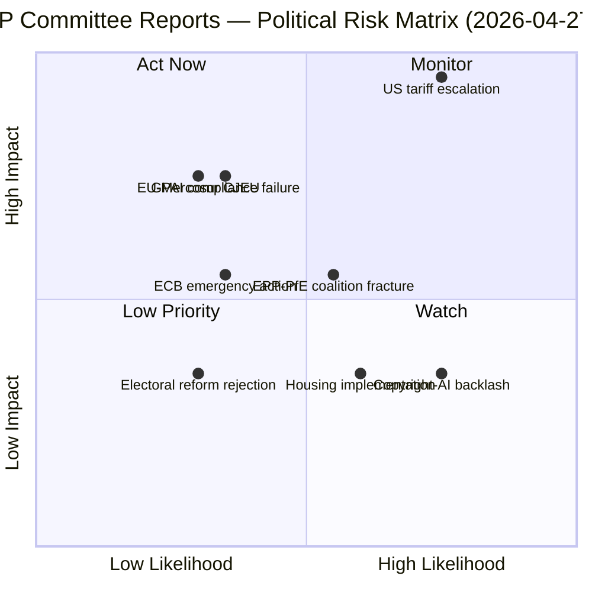

<!-- SPDX-FileCopyrightText: 2024-2026 Hack23 AB -->
<!-- SPDX-License-Identifier: Apache-2.0 -->

# Risk Matrix — EP Committee Reports (2026-04-27)

**Article Type:** committee-reports  
**Period:** 2026-04-20 → 2026-04-27  
**Methodology:** 5×5 political risk matrix, WEP probability bands  

---

## Risk Matrix (5×5)

| Risk Event | Likelihood | Impact | Risk Score | WEP Band | Priority |
|-----------|-----------|--------|-----------|----------|----------|
| US tariff escalation forces emergency EP response | 4 | 5 | 20 | Likely | 🔴 CRITICAL |
| AI Act GPAI compliance failure / market exit | 2 | 4 | 8 | Unlikely | 🟡 MEDIUM |
| EU-Mercosur CJEU opinion: treaty incompatibility | 2 | 4 | 8 | Unlikely | 🟡 MEDIUM |
| ECB emergency rate action destabilizes ECON calendar | 2 | 3 | 6 | Unlikely | 🟡 MEDIUM |
| Coalition fracture EPP-PfE on trade | 3 | 3 | 9 | Roughly Even | 🟡 MEDIUM |
| Anti-corruption legislation blocked by NI/PfE | 3 | 3 | 9 | Roughly Even | 🟡 MEDIUM |
| Media freedom crisis triggers LIBE emergency | 3 | 3 | 9 | Roughly Even | 🟡 MEDIUM |
| Housing resolution implementation failure | 3 | 2 | 6 | Likely | 🟢 LOW |
| Copyright-AI framework triggers industry backlash | 4 | 2 | 8 | Likely | 🟡 MEDIUM |
| Electoral reform (TA-10-2026-0006) Council rejection | 2 | 2 | 4 | Unlikely | 🟢 LOW |

**Likelihood scale:** 1=Very Unlikely, 2=Unlikely, 3=Roughly Even, 4=Likely, 5=Almost Certain  
**Impact scale:** 1=Negligible, 2=Minor, 3=Moderate, 4=High, 5=Catastrophic

---

## Risk Quadrant (Mermaid)

---

## Top 3 Priority Risks — Detailed Assessment

### Risk 1: US Tariff Escalation — CRITICAL (Score: 20)

**WEP:** 🔴 Likely (55–75%)  
**Political mechanism:** US administration expands tariff scope from steel/aluminium to automotive and pharmaceutical sectors. EP INTA forced into emergency session to authorize Article 207 TFEU countermeasures. The EPP faces the most acute dilemma — German and French automotive MEPs push for negotiated de-escalation while smaller economy MEPs and the trade hawks support firm countermeasures.

**Mitigation pathway:**
1. TA-10-2026-0096 (US tariff countermeasures, adopted 2026-03-26) provides the legal authorization framework
2. Commission Article 207 TFEU procedure can activate swiftly (days not weeks)
3. G7 diplomatic track provides pressure relief valve

**Residual risk:** Even with mitigation, a prolonged US-EU trade war would materially reduce EU GDP growth and force BUDG committee into emergency fiscal discussions.

### Risk 2: EPP-PfE Coalition Fracture on Trade (Score: 9)

**WEP:** 🟡 Roughly Even (35–55%)  
**Political mechanism:** EPP-PfE cooperation, which enabled the EP's current legislative majority on several key votes, fractures on trade policy. PfE's protectionist instincts (particularly on agricultural trade with Mercosur) clash with EPP's more liberal trade orientation. ECR's opportunistic support fills gaps but creates unstable vote-by-vote coalitions.

**Impact on committee work:**
- INTA reports become harder to pass; EP positions in trade negotiations are weakened
- Commission faces reduced EP support for trade deal ratifications
- AGRI committee gains leverage as agricultural trade becomes the fracture line

### Risk 3: Anti-Corruption Legislation Blocked (Score: 9)

**WEP:** 🟡 Roughly Even (40–55%)  
**Political mechanism:** TA-10-2026-0094 (anti-corruption) passed the EP, but Council faces resistance from member states with weak rule-of-law track records. NI and PfE MEPs delay or dilute implementing legislation. The anti-corruption framework becomes another rule-of-law battleground alongside Article 7 TEU proceedings.

---

*Risk Matrix — EP Committee Reports 2026-04-27 | 5×5 risk scoring, WEP bands, Mermaid quadrant*
