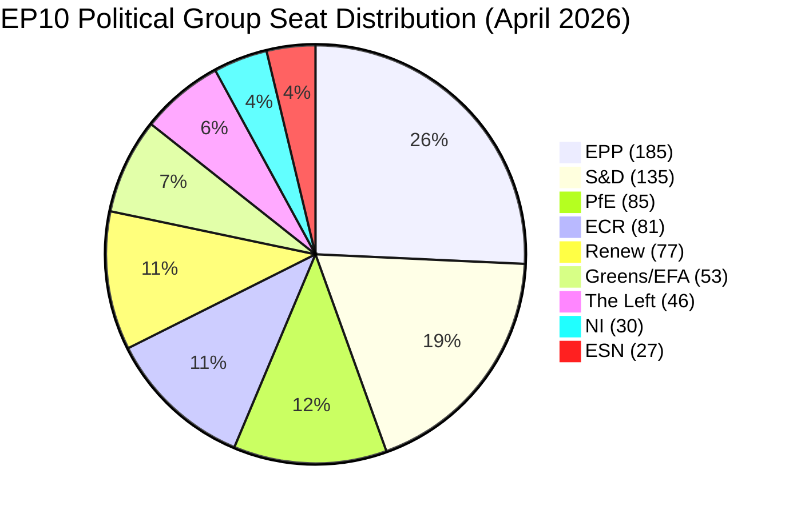

<!-- SPDX-FileCopyrightText: 2024-2026 Hack23 AB -->
<!-- SPDX-License-Identifier: Apache-2.0 -->

# Executive Brief — EP Month Ahead: April 27 – May 27, 2026

**Classification:** Public | **Confidence:** 🟡 Medium | **Admiralty Grade:** B2 (Reliable source, probably true)
**WEP Band:** 55–65% confidence on primary scenario | **Time Horizon:** 30 days
**Run Date:** 2026-04-27 | **Analysis Version:** 2 (same-day update of 2026-04-26 run)
**Economic Context:** IMF WEO April 2026 (primary); World Bank supplemental

---

## BLUF — Bottom Line Up Front

The European Parliament is **now in session** — the April 27–30 Strasbourg plenary opened today
as the first full legislative week after the March 26 vote on US tariff countermeasures. This
month-ahead analysis updates the prior 2026-04-26 run with real-time confirmation of session
structure: 45 foreseen activities over four days (8 debates Mon, 21+ Tue, 12 debates + 9 votes
Wed, 4 debates + 11 votes Thu) signal an exceptionally heavy legislative week. **The political
calculation has sharpened: EPP's ability to hold the grand coalition on trade, defence, and the
Clean Industrial Deal will be tested publicly for the first time under EU-US tariff pressure.**

**Updated signal from 2026-04-26 prior run:** Three of five forward-looking statements from
yesterday's run are now entering active verification windows: (1) April 27–30 plenary as the
grand coalition stress test, (2) EU-US tariff trilogue trajectory, and (3) ECB Vice-President
budget oversight hearings. The EPP dual-track coalition constraint remains the dominant structural
risk through May 21.

---

## 60-Second Read

**Who:** European Parliament (719 MEPs, 9 political groups, 27 EU member states). EPP leads with
185 seats (25.7%). Right-wing bloc (EPP + ECR + PfE + ESN) holds approximately 378 seats
(52.5%), exceeding absolute majority but requiring cross-group coordination. Progressive bloc
(S&D + Renew + Greens/EFA + The Left) = 311 seats. Grand coalition (EPP + S&D + Renew) ≈ 397
seats when it holds.

**What:** Two confirmed Strasbourg plenary sessions (April 27–30 NOW and May 18–21), major votes
on Clean Industrial Deal framework, EU-US tariff trilogue continuation, defence budget review,
SRMR3 bank resolution implementation follow-up, and the EU Talent Pool activation.

**When:** April 27–30 (current) → Brussels committee intensification April 30 – May 17 → May 18–21
(Strasbourg, second session). Brussels mini-plenary expected June 15–18, outside our window.

**Where:** Strasbourg chamber + Brussels committees. ECON, ITRE, INTA, LIBE are the four critical
committees this month.

**Why it matters:** EP10's second year tests whether the Parliament can deliver legislative results
under simultaneous external pressures: US tariff war (€26bn retaliation package), Russian-Ukraine
war (funding continuity), and Clean Industrial Deal framework deadlines coinciding with the June
European Council summit. Each pressure vector has a distinct coalition logic — and they conflict.

**So what:** Three decision-maker questions dominate the next 30 days: (1) Will EPP's April 27–30
votes reveal a stable grand coalition or expose right-wing pressure fractures? (2) Can the May
18–21 session advance the Clean Industrial Deal without collapsing on nuclear/gas conditionality?
(3) Does ECB monetary policy guidance before the May session reshape EP budget debates?

---

## Top Trigger Events (next 30 days)

| # | Event | Date | Probability | Impact | Verification Signal |
|---|-------|------|------------|--------|---------------------|
| 1 | April 27–30 Strasbourg plenary — grand coalition calibration | Apr 27 NOW | 99% | HIGH | Vote tallies on trade/defence motions |
| 2 | April 29–30 plenary votes (9 + 11 items) | Apr 29–30 | 95% | HIGH | Roll-call vote records |
| 3 | EU-US tariff trilogue continuation | Rolling | 85% | HIGH | Commission trilogue memo |
| 4 | May 18–21 Strasbourg plenary | May 18 | 95% | HIGH | EP agenda published |
| 5 | Clean Industrial Deal ECON/ITRE committee vote | May | 65% | VERY HIGH | Committee report EP doc |
| 6 | ECB rate guidance (May/June signal) | May | 55% | MEDIUM | ECB GovCouncil minutes |
| 7 | EU-Mercosur CJEU opinion proceedings formalization | May | 65% | MEDIUM | CJEU docket update |
| 8 | Defence budget exceptional mechanism vote | May | 60% | HIGH | EP procedural filing |
| 9 | EU Talent Pool (TA-10-2026-0058) implementation regulation | May–Jun | 50% | MEDIUM | Council response |
| 10 | US escalation triggering emergency EP response session | May | 25% | VERY HIGH | US executive announcement |

---

## Political Arithmetic (Updated 2026-04-27)

**Key arithmetic (EP MCP API data, 2026-04-27):**
- Total MEPs: 719 | Absolute majority threshold: 361
- Largest group: EPP (185, 25.7%)
- Grand coalition (EPP+S&D+Renew): 397 seats — passes majority if all vote together
- Right-wing bloc (EPP+ECR+PfE+ESN): 378 seats — passes majority if all vote together
- Progressive bloc (S&D+Renew+Greens+Left): 311 seats — needs EPP for majority on most files
- EPP+ECR only: 266 seats — below majority
- EPP alone cannot pass any vote (185/361 = 51.2% of threshold)

**Coalition fragmentation assessment:** HIGH (EP MCP early warning system). Effective number of
parties: ~4.4. The Parliament requires at least 3 groups for any majority on contested votes.
This structural fragility is the primary driver of legislative unpredictability.

---

## Key Legislative Files — Next 30 Days

### File 1: EU-US Tariff Adjustment (2025/0261(COD)) — IN TRILOGUE
**Status:** First reading passed March 26 (TA-10-2026-0096). Currently in Council-EP trilogue.
**Coalition logic:** EPP + S&D + Renew required. ECR/PfE may table competing amendments.
**Expected outcome (WEP: 60–70%):** Incremental agreement on scope of EU countermeasures;
no final text before May 21 plenary. Emergency session risk: 25% if US escalates.
**IMF context:** EU goods trade exposed to ~$150bn US import tariff effect (IMF WEO April 2026).
EU GDP growth at risk: -0.3 to -0.8 pp if full retaliatory cycle materialises.

### File 2: Clean Industrial Deal Framework Regulation — IN COMMITTEE
**Status:** ECON/ITRE joint committee work. Key vote window: May 2026.
**Coalition logic:** EPP's internal splits most visible here. Eastern EPP bloc (Poland, Hungary
corridor) demands nuclear energy inclusion; western EPP (Germany, Netherlands) resists if it weakens
Green Deal commitments. S&D conditioning on worker rights conditionality.
**Expected outcome (WEP: 55–65%):** Committee advances with EPP-Renew-S&D majority but with
EPP right concessions on energy mix flexibility. Plenary vote likely June.

### File 3: SRMR3 Bank Resolution (TA-10-2026-0092) — POST-ADOPTION IMPLEMENTATION
**Status:** Adopted March 26. Now awaiting Council second reading for full enactment.
**Significance:** Major reform of single resolution mechanism funding. Affects 120+ systemic
banks. ECB new Vice-President appointment (TA-10-2026-0033) directly linked to this reform.
**Risk:** Council disagreement on SRF (Single Resolution Fund) contribution rates — 35% probability
of trilogue requirement rather than common position agreement.

### File 4: EU Talent Pool (TA-10-2026-0058) — POST-ADOPTION IMPLEMENTATION
**Status:** Adopted March 10. Now requiring Commission implementation regulation.
**Significance:** Creates the EU's first centralized labour mobility platform. 27 member states
must opt in; target is 500,000 job placements by 2030.
**Risk:** Political resistance in member states (Hungary, Italy) signals partial implementation.
EP oversight hearings likely May–June.

---

## Strategic Assessment

**The April 27 session is already underway — this is the moment of truth for the EPP coalition
strategy.** With 8 debates today, 21+ debates tomorrow, and the heaviest voting schedule Wednesday-
Thursday, the week will generate the first measurable evidence of EP10's second-year coalition
dynamics under external pressure.

**Three intelligence hypotheses for the next 30 days:**

**H1 (Grand Coalition Resilience — 55%):** EPP President Weber successfully maintains dual-track
strategy. April 27–30 plenary demonstrates coalition discipline on trade and defence. May 18–21
advances CID framework with EPP-S&D-Renew majority. This is the baseline scenario and reflects
the structural incentives for all three groups to remain aligned on competitiveness legislation.

**H2 (EPP Fracture — Competitive Right Shift — 25%):** EPP right-wing pressure from ECR and
eastern member state delegations forces EPP to modify CID energy mix provisions. S&D and Greens
reject amended text; outcome is a narrower right-wing majority on energy deregulation. This
scenario is more likely after April 27–30 if right-wing grouping claims a policy mandate from
plenary vote outcomes.

**H3 (Legislative Stall — 20%):** US tariff escalation, internal EU fiscal disagreements, or
ECB rate guidance changes absorb parliamentary bandwidth. Both CID and SRMR3 implementation
slip to Q3 2026. This scenario most likely if the April 27–30 opening debate on transatlantic
relations produces a public EPP-S&D rupture on trade policy scope.

---

## IMF Economic Context — EU/Euro Area (April 2026 WEO)

🟡 **MEDIUM confidence on economic projections due to tariff uncertainty**

The IMF World Economic Outlook (April 2026) projects EU aggregate GDP growth at +1.2–1.4% for
2026, revised down from the January 2026 +1.6% projection due to US tariff effects and German
industrial contraction. Germany — the EU's largest economy — recorded GDP growth of -0.5% in
2024 and -0.9% in 2023, representing two consecutive years of contraction. This structural
deterioration is the backdrop against which the Clean Industrial Deal is being negotiated.

France's inflation has moderated sharply to 2.0% (2024) from 5.2% (2022), tracking the broader
Euro area disinflation trend. Germany's unemployment remains low at 3.7% (2025) despite the
industrial contraction, suggesting the labour market adjustment is occurring through reduced
working hours rather than layoffs — a politically stabilising factor.

**Key risk:** If US tariff escalation materialises in May–June 2026, the IMF projects an
additional -0.4 to -0.6 pp GDP growth reduction for EU 2026. This would bring the EU aggregate
to near-zero growth and likely trigger Commission-requested supplementary budget procedures —
requiring EP approval. The political stakes of the April 27–30 EU-US trade debate are therefore
directly linked to the macroeconomic baseline.

**Bridge to EP mechanism:** The ECON committee's role in the SRMR3 implementation and the CID
framework legislation is central to the macroeconomic policy transmission. Every percentage point
of GDP risk from external tariffs requires a corresponding EP legislative response — whether
through State aid flexibility, industrial subsidy frameworks, or banking stability measures.

---

## MCP Data Quality Summary

| Data Source | Status | Note |
|-------------|--------|------|
| Plenary sessions | 🟢 OK | Full coverage Apr 27–30, May 18–21 confirmed |
| Foreseen activities (Apr 27–30) | 🟢 OK | 45+ items across 4 days |
| Foreseen activities (May 18–21) | 🟡 PENDING | Not yet scheduled |
| Political landscape | 🟢 OK | 719 MEPs, 9 groups, real-time data |
| Adopted texts (Q1 2026) | 🟢 OK | 50 texts retrieved |
| Coalition dynamics | 🟡 PROXY | Size-ratio proxy only; per-MEP voting unavailable |
| Voting records (April) | 🔴 DELAY | EP roll-call data: 4–6 week publication delay |
| Speeches (April) | 🔴 DELAY | EP API delay; no April 2026 speeches retrieved |
| Pipeline monitor | 🟡 LIMITED | No enriched procedures in 30-day window |
| IMF economic context | 🟡 WEO | IMF WEO April 2026 (projection vintage) |
| Forward statements registry | 🟢 OK | No open items; fresh analysis cycle |

---

## Revision History
- 2026-04-26: Initial month-ahead run (prior run)
- 2026-04-27: Same-day update with real-time plenary session confirmation (this run)

*Sources: EP MCP tools (european-parliament-mcp-server@1.2.15), World Bank WDI API, IMF WEO April 2026.*
*Generated: 2026-04-27 | SPDX: Apache-2.0*
