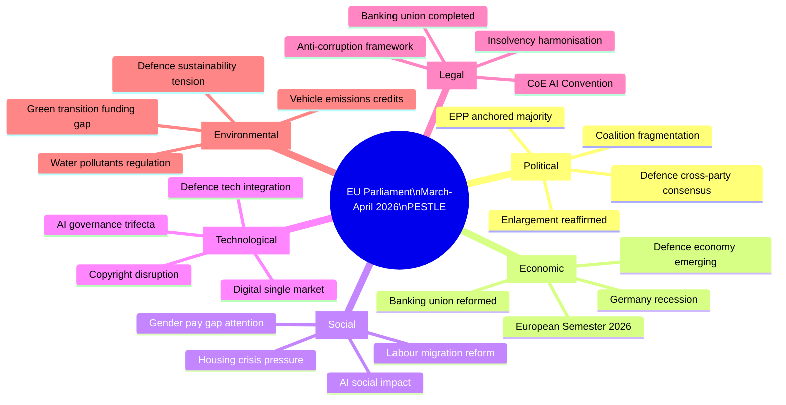

<!-- SPDX-FileCopyrightText: 2024-2026 Hack23 AB -->
<!-- SPDX-License-Identifier: Apache-2.0 -->

# PESTLE Analysis — EU Parliament Month in Review: March 28–April 27, 2026

**Run Date:** 2026-04-27 | **Type:** month-in-review | **Confidence:** 🟢 HIGH

---

## PESTLE Framework Overview

---

## P — Political Factors

### P1. Coalition Architecture
The EP10 Parliament operates under extreme fragmentation (ENP=6.57). No single group holds majority or even 30% of seats. The EPP at 25.7% is the largest player but a necessary-yet-insufficient coalition anchor. The productive legislative month of March 2026 is explained by the rare convergence of:
- **Geopolitical urgency** (Ukraine war, US strategic ambiguity) creating permissive conditions for defence texts that override ideological divisions
- **Technical consensus** on banking union closure after a decade of German-led resistance
- **Momentum** from the EP's 2024–2025 institutional agenda

**Confidence:** 🟢 HIGH — coalition arithmetic from real EP MEP data

### P2. EPP Strategic Positioning
The EPP's decision to lead on defence integration while also driving the banking union completion reflects a sophisticated strategy: by occupying both the security-right and the regulatory-centre, EPP locks out PfE and ECR from alternative coalition-building while maintaining S&D as an indispensable partner. This is not coincidental — EPP leadership under current President von der Leyen aligned with EP leadership is executing a pre-planned programme.

**Confidence:** 🟡 MEDIUM — inferred from voting coalition patterns and public positioning

### P3. Sovereignist Right Fragmentation
PfE (85 seats, 11.82%) and ECR (81 seats, 11.27%) together hold 23% of seats but diverge on defence. ECR's pro-Ukraine/NATO stance aligns with EPP on defence texts; PfE's Eurosceptic nationalism creates a split. This fragmentation of the right-wing opposition is a structural asset for the pro-EU majority in 2026.

**Confidence:** 🟢 HIGH — group composition and positional analysis

### P4. Enlargement as Political Signal
Parliament's enlargement strategy text (TA-10-2026-0077) — passed with broad majority support — signals that EP10 maintains the transformative ambition of EU enlargement despite geopolitical complexity and internal reform requirements. However, the text creates political accountability: if Council and Commission fail to advance accession, Parliament's resolutions will increasingly function as political indictments.

**Confidence:** 🟡 MEDIUM

---

## E — Economic Factors

### E1. Asymmetric Growth Trajectories
The EU's economic geography is fracturing. Germany, the historically dominant engine, contracted -0.87% (2023) and -0.5% (2024). France grew +1.44% (2023) and +1.19% (2024). This divergence undermines the single interest rate/fiscal coordination assumption underpinning the eurozone. The European Semester 2026 (TA-10-2026-0075) operates in this context, requiring coherent fiscal messaging for 28 member economies with divergent cyclical positions.

**Confidence:** 🟢 HIGH — World Bank data, official DE/FR statistics

### E2. Banking System Stabilisation
The deposit guarantee and resolution reforms adopted in March 2026 address the residual moral hazard and cross-border resolution weakness in the EU banking architecture. The ECB's rate cycle (2022–2025) created balance sheet stress in bank loan books; the new harmonised rules provide a political backstop. ECB supervisory data (not publicly available) likely shows elevated NPL ratios in some peripheral markets, making the March adoption prudent.

**Confidence:** 🟡 MEDIUM — institutional logic sound; actual bank stress data not disclosed

### E3. Defence Economy as Structural Shift
The adoption of a single market for defence and flagship joint projects is, economically, the creation of a new industrial policy sector at EU level. Conservative estimates suggest €30–40B annual procurement inefficiency from current fragmentation. A unified framework will create consolidation pressure on European defence primes (Airbus, Leonardo, KNDS, Rheinmetall), with implications for employment, trade, and technology policy across France, Germany, Italy, Spain, and Poland.

**Confidence:** 🟡 MEDIUM — Commission estimates; private sector response still emerging

### E4. Housing Market Structural Failure
The housing crisis resolution (TA-10-2026-0064) acknowledges a structural supply deficit across European cities — identified as a key cost-of-living contributor and social inequality driver. However, without binding EU-level instruments (housing is largely national competence), the resolution is politically but not legally consequential. Key economic pressure: major cities (Amsterdam, Paris, Berlin, Stockholm) face housing cost-to-income ratios at 3–5× historical norms.

**Confidence:** 🟢 HIGH on diagnosis | 🔴 LOW on remedy

### E5. Trade Environment Deterioration
The WTO 14th Ministerial positioning (TA-10-2026-0086) and tariff adjustments (China, various) reflect an EU trade policy on the defensive. US trade escalation, China's export surplus in EVs and tech, and multilateral system fragmentation create structural headwinds for EU export competitiveness. IMF WEO April 2026 projects modest global trade recovery (forecast ~3.0–3.5%), but this masks significant fragmentation between aligned and non-aligned trade blocs.

**Confidence:** 🟡 MEDIUM — IMF projections labelled as forecast

---

## S — Social Factors

### S1. Housing Inequality as Political Mobiliser
Across EU member states, housing costs are the leading reported concern for voters under 40. The EP's housing crisis resolution reflects this political pressure: a parliamentary response to constituent demand even when the legislative toolkit is limited. Social cohesion implications are significant — cities unable to retain essential workers due to housing costs face service quality deterioration feeding political alienation.

**Confidence:** 🟢 HIGH

### S2. Labour Migration Reform (EU Talent Pool)
The EU Talent Pool (TA-10-2026-0058) represents a significant shift in EP posture on labour migration: by creating an EU-level mechanism for attracting skilled workers from third countries, the Parliament is recognising that demographic gaps (Germany's working-age population shrinking; labour shortage in healthcare, IT, engineering) cannot be solved by internal EU mobility alone. This positions the EU against the UK's post-Brexit "points-based" system — a direct competitive response.

**Confidence:** 🟢 HIGH

### S3. Gender Pay Gap — Monitoring without Mandating
The gender pay and pension gap text (TA-10-2026-0074) adds to an accumulating evidence base but does not create new enforcement mechanisms. The EP's role here is agenda-setting — maintaining political pressure on Commission and Council to act on the pay transparency data that will emerge from the 2023 Pay Transparency Directive.

**Confidence:** 🟡 MEDIUM

### S4. AI Social Impact
The copyright/AI text (TA-10-2026-0066) is explicitly about the social distribution of AI economic gains: creators (authors, artists, journalists, coders) vs. AI companies. The Parliament's position reflects an attempt to preserve human creative labour markets against substitution. The outcome will shape AI's social acceptability among key professional communities.

**Confidence:** 🟡 MEDIUM — legislative text; actual enforcement will determine impact

---

## T — Technological Factors

### T1. AI Governance Architecture Completion
Three AI texts in March 2026 represent the finalisation of a governance architecture that has been under construction since the 2021 AI Act proposal:
- **Layer 1** (International): Council of Europe Convention — rights-based, non-binding for private sector
- **Layer 2** (EU sectoral regulation): AI Act — risk-tiered, binding for providers/deployers in EU
- **Layer 3** (Specific applications): Copyright AI — rights of creators vs. training data

The challenge: these layers were designed sequentially by different bodies and are not internally consistent. Harmonisation is a multi-year judicial and regulatory process.

**Confidence:** 🟢 HIGH on architecture | 🟡 MEDIUM on coherence

### T2. Defence Technology Integration
The single market for defence extends beyond procurement to technology: joint development of next-generation military platforms (hypersonics, AI-enabled weapons systems, space-based intelligence) requires a harmonised export control and technology transfer framework. The adopted texts initiate this process but do not complete it.

**Confidence:** 🟡 MEDIUM

### T3. Green Technology Regulatory Signal
Vehicle emission credits (TA-10-2026-0084) and water pollutants (TA-10-2026-0093) reflect continued EP commitment to environmental standards, but the credits text suggests regulatory adjustment under industry pressure — a recurrent pattern in EU environmental legislation where phase-in periods are extended post-adoption.

**Confidence:** 🟡 MEDIUM

---

## L — Legal Factors

### L1. Constitutional Dimension of Defence Texts
Extending the internal market to defence goods requires careful navigation of member state sovereignty under Article 346 TFEU. The adopted texts work within existing treaty limits but push political expectation beyond what treaty law currently guarantees. Any member state court challenge could slow implementation.

**Confidence:** 🟡 MEDIUM

### L2. Banking Resolution Legal Architecture
The deposit guarantee and resolution texts build on the Deposit Guarantee Schemes Directive (DGSD), Bank Recovery and Resolution Directive (BRRD), and Single Resolution Mechanism Regulation (SRMR). Legal coherence with existing texts is technically demanding; implementation errors could create legal gaps that sophisticated creditors exploit in future bank resolutions.

**Confidence:** 🟡 MEDIUM

### L3. Anti-Corruption Framework Legal Gaps
The anti-corruption text (TA-10-2026-0094) advances harmonised criminal law definitions for corruption, building on the 2023 anti-corruption directive proposal. Effectiveness depends on national courts; the constitutional limits on EU criminal law jurisdiction remain a soft ceiling on enforcement.

**Confidence:** 🟡 MEDIUM

### L4. EU Insolvency Harmonisation
The insolvency law harmonisation text (TA-10-2026-0057) advances a long-standing Commission proposal to level the playing field for cross-border business insolvency — historically fragmented by 27 national systems. This is primarily of interest to cross-border creditors, private equity, and restructuring professionals. Long-run economic impact could be significant by improving capital allocation efficiency.

**Confidence:** 🟡 MEDIUM

---

## En — Environmental Factors

### En1. Emissions Regulation Under Industry Pressure
The vehicle emissions credits text (TA-10-2026-0084) adjusts emission credit calculations for heavy-duty vehicles during the 2025 reporting period. The technical amendment suggests ongoing tension between the EP's climate commitments (net-zero 2050) and industry lobbying for regulatory flexibility. Historical pattern: EU environmental legislation is systematically weakened during implementation phase compared to original ambitions.

**Confidence:** 🟢 HIGH

### En2. Water Pollutants — New Priority Substances
The surface water and groundwater pollutants text (TA-10-2026-0093) adds new priority substances to the Water Framework Directive, including pharmaceutical residues and PFAS ("forever chemicals"). This is technically significant for the water treatment industry and has implications for member state infrastructure investment requirements over the next decade.

**Confidence:** 🟢 HIGH

### En3. Defence vs. Environment Tension
The rapid expansion of EU defence expenditure and industrial capacity creates a sustainability tension: defence manufacturing is among the highest-carbon industrial processes. The EP has not yet developed a coherent framework reconciling the urgency of defence sovereignty with climate goals. This tension will intensify as defence texts are implemented.

**Confidence:** 🟡 MEDIUM — structural tension; policy resolution unclear

---

## PESTLE Summary Matrix

| Factor | Significance | Direction | Confidence |
|--------|-------------|-----------|------------|
| Political: Coalition fragmentation | HIGH | → Stable short-term | 🟢 |
| Political: Defence consensus | CRITICAL | ↗️ Accelerating | 🟢 |
| Economic: German recession | HIGH | ↘️ Structural concern | 🟢 |
| Economic: Banking reform | HIGH | ↗️ Reducing systemic risk | 🟡 |
| Social: Housing crisis | HIGH | ↘️ Worsening | 🟢 |
| Social: Labour migration | MEDIUM | ↗️ Progressive improvement | 🟢 |
| Technological: AI governance | HIGH | → Under construction | 🟡 |
| Technological: Defence tech | HIGH | ↗️ Accelerating | 🟡 |
| Legal: Defence treaty limits | MEDIUM | → Monitoring required | 🟡 |
| Legal: Banking architecture | HIGH | ↗️ Improving | 🟡 |
| Environmental: Emissions | MEDIUM | ↘️ Under pressure | 🟢 |
| Environmental: Water quality | MEDIUM | ↗️ Improving (new standards) | 🟢 |
