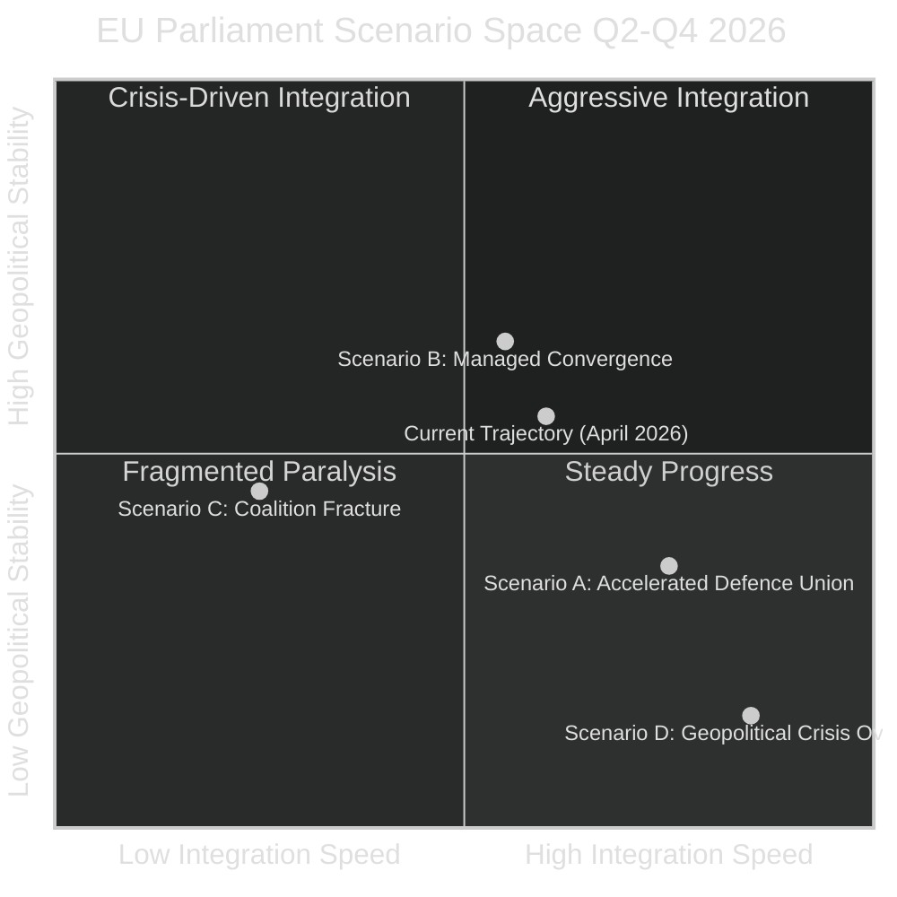

<!-- SPDX-FileCopyrightText: 2024-2026 Hack23 AB -->
<!-- SPDX-License-Identifier: Apache-2.0 -->

# Scenario Forecast — EU Parliament Month in Review: March 28–April 27, 2026

**Run Date:** 2026-04-27 | **Type:** month-in-review | **Confidence:** 🟡 MEDIUM

---

## Scenario Framework

---

## Scenario A — Accelerated Defence Integration (Probability: 25%)

**Trigger Conditions:**
- US withdrawal from NATO active commitments materialises (Trump 2.0 strategic ambiguity becomes formal policy revision)
- Russian military offensive advances beyond current contact line
- Franco-German defence industrial agreement concluded H1 2026

**Scenario Narrative:**
The March 2026 defence texts prove to be the enabling legislation for a rapid cascade of implementing measures. Within 12 months: a European Armaments Agency with real procurement authority, initial joint weapons platform contracts (next-gen fighter, armoured vehicle), and a separate EU defence budget line distinct from cohesion funds. The EPP-S&D-ECR defence coalition holds and expands. PfE fractures under Orbán/Le Pen tension.

**Legislative Implications:**
- Commission's Defence White Paper legislative package accelerated from 2027 to late 2026
- European Defence Fund doubled in scope via budget revision
- EP committee on Defence (SEDE) gains enhanced formal powers

**Economic Impact:**
- Defence spending increase of 0.3–0.5% GDP across major member states
- German industrial reindustrialisation narrative emerges around defence primes
- Rheinmetall/KNDS/Leonardo stock surge; Airbus Military division bolstered

**Confidence in Triggers:** 🔴 LOW — US policy still ambiguous; Franco-German industrial agreement historically slow

---

## Scenario B — Managed Convergence (Probability: 45%, BASE CASE)

**Trigger Conditions:**
- Current geopolitical environment remains broadly stable
- ECB rate normalisation continues as planned
- EPP+S&D+Renew coalition holds through spring 2026 institutional calendar
- Commission's spring legislative package (housing, AI implementing acts) arrives broadly on schedule

**Scenario Narrative:**
The March 2026 legislative harvest is implemented through Commission delegated acts and national transposition at a steady, unspectacular pace. Defence texts create the legal framework; actual procurement consolidation takes 3–5 years. Banking union reforms are transposed by Q4 2027. AI governance enters implementation with expected confusion between regulatory layers. Housing crisis resolution generates the Commission's Affordable Housing Initiative in May–June 2026 but stops short of binding EU-level instruments.

**Legislative Outlook Q2–Q3 2026:**
- AI Act implementing acts (Commission): Q2 2026
- Affordable Housing Initiative (Commission): May/June 2026
- Defence White Paper follow-up legislative proposals: H2 2026
- WTO Ministerial Conference position validation: Q2 2026
- EP elections preliminary analysis for 2029: begins background work H2 2026

**Economic Baseline:**
- EU GDP growth 1.2–1.4% (2026, IMF forecast)
- Germany begins hesitant recovery from -0.5% 2024 base
- ECB policy rate continues cautious reduction path
- Banking union implementation reduces tail risk premium on European banks

**Probability Assessment:** 🟡 MEDIUM — most plausible near-term trajectory; subject to geopolitical shocks

---

## Scenario C — Coalition Fracture and Legislative Paralysis (Probability: 20%)

**Trigger Conditions:**
- EPP leadership decides to pivot right (incorporating PfE or ECR formally)
- S&D withdraws from coalition on social policy disagreement (housing, AI Act weakening)
- External shock (financial crisis, trade war escalation) creates blame politics

**Scenario Narrative:**
The productive legislative environment of March 2026 proves difficult to sustain. A combination of internal EPP right-wing pressure (migration, rule of law enforcement, Orbán-friendly conditionality) and S&D resistance on social policy creates a legislative standstill. Key pending items — AI implementing acts, housing initiative, banking implementation — stall in committee. The EP's credibility as a legislative actor is questioned as the Commission finds it easier to work bilaterally with Council.

**Key Fracture Points:**
1. AI Act simplification: if S&D interprets the March adoption as a "licence to weaken," a coalition built on different assumptions fractures on the first implementing act
2. Housing Initiative: if the Commission proposes a weak, voluntary framework, S&D's left flank could withdraw political support for other EPP-aligned texts
3. Rule of law: ongoing Hungary situation; any attempt by EPP to soften rule-of-law conditionality for EU funds could trigger S&D/Greens walkout on the coalition

**Probability Assessment:** 🔴 LOW-MEDIUM — structural incentives for EPP+S&D+Renew coalition are strong; requires specific trigger events

---

## Scenario D — Geopolitical Crisis Override (Probability: 10%)

**Trigger Conditions:**
- Major escalation in Ukraine conflict (Russian territorial gains, nuclear signalling)
- Major European security incident (hybrid attack on critical infrastructure)
- Transatlantic financial crisis (US debt ceiling crisis, dollar crisis)

**Scenario Narrative:**
A major geopolitical shock overrides the normal legislative calendar. Parliament convenes extraordinary plenaries; Article 7 TEU or equivalent emergency procedures activated. All pending legislation is suspended in favour of crisis response. The coalition calculus changes completely: nationalism rises, sovereignism potentially gains, but simultaneously pan-European solidarity mechanisms are activated. The defence texts adopted in March would be immediately operationalised under emergency conditions.

**Historical Parallel:**
COVID-19 (2020): 90 days of extraordinary legislative activity that produced the largest EU fiscal framework in history (NGEU), bypassing years of preceding political opposition. A geopolitical shock of equivalent magnitude could similarly accelerate EU integration beyond the current trajectory.

**Probability Assessment:** 🔴 LOW — probability assigned at 10% but impact would be extreme; warrants monitoring

---

## Forward Indicators Monitoring List

| Indicator | Threshold | Signal Direction | Update Frequency |
|-----------|-----------|-----------------|-----------------|
| EPP-S&D coalition joint committee positions | Any formal split | ⚠️ Scenario C signal | Weekly |
| Commission Affordable Housing Initiative publication | Before July 2026 | ✅ Scenario B confirmation | Monthly |
| US-NATO formal commitment statement | Strengthened vs. weakened | ↕️ Scenario A/D signal | Monthly |
| ECB policy rate decision path | Rate below 3% by Q3 2026 | ✅ Scenario B | Every 6 weeks |
| German GDP Q1 2026 preliminary | Positive vs. negative | ↕️ Economic trajectory | Quarterly |
| AI Act implementing acts timeline | On time vs. delayed | ↕️ Implementation health | Monthly |
| Banking union transposition rate | National legislation timeline | ✅ Scenario B | Quarterly |
| PfE internal cohesion (key votes) | Split rate >30% | ⚠️ PfE fracture | Monthly |

---

## Scenario Probability Summary

| Scenario | Label | Probability | Time Horizon |
|----------|-------|-------------|--------------|
| A | Accelerated Defence Integration | 25% | 6–12 months |
| B | Managed Convergence | 45% | 3–9 months |
| C | Coalition Fracture | 20% | 3–6 months |
| D | Geopolitical Crisis Override | 10% | 1–12 months |

**Dominant scenario:** B — Managed Convergence (45%)
**Key risk scenario:** C — Coalition Fracture (20%), particularly on AI Act implementing acts or housing initiative

**Confidence:** 🟡 MEDIUM — scenario probabilities based on structural analysis; sensitive to geopolitical shocks not currently visible

---

## Cross-References

- `intelligence/synthesis-summary.md` §4 for critical assessment
- `intelligence/wildcards-blackswans.md` for low-probability high-impact events
- `intelligence/historical-baseline.md` for analogical forecasting base
- `intelligence/threat-model.md` for adversarial scenario inputs
