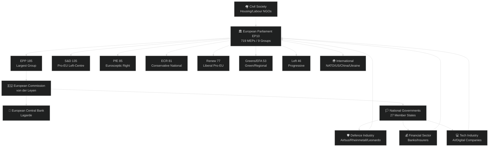

<!-- SPDX-FileCopyrightText: 2024-2026 Hack23 AB -->
<!-- SPDX-License-Identifier: Apache-2.0 -->

# Stakeholder Map — EU Parliament Month in Review: March 28–April 27, 2026

**Run Date:** 2026-04-27 | **Type:** month-in-review | **Confidence:** 🟢 HIGH

---

## Stakeholder Network Overview

---

## Tier 1 Stakeholders (Principal Decision-Makers)

### ST-01: European People's Party (EPP) — 185 seats (25.7%)

**Profile:** Centre-right Christian democratic bloc; largest parliamentary group for third consecutive mandate; dominant in committee leadership positions.

**Primary Interests in March–April 2026:**
- Defence integration leadership — EPP positioned as the author of the flagship defence texts, associating the group with European sovereignty during a period of high geopolitical anxiety
- Banking union completion — EPP's economic competence credibility bolstered by the deposit guarantee reform; balances market-liberal instincts with systemic stability logic
- AI Act simplification — EPP drove the SME-friendly amendments, reflecting close ties with European business federations (BusinessEurope, DIGITALEUROPE)
- Enlargement strategy — EPP has historical ownership of enlargement as a project; the text reinforces group leadership on EU foreign policy identity

**Strategic Positioning:**
EPP is executing a deliberate "anchor coalition" strategy: by making itself indispensable on both security (defence texts) and economic (banking, semester) issues, EPP neutralises challenge from the right (PfE/ECR can only govern with EPP) and the left (S&D cannot pass legislation without EPP). This structural dominance, achieved with only 25.7% of seats, is a testament to ideological positioning at the fulcrum of the chamber.

**Key Vulnerabilities:**
- Internal tensions between Christian democratic social values (housing, migrant rights) and economic liberalism (AI Act deregulation, labour flexibility)
- Risk of PfE-ECR convergence on defence nationalism that could erode EPP's lead on security
- Von der Leyen-EP relationship tensions if Commission's Affordable Housing Initiative is perceived as insufficiently ambitious

**Confidence:** 🟢 HIGH

---

### ST-02: Progressive and Socialists (S&D) — 135 seats (18.8%)

**Profile:** Centre-left Social Democratic bloc; traditional anchor of pro-EU progressive coalition; strong in southern member states (Spain, Portugal, Italy) and traditional social democracy (Germany, Sweden, Netherlands).

**Primary Interests:**
- Banking union completion — S&D as architects of the original banking union project (2012–2014) claims co-ownership; the deposit guarantee reform represents policy continuity
- European Semester employment focus — the employment and social priorities text (TA-10-2026-0076) reflects S&D's core voter base interests in active labour market policy and social investment
- Housing — S&D led the housing crisis resolution; lacks legislative lever but maintains political momentum for the Commission's planned Affordable Housing Initiative
- Anti-corruption — S&D's governance agenda; supports rule-of-law enforcement as a condition for EU cohesion funds

**S&D Defence Posture:**
S&D's conditional support for defence texts (TA-10-2026-0079/0080) reflects internal tension between its pacifist tradition (particularly among German, Austrian, and Nordic delegations) and the geopolitical reality of Russia's ongoing aggression. S&D publicly conditioned its support on social/industrial policy components being embedded in defence framework legislation — reflecting constituency pressure from defence industry workers in France, Spain, Italy.

**Strategic Positioning:**
S&D faces existential pressure from the realignment of European left politics: the Left group (46 seats) is eating into its progressive flank, while Renew's technocratic centrism competes for professional urban voters. S&D's legislative strategy of "responsible governance" (supporting mainstream coalition on banking/defence while leading on social) is an attempt to occupy the indispensable-moderate position.

**Confidence:** 🟢 HIGH

---

### ST-03: Patriots for Europe (PfE) — 85 seats (11.8%)

**Profile:** New pan-European right-populist group formed June 2024; anchored by Fidesz (Hungary), RN (France), ANO (Czech Republic); largest right-wing non-EPP group.

**Primary Interests:**
- Defence texts: **Divided** — Hungarian Fidesz under Orbán's pro-Russian orientation conflicted with RN's anti-NATO orientation; both oppose further integration but for different reasons
- Banking union: **Opposed** — national sovereignty over financial regulation; concerns about cross-border deposit mutualisation
- AI simplification: **Supported** — deregulatory posture aligns with PfE's anti-bureaucracy brand
- Enlargement: **Sceptical** — Hungarian veto on Ukraine accession remains a proxy battleground

**Group Cohesion Assessment:**
PfE is the least cohesive group in the Parliament (estimated internal divergence on key votes). Orbán's Hungary and Le Pen's France have different foreign policy interests (Russia vs. NATO), different economic interests (Hungary needs EU funds; France is a net contributor), and different electoral imperatives. The group holds together on opposition to "Brussels overreach" but fractures on every concrete policy.

**Political Risk:**
If PfE fractures before the 2029 EP election, its 85 seats could redistribute in ways that significantly alter Parliament's balance. EPP's strategy appears to be isolating PfE while periodically co-opting ECR on security/trade issues.

**Confidence:** 🟡 MEDIUM — group dynamics inference

---

### ST-04: European Conservatives and Reformists (ECR) — 81 seats (11.3%)

**Profile:** Conservative national sovereignist group; led by Italian PM Meloni's Fratelli d'Italia and Polish PiS; pro-NATO, anti-Brussels federalism, economically orthodox.

**Primary Interests:**
- Defence: **Strong support** — ECR's Atlanticist/pro-NATO orientation makes the defence single market and EU-Canada text natural allies; however, ECR opposes "federalisation" of defence procurement
- AI simplification: **Supported** — deregulatory instinct
- Enlargement: **Ambivalent** — Balkans enlargement supported (Italy's neighbourhood); Ukraine controversial for PiS (Polish-Ukrainian historical tensions)
- Banking: **National-first** — opposes mutualisation; supported the technical resolution text if national discretion preserved

**Strategic Note:**
ECR's participation in the defence coalition (EPP+S&D+Renew+ECR) is structurally significant — it creates a security consensus that spans ideological lines and gives ECR policy influence proportional to its 11.3% seat share. This prevents ECR from being isolated on the right.

**Confidence:** 🟡 MEDIUM

---

### ST-05: Renew Europe — 77 seats (10.7%)

**Profile:** Liberal/centrist pro-European group; anchored by French La République En Marche (Macron), Spanish Ciudadanos remnants, and Nordic liberals; technocratic reform agenda.

**Primary Interests:**
- All mainstream texts — Renew is the reliable third leg of the EPP+S&D+Renew coalition
- AI governance — strong pro-digital/innovation instinct with rights conditionality
- Enlargement — Renew is the most enthusiastic enlargement group
- European Semester — fiscal reform with investment flexibility

**Decline Trajectory:**
Renew lost significant seats in the 2024 elections (from 102 to 77) and faces existential questions about its relevance as the political centre fragments. Its 10.7% share means it is necessary but not dominant in the core coalition. The group's leadership on AI (via key MEP positions) keeps it relevant in the tech regulatory agenda.

**Confidence:** 🟢 HIGH

---

## Tier 2 Stakeholders (Significant Influence)

### ST-06: European Commission (von der Leyen II)

The Commission holds agenda-setting power. The March 2026 legislative harvest implements the Commission's 2024–2029 work programme. Key Commission interests:
- Defence white paper follow-up: Commission will table legislative instruments implementing the EP's political mandate
- Banking union: Commission oversees BRRD/SRMR implementation; the adopted texts require Commission delegated acts
- AI Act simplification: Commission proposed the simplification; the EP's adoption gives it political cover
- Affordable Housing Initiative: Commission's expected Q2 2026 proposal is politically enabled by the EP's strong housing resolution

**Confidence:** 🟢 HIGH

### ST-07: European Central Bank

ECB interests are directly implicated in banking union reform. President Lagarde's institution gains strengthened supervisory tools from the deposit guarantee harmonisation. ECB has been publicly supportive of completing banking union; the March 2026 texts represent a partial validation of ECB advocacy going back to 2015. ECB VP appointment (TA-10-2026-0060) confirms institutional continuity.

**Confidence:** 🟢 HIGH

### ST-08: National Governments — Differentiated

| Country | Key Legislative Interest | Alignment |
|---------|-------------------------|-----------|
| Germany | Banking union details; European Semester | 🟡 Mixed (banking = concern; semester = support) |
| France | Defence single market (industry winner) | 🟢 Strong support |
| Poland | Enlargement (Ukraine); defence | 🟢 Strong on both |
| Hungary | Enlargement sceptic; banking sovereignty | 🔴 Opposed on several |
| Italy | ECR alignment; defence SMEs | 🟡 Mixed |
| Spain | Housing; S&D agenda | 🟢 Support on social |

### ST-09: Defence Industry Actors

Airbus (France/Germany), Leonardo (Italy), KNDS/Nexter (France), Rheinmetall (Germany), Saab (Sweden), and PGZ (Poland) are principal beneficiaries of the defence single market legislation. Their trade association (ASD — AeroSpace and Defence Industries) has been lobbying for the single market text for over two years. The flagship projects model creates direct government-to-industry relationships at EU level.

**Interest:** 🟢 Strong support for all defence texts

**Confidence:** 🟢 HIGH

### ST-10: Financial Sector

European banks (Deutsche Bank, BNP Paribas, Santander, Unicredit) and the European Banking Federation have complex interests in the banking union reform: harmonised rules reduce cross-border compliance costs but the crisis resolution framework introduces new liability structures. Resolution funds impose ex-ante contributions from the sector — a cost banks resist but accept as insurance against disorderly resolution.

**Interest:** 🟡 Conditional support (accepts systemic stability benefits; opposes over-mutualisation)

**Confidence:** 🟡 MEDIUM

---

## Tier 3 Stakeholders (Affected Parties)

### ST-11: Technology Companies (AI Regulation)
Google, Microsoft, OpenAI, Meta, Mistral (EU), and thousands of AI startups across Europe are directly affected by the AI governance package. The AI Act simplification (TA-10-2026-0098) is a partial win for the tech sector; the copyright text (TA-10-2026-0066) and CoE Convention are constraints. Big Tech lobbied intensively through DIGITALEUROPE and allied MEPs for the simplification provisions.

**Confidence:** 🟡 MEDIUM

### ST-12: Civil Society — Housing and Labour
Housing NGOs (FEANTSA, Housing Europe), labour unions (ETUC), and social rights networks are the primary advocates for the housing crisis resolution and Talent Pool texts. Their influence is indirect (via S&D, Greens, Left) but persistent. The housing resolution's strength reflects years of civil society pressure; its non-binding nature reflects the limits of that pressure against the treaty's subsidiarity architecture.

**Confidence:** 🟢 HIGH on civil society presence | 🔴 LOW on legislative impact

### ST-13: Candidate Countries (Enlargement)
Ukraine, Moldova, Western Balkans states (Albania, Serbia, North Macedonia, Montenegro, Bosnia-Herzegovina, Kosovo) are stakeholders in the enlargement strategy text. The EP's reaffirmation is politically valuable but legally insufficient without Council unanimity, which remains the operational constraint.

**Confidence:** 🟢 HIGH

---

## Stakeholder Influence Matrix

| Stakeholder | Influence Level | Alignment with Month's Agenda | Satisfaction |
|-------------|----------------|------------------------------|--------------|
| EPP | ⭐⭐⭐⭐⭐ | ✅ High | ✅ High |
| S&D | ⭐⭐⭐⭐ | ✅ High | 🟡 Mixed |
| ECR | ⭐⭐⭐ | ✅ Defence/trade | 🟡 Partial |
| PfE | ⭐⭐⭐ | ❌ Low | 🔴 Opposed |
| Renew | ⭐⭐⭐ | ✅ High | ✅ High |
| European Commission | ⭐⭐⭐⭐⭐ | ✅ Full alignment | ✅ High |
| ECB | ⭐⭐⭐⭐ | ✅ Banking | ✅ High |
| Germany (national) | ⭐⭐⭐⭐ | 🟡 Mixed | 🟡 Mixed |
| France (national) | ⭐⭐⭐⭐ | ✅ Defence/AI | ✅ High |
| Defence Industry | ⭐⭐⭐ | ✅ Defence texts | ✅ High |
| Financial Sector | ⭐⭐⭐ | 🟡 Banking | 🟡 Mixed |
| Tech Industry | ⭐⭐⭐ | 🟡 AI simplification | 🟡 Mixed |
| Civil Society | ⭐⭐ | 🟡 Housing/social | 🟡 Mixed |
| Candidate Countries | ⭐⭐ | ✅ Enlargement | 🟡 Conditional |
