<!-- SPDX-FileCopyrightText: 2024-2026 Hack23 AB -->
<!-- SPDX-License-Identifier: Apache-2.0 -->

# Threat Model — EU Parliament Month in Review: March 28–April 27, 2026

**Run Date:** 2026-04-27 | **Type:** month-in-review | **Confidence:** 🟡 MEDIUM

---

## Threat Landscape Overview

```mermaid
%%{init: {"theme":"dark"}}%%
graph TD
    subgraph EXTERNAL["External Threats"]
        T1["🔴 Russian hybrid ops\nagainst EU institutions"]
        T2["🟡 US trade/security\npolicy unpredictability"]
        T3["🟡 Chinese economic\ncoercion/tech competition"]
        T4["🟡 Disinformation campaigns\nagainst EP legitimacy"]
    end
    subgraph INTERNAL["Internal Political Threats"]
        T5["🔴 Coalition instability\n(EPP right-wing pull)"]
        T6["🟡 Enlargement veto\n(Hungary/PfE leverage)"]
        T7["🟡 AI Act implementation\ncoherence failure"]
        T8["🟡 Banking union\nincomplete transposition"]
    end
    subgraph SYSTEMIC["Systemic/Structural Threats"]
        T9["🔴 German economic recession\nundermining EU solidarity"]
        T10["🟡 Housing crisis\ntriggering populist surge"]
        T11["🟡 Defence spending pressure\ncrowding out social investment"]
        T12["🟡 Fragmentation index\npreventing decisive action"]
    end

    T1 --> EP["🏛️ EP Legislative\nOutput Integrity"]
    T5 --> EP
    T9 --> EP
```

---

## Threat Assessment Matrix

| ID | Threat | Probability | Impact | Severity | Trend |
|----|--------|-------------|--------|---------|-------|
| T-01 | Russian hybrid operations against EU institutions | MEDIUM | HIGH | 🔴 HIGH | ↗️ Increasing |
| T-02 | US strategic ambiguity destabilising defence integration | MEDIUM | HIGH | 🟡 MEDIUM | → Stable |
| T-03 | Chinese tech/trade coercion affecting AI governance | LOW-MEDIUM | MEDIUM | 🟡 MEDIUM | ↗️ Slow increase |
| T-04 | Disinformation undermining EP vote legitimacy | HIGH | MEDIUM | 🟡 MEDIUM | ↗️ Chronic |
| T-05 | EPP coalition pivot right fracturing S&D partnership | LOW | VERY HIGH | 🟡 MEDIUM | → Stable |
| T-06 | Hungary/Orbán blocking enlargement via veto | HIGH | HIGH | 🔴 HIGH | → Chronic |
| T-07 | AI Act implementation incoherence | MEDIUM | MEDIUM | 🟡 MEDIUM | ↗️ Emerging |
| T-08 | Banking union incomplete transposition creating gaps | MEDIUM | HIGH | 🟡 MEDIUM | → Monitoring |
| T-09 | German recession deepening, undermining EU fiscal space | MEDIUM | VERY HIGH | 🔴 HIGH | → Monitoring |
| T-10 | Housing crisis fuelling anti-EU populism | HIGH | HIGH | 🔴 HIGH | ↗️ Increasing |
| T-11 | Defence spending crowding out social/climate investment | MEDIUM | HIGH | 🟡 MEDIUM | ↗️ Emerging |
| T-12 | Parliamentary fragmentation preventing crisis response | MEDIUM | HIGH | 🟡 MEDIUM | → Chronic |

---

## Detailed Threat Analysis

### T-01: Russian Hybrid Operations (Severity: 🔴 HIGH)

**Description:** Russia's sustained hybrid warfare against EU member states includes cyberattacks on critical infrastructure, disinformation campaigns, and political interference targeting pro-EU political actors. The adoption of defence single-market legislation makes EP a more prominent target for Russian interference operations.

**Key Vectors:**
- Cyberattacks on EP IT systems (precedent: 2022 DDOS attack on ep.europa.eu)
- Information operations targeting MEP communications
- Financing of Eurosceptic parties (active legal investigations in France, Belgium)
- Interference in national elections that affect EP composition (e.g., France 2027, Germany autumn 2025)

**Mitigation Status:** EP cybersecurity enhancements post-2022; EU Hybrid Toolbox operational; intelligence sharing with member states improved. However, EP's status as a legislative body creates limitations on offensive cyber response options.

**Confidence:** 🟢 HIGH — documented past operations; ongoing threat landscape

---

### T-06: Hungarian Veto on Enlargement (Severity: 🔴 HIGH)

**Description:** Orbán's Hungary has systematically used Council unanimity requirements to block or delay EU decisions on Ukraine aid, rule-of-law enforcement, and enlargement negotiations. The EP's enlargement strategy text (TA-10-2026-0077) creates political expectations that Orbán will continue to frustrate.

**Mechanism:**
- Enlargement accession decisions require Council unanimity — Hungary has a structural veto
- EU accession negotiations (screening, IBAR assessments) require consistent Council backing
- PfE group coherence: if Orbán's PfE allies follow Hungary's line, 85 seats of organised obstruction in Parliament also constrains the pro-EU majority

**Mitigation:**
- Commission's proposed "qualified majority voting" for some accession steps — blocked in Council
- Article 7 TEU proceedings against Hungary — stalled at Council unanimity requirement
- EU funds conditionality — partially effective; Hungary has received some frozen funds in exchange for limited concessions

**Confidence:** 🟢 HIGH — documented pattern of Hungarian obstruction

---

### T-09: German Recession Contagion (Severity: 🔴 HIGH)

**Description:** Germany's two consecutive years of GDP contraction (-0.87% in 2023, -0.5% in 2024) represent the most significant structural economic deterioration among major EU economies since the eurozone crisis. Germany's historical role as net contributor, export engine, and political anchor of the EU is under stress.

**Transmission Channels:**
- Fiscal: reduced German net contributions reduce flexibility for EU budget increases
- Political: economic hardship in Germany drives support for AfD (ECR/PfE-adjacent) and erodes support for deepening integration among the German public
- Financial: German banking sector (particularly savings banks and smaller regional lenders) exposure to SME loan stress from industrial contraction
- Supply chain: Germany's industrial recession creates deflationary pressure on Eastern European manufacturing supply chains

**Mitigation:**
- European Semester 2026 specifically addresses German structural reform needs
- ECB rate normalisation designed to support recovery
- German government coalitions (centre-right) traditionally support EU fiscal frameworks even under domestic pressure

**Confidence:** 🟢 HIGH — WB data confirmed; structural analysis supported by multiple economic sources

---

### T-10: Housing Crisis as Populist Accelerant (Severity: 🔴 HIGH)

**Description:** Across EU member states, housing unaffordability is the leading reported driver of anti-establishment voting. When young voters blame "EU policies" for housing costs (even when causation runs through national planning restrictions and interest rates), EP political legitimacy is weakened.

**Mechanism:**
- Anti-EU parties successfully frame housing crisis as EU failure (Draghi report, ECB monetary policy, EU state aid rules preventing national housing investment)
- Young voters — historically more pro-EU — are shifting toward abstention or protest votes as housing costs eliminate lifestyle expectations
- Increasing homelessness across major EU cities despite economic growth in headline GDP figures

**Mitigation:**
- EP housing resolution (TA-10-2026-0064) creates political narrative: Parliament recognises the crisis
- Commission Affordable Housing Initiative (expected Q2 2026) will be tested against this threat
- Key test: whether EU can demonstrate causal agency in improving housing outcomes, not just acknowledging crisis

**Confidence:** 🟢 HIGH on social pressure | 🔴 LOW on mitigation effectiveness

---

## Threat Interdependency Map

| Primary Threat | Amplified By | Mitigated By |
|----------------|--------------|-------------|
| T-01 (Russian hybrid) | T-12 (fragmentation) | T-defence texts |
| T-06 (Hungary veto) | T-05 (coalition fracture) | EU fund conditionality |
| T-09 (German recession) | T-10 (populism), T-12 | ECB, European Semester |
| T-10 (housing populism) | T-09 (economic stress) | Housing initiative |
| T-12 (fragmentation) | All political threats | EPP+S&D+Renew coalition |

**Overall Threat Environment:** 🟡 ELEVATED — multiple concurrent threats at medium-high severity; no immediate crisis-level threat, but multiple fault lines under stress.

---

## Risk Escalation Triggers

| Trigger | Escalation Path | Monitoring Signal |
|---------|-----------------|------------------|
| US formal NATO commitment withdrawal | T-02 escalates to 🔴 CRITICAL | US Congressional vote on NATO; executive statements |
| German Q1 2026 GDP negative | T-09 escalates to 🔴 CRITICAL | Destatis preliminary estimate (May 2026) |
| Major EU bank resolution failure | T-08 escalates to 🔴 CRITICAL | ECB Supervisory Board announcements |
| EP vote on AI implementing acts split | T-07 escalates; coalition fracture risk | Committee vote signals |
| Hungarian Fidesz withdrawal from PfE | PfE fracture; EP right-wing realignment | Orbán statements; PfE coordination meetings |
