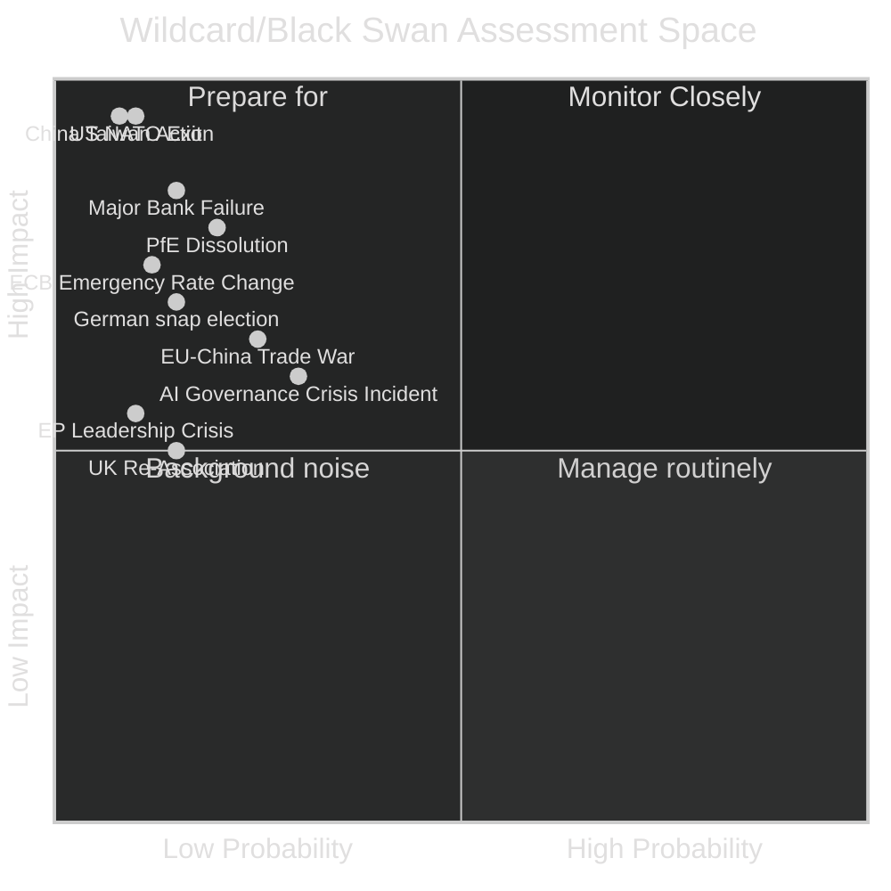

<!-- SPDX-FileCopyrightText: 2024-2026 Hack23 AB -->
<!-- SPDX-License-Identifier: Apache-2.0 -->

# Wildcards and Black Swans — EU Parliament Month in Review: March 28–April 27, 2026

**Run Date:** 2026-04-27 | **Type:** month-in-review | **Confidence:** 🔴 LOW (by definition — wildcards are low-probability)

---

## Framework

Wildcards are low-probability but non-negligible events that would materially alter the EU Parliament's legislative and political trajectory. Black swans are high-impact, difficult-to-predict events for which retroactive narratives are constructed. This document catalogues both types as part of the scenario planning methodology.

---

## Category 1: Institutional/Political Wildcards

### W-01: PfE Group Dissolution (Probability: 15-20%, Impact: 🔴 VERY HIGH)

**Scenario:** The Patriots for Europe group fractures due to irreconcilable internal contradictions between:
- Orbán's Hungary (pro-Russian, EU funds dependent, sovereignist)
- Le Pen's RN France (NATO-adjacent, anti-Islam, economically nationalist)
- Babis's ANO Czech Republic (pragmatic, pro-business, centrist populist)

**Trigger:** A major foreign policy vote (Ukraine military aid, Russia sanctions) that forces a roll-call vote forcing public position.

**Impact:**
- 85 PfE seats redistributed across ECR, EPP fringe, NI
- EPP potentially absorbs moderate PfE elements, creating a larger dominant coalition
- Right-wing opposition weakened; pro-EU majority strengthened on key votes
- Alternative: PfE hardens under Orbán's maximalist line, making it a more coherent 45–50 seat Eurosceptic bloc

**Intelligence Signals:** PfE coordination meeting attendance; Hungarian government statements on EU; Le Pen public positioning on Ukraine; Orbán public statements on NATO

**Confidence:** 🔴 LOW on specific trigger | 🟡 MEDIUM on structural tension

---

### W-02: US Formal NATO Commitment Withdrawal (Probability: 8-12%, Impact: 🔴 CRITICAL)

**Scenario:** The United States government formally reduces its NATO Article 5 commitment — either through official statements, Congressional action, or de facto withdrawal from key NATO military postures (US troops out of Germany, Baltic states).

**Impact:**
- Immediate acceleration of EU defence integration beyond current trajectory
- Defence texts adopted in March 2026 become operational emergency measures, not gradual frameworks
- EU defence budget discussions move from 2029 to 2026–2027 horizon
- Germany forced into full rearmament; political realignment of German domestic politics
- Finland/Sweden new NATO status creates specific vulnerability requiring bilateral response

**Legislative Implications:**
- Commission defence legislative package accelerated by 12–18 months
- EP extraordinary plenary sessions; emergency budget procedure
- Article 42 TEU mutual defence clause activated in European Council

**Confidence:** 🔴 LOW on probability | 🟢 HIGH on impact severity if triggered

---

### W-03: Major EU Bank Failure (Probability: 12-18%, Impact: 🔴 VERY HIGH)

**Scenario:** A significant EU bank (mid-tier, cross-border) experiences a disorderly resolution event — either due to residual commercial real estate exposure, cyber-fraud, or concentrated sovereign debt holdings — before the March 2026 banking union reforms are fully transposed.

**Why This is a Wildcard:**
The March 2026 texts address the *framework* but not the *implementation*. Transposition typically takes 18–24 months. A bank failure in the 2026–2027 transition window would stress-test the old framework while the new one is not yet operational — the worst possible timing.

**Impact:**
- Deposit guarantee reform's practical effectiveness tested under live conditions it was not designed for
- ECB emergency liquidity mechanism activated
- National governments forced into bail-out positions that contradict the just-adopted resolution framework
- Political fallout: anti-EU parties cite bank failure as evidence of "Brussels failure" despite the framework having been just adopted

**Probability drivers:** Commercial real estate sector stress in Germany, Austria, and Netherlands; cyberattack vulnerability; interest rate sensitivity of bank bond portfolios

**Confidence:** 🟡 MEDIUM on probability range | 🟢 HIGH on impact severity

---

## Category 2: Geopolitical Wildcards

### W-04: China-Taiwan Military Action (Probability: 5-8%, Impact: 🔴 CRITICAL)

**Scenario:** China's People's Liberation Army initiates a naval blockade or kinetic military action against Taiwan.

**EU Impact:**
- EU-China trade collapse (EU-China bilateral trade €700B+ annually); immediate supply chain crisis in semiconductors, consumer electronics, critical minerals
- EU forced to choose between US sanctions alignment and European economic interests
- Diplomatic crisis exposes EU's foreign policy consensus fragility (Hungary/Italy vs. Netherlands/Germany)
- AI governance texts immediately complicated by China's claim that technology governance is a sovereignty issue

**Legislative Implications:**
- EP emergency resolution; extraordinary plenary
- Export controls on dual-use technologies rushed through
- WTO mechanism temporarily suspended
- EU-China tariff landscape completely redrawn

**Confidence:** 🔴 LOW on probability | 🟢 HIGH on systemic impact

---

### W-05: Major Cyber Attack on EU Critical Infrastructure (Probability: 20-25%, Impact: 🔴 HIGH)

**Scenario:** A nation-state or organised criminal cyber operation causes prolonged disruption to pan-EU critical infrastructure — electric grid, financial clearing (TARGET2), or the Schengen information system.

**Why Now:** The March 2026 defence and security legislative push may have increased Russia's motivation for a demonstrative cyber operation, and the AI Act simplification may have created compliance gaps in critical systems' security posture.

**Impact:**
- EP cybersecurity legislation (NIS2, DORA for financial sector) tested under real-world conditions
- EP emergency cyber resilience legislation fast-tracked
- Anti-EU narrative exploited by Eurosceptic parties ("EU couldn't protect its own systems")
- Economic disruption of 0.1–0.3% GDP equivalent estimated by European Central Bank scenarios

**Confidence:** 🟡 MEDIUM on probability (documented threat level) | 🟢 HIGH on impact range

---

## Category 3: Structural/Systemic Wildcards

### W-06: AI Governance Crisis Incident (Probability: 25-30%, Impact: 🟡 MEDIUM-HIGH)

**Scenario:** A high-profile AI system failure (medical misdiagnosis, financial algorithm flash crash, judicial AI bias case) in an EU member state triggers a political crisis around the adequacy of the March 2026 AI governance framework.

**Why This is a Wildcard:**
The AI Act was implemented in stages; the simplification adopted in March may have reduced requirements for some categories of systems. A crisis involving a "simplified" system would immediately trigger political blame.

**Impact:**
- Immediate demand for AI Act strengthening (revising the March simplification)
- Coalition fracture risk: those who supported simplification (EPP, ECR, Renew) vs. those who opposed it (Greens, Left, S&D margin)
- Commission forced into emergency legislative procedure
- Council of Europe AI Convention ratification suddenly becomes more urgent

**Confidence:** 🟡 MEDIUM on probability | 🟡 MEDIUM on impact

---

### W-07: UK Re-Association with Single Market (Probability: 12-18%, Impact: 🟡 HIGH)

**Scenario:** A new UK Labour government, responding to post-Brexit economic deterioration, formally proposes a "Swiss-style" bilateral framework for UK-EU market access in financial services, digital, and energy.

**Why This is a Wildcard:**
The political conditions in the UK are gradually shifting. UK GDP growth has underperformed comparable EU member states since Brexit. The March 2026 EU Talent Pool and digital single market texts create a growing regulatory divergence that increases the economic cost of UK exclusion.

**EU Impact:**
- Renew, EPP, and S&D generally supportive of UK re-engagement
- ECR and PfE concerned about re-opening Brexit as a precedent for reverse-integration
- EP's institutional relationship with UK Parliament would need formal framework
- Economic benefit of UK re-integration estimated at 0.5–1.5% long-run GDP gain for both sides (various think-tank estimates)

**Confidence:** 🟡 MEDIUM on probability over 2–3 year horizon | 🟡 MEDIUM on impact

---

## Wildcard Monitoring Matrix

| Wildcard | Probability | Impact | Time Horizon | Early Warning Signal |
|----------|------------|--------|-------------|---------------------|
| W-01: PfE Dissolution | 15–20% | Very High | 6–18 months | PfE internal vote coherence |
| W-02: US NATO withdrawal | 8–12% | Critical | 6–24 months | US Congressional NDAA votes |
| W-03: EU Bank Failure | 12–18% | Very High | 12–24 months | ECB bank stress indicators |
| W-04: China-Taiwan | 5–8% | Critical | 12–36 months | PLA military exercises |
| W-05: Major Cyberattack | 20–25% | High | 3–12 months | ENISA threat advisories |
| W-06: AI Crisis Incident | 25–30% | Medium-High | 6–18 months | Media/regulatory alerts |
| W-07: UK Re-Association | 12–18% | High | 24–48 months | UK political party platforms |

**Summary Intelligence Assessment:** The current wildcard landscape is unusually dense — multiple moderate-probability, high-impact events cluster around the 2026–2027 horizon. The EU Parliament's March 2026 legislative harvest has created positive forward momentum, but the implementation environment faces structural fragility from German economic weakness, parliamentary fragmentation, and geopolitical volatility. The balance of wildcards is bimodal: some (W-01, W-06, W-07) would strengthen EU integration momentum; others (W-02, W-03, W-04, W-05) would test the resilience of the newly adopted frameworks under stress conditions.

**Confidence:** 🔴 LOW on specific probabilities | 🟢 HIGH on structural logic of each scenario
