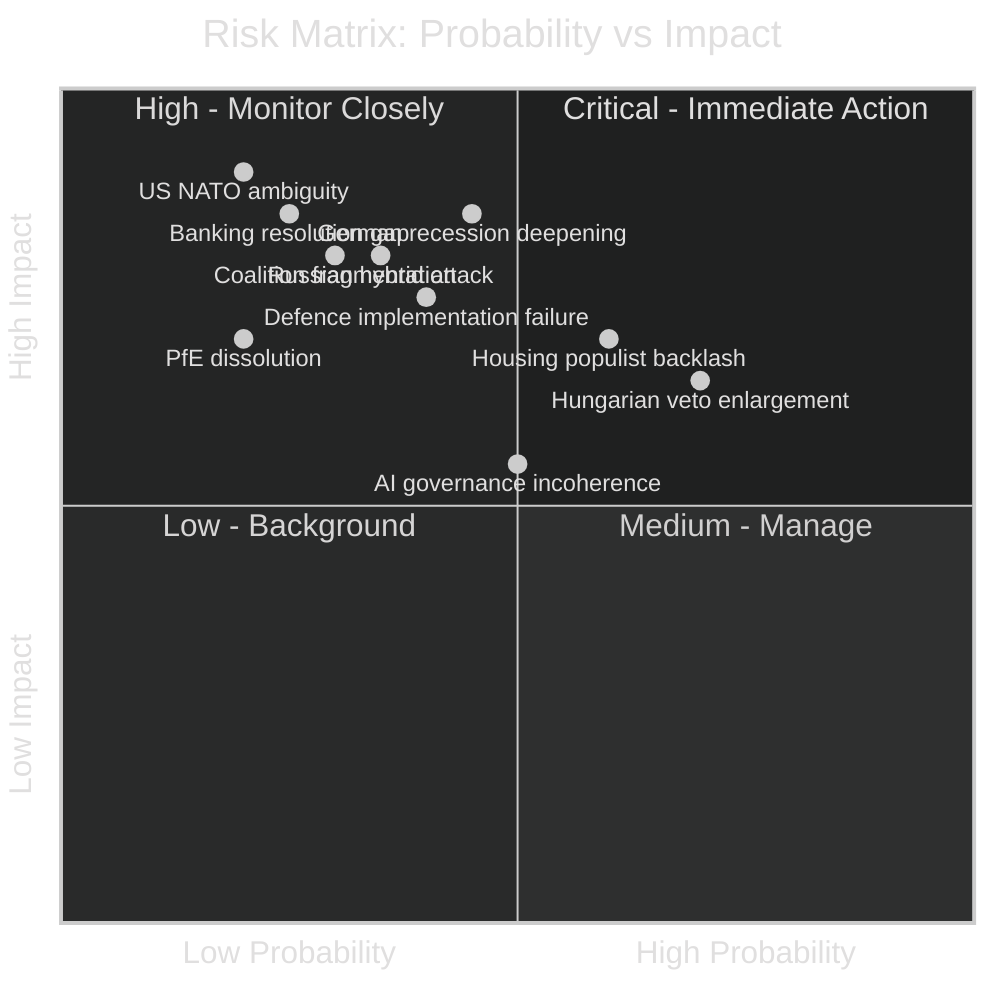

<!-- SPDX-FileCopyrightText: 2024-2026 Hack23 AB -->
<!-- SPDX-License-Identifier: Apache-2.0 -->

# Risk Matrix — EU Parliament Month in Review: March 28–April 27, 2026

**Run Date:** 2026-04-27 | **Type:** month-in-review | **Confidence:** 🟡 MEDIUM

---

## Risk Assessment Framework

---

## Risk Register

| Risk ID | Risk Description | Probability | Impact | Score | Owner | Trend |
|---------|-----------------|-------------|--------|-------|-------|-------|
| R-01 | German economic recession deepening | MEDIUM (40%) | VERY HIGH | 🔴 32 | European Commission | ↗️ Worsening |
| R-02 | EPP-S&D coalition fracture on AI/social | LOW (25%) | VERY HIGH | 🟡 20 | EP Political Leaders | → Stable |
| R-03 | Defence single-market implementation failure | MEDIUM (35%) | HIGH | 🟡 21 | Commission/Member States | → Emerging |
| R-04 | AI governance layer incoherence | MEDIUM (45%) | MEDIUM | 🟡 18 | Commission/ECtHR/CJEU | ↗️ Increasing |
| R-05 | Banking union transposition gap | LOW (25%) | VERY HIGH | 🟡 20 | National competent authorities | → New risk |
| R-06 | Housing crisis → populist electoral shift | HIGH (60%) | HIGH | 🔴 24 | National governments/Commission | ↗️ Increasing |
| R-07 | Hungarian veto blocking enlargement | HIGH (70%) | HIGH | 🔴 28 | Council/European Council | → Chronic |
| R-08 | Russian hybrid operations escalation | MEDIUM (35%) | HIGH | 🟡 21 | ENISA/Member state CERTs | ↗️ Increasing |
| R-09 | US NATO ambiguity destabilising defence | LOW (20%) | CRITICAL | 🟡 18 | Transatlantic partners | → Monitoring |
| R-10 | PfE fragmentation creating political void | LOW-MEDIUM (20%) | HIGH | 🟡 16 | EP Group leadership | → Emerging |

---

## Top Risk Analysis

### R-07: Hungarian Enlargement Veto (Score: 28 — 🔴 HIGH)

**Risk Description:** Hungary under PM Orbán maintains a structural veto position on EU enlargement decisions requiring Council unanimity. The EP's March 2026 enlargement strategy text creates political expectations that Hungary will systematically frustrate.

**Impact Analysis:** Failure to advance Ukraine/Moldova/Western Balkans accession undermines EU credibility as a geopolitical actor, weakens the transformative leverage over candidate countries, and provides Russia with a proxy instrument for EU division.

**Current Mitigation:**
- EU cohesion fund conditionality (limited effectiveness: Hungary has received partial fund releases)
- Article 7 proceedings (stalled)
- Qualified majority voting proposals for accession steps (blocked in Council)
- Political isolation strategy (EPP's refusal to engage Orbán in EPP channels)

**Residual Risk:** 🔴 HIGH — structural veto power not addressed by current mechanisms

---

### R-01: German Recession Deepening (Score: 32 — 🔴 CRITICAL)

**Risk Description:** Germany's -0.5% GDP growth (2024) following -0.87% (2023) represents a structural economic deterioration. If the industrial restructuring cycle (energy, autos, manufacturing) causes further contraction in 2025–2026, German political consensus for EU integration weakens.

**Impact Cascade:**
1. Reduced German net contributions → EU budget pressure
2. Rising German unemployment → AfD electoral gains → CDU/CSU right-wing pressure
3. German government pushback on banking union mutualisation
4. Fiscal austerity pressure limiting European Semester flexibility

**Mitigation:**
- ECB rate normalisation supports credit conditions
- German structural reform (energy transition, digitalisation) beginning to gain traction
- Coalition government (CDU/CSU-led) maintains EU commitment despite domestic pressure

**Residual Risk:** 🟡 MEDIUM — structural problem acknowledged; mitigation partial

---

### R-06: Housing Crisis Populist Backlash (Score: 24 — 🔴 HIGH)

**Risk Description:** If the housing crisis is not visibly addressed before the next national election cycles (France 2027, Germany already passed autumn 2025), the political backlash could materialise as EP electoral losses for pro-EU parties in 2029.

**Time Horizon:** 2026–2029

**Mitigation:**
- EP housing resolution creates political pressure
- Commission Affordable Housing Initiative (expected Q2 2026)
- ECB rate reductions (reducing mortgage financing costs)

**Gap:** Treaty subsidiarity limits EU's direct lever; national governments control zoning, planning, housing expenditure. EU can incentivise but not command housing policy.

---

## Risk Heat Map by Policy Area

| Policy Area | Key Risks | Overall Area Risk Level |
|-------------|-----------|------------------------|
| Defence Integration | R-03 (implementation), R-09 (US) | 🟡 MEDIUM |
| Banking/Finance | R-01 (Germany), R-05 (transposition gap) | 🔴 HIGH |
| AI/Digital | R-04 (incoherence) | 🟡 MEDIUM |
| Enlargement | R-07 (Hungary) | 🔴 HIGH |
| Social/Housing | R-06 (populism) | 🔴 HIGH |
| Geopolitical | R-08 (Russia), R-09 (US) | 🟡 MEDIUM-HIGH |
| Political/Institutional | R-02 (coalition), R-10 (PfE) | 🟡 MEDIUM |

**Overall Risk Environment for May–June 2026:** 🔴 ELEVATED
The EU Parliament's productive March 2026 legislative month creates implementation obligations that concentrate risk in the medium-term (12–24 months). The banking union and defence texts in particular create execution risks that will be visible within 18 months.
