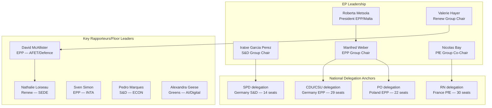
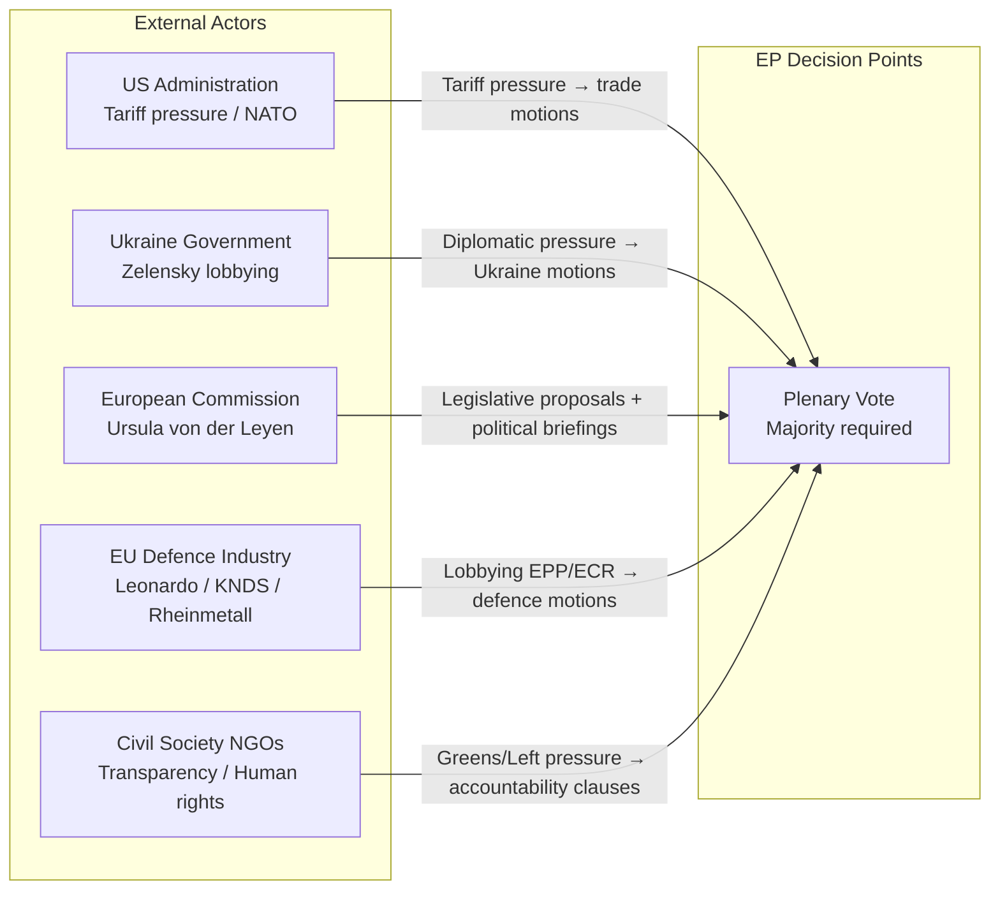

# Actor Mapping: EU Parliament Motions — April 2026

**Date:** 2026-04-27 | **Article Type:** motions | **Classification:** PUBLIC

---

## For Citizens: Who Shapes EP Decisions?

Behind every European Parliament vote is a network of actors—MEPs, party whips, national delegations, lobbying organizations, and outside pressures. This map identifies the key players shaping the April 2026 motions session and the relationships between them.

---

## Primary Actor Network

---

## Actor Profiles

### Roberta Metsola (EPP, Malta) — EP President
**Role in motions session:** Chairs plenary, sets agenda priorities, procedural gatekeeper.  
**Influence level:** 🔴 Very High (procedural + symbolic)  
**Alignment:** Pro-EU, pro-Ukraine, moderate on defence spending, strong Rule of Law advocate.  
**Key interest in April session:** Ensure smooth passage of Ukraine continuity and defence texts; manage urgency resolutions without disrupting scheduled agenda.  
**Vulnerability:** PfE/ESN procedural challenges to rulings; quorum tactics.

### Manfred Weber (EPP, Germany) — EPP Group Chair
**Role:** Orchestrates EPP's 185-seat bloc; broker between CDU/CSU fiscal conservatives and eastern flank security maximalists.  
**Influence level:** 🔴 Very High  
**Alignment:** Pro-defence, pro-Ukraine, market-oriented, cautious on fiscal mutualisation.  
**Key tension:** Balancing CDU Merz government's NATO-first defence posture with EPP members in PfE-adjacent positions (Italian FI, some Central European delegations).  
**Shadow rapporteur commitments:** Weber personally engaged on SAFE/EDIP; delegates trade and banking union to senior shadow rapporteurs.

### Iratxe García Pérez (S&D, Spain) — S&D Group Chair
**Role:** Leads 135-seat progressive bloc; ensures S&D votes hold on both security (Ukraine) and social texts.  
**Influence level:** 🔴 High  
**Alignment:** Strong Ukraine supporter; conditional on peace process provisions; social justice anchor on banking union and trade.  
**Key tension:** S&D left flank (Mediterranean groups) presses for social conditionality clauses; German SPD MEPs under pressure from Scholz government's fiscal constraints.

### Valerie Hayer (Renew, France) — Renew Europe Group Chair
**Role:** Manages 77-seat centrist bloc; pivotal on competitiveness (AI, banking, trade) and security texts.  
**Influence level:** 🟡 High  
**Alignment:** Pro-EU liberal, pro-Ukraine, strong Atlanticist; cautious on excessive defence autonomy that might weaken NATO.  
**Key tension:** French RN MEPs (30 seats) sit in PfE and pull against her; French government's industrial policy preferences sometimes diverge from liberal trade positions.

### David McAllister (EPP, Germany) — AFET Committee Chair
**Role:** Floor leader on Ukraine, Russia, foreign affairs motions; authoritative voice for EPP on geopolitical texts.  
**Influence level:** 🟡 High  
**Alignment:** Strong Ukraine supporter, Atlanticist, anti-Russia; leads cross-group coalition building on foreign affairs.

### Nathalie Loiseau (Renew, France) — SEDE Subcommittee Chair
**Role:** Drives defence and security motions; architects of European defence industrial agenda.  
**Influence level:** 🟡 High  
**Alignment:** Pro-autonomy, supports SAFE instrument, EDIP, European defence market unification.  
**Key tension:** French strategic autonomy discourse sometimes clashes with US/NATO preference of eastern EPP members.

### ECR Group (81 seats) — Strategic Swing Bloc
**Role:** Swing bloc on defence and Ukraine; opposes social and climate motions.  
**Influence level:** 🟡 Medium-High (swing)  
**Internal split:** PiS (Poland) = 22 seats — strongly pro-Ukraine, pro-NATO; Brothers of Italy (22 seats) — hedged on autonomy but generally anti-Russia; ECR western members (Belgian, Swedish) — moderate.  
**Key dynamic:** ECR's Ukraine and defence vote = net +40–60 votes above EPP+S&D+Renew majority; crucial for large majorities. ECR trades votes for text language accommodations (bilateral over EU-federal formulations).

---

## External Actor Influence Network

### European Commission (von der Leyen)
**Role:** Key ally — Commission legislative proposals drive EP agenda; Commission DGs provide technical briefings to committee chairs; President von der Leyen maintains close relationship with EPP Group Chair Weber.  
**Influence vector:** Institutional/agenda-setting; can frame motions as "confidence votes" in Commission competitiveness agenda.

### US Administration (Trump Administration)
**Role:** Indirect driver — US tariff threats (25–50% across categories) create EP urgency on trade response motions. US defence posture creates urgency on European defence sovereignty. Negative US-EU relationship creates political space for autonomy-focused motions.  
**Influence vector:** Exogenous geopolitical pressure.

### Ukraine Government (Zelensky)
**Role:** Zelensky's continued lobbying of European capitals and EP delegations sustains political will. Ukrainian diaspora in EU member states creates grassroots pressure on MEPs. Ukraine's military situation is a constant news backdrop.  
**Influence vector:** Moral/political urgency creation.

### EU Defence Industry (Leonardo, KNDS, Rheinmetall, Airbus Defence)
**Role:** Active lobbyists on SAFE instrument and EDIP provisions; funding eligible under 95% EU-content rule vs. US-made platforms. Industry coordination via ASD (AeroSpace and Defence Industries Association of Europe).  
**Influence vector:** Technical advocacy, economic argument (EU jobs), direct EPP/ECR lobbying.

---

## Influence Concentration and Vulnerability Map

| Actor Category | Seats/Weight | Motion Areas | Vulnerability |
|----------------|-------------|--------------|---------------|
| EPP leadership (Weber + Metsola) | 185 seats | ALL | Internal CDU/CSU fiscal brake; eastern maximalists |
| S&D leadership (Garcia Perez) | 135 seats | Ukraine, banking, trade | Left flank social conditionality |
| Renew leadership (Hayer) | 77 seats | AI/digital, trade, defence | French RN PfE pressure on national delegation |
| ECR leadership (internal split) | 81 seats | Defence, Ukraine | PiS vs Meloni vs Baltic blocs |
| PfE leadership (Bay/Orbán) | 85 seats | ALL opposition | Orbán-Meloni split on defence autonomy |

---

## Reader Briefing

**Why actor mapping matters for motions analysis:** EP motions are not abstract policy documents—they are political outputs of actor negotiations. The April 2026 session involves at least 6 active coalition-building processes happening simultaneously (defence, trade, Ukraine, AI, banking, Rule of Law). Actor mapping reveals that:

1. **The EPP-S&D-Renew 397-seat coalition is necessary but insufficient** for large margins—texts with <50 vote majorities are vulnerable to procedural challenges.
2. **ECR (81 seats) is the decisive swing actor** on defence and Ukraine—floor leaders must accommodate ECR language preferences to secure supermajorities.
3. **PfE (85) + ESN (27) = 112 systematic opposition** cannot block but forces procedural management and language negotiation.
4. **External actors (US tariffs, Ukraine war, EU defence industry) are the primary drivers of urgency** that override normal left-right legislative pacing.

*Confidence: 🟡 Medium. Based on EP composition data, AFET/SEDE/INTA committee structures, and historical coalition patterns. Individual MEP positions unverifiable without live roll-call data.*
