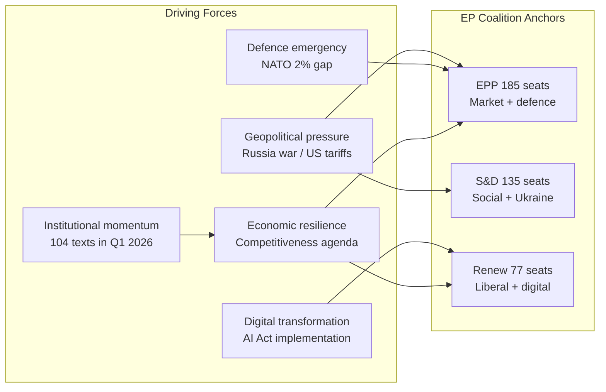
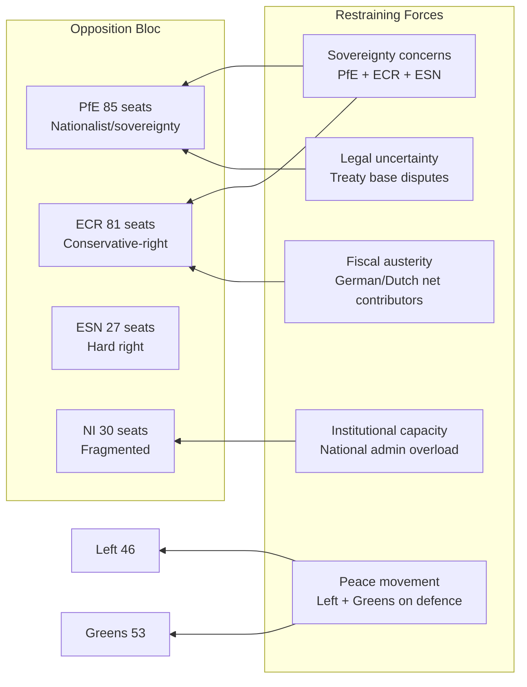

# Forces Analysis: EU Parliament Motions — April 2026

**Date:** 2026-04-27 | **Article Type:** motions | **Classification:** PUBLIC

---

## For Citizens: The Power Behind EP Decisions

Understanding why the European Parliament votes the way it does requires mapping the forces that push and pull MEPs in different directions. These include not just political parties, but also national governments, industries, civil society, and geopolitical pressures. This analysis applies a structural forces framework to the April 2026 plenary.

---

## Forces Driving Change (Pro-Motion Forces)

### Force 1: Geopolitical Emergency (STRENGTH: 🔴 Very High)
Russia's ongoing war of aggression in Ukraine—now in its fourth year—creates overwhelming legislative urgency. The EP's consistent 65–80% majority for Ukraine support motions reflects this pressure. US tariff imposition under Trump's second term creates secondary geopolitical pressure on trade motions. These twin pressures override normal left-right divisions, uniting EPP, S&D, Renew, and even some ECR members on core geopolitical motions.

**Key MEP voices driving this force:**
- David McAllister (EPP, Germany) — Foreign Affairs Committee Chair, Ukraine champion
- Kati Piri (S&D, Netherlands) — foreign policy, Rule of Law anchor
- Nathalie Loiseau (Renew, France) — Security & Defence champion
- Andrius Kubilius (EPP, Lithuania) — Defence Commissioner; strong institutional ally

### Force 2: Institutional Momentum (STRENGTH: 🔴 High)
The March cluster adopted 35 texts in 6 days across two sessions—an exceptional pace. This momentum reflects Conference of Presidents pressure to clear EP9 backlog, Commission deadline pressure (Competitiveness Agenda), and the new EP-Commission Framework Agreement (TA-10-2026-0069). Institutional momentum is self-reinforcing: successful adoption builds political will for further progress.

### Force 3: Economic Competitiveness Imperative (STRENGTH: 🟡 High)
The Draghi Report's competitiveness diagnosis and Commission's Competitiveness Agenda have shifted EP political vocabulary. EPP, Renew, and even pragmatic S&D members now speak in competitiveness terms. Digital Omnibus simplification, banking union completion, and defence industrial base are all framed as competitiveness imperatives. This reframes traditional left-right tensions as "efficiency vs. equity" rather than "market vs. state".

### Force 4: Digital Regulatory Pressure (STRENGTH: 🟡 Medium-High)
AI Act implementation, GDPR enforcement, and the ERA Act create a thickening digital regulatory environment. Renew and EPP seek to manage implementation pace to avoid competitive disadvantage. Progressive groups push for stricter enforcement. This creates productive legislative tension that drives motions forward even when conclusions differ.

### Force 5: Defence Investment Urgency (STRENGTH: 🔴 High)
The NATO 2% GDP target, combined with European strategic autonomy discourse, has moved defence from peripheral to central EP concern. SEDE subcommittee's output (flagship projects, single market for defence) reflects this. April motions on SAFE instrument and EDIP implementation carry this force.

---

## Forces Resisting Change (Restraining Forces)

### Force 6: Sovereignty and Anti-EU Federalism (STRENGTH: 🔴 High)
PfE (85 seats), ECR (81), and ESN (27) collectively hold 193 seats—27% of the chamber. Their consistent opposition to EU-level governance solutions is the primary structural restraining force. PfE's Orbán wing explicitly frames motions as "Brussels overreach"; ECR is more selective (supports some defence motions from nationalist security perspective; opposes social and climate motions). ESN is systematic oppositional.

**This restraining force can delay but not block** — 193 opposition seats cannot defeat a grand coalition of 397+ votes. However, it affects the language, conditionality, and implementation provisions of motions.

### Force 7: Fiscal Restraint in Net-Contributor States (STRENGTH: 🟡 Medium)
Germany's Scholz-Merz coalition, the Netherlands, Austria, and Finland governments have expressed concern about the fiscal implications of EU-level defence funding, Ukraine support facility, and banking union mutualisation. Their respective national MEP delegations (EPP: CDU/CSU + ÖVP; S&D: SPD; Renew: VVD/FDP affiliates) apply quiet pressure on language regarding additionality, conditionality, and fiscal neutrality clauses.

### Force 8: Progressive Peace Conditionality (STRENGTH: 🟡 Medium)
Left (46) and Greens/EFA (53) provide 99 seats of conditionality. On defence motions, they demand peace process provisions, restrictions on weapons to conflict zones, and civilian casualty accountability. This does not block motions but adds complexity—rapporteurs must navigate Left/Greens concerns to avoid coalition fragmentation. On climate motions, Greens and Left are proponents, but face EPP-led resistance to binding targets.

### Force 9: Implementation Capacity Limitations (STRENGTH: 🟡 Low-Medium)
Commission implementation capacity is under strain. With 104 texts adopted in Q1 2026 alone, DG staff face pipeline pressure. Member state transposition capacity varies widely. This creates a structural risk that well-intentioned EP motions generate enforcement gaps—a political problem that opposition groups exploit.

---

## Force Balance Analysis

### For Defence Motions:
**Driving forces:** Geopolitical emergency (Very High) + Defence urgency (High) + Institutional momentum (High)  
**Restraining forces:** Sovereignty concerns (High) + Fiscal restraint (Medium)  
**Net balance:** 🟢 Driving forces clearly dominant → passage probable

### For Trade/Tariff Motions:
**Driving forces:** Geopolitical emergency (High) + Economic competitiveness (High)  
**Restraining forces:** Sovereignty concerns (Medium) + divergent national interests (Medium)  
**Net balance:** 🟡 Driving forces dominant but contested → passage probable with caveats

### For Ukraine Motions:
**Driving forces:** Geopolitical emergency (Very High) + Institutional momentum (High)  
**Restraining forces:** PfE/ESN sovereignty bloc (High) + Fiscal restraint (Low-Medium)  
**Net balance:** 🟢 Driving forces overwhelmingly dominant → highly likely passage

### For AI/Digital Motions:
**Driving forces:** Digital pressure (High) + Competitiveness (High)  
**Restraining forces:** Progressive conditionality (Medium)  
**Net balance:** 🟢 Broadly consensus-driven → passage highly likely

### For Anti-Corruption/Rule of Law:
**Driving forces:** Institutional accountability (High) + Geopolitical pressure (Medium)  
**Restraining forces:** PfE sovereignty bloc (High)  
**Net balance:** 🟡 Contested but majority achievable → passage probable

---

## Structural Insight

The April 2026 plenary is structurally positioned as a **"momentum session"** — the legislative pipeline from March is full, the geopolitical environment is urgent, and the institutional coalition (EPP+S&D+Renew = 397) is intact. The primary risk to legislative productivity is not coalition collapse but **agenda overcrowding**: too many motions competing for voting slots in four days, combined with the EP's procedural tendency to add urgency resolutions that crowd out scheduled items.

*Confidence: 🟡 Medium. Sources: EP Open Data (composition, session schedule), political landscape analysis. Forces assessment based on structural composition and historical coalition patterns.*
