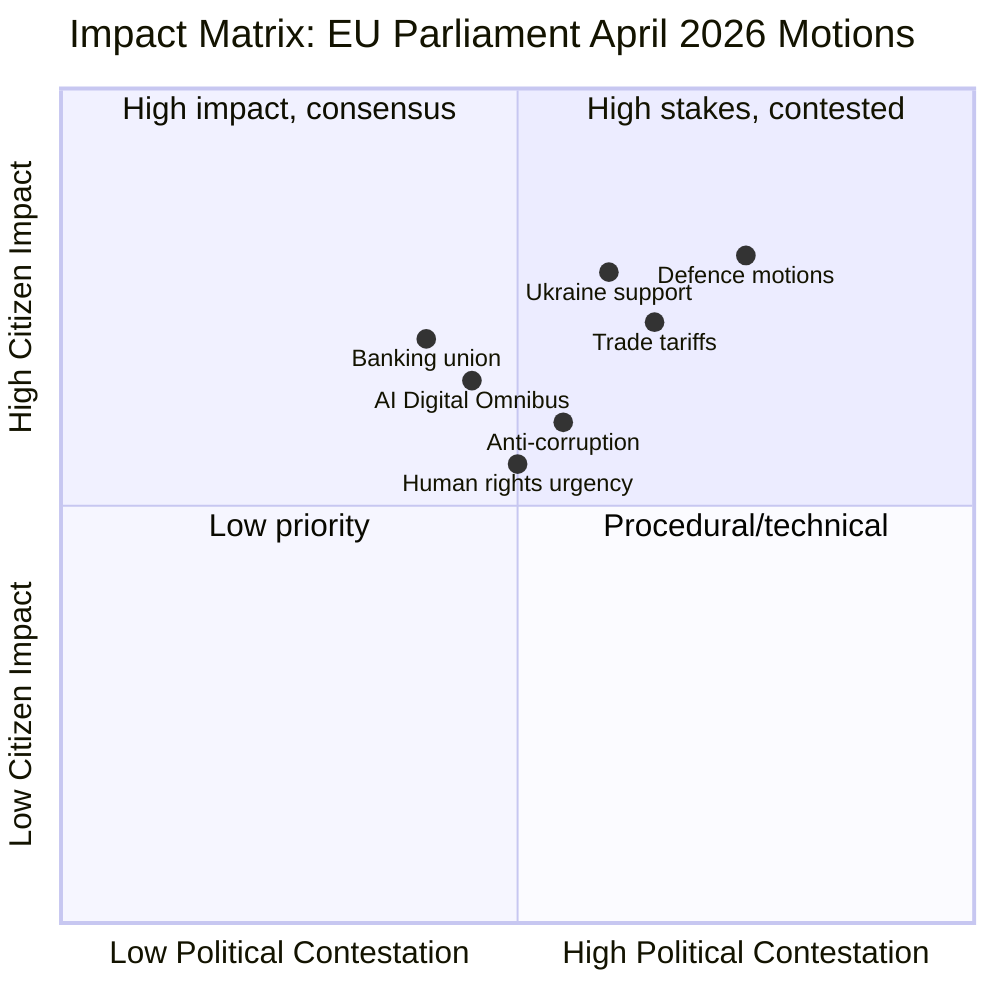
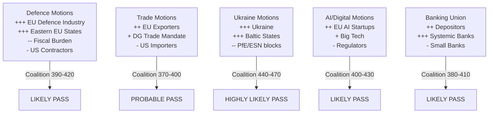

# Impact Matrix: EU Parliament Motions — April 2026

**Date:** 2026-04-27 | **Article Type:** motions | **Classification:** PUBLIC

---

## For Citizens: What This Means

The European Parliament's April 2026 Strasbourg session votes on laws and resolutions that affect your everyday life — from how safe your savings are, to how Europe defends itself and who pays for it, to whether your digital rights are protected as AI becomes more prevalent. This matrix maps who wins, who loses, and how much over what timeframe.

---

## Impact Matrix: Five Key Motion Clusters

---

## Dimension 1: Defence and Security Motions

| Stakeholder Group | Impact Type | Severity | Timeframe | Confidence |
|------------------|-------------|----------|-----------|------------|
| EU citizens (security) | Positive — improved collective defence | 🔴 High | 1–5 years | 🟡 Medium |
| Defence industry (EU) | Strongly positive — procurement harmonisation | 🔴 High | 6–18 months | 🟢 High |
| National defence budgets | Negative — additionality requirements | 🟡 Medium | 12–36 months | 🟡 Medium |
| US defence contractors | Mixed — EU preference clauses may exclude | 🟡 Medium | 12–24 months | 🟡 Medium |
| NATO partners (UK, Norway) | Ambiguous — access to EU defence market | 🟡 Medium | 12–24 months | 🔴 Low |
| Workers in defence sector | Positive — employment growth, EU labour standards | 🟡 Medium | 18–36 months | 🟡 Medium |

**Political Coalition Assessment:**
- EPP + S&D + ECR (Baltic/Polish) + partial Renew → ~390–420 votes likely
- Left and Greens oppose on peace/ethical grounds but cannot block
- PfE split: Hungarian MEPs (Fidesz, 11 seats) oppose; French/Austrian PfE ambiguous

---

## Dimension 2: Trade and Tariff Response

| Stakeholder Group | Impact Type | Severity | Timeframe | Confidence |
|------------------|-------------|----------|-----------|------------|
| EU exporters (automotive, steel) | Positive — EP signals firm trade stance | 🔴 High | Immediate–12 months | 🟡 Medium |
| EU farmers | Mixed — agricultural exemptions contested | 🟡 Medium | 6–18 months | 🟡 Medium |
| EU consumers | Slightly positive — domestic price competition | 🟡 Low-Medium | 6–18 months | 🔴 Low |
| US importers to EU | Negative — tariff adjustment signals | 🟡 Medium | Immediate | 🟢 High |
| Developing country exporters | Mixed — EU preference erosion risk | 🟡 Medium | 12–36 months | 🔴 Low |
| Commission DG Trade | Empowered — EP mandate strengthens negotiating position | 🟡 Medium | Immediate | 🟢 High |

**Political Coalition Assessment:**
- EPP + S&D + Renew → ~397 votes (sufficient, if text avoids over-specificity)
- ECR split on "EU-level response" vs "bilateral arrangements" — reduces final margin
- PfE oppose EU-level trade mandate on sovereignty grounds

---

## Dimension 3: Ukraine Support Continuity

| Stakeholder Group | Impact Type | Severity | Timeframe | Confidence |
|------------------|-------------|----------|-----------|------------|
| Ukraine (government/economy) | Strongly positive — funding continuity | 🔴 High | Immediate | 🟢 High |
| EU member states (eastern flank) | Positive — geopolitical stability | 🔴 High | 12–36 months | 🟢 High |
| EU taxpayers | Negative — fiscal burden of €45bn+ facility | 🟡 Medium | 12–60 months | 🟡 Medium |
| Russia (state) | Negative — continued EP pressure | 🔴 High | Immediate | 🟢 High |
| EU peace movement/civil society | Mixed — support vs war escalation concerns | 🟡 Low-Medium | Immediate | 🟡 Medium |
| Hungarian/Slovak governments | Negative — EP motion overrides bilateral vetoes | 🟡 Medium | Immediate | 🟡 Medium |

**Political Coalition Assessment:**
- EPP + S&D + Renew + Greens + Left → 496 theoretical maximum; realistically ~440–470 votes
- PfE (85) + ESN (27) systematic opposition = 112 votes against
- NI split; some NI MEPs support Ukraine

---

## Dimension 4: AI and Digital Regulation

| Stakeholder Group | Impact Type | Severity | Timeframe | Confidence |
|------------------|-------------|----------|-----------|------------|
| EU AI companies (startups) | Positive — reduced compliance burden | 🟡 Medium | 6–12 months | 🟢 High |
| Big Tech (US/China) | Positive short-term — timeline grace | 🟡 Medium | 6–12 months | 🟢 High |
| Data subjects/citizens | Mixed — enforcement gap risk | 🟡 Medium | 6–24 months | 🟡 Medium |
| National regulators | Negative — resource pressure without simplification grants | 🟡 Medium | 6–18 months | 🟡 Medium |
| AI workers (EU) | Positive — investment, job creation | 🟡 Medium | 12–36 months | 🟡 Medium |
| Media/journalism | Positive — copyright/AI protections affirmed | 🟡 Low-Medium | 6–18 months | 🟡 Medium |

---

## Dimension 5: Banking Union Implementation

| Stakeholder Group | Impact Type | Severity | Timeframe | Confidence |
|------------------|-------------|----------|-----------|------------|
| Depositors (EU-wide) | Positive — harmonised deposit protection | 🔴 High | 24–60 months | 🟢 High |
| Systemically important banks | Positive — resolution clarity, lower uncertainty | 🔴 High | 12–36 months | 🟢 High |
| Small/mid-tier banks | Negative — higher compliance costs | 🟡 Medium | 12–24 months | 🟢 High |
| German/Dutch taxpayers | Negative — implicit mutualisation risk | 🟡 Medium | 36–120 months | 🟡 Medium |
| ECB/SRB | Positive — empowered resolution tools | 🟡 Medium | Immediate | 🟢 High |
| Bond/equity investors | Positive — reduced bank resolution uncertainty | 🔴 High | 6–12 months | 🟢 High |

---

## Cross-Cutting Impact Summary

---

## Reader Briefing

**For ordinary citizens**: The five major themes this week—defence, trade, Ukraine, AI, and banks—will shape your security, job, savings, and digital rights over the next 1–5 years. The broad majority supporting Ukraine (70%+ of MEPs) is the strongest signal; the contested defence and trade motions will require active political management.

**Confidence note:** 🟡 Medium confidence overall. EP roll-call voting data has a publication delay; final vote totals will be available in approximately 4–6 weeks. Coalition estimates are based on structural composition analysis and historical voting patterns, not live roll-call data.

*Source: European Parliament Open Data Portal. Analysis: EU Parliament Monitor.*
