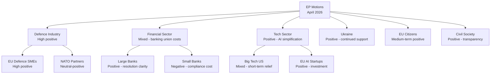

# Stakeholder Impact Analysis: EP Motions — April 2026

**Date:** 2026-04-27 | **Article Type:** motions | **Session:** Strasbourg April 27–30

---

## Overview

This analysis maps the distributional impact of the April 2026 European Parliament motions across key stakeholder groups. The session consolidates momentum from the March 2026 plenary cluster—where 104 texts were adopted across banking union reform, AI simplification, trade responses, anti-corruption, and defence—and introduces new motions that carry direct material consequences for citizens, institutions, industries, and third countries.

---

## 1. EU Citizens (General)

**Impact Severity:** 🟡 Medium-High  
**Confidence:** 🟡 Medium  
**Time Horizon:** 6–24 months

The motions under debate this week affect citizens through three primary channels:

**Consumer and Social Rights**: The housing crisis resolution (TA-10-2026-0064, adopted March) and European Semester priorities for 2026 (TA-10-2026-0076) establish a political context in which the April session's social motions will be judged. Citizens in high-cost urban areas (Berlin, Paris, Amsterdam, Stockholm, Dublin) face acute affordability pressures that motions on housing investment and social protection are meant to address—but with legislative timelines of 18–36 months, impact is delayed.

**Digital Rights**: The Digital Omnibus on AI simplification (TA-10-2026-0098) reduces compliance burdens for AI providers but also streamlines some consumer protection requirements. Progressive groups (Left, Greens) argue this creates an enforcement gap; EPP and Renew argue it improves EU competitiveness. Citizens' net benefit depends on national regulators' capacity to fill gaps.

**Geopolitical Security**: Defence motions have a dual citizen impact. The majority of EU citizens in EP10 member states surveyed by Eurobarometer support increased EU defence cooperation; however, the fiscal burden—if translated into additional defence spending from EU-level instruments—is regressive unless offset by social spending provisions.

**Plain Language Summary for Citizens:**  
*"The April 2026 European Parliament session in Strasbourg will decide on key issues including how Europe defends itself, how it trades with the United States after tariff disputes, and how it continues to support Ukraine. These decisions will affect your prices, your digital rights, and how secure Europe feels over the coming years."*

---

## 2. Financial Sector and Banking

**Impact Severity:** 🔴 High  
**Confidence:** 🟡 Medium  
**Time Horizon:** 12–36 months

The March 2026 banking union reforms—SRMR3 (TA-10-2026-0092), BRRD3 (TA-10-2026-0091), and DGSD2 (TA-10-2026-0090)—constitute the most significant structural reforms to European banking supervision since 2015. April motions will address implementation oversight:

**Winners**: Large systemic banks benefit from the harmonised resolution framework reducing legal uncertainty across member states. German Sparkassen and French Crédit Agricole, previously exposed to fragmented national resolution regimes, gain from clarity.

**Losers**: Mid-tier and smaller banks face higher compliance costs as the resolution requirements cascade down. The revised deposit guarantee scheme (DGSD2) requires member state funds to be partially mutualised—creating political friction in net-contributor states (Germany, Netherlands, Austria).

**Investment implications**: Bond markets will watch April EP motions on banking union implementation for signals on whether the EP will push for accelerated Capital Markets Union completion. Renew MEPs—Stéphane Séjourné's network and Karin Kneissl's successor grouping—are expected to advocate for CMU acceleration in motions.

---

## 3. Defence Industry and Security Stakeholders

**Impact Severity:** 🔴 High  
**Confidence:** 🟡 Medium  
**Time Horizon:** 6–18 months

The March 11 adoption of "Flagship European defence projects" (TA-10-2026-0080) and "Tackling barriers to the single market for defence" (TA-10-2026-0079) set the political baseline. April motions will test whether this translates to specific procurement frameworks and joint capability development:

**Primary beneficiaries**: Large EU defence contractors (MBDA, Airbus Defence, Leonardo, Rheinmetall, Saab) stand to gain from reduced fragmentation. SME suppliers in Poland (PGZ group), Sweden (Saab ecosystem), and France (Thales/Safran chain) benefit from harmonised procurement rules.

**Affected third parties**: The UK, Norway, and US face different dynamics. UK defence companies (BAE Systems, Rolls-Royce Defence) are in a structurally ambiguous position—excluded from some EU defence instruments post-Brexit, but essential to NATO interoperability.

**NATO coordination**: EPP rapporteur positions consistently emphasise NATO compatibility of EU defence motions. S&D demands social conditionality (worker consultation, labour rights in procurement). Renew focuses on market efficiency. Left/Greens seek peace-process conditionality. This four-way internal coalition tension creates amendment risks on specific motions.

---

## 4. Technology and AI Sector

**Impact Severity:** 🟡 Medium-High  
**Confidence:** 🟡 Medium  
**Time Horizon:** 6–12 months

The AI Digital Omnibus (TA-10-2026-0098) adopted March 26 simplified enforcement timelines and reduced compliance requirements for AI providers. April motions will address:

**Big Tech (US-headquartered)**: Google, Meta, Microsoft, Amazon, OpenAI face reduced immediate compliance burden but unchanged long-term requirements under AI Act. The simplification creates a 12-month grace period that US companies—whose EU lobbying spend increased 40% in 2025—actively sought.

**EU AI startups and scale-ups**: Access-to-finance resolution (PV-10-2025-11-26 December session) created a favourable context for scale-up capital. April motions on research infrastructure and data sharing could further benefit EU AI champions like Mistral (France), Aleph Alpha (Germany), and ASML's AI-adjacent supply chain.

**Workforce**: The just transition directive (TA-10-2026-0003, January 2026) and European Semester employment priorities (TA-10-2026-0076) create pressure for reskilling frameworks targeting workers displaced by AI automation. S&D rapporteurs are expected to push motions on worker algorithmic rights.

---

## 5. Third Countries and Geopolitical Actors

**Impact Severity:** 🔴 High  
**Confidence:** 🟡 Medium  
**Time Horizon:** Immediate to 12 months

**Ukraine**: The Ukraine Support Loan (TA-10-2026-0035, February 11) and Ukraine Facility amendment (TA-10-2026-0036) established €45bn in support infrastructure. April motions will address accountability reporting and conditionality. The broad EP majority for Ukraine support (EPP+S&D+Renew+Greens+Left) creates structural resilience, but PfE and ESN (combined 112 seats) are consistent opponents.

**United States**: The March 26 customs duty adjustment motion (TA-10-2026-0096) responded to US tariff pressure. April's follow-on motions will signal EP positioning on potential EU-US trade framework negotiations. The outcome affects approximately €650bn in annual bilateral trade flows.

**EU Enlargement countries (Western Balkans, Ukraine)**: The enlargement strategy resolution (TA-10-2026-0077, March 11) created political conditions for April motions on specific accession timelines. Serbia, Bosnia, Kosovo, Albania, and North Macedonia are directly impacted by EP conditionality language.

**Russia/Belarus**: Continued systematic EP opposition. The "Elene Khoshtaria / Georgian Dream" resolution (TA-10-2026-0083) signals EP willingness to maintain pressure on Russian-adjacent authoritarian regimes. April urgency resolutions likely to address ongoing situations in Russia, Belarus, and occupied Ukrainian territories.

---

## 6. Civil Society and NGOs

**Impact Severity:** 🟡 Medium  
**Confidence:** 🟡 Medium  
**Time Horizon:** 6–18 months

Anti-corruption framework (TA-10-2026-0094) and public access to documents (TA-10-2026-0065) adopted in recent plenaries directly strengthen civil society oversight capacity. April motions are expected to address:
- Transparency International advocacy agenda on political financing transparency
- NGO funding protection within the anti-subversion framework
- Civil society participation in AI governance (response to Digital Omnibus)

The Left and Greens/EFA are the primary institutional champions for civil society interests. However, EPP has increasingly accepted transparency provisions as a conditionality device in foreign relations resolutions.

---

## Cross-Stakeholder Interaction Map

*Analysis confidence: 🟡 Medium. Admiralty Grade: B3 (Usually reliable source, possibly true — legislative outcomes not yet finalised).*
