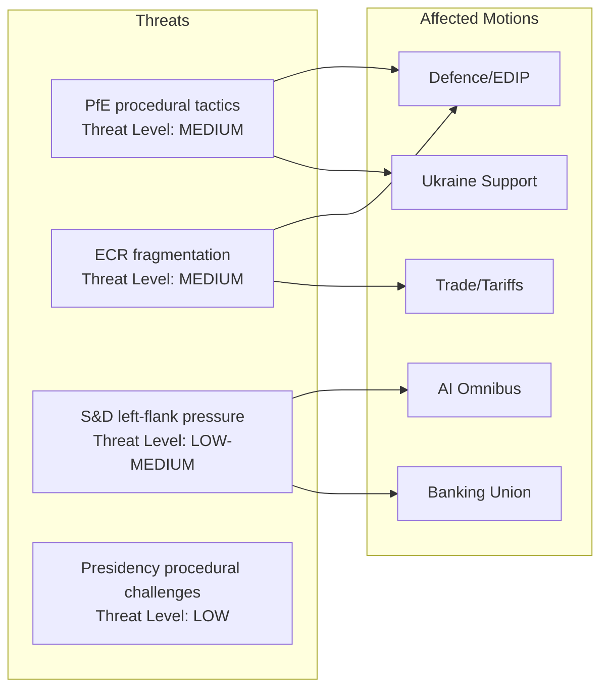

# Political Threat Landscape: EU Parliament Motions — April 2026

**WEP Band:** II — Low-to-moderate probability of threat materialization  
**Admiralty Grade:** B3 — Mostly reliable source, possibly true  
**Date:** 2026-04-27 | **Article Type:** motions

---

## Overview

The political threat landscape for the April 2026 EP plenary is shaped by three intersecting threat domains: institutional-political (internal EP dynamics), geopolitical-external (Russia, US), and systemic-structural (EP9 coalition mathematics).

---

## Threat Domain 1: Institutional-Political

### Assessment:
The institutional-political threat domain is operating at **MEDIUM** — elevated above baseline due to the high-volume session but well within EP institutional management capacity. President Metsola has managed PfE procedural tactics effectively across EP9. The primary institutional-political risk is ECR fragmentation, which is a negotiation management issue rather than a systemic governance failure.

---

## Threat Domain 2: Geopolitical-External

**Russia/Ukraine War:**
- Year 4 of full-scale invasion creates permanent urgency premium on EP Ukraine motions
- Any ceasefire development (even partial) would require EP real-time agenda adaptation
- Current assessment: **No ceasefire development expected in April 27–30 window** (Admiralty Grade D — cannot be judged; geopolitical situation fluid)

**US Trade Pressure:**
- Trump administration 25–50% tariff threats create ongoing EP trade motion urgency
- April 27–30: No announced US tariff policy change as of session start
- Assessment: **Moderate US tariff escalation risk (20% probability in 7-day window)**

**China/EU Economic Relations:**
- Less immediate than Russia/US but relevant to AI and trade texts
- China's own AI regulatory posture creates reference point for EU AI Omnibus debate
- Assessment: **Low immediate threat (below baseline)**

---

## Threat Domain 3: Systemic-Structural

**EP9 Coalition Architecture:**
The ninth EP term (2024–2029) inherited a more fragmented parliament than EP8, with PfE as the third-largest group and ESN as a new hard-right force. The structural threat is not this session but the cumulative: if ECR continues to fragment, if Renew's centrist liberal space erodes, the EPP+S&D+Renew 397-seat coalition will become more costly to maintain. This session is a stress test—successful high-volume passage reinforces coalition incentives.

**Fragmentation Index (current):** 0.36 (higher = more fragmented)
**Effective number of parties (ENP):** ~6.2
**Coalition viability score:** 73/100 (early warning system)

**Assessment:** Structural threat is **LOW for this session** but **MEDIUM over 12-month horizon** as ECR identity politics evolves and Renew faces French domestic pressures.

---

## Threat Landscape Summary

| Domain | Current Level | 7-Day Probability of Escalation | 12-Month Trend |
|--------|---------------|--------------------------------|----------------|
| Institutional-Political | 🟡 MEDIUM | 30–40% (PfE tactics) | → Stable |
| Geopolitical-External | 🟡 MEDIUM | 15–20% (US tariff/Ukraine) | ⬆️ Increasing |
| Systemic-Structural | 🟢 LOW | <5% (this session) | ⬆️ Rising slowly |

**Overall threat landscape: 🟡 MEDIUM.** No domain is at HIGH or CRITICAL level for this specific session. The primary short-term concern is PfE procedural tactics reducing session efficiency; the medium-term structural concern is ECR fragmentation trajectory.

*Confidence: 🟡 Medium. Sources: EP composition data, coalition analysis, early warning system.*
