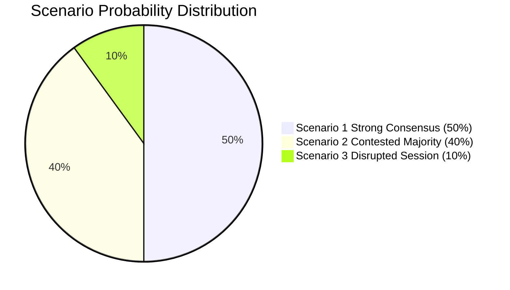

# Scenario Forecast: EU Parliament Motions — April 2026

**WEP Band:** III — Significant uncertainty, multiple distinct outcomes  
**Admiralty Grade:** B3 — Mostly reliable source, possibly true  
**Date:** 2026-04-27 | **Article Type:** motions

---

## Forecasting Framework

Three scenarios are constructed using a structured probability-weighted approach. Each scenario is assigned a plausibility weight based on current coalition structure, historical EP performance, and geopolitical context.

---

## Scenario 1: Strong Consensus Plenary (Probability: 50%)

**Conditions:** ECR supports defence and Ukraine texts; PfE procedural tactics limited; AI Omnibus amendment package negotiated to compromise; banking union text passes with broad EPP+S&D+Renew majority.

**Key events:**
- April 28: Ukraine support motion passes 460+ votes; trade resolution 400–420
- April 29: Defence/EDIP passes 430–450; AI Omnibus passes 390–410
- April 30: SRMR3 passes 380–410; Rule of Law motion passes 390–420

**Consequences:**
- Commission receives strong multi-domain mandate for competitiveness, defence, and digital agendas
- Von der Leyen Commission enters Q2 2026 with maximum legislative credibility
- EU strategic direction signal to partners (US, Ukraine, China): cohesive and directive
- ECR's co-authorship of key margins enhances its institutional influence

**WEP assessment:** 🟢 FAVORABLE for EU governance trajectory

---

## Scenario 2: Contested Majority Session (Probability: 40%)

**Conditions:** ECR fragmentation reduces margins on 1–2 defence/trade texts; Greens/Left amendment packages complicate AI Omnibus; PfE procedural tactics extend sessions; one major text produces a split or weakened outcome.

**Key events:**
- Defence/EDIP passes 380–400 with Italian FdI abstaining on procurement clause
- AI Omnibus passes with significant Greens/Left amendments restoring enforcement provisions — outcome: stronger regulation than EPP/Renew wanted, weaker than Left/Greens wanted
- Trade resolution passes 370–390 with bilateral-only language inserted by ECR
- Ukraine continues strong (440+)

**Consequences:**
- Contested mandates on defence and trade; Commission has room to manoeuvre but no clear political instruction
- AI regulatory outcome disappoints both industry (over-regulated) and rights advocates (under-enforced)
- Political narrative: "EP divided on Europe's direction" — exploitable by PfE and EU-skeptic media
- ECR emerges as kingmaker rather than partner

**WEP assessment:** 🟡 MIXED — legislative output exists but authority contested

---

## Scenario 3: Disrupted Session (Probability: 10%)

**Conditions:** External shock (Ukraine ceasefire announcement OR major US tariff escalation) triggers agenda restructuring; PfE+ESN coordinated procedural assault delays key votes; ECR walks out on a motion.

**Key events:**
- Emergency plenary session called for Ukraine crisis management
- Defence and trade texts deferred to May mini-plenary
- Banking union SRMR3 fails in first vote (majority not reached due to absences)
- Urgency resolutions dominate April 30

**Consequences:**
- Major delay in Commission mandate delivery
- Political crisis narrative dominates European media
- ECR/PfE claim "EP cannot govern effectively"
- Commission forced to act via delegated acts rather than EP mandate

**WEP assessment:** 🔴 ADVERSE — significant institutional and political costs

---

## Forecast Summary

---

## Key Forecast Indicators

| Indicator | Scenario 1 Signal | Scenario 2 Signal | Scenario 3 Signal |
|-----------|------------------|------------------|------------------|
| ECR rollcall cohesion | No split votes | 1–2 abstentions | Walkout/rejection |
| PfE rollcall requests | <5 across session | 5–10 spread | >15 mass blocking |
| External shock | None | Tariff adjustment | Ceasefire/major event |
| Vote margins | >420 on all major texts | 362–400 on 2+ texts | Below 361 on any |

**Base case forecast: Scenario 1 (50%) or Scenario 2 (40%), with Scenario 2 most likely for the AI Omnibus specifically. Ukraine and banking union texts track toward Scenario 1. Defence tracks toward a Scenario 1/2 hybrid depending on EDIP procurement clause language.**

**Overall confidence: 🟡 Medium.** Structural analysis with medium-confidence probabilistic estimates.
