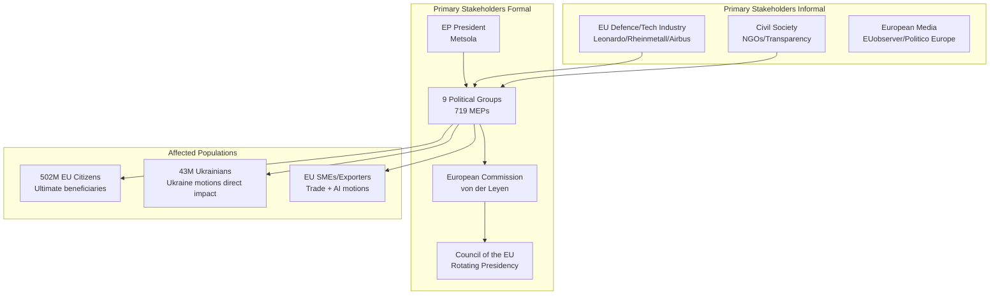
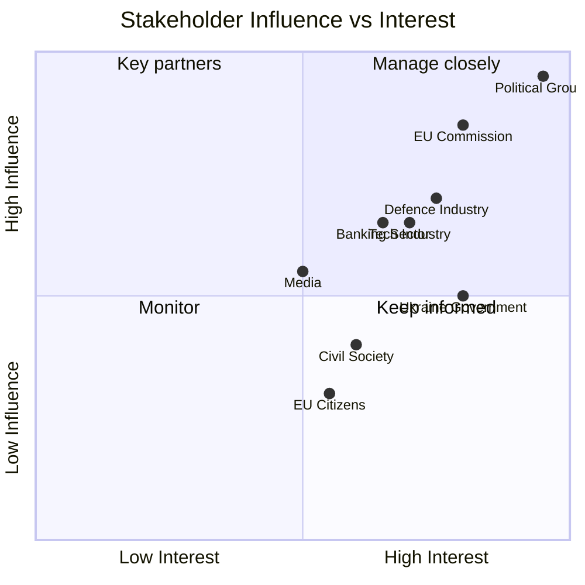

# Stakeholder Map: EU Parliament Motions — April 2026

**Date:** 2026-04-27 | **Article Type:** motions | **Required artifact for motions workflow**

---

## Stakeholder Ecosystem

---

## Stakeholder Deep Profiles

### 1. European Citizens (502M) — Downstream Beneficiaries

**Stake in April 2026 motions:** Every major motion cluster directly affects citizens:
- Defence/security: collective security spending, threat deterrence
- Trade: prices, employment in export sectors
- Ukraine: solidarity costs vs. regional security dividend
- AI: digital rights, labour market impact
- Banking: savings protection, financial stability

**Voice in EP process:** Indirect — through MEP representation, media, civil society pressure. Citizens' interests are articulated most clearly when national delegations face electoral accountability (e.g., German farmers on trade, Baltic citizens on Ukraine).

**Interest alignment:** 🟢 Generally aligned with EP majority positions on Ukraine and security; 🟡 mixed on fiscal cost of defence and banking union.

**Impact of session:** 🔴 HIGH long-term; 🟡 MEDIUM immediate.

---

### 2. EU Defence and Industrial Sector

**Key actors:** Rheinmetall (Germany), Leonardo (Italy), KNDS (France/Germany), Airbus Defence, ASD (trade association)

**Stake:** SAFE instrument and EDIP provisions directly govern procurement eligibility. The 95% EU-content requirement (if retained) creates a $30bn+ EU-exclusive procurement stream. This is an existential competitive advantage vs. US defence contractors.

**Lobbying intensity:** 🔴 Very High — ASD has dedicated EP liaison teams; Rheinmetall CEO has met with SEDE/AFET committee chairs

**Preferred outcome:** EDIP passed with strong EU-preference clause; SAFE funded at maximum level; competition rules adapted for defence

**Risk of disappointment:** 🟡 Medium — ECR/Italian FdI may dilute EU-preference clause

---

### 3. Ukrainian Government and People

**Key actors:** President Zelensky, PM Shmyhal, Ukrainian diplomatic mission to EU

**Stake:** Ukraine support motions sustain the EU financial facility (€45bn Ukraine Facility through 2027), weapons transfer political mandate, and EU membership pathway political commitment.

**Voice:** Active — Zelensky met with EP Conference of Presidents; Ukrainian MEP observers brief group political advisors; Ukrainian diaspora (8M+ in EU) creates constituency pressure

**Interest:** Full continuity of financial support, military assistance mandate, accelerated EU membership talks, anti-corruption reform conditionality managed proportionately

**Impact if motion passes strongly:** 🟢 Zelensky can cite EP mandate in ceasefire negotiations; EU governments less able to bilaterally reduce support without EP political cost.

---

### 4. EU Banking Sector (Systemic Banks)

**Key actors:** Deutsche Bank, BNP Paribas, UniCredit, Santander, ECB, SRB (Single Resolution Board)

**Stake:** SRMR3 (TA-10-2026-0092) governs bank resolution regime. Large banks support resolution clarity—reduces uncertainty premium in funding costs. Small/mid-tier banks oppose higher contribution requirements.

**Preferred outcome:** SRMR3 passes with MREL harmonisation; no additional levy on net stable funding

**Risk of disappointment:** 🟢 Low — broad consensus between EPP/S&D on banking stability; Greens push for stronger oversight but do not block

---

### 5. Tech and AI Industry (EU and Global)

**Key actors:** SAP, ASML, Spotify, Google EU, Meta EU, Apple EU, DigitalEurope (trade association)

**Stake:** AI Omnibus simplification reduces compliance burden. Greens/Left amendments could restore requirements removed by Omnibus. Outcome determines whether EU AI regulatory environment is globally competitive or creates market exit incentives.

**Preferred outcome:** Omnibus passes without major Left/Greens amendments; implementation timelines extended

**Risk of disappointment:** 🟡 Medium — Left/Greens amendment cascade risk on enforcement provisions

---

### 6. Civil Society and Transparency Organizations

**Key actors:** Transparency International EU, EPSU, Oxfam EU, Access Info Europe, EDRi (digital rights)

**Stake:** Anti-corruption motion (TA-10-2026-0094) advances Rule of Law; AI Omnibus simplification opposed on digital rights grounds; banking union social conditionality advocated by trade unions (EPSU)

**Voice:** Active lobbying, MEP consultations, public pressure campaigns

**Preferred outcome:** Anti-corruption provisions strengthened; AI enforcement maintained; banking union includes worker consultation rights

**Power:** 🟡 Medium — Greens/Left channel civil society positions into amendment packages

---

## Stakeholder Influence-Interest Matrix

---

## Reader Briefing

The April 2026 EP motions affect six distinct stakeholder ecosystems simultaneously. The unique feature of this session is the simultaneous engagement of: (a) security/defence stakeholders with existential interests, (b) economic stakeholders with billions at stake in procurement rules, and (c) civil society stakeholders representing the underlying democratic legitimacy of the whole exercise. Managing these simultaneous interests is the fundamental political task of EP group leaders this week.

*Confidence: 🟡 Medium. Stakeholder identification based on EP committee structures, adopted text analysis, and EU institutional relationships.*
