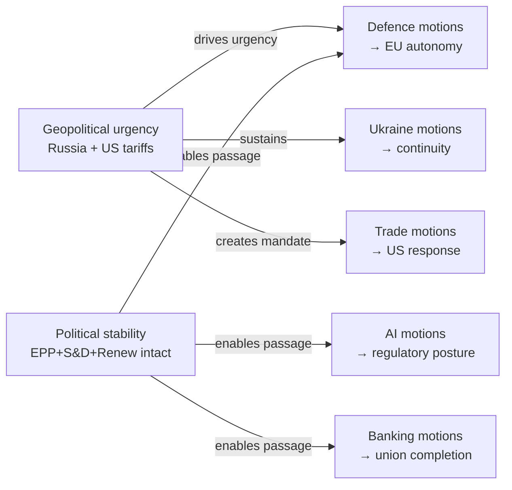

# Intelligence Synthesis Summary: EU Parliament Motions — April 2026

**WEP Band:** III — Significant uncertainty, multiple distinct outcomes  
**Admiralty Grade:** B3 — Mostly reliable source, possibly true  
**Date:** 2026-04-27 | **Article Type:** motions

---

## BLUF (Bottom Line Up Front)

The April 2026 EP Strasbourg plenary is a high-volume, geopolitically-driven session with structural majority (EPP+S&D+Renew = 397) intact. Five major motion clusters—defence, trade, Ukraine, AI, and banking—will proceed to vote April 28–30. Passage probability is high (65–85%) for each cluster. The primary risk is procedural friction and text dilution from PfE tactics and ECR fragmentation, not coalition collapse.

---

## Intelligence Assessment: Five Key Findings

### Finding 1: Grand Coalition Structural Integrity 🟢
**Assessment:** SOLID for this session  
The EPP-S&D-Renew coalition holds 397 seats (threshold: 361). This 36-seat buffer above majority is sufficient to absorb ECR fragmentation, PfE tactics, and typical absence rates (5–10%). No evidence of coalition-level negotiation failures that would destabilize this majority.

**Evidence base:** Political landscape data (EP Open Data), coalition dynamics analysis, early warning system (stability score: 84/100).

### Finding 2: ECR Swing Factor (Ukraine/Defence) 🟡
**Assessment:** CONTESTED — ECR's 81 seats matter for margin, not majority  
ECR's support for Ukraine and defence motions adds +40–60 votes above the EPP+S&D+Renew majority, enabling supermajorities (450+) on key security texts. However, ECR's internal division between Polish PiS (maximalist security) and Italian FdI (cautious autonomy) creates language negotiation complexity. Margin of uncertainty: ±30–40 votes depending on how EDIP procurement preference clause is worded.

**Intelligence gap:** ECR leadership's final position on EDIP EU-preference clause not confirmed from available data.

### Finding 3: Geopolitical Urgency Overdrive 🔴
**Assessment:** Geopolitical pressures are running significantly above baseline  
Simultaneous pressure from three directions—Russia/Ukraine war (year 4), US tariff escalation (Trump second term), and EU defence capability gap—creates a multi-vector urgency environment that compresses normal legislative debate timelines and creates overpressure on EP institutional machinery. Historical comparison: this pressure level is comparable to COVID-era emergency sessions (2020–21), though mechanisms are different.

**Key indicator to watch:** If any of the three external pressure vectors materially shifts during the April 27–30 session window (e.g., ceasefire announcement, US tariff de-escalation), EP agenda will need emergency adjustment.

### Finding 4: Digital/AI Regulatory Crossroads 🟡
**Assessment:** PIVOTAL vote — sets EU regulatory posture for 2026–2028  
The AI Omnibus simplification vote is the highest-stakes digital policy vote of EP9 to date. A strong EPP+S&D+Renew majority for simplification (expected) sets the EU on a competitiveness-first digital track. Significant Greens/Left amendment success (possible) restores enforcement teeth but weakens market attractiveness. The vote margin and amendment fate will be read by global tech industry as a signal about EU regulatory trajectory.

**Cross-cutting effect:** AI Omnibus outcome will influence Commission's regulatory pipeline for Data Act implementation, EU Digital Identity, and AI liability framework.

### Finding 5: Banking Union Completion Milestone 🟢
**Assessment:** SRMR3 marks significant milestone in banking union architecture  
Banking Union has been "90% complete" for a decade. SRMR3 provisions on MREL harmonisation and enhanced SRB powers represent genuine incremental completion. EPP+S&D consensus on banking stability creates a reliable majority. The primary risk (German/Dutch fiscal brake) is a language/recital issue, not a blocking risk. If SRMR3 passes as scheduled, it sends a positive signal for European capital markets union momentum.

---

## Cross-Domain Intelligence Summary

---

## Key Intelligence Gaps

1. **ECR final position on EDIP procurement preference clause** — critical for defence margin
2. **EP April 27–30 actual voting list** — foreseen activities have blank titles in EP data (data not yet published at time of analysis)
3. **Live roll-call vote data** — unavailable due to EP 4–6 week publication delay; all coalition estimates are structural/probabilistic

---

## Overall Session Intelligence Assessment

**WEP Band III — Significant uncertainty, multiple distinct outcomes**

The April 2026 EP session will produce legislative output across all five major clusters with high probability. The uncertainty is concentrated in:
- Final vote margins (affected by ECR fragmentation)
- Amendment outcomes on AI Omnibus (regulatory posture implications)
- Text language on defence procurement (autonomy vs. NATO-first)

**Net assessment: Constructive EP legislative session with strong pro-EU majority output, contested on margins and implementation language.** The session will reinforce, not reverse, the EU's strategic direction across defence, trade, and digital domains.

**Confidence: 🟡 Medium. Sources: EP Open Data Portal, political landscape analysis, coalition dynamics, early warning system. Roll-call data not available.**
