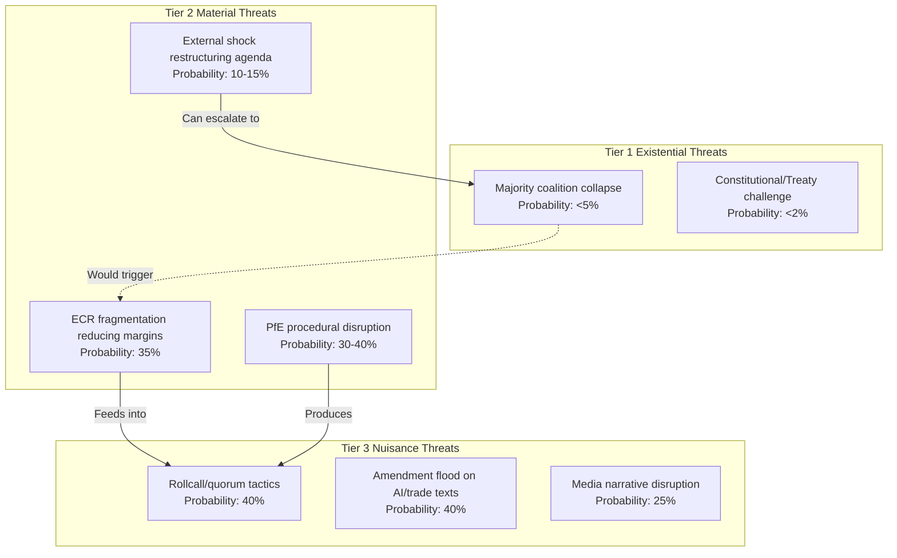

# Threat Model: EU Parliament Motions — April 2026

**WEP Band:** II-III — Low-to-moderate uncertainty on threat sources  
**Admiralty Grade:** B3 — Mostly reliable source, possibly true  
**Date:** 2026-04-27 | **Article Type:** motions

---

## Threat Model Summary

The EP institutional threat environment for April 2026 motions is characterized by: (a) strong internal coalition resilience, (b) systematic external opposition from PfE/ESN/Hungary, and (c) elevated geopolitical threat amplification driving urgency. No existential threats to the EP's legislative capacity are identified.

---

## Threat Taxonomy

---

## Tier 2 Threat Deep Analysis

### T2A: ECR Fragmentation
**Threat vector:** ECR's 81 seats are crucial for supermajority on defence texts. Internal fracture between PiS (Poland) and FdI (Italy) on EU-preference procurement clause could reduce margins by 20–40 votes on EDIP.  
**Probability:** 🟡 35%  
**Impact:** Vote margin falls from 430+ to 380–400; contested mandate, reduced Commission authority  
**Countermeasures:** AFET/SEDE rapporteur text accommodation; bilateral language in recitals; Weber-ECR leadership back-channel

### T2B: PfE Systematic Procedural Assault
**Threat vector:** PfE tables rollcall requests on all major texts, split vote requests on AI Omnibus, and potentially challenges procedural rulings. Combined effect: 2–3 hours added voting time; some motions slip to Friday.  
**Probability:** 🟡 30–40%  
**Impact:** Agenda slippage; reduced margins due to absence of MEPs with travel Friday  
**Countermeasures:** Conference of Presidents pre-agreement; President Metsola procedural authority; EPP whipping operation

### T2C: External Shock
**Threat vectors:** (a) Ukraine ceasefire announcement → emergency plenary restructuring; (b) Major US tariff escalation → trade text revision required; (c) Major security incident → session suspension  
**Probability:** 🟡 10–15% for any one event in 7-day window  
**Impact:** Highest impact scenario — restructures entire session agenda, delays non-emergency motions by 2–4 weeks  
**Countermeasures:** EP established emergency procedures; Conference of Presidents real-time authority

---

## Threat Assessment: Information Environment

The EP's legislative threat environment includes a secondary information domain: PfE, ESN, and associated media ecosystems will frame session outcomes in ways designed to amplify division narratives. This is not a direct legislative threat but creates a political cost that affects subsequent sessions.

**Information threat indicators:**
- Russian state media amplifying PfE-aligned narratives on Ukraine motions
- EU-skeptic national media framing banking union as "German taxpayers bail out Mediterranean banks"
- Far-right social media amplifying any ECR fracture as evidence of EPP overreach

**Mitigation:** EP Communication Directorate proactive messaging; EP Research Service factsheets; MEP communication toolkits

---

## Overall Threat Assessment

**WEP Band II-III:** The April 2026 plenary faces a substantive but manageable threat environment. No Tier 1 existential threats are active. Tier 2 threats (ECR fragmentation, PfE tactics, external shock) have meaningful probability but are within the EP's institutional management capacity. The most material risk to legislative outcomes is ECR fragmentation on the EDIP text—a risk that rapporteur-level negotiation can and likely will manage.

**Admiralty Grade B3:** Sources are mostly reliable; assessed information is possibly true. The primary intelligence gap is ECR's final position on EDIP, which requires direct confirmation not available from EP open data.

*Confidence: 🟡 Medium.*
