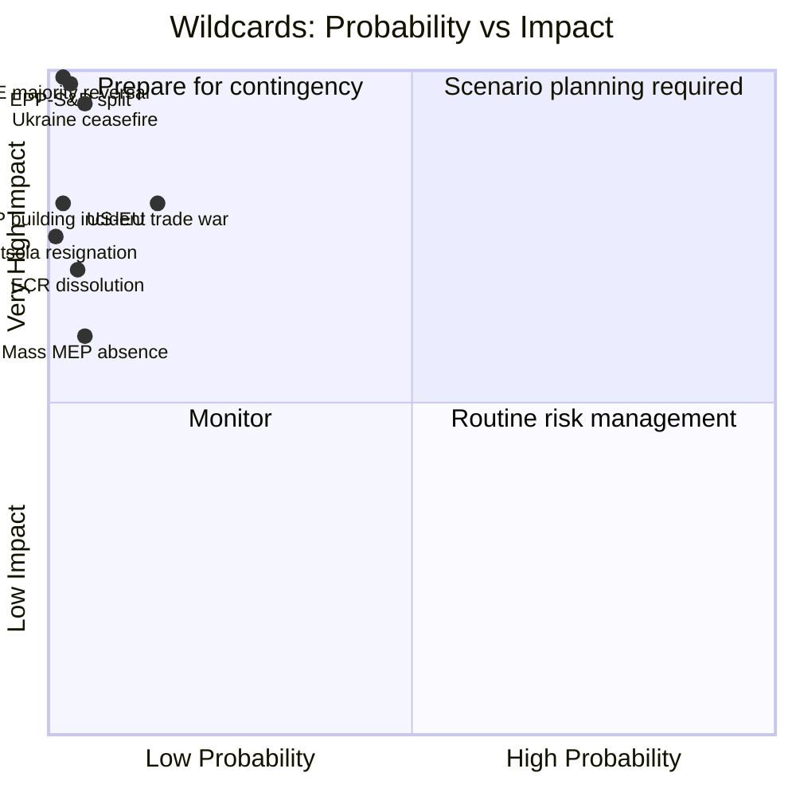

# Wildcards and Black Swans: EU Parliament Motions — April 2026

**WEP Band:** IV — High uncertainty, low-probability/high-impact scenarios  
**Admiralty Grade:** F5 — Reliability cannot be judged; information is improbable  
**Date:** 2026-04-27 | **Article Type:** motions

---

## Overview

Wildcards are low-probability events that would materially alter the April 2026 session outcomes if they occurred. Black swans are unprecedented events that current models do not anticipate but whose consequences would be systemic.

---

## Wildcard Matrix

---

## Wildcard 1: Ukraine Ceasefire Announcement

**Probability:** 🔴 Very Low (3–5% in 7-day window)  
**Impact if realized:** 🔴 Catastrophic for current legislative planning  
**Description:** A credible ceasefire announcement—even partial—would trigger an immediate EP emergency response. The Conference of Presidents would likely suspend the pre-planned voting agenda and call an emergency debate. All Ukraine support motions would require revision to accommodate a new political reality. Defence motions would face immediate re-evaluation of urgency framing.

**What EP would do:**
1. Emergency Conference of Presidents session
2. Emergency plenary debate on ceasefire terms
3. Suspension of Ukraine financial facility motion pending ceasefire compliance assessment
4. New urgency resolution on peace monitoring mechanism

**Who benefits politically:** Left/Greens (peace dividend); PfE (vindication of "diplomacy not weapons" narrative); moderate S&D (balanced response)  
**Who loses:** ECR Eastern bloc (security concerns unresolved); defence industry (procurement urgency reduced)

---

## Wildcard 2: Full-Scale US-EU Trade War

**Probability:** 🔴 Low (10–15% in 30-day window; <5% in 7-day window)  
**Impact if realized:** 🔴 Very High  
**Description:** A surprise US announcement of 50%+ tariffs on all EU imports would render EP trade resolution language obsolete and trigger an emergency Commission mandate. The EP would likely adopt an emergency trade authorization motion.

**What EP would do:**
1. Emergency INTA committee session
2. Revised trade motion with maximum Commission negotiating mandate
3. Possible Article 222 TFEU-adjacent emergency authorization

**Net effect on this session:** Trade motions deferred or radically revised; defence motions may accelerate as EU-US relations deteriorate

---

## Wildcard 3: Major EP Coalition Fracture (EPP-S&D Split)

**Probability:** 🔴 Extremely Low (<3%)  
**Impact if realized:** 🔴 Catastrophic  
**Description:** A fundamental breakdown in EPP-S&D cooperation—e.g., a scandal implicating EP leadership from both groups, or a fundamental policy disagreement on banking union that leads to public mutual condemnation—would collapse the coalition majority. Without EPP+S&D cooperation, Renew alone cannot form majority.

**Historical precedent:** No such coalition collapse in EP history. Closest comparison: QatarGate scandal (2022) targeted S&D but EPP maintained cooperation.

**Assessment:** This is a black swan, not a wildcard—it would require a catastrophic triggering event with no current indicators.

---

## Wildcard 4: Sudden ECR Dissolution

**Probability:** 🔴 Very Low (<4%)  
**Impact if realized:** 🟡 High  
**Description:** ECR's internal fragmentation (PiS vs FdI) could theoretically reach a breaking point where the group formally dissolves or splits into two. This would not change absolute seat counts but would eliminate ECR as a coherent swing actor, forcing each national delegation to vote independently.

**Net effect:** Increases unpredictability on swing votes; may actually benefit EPP+S&D+Renew (some ECR members would move closer to EPP)

---

## Black Swan Horizon

Beyond the wildcards above, three genuinely unprecedented scenarios could emerge over the EP9 term (2024–2029) with very low probability but transformative impact:

1. **PfE achieving majority** (would require 2027 elections shifting 150+ seats) — would fundamentally alter EU governance
2. **EU treaty crisis** (a large member state triggering Article 7 response failure) — EP would face constitutional legitimacy questions  
3. **AI-driven information warfare targeting EP voting** (coordinated influence operation on MEP positions) — novel threat with no precedent

**Admiralty Grade F5** on all three: improbable, cannot be judged, but worth scenario-planning.

---

## Reader Briefing

Wildcards and black swans are included in intelligence analysis not because they are likely but because their occurrence would make all other analysis irrelevant. For the April 2026 session, the base case (Scenarios 1–2 in the forecast) is strongly dominant. The wildcard matrix serves primarily as a navigation guide for decision-makers: if any of these events emerge during April 27–30, the analytical framework should be immediately updated.

*Confidence: 🔴 Low (by design — these are low-probability scenarios). Sources: Historical EP precedent, geopolitical situational awareness.*
