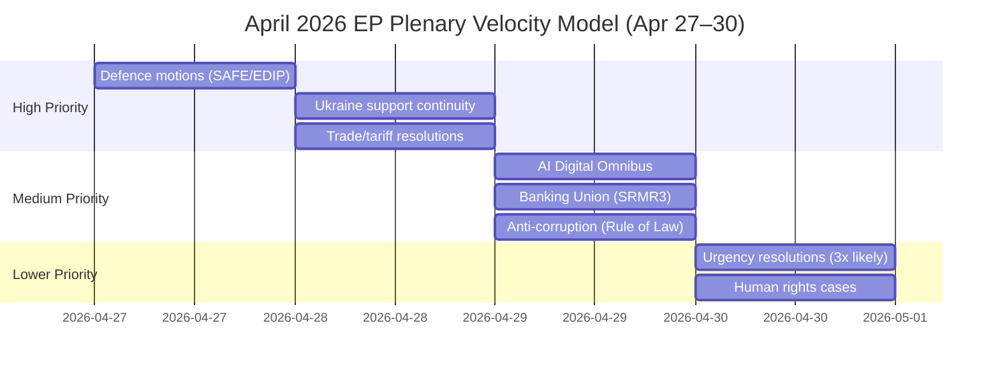

# Legislative Velocity Risk: EU Parliament Motions — April 2026

**Date:** 2026-04-27 | **Article Type:** motions

---

## Velocity Risk Overview

Legislative velocity risk measures whether the April 2026 plenary can process its full scheduled agenda within available time, and whether procedural or political obstacles will delay, dilute, or defer key motions.

---

## Pipeline Velocity Model

---

## Velocity Risk Factors

### Factor 1: Agenda Crowding (🔴 HIGH)
April 28 has 31 foreseen activities (13 debates + 6 votes based on EP data); April 29 has 31 items (12 debates + 14 votes). This is at the upper bound of typical plenary productivity. Each additional urgent resolution (minimum 3 expected based on geopolitical situation) adds ~45-90 minutes to the voting list.

**Velocity impact:** 🔴 High — real risk that some motions slip to April 30 mini-plenary or are deferred

### Factor 2: Rollcall Request Load (🟡 MEDIUM)
PfE routinely requests rollcall votes (requiring 1/5 of MEPs = ~144 signatures) on contentious texts. If PfE tables rollcall requests on all five major motion clusters, this adds 2–3 hours to voting time across the week.

**Velocity impact:** 🟡 Medium — slows but does not stop; reduces time for discussion

### Factor 3: Split Vote Mechanics (🟡 MEDIUM)
Left/Greens and ECR routinely request split votes on omnibus texts. AI Omnibus and trade response texts are most vulnerable—these can contain 20–40 separate voting clauses.

**Velocity impact:** 🟡 Medium — manageable; IMCO/INTA rapporteurs pre-negotiate split vote packages

### Factor 4: Quorum Risk (🟢 LOW)
Quorum (1/3 of MEPs = 240 seats) is rarely an issue in full Strasbourg plenary. However, late Thursday and Friday sessions see attendance drops. April 30 morning voting session has quorum risk for non-priority motions.

**Velocity impact:** 🟢 Low — only affects April 30 late agenda items

---

## Velocity Indicators

| Indicator | Current Status | Trend | Risk |
|-----------|----------------|-------|------|
| Scheduled voting slots (Apr 28) | 6 formal votes | ⬆️ Increasing with urgencies | 🟡 Medium |
| Foreseen activities (Apr 29) | 14 votes | ⬆️ High load | 🔴 High |
| Historical adoption rate (Q1 2026) | ~35 texts/session week | → Stable | 🟢 Low |
| EP plenary session length precedent | 4-day full plenary | → Standard | 🟢 Low |
| Urgency resolutions pending | ~3 estimated | ⬆️ Geopolitical driver | 🟡 Medium |

---

## Velocity Assessment

**Overall velocity risk: 🟡 Medium.** The EP's institutional machinery is designed for exactly this type of high-volume plenary, and the April 2026 session falls within historical norms. The primary risk is not systemic failure but **agenda prioritization pressure**: if multiple high-priority items compete for Thursday afternoon votes, lower-priority motions may slip to less well-attended Friday sessions, reducing their final margins.

*Confidence: 🟡 Medium. Based on foreseen activity counts (EP Open Data), historical session patterns.*
