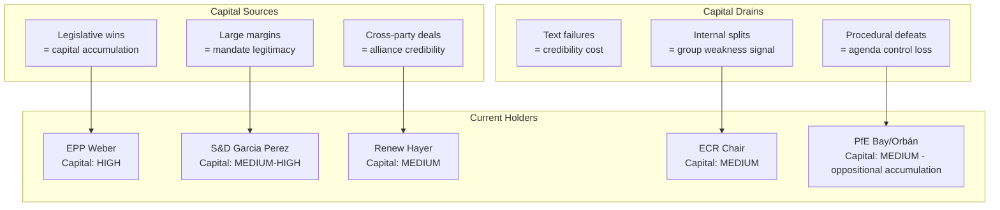

# Political Capital Risk: EU Parliament Motions — April 2026

**Date:** 2026-04-27 | **Article Type:** motions

---

## Political Capital Overview

Political capital in the EP context means the ability of group leaders, rapporteurs, and the EP President to spend or accumulate credibility, alliance commitments, and leverage through the outcomes of this session.

---

## Political Capital Flow

---

## Per-Group Capital Risk Analysis

### EPP (Weber) — Current capital: HIGH
**Risks this session:**
- If defence texts pass with large margins: EPP gains agenda-setting credibility on security/competitiveness narrative
- If CDU/CSU fiscal brake derails banking union language: EPP exposed as internally inconsistent
- If AI Omnibus simplification prevails: EPP competitiveness narrative validated
**Net risk:** 🟢 Low — EPP positioned to gain capital regardless of precise outcomes; even contested results can be framed as EPP pragmatism

### S&D (García Pérez) — Current capital: MEDIUM-HIGH
**Risks this session:**
- If social conditionality clauses survive in trade/banking motions: S&D demonstrates it adds value as coalition partner
- If S&D votes for defence texts without peace process provisions: left flank damage, Greens/Left critical commentary
- If S&D splits on Ukraine support (unlikely): catastrophic for S&D's cross-national credibility
**Net risk:** 🟡 Medium — navigating left flank while maintaining coalition reliability is S&D's persistent tension

### Renew (Hayer) — Current capital: MEDIUM
**Risks this session:**
- If digital/AI simplification passes: Renew competitiveness narrative wins
- If French RN (PfE) publicly frames outcomes as "Hayer's Brussels overreach": French domestic political cost
- If Renew abstains on defence texts due to autonomy concerns: NATO allies note it
**Net risk:** 🟡 Medium — French political context creates asymmetric domestic pressure

### ECR — Current capital: MEDIUM (split)
**Risks this session:**
- ECR's support for Ukraine/defence earns it legitimacy with pro-EU establishment
- But: Italian FdI members face pressure from government on EU defence autonomy
- ECR split vote on any major text = visible internal fracture
**Net risk:** 🟡 Medium — ECR's capital depends on maintaining coherent split between "security conservatives" and "sovereignty conservatives"

### PfE (Bay/Orbán) — Oppositional capital: MEDIUM
**Risks this session:**
- PfE votes against everything → confirms oppositional identity, accumulates capital with base
- Risk: if PfE splits on defence (anti-NATO vs. pro-EU-sovereignty members), group coherence questioned
- Hungary/Orbán's systematic opposition increasingly marginalizes rather than empowers
**Net risk:** 🟢 Low (for PfE's purposes) — opposition is its political product; procedural tactics are features, not bugs

---

## Capital-at-Risk Summary

| Group | Capital at Stake | Probability of Loss | Expected Impact |
|-------|-----------------|--------------------|-|
| EPP | Alliance credibility on defence | 🟢 20% | 🟡 Medium |
| S&D | Left flank coherence | 🟡 40% | 🟡 Medium |
| Renew | Competitiveness narrative | 🟢 25% | 🟡 Low-Medium |
| ECR | Internal coherence | 🟡 45% | 🟡 Medium |
| PfE | Oppositional brand | 🟢 10% | 🟢 Low |

*Overall session political capital risk: 🟡 Elevated for S&D and ECR; manageable for EPP, Renew, and PfE.*
