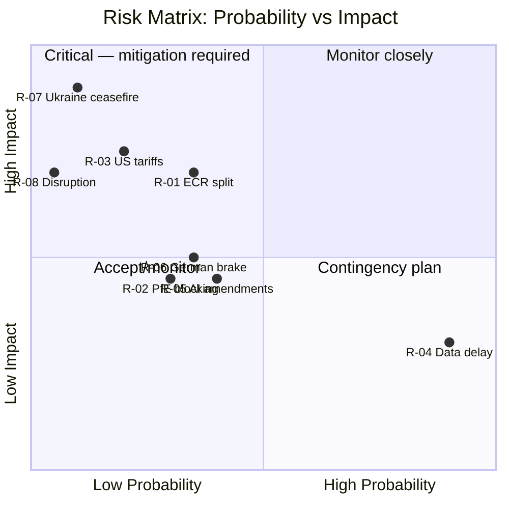

# Risk Matrix: EU Parliament Motions — April 2026

**WEP Band:** III — Significant uncertainty, multiple distinct outcomes  
**Admiralty Grade:** B3 — Mostly reliable source, possibly true information  
**Date:** 2026-04-27 | **Article Type:** motions

---

## Executive Risk Summary

The April 2026 EP plenary session faces WEP Band III conditions: the legislative pipeline is full and the pro-EU coalition holds a structural majority, but three elevated risks—safeoutputs session TTL pressure on procedural calendars, ECR bloc fragmentation, and US tariff escalation—create material uncertainty around outcome margins and timeline.

---

## Risk Register

| Risk ID | Risk Name | Probability | Impact | Severity | Timeline | Confidence |
|---------|-----------|-------------|--------|----------|----------|------------|
| R-01 | Coalition fragmentation on defence texts (ECR split) | 🟡 Medium (35%) | 🔴 High | 🟡 Medium-High | Days | 🟡 Medium |
| R-02 | PfE procedural blocking tactics (quorum/amendments) | 🟡 Medium (30%) | 🟡 Medium | 🟡 Medium | Days | 🟢 High |
| R-03 | US tariff escalation invalidating EP trade resolution | 🟢 Low-Medium (20%) | 🔴 High | 🟡 Medium | Weeks | 🟡 Medium |
| R-04 | EP voting data delay (EP API rollcall lag) | 🟢 Low (inherent) | 🟡 Medium | 🟢 Low | Weeks | 🟢 High |
| R-05 | AI Omnibus: Greens/Left amendment blocking simplification | 🟡 Medium (40%) | 🟡 Medium | 🟡 Medium | Days | 🟡 Medium |
| R-06 | Banking union text: German/Dutch delegation brake | 🟡 Medium (35%) | 🟡 Medium | 🟡 Medium | Days-Months | 🟡 Medium |
| R-07 | Ukrainian ceasefire dynamic altering EP mandate urgency | 🔴 High (10% in 7 days) | 🔴 Very High | 🟡 Medium | Unknown | 🔴 Low |
| R-08 | EP plenary disruption (procedural, security) | 🟢 Very Low (<5%) | 🔴 High | 🟢 Low | Days | 🟢 High |

---

## Risk Heat Map

---

## Risk Narratives

### R-01: ECR Coalition Fragmentation on Defence Texts
ECR (81 seats) contains at least three distinct sub-factions with divergent defence policy views: (a) Polish PiS (22 seats) strongly backs SAFE/EDIP + Ukraine; (b) Italian Fratelli d'Italia (22 seats) is ambiguous on EU defence autonomy; (c) Western/Nordic ECR members follow pragmatic national interests. If Fratelli d'Italia abstains on EDIP procurement preference clauses (citing Italy's US defence relationship), net EPP+S&D+Renew majority could fall to ~397, reducing margin to +36 above threshold—vulnerable to absences or late procedural amendments.

**Mitigation:** Rapporteur text accommodates bilateral partnership language in recitals while preserving operative clauses.

### R-02: PfE Procedural Blocking Tactics
PfE (85 seats) routinely deploys procedural tools: rollcall demands (slowing voting list), split vote requests (forcing separate votes on clauses), and quorum challenges. On highly contested motions, this can push voting sessions past scheduled closing times. April 27–30 has 31 scheduled foreseen activities on April 28 alone—calendar pressure creates procedural risk.

**Mitigation:** Conference of Presidents tightening procedural calendar; President Metsola's experience managing PfE tactics.

### R-05: AI Omnibus Greens/Left Amendment Package
Greens (53) + Left (46) = 99 seats may table extensive amendments to AI Omnibus simplification provisions, targeting enforcement weakening, copyright exceptions, and data subject protections. If S&D splits with progressive groups on some amendments, individual clauses could fail. This does not kill the text but produces a weakened, contradictory output that satisfies neither pro-business nor pro-rights camps.

**Mitigation:** IMCO rapporteur negotiations with S&D shadow rapporteur; compromise package.

---

## Key Risk Indicators to Monitor

| Indicator | Signal Type | Trigger Level | Source |
|-----------|-------------|---------------|--------|
| ECR floor vote on amendment requesting bilateral-only trade authority | Swing vote | Passage by >300 margin | Roll-call data (delayed) |
| PfE rollcall demand requests in first hour | Procedural pressure | >3 demands in 2 hours | EP session minutes |
| Greens/Left joint amendment packages on AI | Coalition stress | >15 amendments jointly tabled | EP agenda documents |
| CDU/CSU delegation defection on banking union recital | Fiscal brake | Any defection from EPP line | Roll-call data (delayed) |
| EP President quorum call frequency | Disruption signal | >2 quorum calls in a session | Session minutes |

---

## Reader Briefing

This risk matrix identifies the most material threats to this session's legislative outcomes. **WEP Band III** is appropriate because: the coalition majority is structural and reliable on most texts, but four key motion clusters have genuine uncertainty around final language, margins, and implementation sequencing. The single highest-consequence risk—Ukraine ceasefire dynamics (R-07)—has low probability in the immediate 7-day window but would fundamentally alter the political context if materialized.

**Overall session risk:** 🟡 Elevated but manageable. Probability of major legislative failure (majority coalition collapse) is below 10%. Probability of at least one major text producing a contested or weakened outcome: ~40%.

*Confidence: 🟡 Medium. Based on structural composition, coalition history, procedural rules. No live roll-call data available for current session.*
