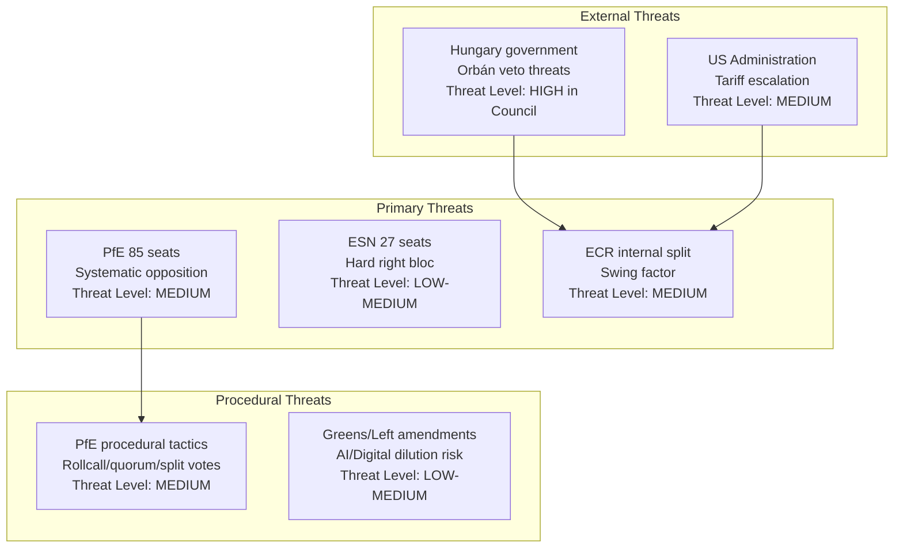

# Actor Threat Profiles: EU Parliament Motions — April 2026

**Date:** 2026-04-27 | **Article Type:** motions

---

## Overview

This document profiles actors whose actions represent material threats to the legislative objectives of the April 2026 EP plenary session. "Threat" is defined in the intelligence sense: any actor whose actions could prevent, delay, or substantially dilute the intended legislative outcome of key motions.

---

## Threat Actor Network

---

## Threat Profile 1: PfE Bloc (85 seats)

**Threat classification:** Systematic Opposition Actor  
**Threat level:** 🟡 MEDIUM (insufficient to block majority, but creates friction)  
**Primary actors:** Viktor Orbán (Fidesz/Hungary, 11 seats), Marine Le Pen's RN (France, 30 seats), Matteo Salvini's Lega (Italy, 8 seats)  
**Key threats:**
- Rollcall requests adding 2–3 hours to voting sessions
- Sovereignty-framing amendments that force recorded positions
- PfE members in key committee chairs (none in AFET/SEDE/INTA; limited leverage on this session's priority texts)
- Orbán Hungary: government-level obstruction in Council for any texts requiring Council action after EP adoption

**Assessment:** PfE cannot block any motion with EPP+S&D+Renew support. Its threat is procedural friction and messaging: making EP majority work visible and politically costly rather than blocking outcomes. The Orbán/Fidesz sub-group (11 seats) is particularly focused on Ukraine and anti-corruption motions.

---

## Threat Profile 2: ECR Internal Fracture Risk

**Threat classification:** Coalition Reliability Risk  
**Threat level:** 🟡 MEDIUM-HIGH for specific texts (defence autonomy)  
**Primary tension:** Polish PiS (pro-NATO, pro-SAFE/EDIP, strongly pro-Ukraine) vs. Italian Fratelli d'Italia (cautious on EU defence autonomy, US relationship preservation, conditionality concerns)  
**Specific threat vectors:**
- FdI abstention on EDIP EU-preference clause → reduces majority by ~22 votes
- ECR amendment on bilateral trade authority language → forces recorded split within ECR
- ECR leverage demand: rapporteurs must accommodate ECR language OR lose +80 votes from coalition

**Assessment:** ECR fragmentation risk is real but manageable. Historical pattern shows ECR sub-factions negotiate text language accommodations before floor votes rather than defecting on final vote. Key monitoring indicator: whether ECR tables coordinated amendment packages or fragmented individual amendments (the latter signals discipline breakdown).

---

## Threat Profile 3: Hungary Government (External/Council Threat)

**Threat classification:** Council-Stage Obstruction  
**Threat level:** 🔴 HIGH for anti-corruption, Rule of Law, and Ukraine continuity texts requiring Council implementation  
**Mechanism:** EP-adopted motions that require Council decisions face Hungarian blocking potential. Orbán government has systematically used qualified-majority-blocking procedures in Council on Ukraine funding and Rule of Law mechanisms.  
**EP-stage impact:** Limited—EP can adopt motions regardless of Hungary's position. But EP majorities know that texts requiring unanimous Council adoption face implementation risks, which may affect language negotiation.

**Assessment:** Hungary's threat operates primarily downstream of EP adoption. The EP has developed a strategic practice of using QMV-applicable instruments where possible and noting Hungary's objections in resolution recitals—creating political record without giving veto power.

---

## Threat Profile 4: US Tariff Escalation (External Geopolitical Threat)

**Threat classification:** External Geopolitical Actor  
**Threat level:** 🟡 MEDIUM — can modify EP motion content, not prevent adoption  
**Mechanism:** Rapid US tariff changes during the session week could render EP trade response motions obsolete or require last-minute amendments. The April 27–30 session was scheduled without certainty about US trade policy evolution.  
**Assessment:** EP typically manages this through "noting" formulations and empowering Commission to respond; the threat is that rigid text language locks EP into outdated positions.

---

## Threat Probability Summary

| Threat | Probability | Impact | Mitigation Available |
|--------|-------------|--------|---------------------|
| PfE procedural blocking | 🟡 30–40% | 🟡 Delay/friction only | Agenda management, rollcall pre-counts |
| ECR split on defence text | 🟡 35% | 🟡 Reduced majority | Language accommodation in recitals |
| Hungary Council obstruction | 🔴 70%+ | 🔴 High (implementation delay) | QMV instruments; recorded political condemnation |
| US tariff escalation surprise | 🟡 20% | 🟡 Text obsolescence | Flexible "noting/urging Commission" language |
| Greens/Left amendment cascade | 🟡 40% | 🟡 Text dilution | S&D floor management, pre-negotiation |

*Confidence: 🟡 Medium.*
