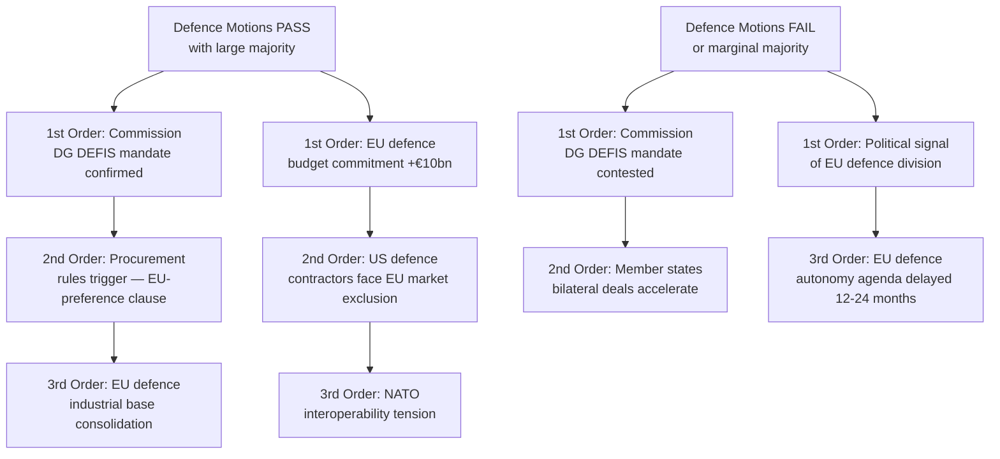
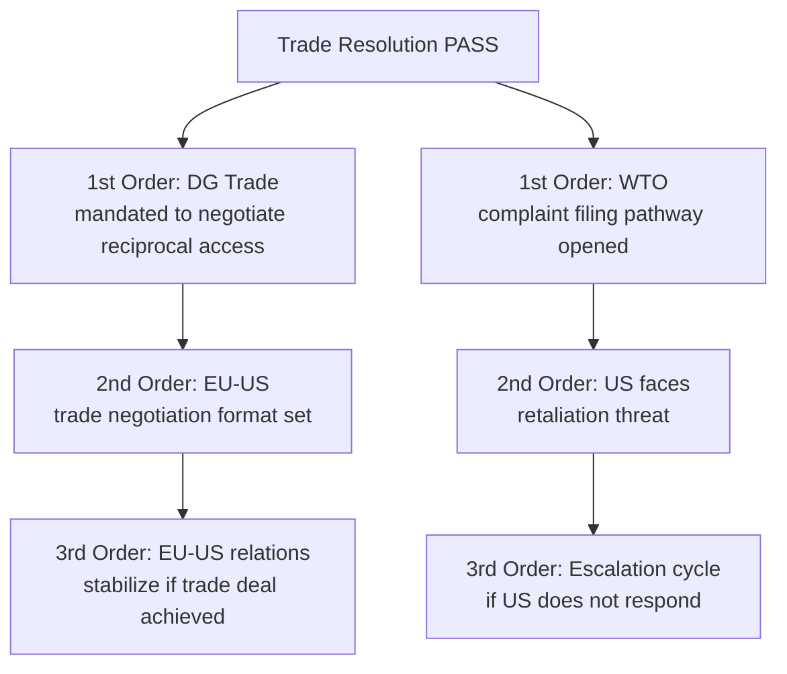
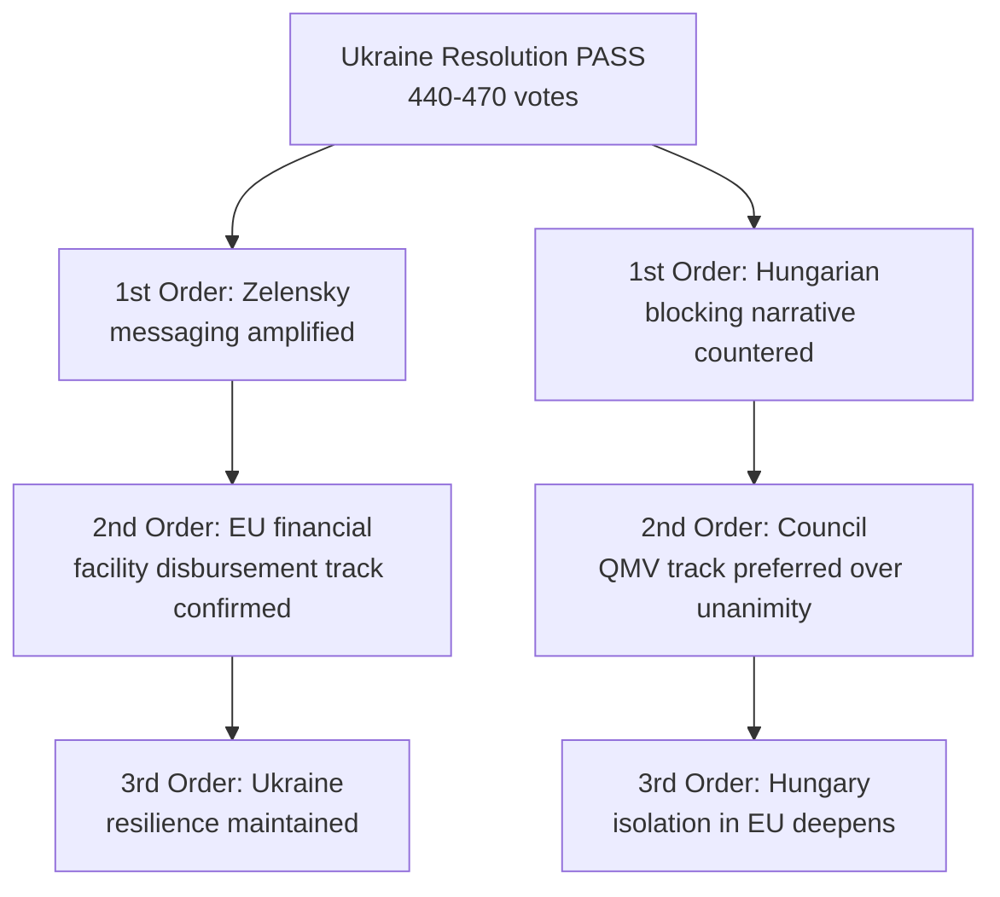

# Consequence Trees: EU Parliament Motions — April 2026

**Date:** 2026-04-27 | **Article Type:** motions

---

## Consequence Tree Overview

Each major motion cluster generates first-order (immediate), second-order (near-term), and third-order (systemic) consequences. This document maps the cascading effects of adoption vs. rejection scenarios.

---

## Tree 1: Defence Motions (SAFE/EDIP)

**Key consequence triggers:**
- Adoption with >420 votes: strong mandate, Commission can move quickly to delegated acts
- Adoption with 362–400 votes: contested mandate, Council likely to test Commission limits
- Rejection (highly unlikely): catastrophic signal for EU strategic autonomy

---

## Tree 2: Trade/Tariff Response

**Key consequence triggers:**
- Strong mandate → Commission negotiating position vis-à-vis US strengthened
- Weak or split vote → US administration may not take EP seriously

---

## Tree 3: Ukraine Support

---

## Cross-Tree Consequences

The most significant systemic consequence of the April 2026 session is the **cumulative signaling effect**: a session that passes all five major motion clusters with margins above 400 sends a unified message of EP institutional confidence and EU strategic direction. Each individual passage reinforces the others—defence legitimizes trade, trade reinforces Ukraine, Ukraine legitimizes Rule of Law enforcement.

Conversely, a session marred by procedural disruptions, split votes, or one major text failure creates a **fragmentation narrative** that opponents (PfE, EU-skeptic media) exploit to question EP cohesion.

---

## Consequence Probability Matrix

| Motion | Pass Probability | Best-Case Consequence | Worst-Case Consequence |
|--------|-----------------|----------------------|----------------------|
| Defence | 🟢 75% | EU defence autonomy accelerated | Commission mandate contested |
| Trade | 🟡 65% | DG Trade mandate strengthened | US dismisses EP signal |
| Ukraine | 🟢 85% | Continuity confirmed | Fidesz veto in Council |
| AI/Digital | 🟢 80% | Competitiveness narrative wins | Enforcement gap confirmed |
| Banking | 🟢 70% | Depositor protection progress | Fiscal conservative veto |

*Confidence: 🟡 Medium. Probabilities are structural estimates based on coalition analysis, not live polling data.*
